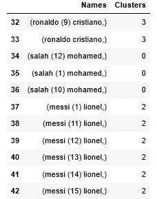

# 基于 K-均值聚类的人脸识别

> 原文：<https://medium.com/analytics-vidhya/face-recognition-using-k-means-clustering-127c462e02f2?source=collection_archive---------3----------------------->


每当我们看到一部关于人工智能的科幻电影时，人脸识别的魔力仍然让我们感到惊讶，这就是为什么在这个主题上潜水，研究和写作的目的是揭示这项令人着迷的技术的秘密。

在第一篇文章[ [人脸检测和识别](https://www.linkedin.com/pulse/face-detection-recognition-yasser-chihab/) ]中，我讨论了人脸检测和识别背后的想法，以及我如何能够通过使用 **Dlib C++** 和 **openCV** 库来完成工作的解决方案，现在我想解释一下我所研究的最新解决方案，以便使用机器学习算法来实现人脸识别，该算法是使用 Python 的 K-means 聚类。

# 解决方案背后的想法

在学习了一些机器学习的基础知识后，我痴迷于将我所学到的知识应用到一个真实的问题中，以查看机器学习对我们如何解决一些复杂问题的实际影响。

在我以前的项目中，我开发了一个提供的神经网络，它可以将检测到的人脸作为输入，并将该人脸的数据作为输出，这是一个 128 维的向量，所以一旦我们有了数据，我们就可以生成它，所以为什么不考虑一个使用机器学习算法的结果更准确的解决方案。

所以我们需要一个算法，在第一时间将相似的向量分组，换句话说，相似的脸，每组相似的脸当然代表一个我们想识别的已知的人，所以如果我们有一个新的脸，我们只需要把它放在这些组中的一个，我们就可以识别它。如果你了解机器学习算法，你会说我们需要一个无监督的算法，特别是 k-means 聚类。

# 无监督算法:K-均值聚类

*   无监督学习

无监督学习是一种机器学习方法，它允许我们仅基于输入数据来发现模式，换句话说，它试图将输入数据中的未标记数据作为标记数据。

*   k-均值聚类算法

K-means 算法是一种无监督的机器学习算法，它试图将相似的数据聚类成 K 个聚类，其中每个聚类都有一个代表它的质心(中心)。每个聚类包含彼此尽可能相似的数据，当然不在同一聚类中的数据尽可能不同。

# 利用 K-means 算法进行人脸识别

正如我之前解释的，每张脸都有数据，通过使用这些数据，我们可以识别它，K-means 算法试图将相似的数据聚集成 K 个组或簇，所以我们需要做的是收集我们想要识别他们的脸的人的所有数据，并将他们聚集在 K 个簇中，结果我们将有 K 个簇，每个簇代表一个人。

为了训练算法，我拍摄了 5 名足球运动员(梅西、萨拉赫、c 罗、苏亚雷斯和内马尔)的 75 张不同脸部的照片，每个球员几乎有 15 张不同位置的脸，并将它们交给我的脸部数据提取器，以便提取数据并存储在数据库中。


人脸数据

上图显示的是 c 罗的面部数据，这些数据在被转换成对训练算法有效的格式之前。


代表数据面的 128 维向量。

转换排列面数据后，最终结果是一个 75x128 的矩阵，上图显示的是第一列。

现在，在我们获得所有数据后，我们可以将它们可视化，看看看起来是什么样子:


玩家面部的所有向量的散布

我们可以看到，我们有些点彼此接近，我们可以从第一次可视化中得出结论，这些数据点涉及同一张脸或同一个人，这将在我们应用 k-means 聚类算法时得到证实。

*   **训练算法**

K-means 聚类中最重要的事情是选择“K”个聚类，如果选择不当，可能会对结果产生不良影响，因此有一种称为“肘函数法”的方法可以确定最佳聚类数，但在我们的情况下，我们想要的聚类数是明确的，我们想要识别的人数是 5(梅西、苏亚雷斯、c 罗、内马尔和萨拉赫)。

```
Kmean = KMeans(n_clusters=5)
Kmean.fit(data)
```

在对我们的数据点进行算法训练之后，作为结果，我们将得到代表 5 个聚类的 5 个质心的坐标。

```
centers=np.array(Kmean.cluster_centers_)
```

下图是我们 5 个质心的可视化:


5 个质心的可视化

除了质心的坐标之外，该算法给出了每个数据点的标签，这意味着现在在训练该算法之后，每个数据点或每个面属于 5 个聚类之一

```
labels=Kmean.labels_
```


数据点的聚类

重新组织结果后，我们得到了以下数据框架:



每个面的聚类

正如我们可以看到的，同一个玩家的面部数据属于同一个聚类，所以现在我们的面部数据被标记，我们可以利用它来预测和识别未知的面部。

*   认出一张新面孔

现在，在我们标记了所有的数据点之后，我们可以基于之前发现的 5 个聚类来识别一个新面孔。

人脸识别的过程现在非常简单，我们有 5 个聚类，每个聚类代表一个玩家，所以如果我们给算法一个在训练阶段没有计算的新面孔，它必须把它放在 5 个聚类中的一个，这个聚类将代表我们想要识别的人。

```
labels = Kmean.predict(new_data)
```

new_data 表示 C.Ronaldo 的数据面，我们希望看到将放在哪个聚类中，当然，new_data 是算法的未知数据，它自己必须知道包含与我们的 new_data 相似的数据点的聚类在哪里。


新数据的群集

正如我们所看到的，该算法将新的数据点放在第 3 个聚类中，这是 C.Ronaldo 的聚类，因此现在我们的算法几乎能够识别 5 名球员的面部。

# 结论

当然，仅用 75 个人脸数据训练算法不足以获得准确的结果，并且仅用 2 或 3 个新数据人脸进行测试也不足以说我们的模型已经准备好识别任何新面孔，但是我们可以在 k 个聚类中标记不同人脸的事实是非常有趣的，并且很好地理解问题并思考我们如何能够找到使问题变得简单一点的解决方案也是非常有趣的。

# Github:

*   K-means 人脸识别:[https://github.com/yasser1dev/Kmeans_FaceRecognition](https://github.com/yasser1dev/Kmeans_FaceRecognition)
*   数据面提取器:【https://github.com/yasser1dev/FaceRecognition 