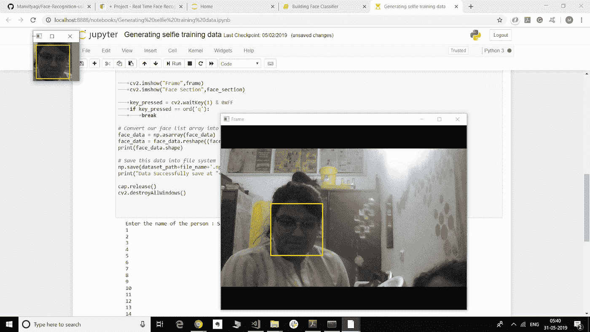

# 基于 Knn 和 OpenCV 的人脸识别

> 原文：<https://medium.com/analytics-vidhya/face-recognition-using-knn-open-cv-9376e7517c9f?source=collection_archive---------1----------------------->

*项目链接:*[*https://github . com/Manvityagi/Face-Recognition-using-KNN-openCV*](https://github.com/Manvityagi/Face-Recognition-using-KNN-openCV)


照片由 [May](https://unsplash.com/@firecloak?utm_source=medium&utm_medium=referral) 在 [Unsplash](https://unsplash.com?utm_source=medium&utm_medium=referral) 上拍摄

# 摘要

人脸识别是一项至关重要的安全应用。通过这个项目，已经使用 Haar 级联分类器、openCV & K-最近邻算法实现了一种非常基本的人脸识别形式。

**简介**

面部是人类身份最重要的实体。是最能区分一个人的特征。出于同样的原因，人脸识别是一项重要的技术。人脸识别是一个有趣且具有挑战性的问题，并且影响许多领域中的重要应用，例如执法部门的身份识别、银行和安全系统访问的认证以及个人身份识别等。

人脸识别对人类来说是一项简单的任务，但对计算机来说却是完全不同的任务。迄今为止，我们对人类识别知之甚少，我们如何分析图像，大脑如何对其进行编码，成功的人脸识别是使用内部特征(眼睛、鼻子、嘴巴)还是外部特征(头型、发际线)？神经生理学家 David Hubel 和 Torsten Wiesel 已经表明，我们的大脑有专门的神经细胞对场景的特定局部特征做出反应，如线条、边缘、角度或运动。由于我们不把世界看成是分散的碎片，我们的视觉皮层必须以某种方式将不同来源的信息组合成有用的模式。自动人脸识别就是从图像中提取那些有意义的特征，将它们转化为有用的表示，并对它们进行一些分类。

整个过程可以分为三个主要步骤，其中第一步是找到一个良好的人脸数据库，其中包含每个人的多幅图像。下一步是检测数据库图像中的人脸，并使用它们来训练人脸识别器，最后一步是测试人脸识别器来识别它所训练的人脸。

# **技术堆栈**

## Python——全部代码都是用 Python 编写的

## cv2 — cv2 是 OpenCV 模块，在这里用于读取和写入图像&也用于输入视频流

## 算法— KNN

## 分类器—哈尔级联

# 工作/实施

*   **生成训练数据**:按照以下步骤生成训练数据

#编写一个 Python 脚本，从您的网络摄像头视频流中捕获图像

#从图像帧中提取所有面(使用哈尔级联)

#将面部信息存储到 numpy 数组中

# 1.读取和显示视频流，捕捉图像

# 2.检测面部和显示边界框(哈尔级联)

# 3.展平最大的人脸图像(灰度)并保存在 numpy 数组中

# 4.对多人重复上述操作，以生成训练数据

```
cap = cv2.VideoCapture(0)
face_cascade = cv2.CascadeClassifier("haarcascade_frontalface_alt.xml")

skip = 0
face_data = []
dataset_path = './data/'
offset = 10

file_name = input("Enter the name of the person :  ")
while True:
    ret,frame = cap.read()

    if(ret == False):
        continue

    gray_frame = cv2.cvtColor(frame,cv2.COLOR_BGR2GRAY)    
    faces = face_cascade.detectMultiScale(frame,1.3,5)
    #print(faces)
    faces = sorted(faces,key=lambda f:f[2]*f[3])

    #pick the last face (largest)
    for face in faces[-1:]:
        x,y,w,h =  face 
        cv2.rectangle(frame,(x,y),(x+w,y+h),(255,0,0),2)

    #extract main face
    face_section = frame[y-offset:y+h+offset,x-offset:x+w+offset]
    face_section = cv2.resize(face_section,(100,100))

    skip += 1
    if(skip%10 == 0):
        face_data.append(face_section)
        print(len(face_data))

    cv2.imshow("Cropped",face_section) 
    cv2.imshow("VIDEO FRAME",frame)

    keypressed = cv2.waitKey(1) & 0xFF
    if(keypressed == ord('q')):
        break

# convert our face list array into a numpy array
face_data = np.array(face_data)
print(face_data.shape)
face_data = face_data.reshape((face_data.shape[0],-1))
print(face_data.shape)

#save this data into file system
np.save(dataset_path + file_name + '.npy',face_data)
print("data successfully saved at " + dataset_path+file_name+'.npy')
```

*   **建立人脸分类器**

#使用 KNN 分类算法识别人脸。

# 1.加载训练数据(所有人的 numpy 数组)

# x 值存储在 numpy 数组中

#我们需要为每个人分配的 y 值

# 2.使用 opencv 读取视频流

# 3.从中提取人脸

# 4.用 knn 求 face (int)的预测

# 5.将预测 id 映射到用户名

# 6.在屏幕上显示预测-边界框和名称

```
import cv2
import numpy as np
import os

########## KNN CODE ############
def distance(v1, v2):
   ** # Eucledian**
    return np.sqrt(((v1-v2)**2).sum())

def knn(train, test, k=5):
    dist = []

    for i in range(train.shape[0]):
        **# Get the vector and label
 **       ix = train[i, :-1]
        iy = train[i, -1]
  **      # Compute the distance from test point**
        d = distance(test, ix)
        dist.append([d, iy])
   ** # Sort based on distance and get top k**
    dk = sorted(dist, key=lambda x: x[0])[:k]
   ** # Retrieve only the labels**
    labels = np.array(dk)[:, -1]

   ** # Get frequencies of each label**
    output = np.unique(labels, return_counts=True)
    **# Find max frequency and corresponding label**
    index = np.argmax(output[1])
    return output[0][index]
################################

**#Init Camera**
cap = cv2.VideoCapture(0)

**# Face Detection**
face_cascade = cv2.CascadeClassifier("haarcascade_frontalface_alt.xml")

skip = 0
dataset_path = './data/'

face_data = []
labels = []

class_id = 0 **# Labels for the given file**
names = {} **#Mapping btw id - name****# Data Preparation**
for fx in os.listdir(dataset_path):
 if fx.endswith(‘.npy’):
 **#Create a mapping btw class_id and name**
 names[class_id] = fx[:-4]
 print(“Loaded “+fx)
 data_item = np.load(dataset_path+fx)
 face_data.append(data_item)
```

**工作演示图片**

***训练***



***测试***


**附加用途**

除了用于安全系统，当局还发现了面部识别系统的许多其他应用。虽然早期的后 9/11 部署是广为人知的试验，但最近的部署由于其隐蔽性很少被报道。

面部识别还有许多潜在的用途，目前正在开发中。例如，这项技术可以作为自动取款机的安全措施。取代使用银行卡或个人识别号码，自动柜员机将捕获客户的面部图像，并将其与银行数据库中帐户持有人的照片进行比较，以确认客户的身份。

面部识别系统用于解锁移动设备上的软件。一个独立开发的 Android Marketplace 应用程序 Visidon Applock 利用手机内置的摄像头为用户拍照。面部识别用于确保只有此人可以使用他们选择保护的特定应用程序。

面部检测和面部识别被集成到 Macintosh 的 iPhoto 应用程序中，以帮助用户组织和说明他们的收藏。

此外，除了生物测定用途之外，现代数码相机通常包含面部检测系统，该系统允许相机聚焦并测量对象面部的曝光，从而保证被拍摄人的聚焦肖像。此外，一些相机装有微笑快门，如果有人在曝光过程中闭上眼睛，相机会自动拍摄第二张照片。

由于指纹识别系统的某些局限性，面部识别系统被用作确认员工在声称的工作时间内出勤的替代方法。

另一个用途可以是一种便携式设备，帮助面容失认症患者认出他们的熟人。

**赞成者和 CONS**

在不同的生物识别技术中，面部识别可能不是最可靠和最有效的。然而，一个关键的优点是，它不需要测试对象的合作来工作。安装在机场、多厅影院和其他公共场所的设计合理的系统可以在人群中识别个人，而路人甚至不会意识到该系统。指纹、虹膜扫描和语音识别等其他生物识别技术无法执行这种大规模识别。然而，人们对面部识别软件在铁路和机场安检中的有效性提出了质疑。

**弱点:**

人脸识别并不完美，在某些条件下很难发挥作用。卡内基梅隆机器人研究所的研究员拉尔夫·格罗斯描述了与面部视角有关的一个障碍:“面部识别在正面全脸和 20 度角的情况下已经变得非常好，但一旦你转向侧面，就有问题了。”人脸识别效果不佳的其他情况包括光线不足、太阳镜、长发或其他物体部分覆盖了对象的脸，以及低分辨率图像。另一个严重的缺点是，如果面部表情变化，许多系统的效率会降低。即使是一个灿烂的笑容也会降低系统的效率。例如:加拿大现在只允许在护照照片中使用中性的面部表情。研究人员使用的数据集也不稳定。研究人员可能使用从几个对象到几十个对象，从几百张图像到几千张图像的任何图像。对于研究人员来说，重要的是让他们彼此可以利用他们使用的数据集，或者至少有一个标准数据集。2013 年 1 月 18 日，日本研究人员创造了一种隐私护目镜，它使用近红外光使其下面的脸无法被面部识别软件识别。