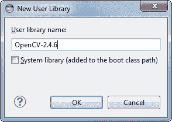

# 利用 Java 中的 Open CV 进行人脸识别

> 原文：<https://medium.com/analytics-vidhya/face-recognition-using-open-cv-in-java-791d246b4560?source=collection_archive---------9----------------------->


在这个操作中，我们使用 opencv java 来构建使用 spring 的应用程序。所以在这个博客中，你可以看到应用程序成功地完成了人脸检测。

**首先，我们看看如何将库导入到应用程序中**

首先，从下载页面获取 OpenCV [的新版本，并将其解压到一个简单的位置，如`C:\OpenCV-2.4.6\`。我使用的是版本 2.4.6，但是其他版本的步骤大致相同。](http://opencv.org/releases.html)

现在，我们将 OpenCV 定义为 Eclipse 中的用户库，因此我们可以为任何项目重用该配置。启动 Eclipse 并从菜单中选择 Window –> Preferences。


在 Java –>构建路径–>用户库下导航，然后单击新建…


为新库输入一个名称，例如 OpenCV-2.4.6。



现在选择您的新用户库，并单击 Add External JARs…


浏览`C:\OpenCV-2.4.6\build\java\`并选择 opencv-246.jar。添加 jar 后，扩展 opencv-246.jar 并选择本地库位置并按下 Edit....


选择外部文件夹…并浏览选择文件夹`C:\OpenCV-2.4.6\build\java\x64`。如果您有 32 位系统，您需要选择 x86 文件夹而不是 x64。


您的用户库配置应该如下所示:


# 在新的 Java 项目上测试配置

现在开始创建一个新的 Java 项目。


在 Java 设置步骤的库选项卡下，选择添加库…并选择 OpenCV-2.4.6，然后单击完成。


库应该是这样的:


现在您已经创建并配置了一个新的 Java 项目，是时候测试它了。

# 测试面部检测器

现在获取 Facedetector.class 的代码

```
package com.ocr.ocrexample;

import org.opencv.core.*;
import org.opencv.imgcodecs.Imgcodecs;
import org.opencv.objdetect.CascadeClassifier;
import org.springframework.web.multipart.MultipartFile;

import java.io.IOException;

import static java.lang.System.*loadLibrary*;
import static org.opencv.imgproc.Imgproc.*rectangle*;

class  DetectFaceDemo { public static void run(MultipartFile file) throws IOException {

        *loadLibrary*( Core.*NATIVE_LIBRARY_NAME* );
        CascadeClassifier faceDetector = new CascadeClassifier();
        faceDetector.load( "C:\\Users\\Desktop\\ocv\\.idea\\haarcascade_frontalface_alt.xml" );

        // Input image

        com.ocr.ocrexample.FileUploadController.*convert*(file);
                Mat image = Imgcodecs.*imread*(String.*valueOf*(file));// Detecting faces
        MatOfRect faceDetections = new MatOfRect();
        faceDetector.detectMultiScale( image, faceDetections );

        // Creating a rectangular box showing faces detected
        for (Rect rect : faceDetections.toArray()) {
            *rectangle*( image, new Point( rect.x, rect.y ), new Point( rect.width + rect.x,
                    rect.height + rect.y ), new Scalar( 0, 255, 0 ) );
        } // Saving the output image
        String filename = "Ouput.jpg";
        System.*out*.println("Face Detected Successfully ");
        Imgcodecs.*imwrite*( "D:\\" + filename, image );

    }
    }
```

从这段代码中，你可以得到一个绿色的输出框，显示人脸。

## 输出


输出

## 可以从公开的 cv java 中获取人脸识别。

[](http://linkedin.com/in/ashan-lakmal) [## Ashan Lakmal -软件工程师实习- Axiata 数字实验室| LinkedIn

### 查看 Ashan Lakmal 在全球最大的职业社区 LinkedIn 上的个人资料。亚山有 4 份工作列在他们的…

linkedin.com](http://linkedin.com/in/ashan-lakmal)