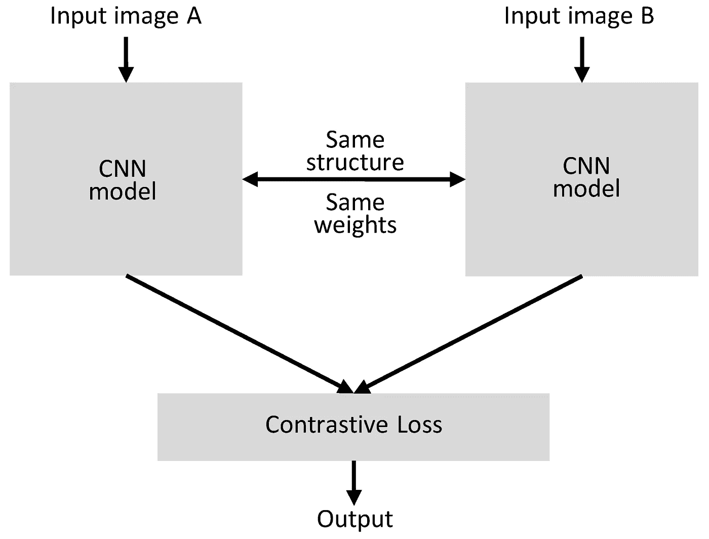
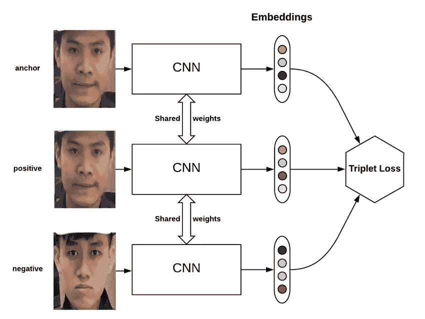

# 使用人脸验证的人脸识别

> 原文：<https://medium.com/analytics-vidhya/face-recognition-using-siamese-network-8ef07aab2f1f?source=collection_archive---------15----------------------->

**那么什么是人脸识别呢？**

自动人脸识别系统是一种能够从来自视频源的数字图像或视频帧中识别或验证个人的技术。人脸识别系统的工作基于多种方法，但一般来说，它们通过将从给定图像中选择的面容与数据库中的人脸进行比较来工作。

**人脸识别的挑战**

尽管发展了许多算法，仍然存在许多挑战，例如

*1。姿势变化*

*2。面部表情变化。*

*3。面部老化*

*4。变化的照明条件*

我希望大家兴奋起来，因为今天我们将学习开发一个使用人脸验证的人脸识别系统。

***但是等等，人脸验证是什么意思？这和人脸识别有什么不同？***

我们先来了解一下什么是人脸验证，然后再来看看如何从人脸验证构建人脸识别系统。

***人脸验证 vs 人脸识别***

***人脸验证*** 涉及基于人脸图像来验证所声称的身份，并接受或拒绝该身份声明。(一对一匹配)

*****还迷惑吗？好吧，让我解释一下。*****

**例如，考虑在机场检查身份的情况下，他们使用面部验证来阻止人的完整性。(验证输入图像是否是声称的人的图像。)在面部识别的情况下，考虑家庭或办公室中的自动开门的安全系统；他们将输入图像与数据库进行匹配，该数据库可能包含每人 100 多张图像。**

*****我想你明白了！！！好的，让我们看看如何使用人脸验证来构建人脸识别系统。*****

**为了建立一个人脸识别系统，我们需要一些数据来训练我们的神经网络。数据越高，系统的效率越高。在这种情况下，我们正在为一家至少有 500 名员工的公司构建人脸识别系统。在这种情况下，您不能让工作人员坐下来为数据集捕捉照片。同样，由于我们需要更多的数据，不可能捕捉每个工人的大约 1000 或 2000 张照片。所以这是我们人脸识别的第一个问题，数据不足；这个问题也叫 ***一个人短学*** 。对于许多人脸识别应用程序，您可能希望在只给定一张图像或只给定一个人脸样本的情况下就能识别出这个人。现在，让我们假设某人出现在办公室，并希望通过门，尽管看到一个人的例子，系统必须识别他是同一个人。所以在一次性学习的问题中，模型应该能够在特定人的单个例子的帮助下识别已知和未知的人。所以，这是一个分类问题。对！！一般来说，在分类问题的情况下，我们只是通过用图像数据训练卷积神经网络，并通过网络末端的 softmax 单元获得输出概率。但在这种情况下，这是不可能的，因为我们只有最小数量的数据集。即使你用可用的数据集训练了神经网络，如果有新人加入公司会发生什么呢？在这种情况下，您必须使用新的人员数据集来训练神经网络。这看起来不是一个好方法。**

*****那么我们要做什么？*****

**我们可以构建一个相似性函数，而不是用这么少的数据集来训练神经网络。好吧，接下来，**

*****什么是相似度函数？*****

**相似性函数只是比较两个图像并返回两个图像之间的相异分数的函数。所以如果两个图像之间的相似度低意味着，那么它们是同一个人和不同的人，如果它高。为了使用相似性函数进行人脸识别，我们必须计算数据库中每幅图像与输入图像成对的相异度得分。如果所有的分数都有较高的值，那么这个人是未知的。即使您想将另一个人添加到数据库中，也可以完成相同的过程。就是这样。在这种情况下，我们必须以这样的方式实现相似性函数，使得由此生成的相似性得分应该更准确。因此，为了创建相似性函数，我们将使用暹罗网络。连体神经网络(有时称为孪生神经网络)是一种人造神经网络，它使用等效权重，同时串联两个不同的输入向量来计算可比较的输出向量。通常预先计算输出向量中的一个，从而形成一个基线，与之相对的输出向量与之进行比较。这几乎就像比较指纹一样，但在技术上通常被描述为一个位置敏感散列的距离函数。**

****

**学习神经网络参数的一种方法是在 ***三重损失*** 函数上定义一个应用的梯度下降，从而为你的面部图片提供一个良好的编码。
***三重损失*** 是人工神经网络的损失函数，其中基线(锚)输入与正(真)输入和负(假)输入进行比较。从基线(锚)输入到正(真)输入的距离最小，从基线(锚)输入到负(假)输入的距离最大。
来自谷歌的 Florian Schroff 在他们 2015 年题为***“FaceNet:人脸识别和聚类的统一嵌入”的论文中介绍了*****

******

***三重损失***

***在计算三重损失时，我们可以设置一些阈值，并根据该阈值来验证已知和未知的人。
这种方法被用作 ***人脸网*** 系统背后的基础，该系统在基准人脸识别数据集上取得了当时最先进的结果。***

*****总结*****

***在这篇文章中，我们发现了人脸识别的一些挑战，以及如何使用三元组损失函数来学习高质量的人脸嵌入。希望你觉得这篇文章很有趣。谢谢您，祝您机器学习之旅愉快。***