# 基于迁移学习和 VGG16 的人脸识别

> 原文：<https://medium.com/analytics-vidhya/face-recognition-using-transfer-learning-and-vgg16-cf4de57b9154?source=collection_archive---------9----------------------->

迁移学习是一种将预先训练好的模型知识重新用于另一项任务的方法。它可用于分类、回归和聚类问题。收集相关的训练数据和重建模型是一个漫长的过程。在这种情况下，来自不同领域的知识转移或学习转移将是可取的。

# VGG16 是什么？

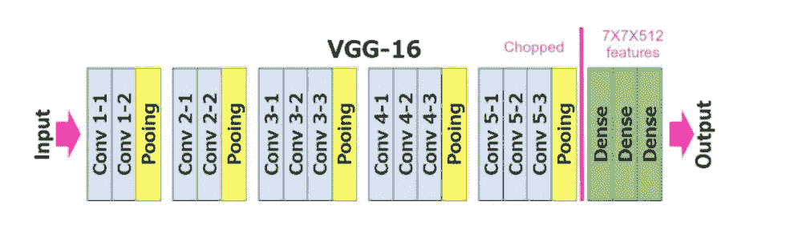

VGG 是一种卷积神经网络架构，它是由[牛津机器人研究所](https://en.wikipedia.org/wiki/Oxford_Robotics_Institute)的[卡伦·西蒙扬](http://www.robots.ox.ac.uk/~karen/)和[安德鲁·齐泽曼](https://en.wikipedia.org/wiki/Andrew_Zisserman)在 2014 年提出的。它被提交给 2014 年大规模视觉识别挑战赛(ILSVRC2014)，该模型在 ImageNet(数据集)上取得了 92.7%的 top-5 测试准确率。

*   第一和第二卷积层由 64 个特征核滤波器组成，滤波器的大小为 3×3。当输入图像(深度为 3 的 RGB 图像)进入第一和第二卷积层时，尺寸变为 224x224x64。然后，将结果输出传递给跨度为 2 的最大池层。
*   第三和第四卷积层有 124 个特征核滤波器，滤波器大小为 3×3。这两层之后是跨距为 2 的最大池层，结果输出将减少到 56x56x128。
*   第五、第六和第七层是卷积层，核大小为 3×3。三家都用了 256 张特征图。这些层之后是跨度为 2 的最大池层。
*   第八到十三是核大小为 3×3 的两组卷积层。所有这些卷积层集合都有 512 个内核滤波器。这些层后面是跨距为 1 的最大池层。
*   十四层和十五层是 4096 个单位的全连接隐藏层，后面是 1000 个单位的 softmax 输出层(第十六层)。

# 使用 VGG16 进行迁移学习

我们可以再增加一层或者重新训练最后一层来提取我们图像的主要特征。我们也可以给出 VGG16 的权重，重新训练，而不是用随机权重**(微调)。**在这项任务中，我们必须使用迁移学习来进行人脸识别，以便进行模型训练。我们将使用预定义的权重，冻结上层或输入层，并在它们具有权重时使用它们。

我已经使用[谷歌 Colab](https://research.google.com/colaboratory/faq.html) 来训练这个模型。

1.  Keras.applications 使用 TensorFlow 作为后端，用于导入 vgg16 模型及其权重。include_top 设置为 False，因此不包括输出图层。否则，我们将无法在它之后再添加一个完全连接的层。然后我们冻结所有的层。

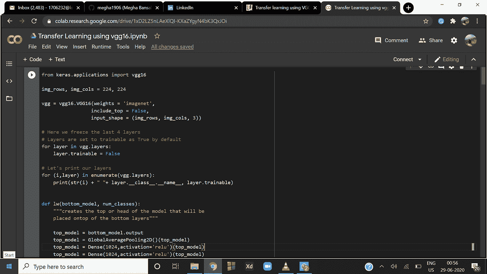

2)我们使用先前的模型添加新的层，并通过 model.summary()打印模型的整个结构

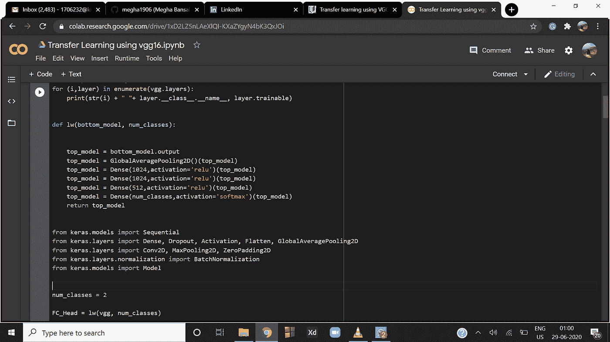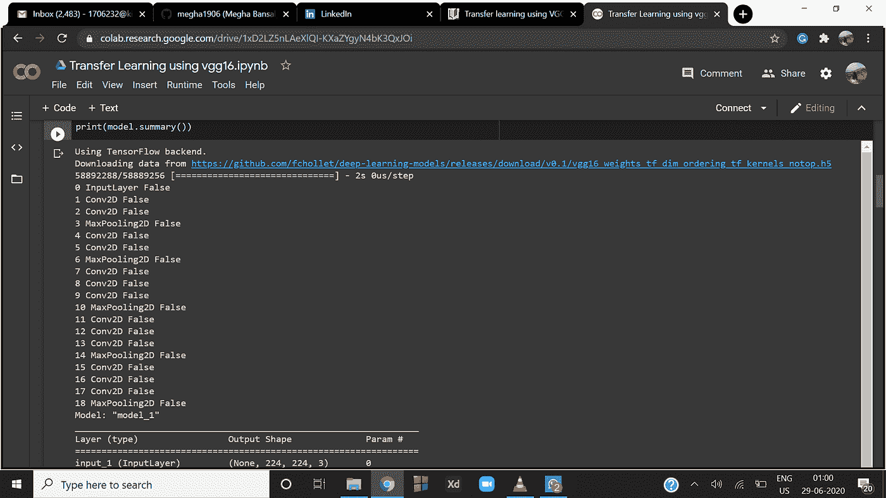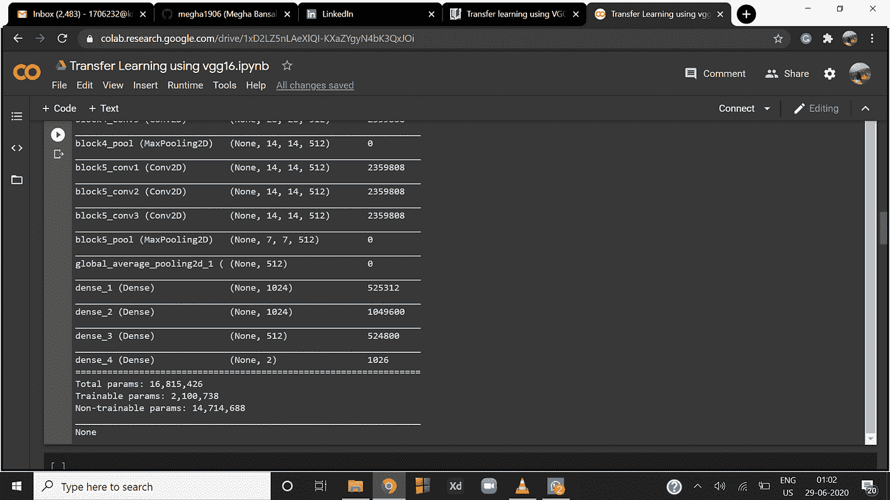

3)我已经将 Google drive 安装到 colab，以导入用于训练和预测的图像数据集。

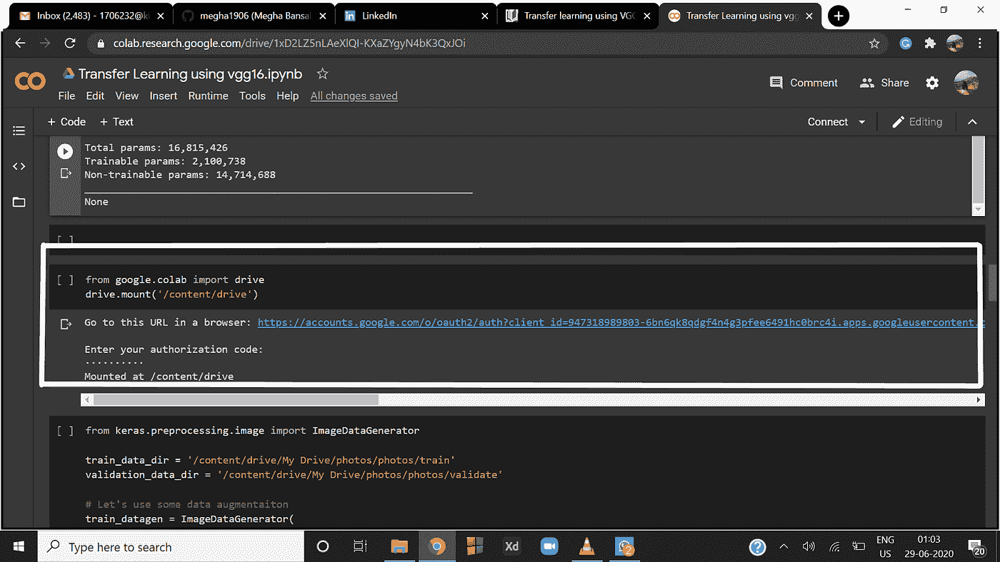

4)导入训练图像，这将告诉我们图像和类别的数量:

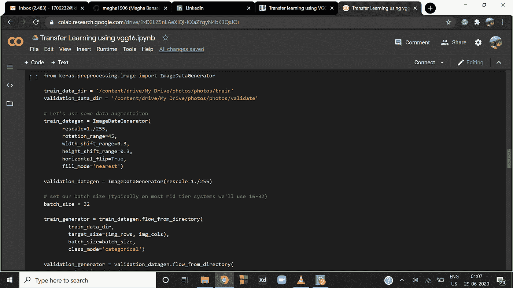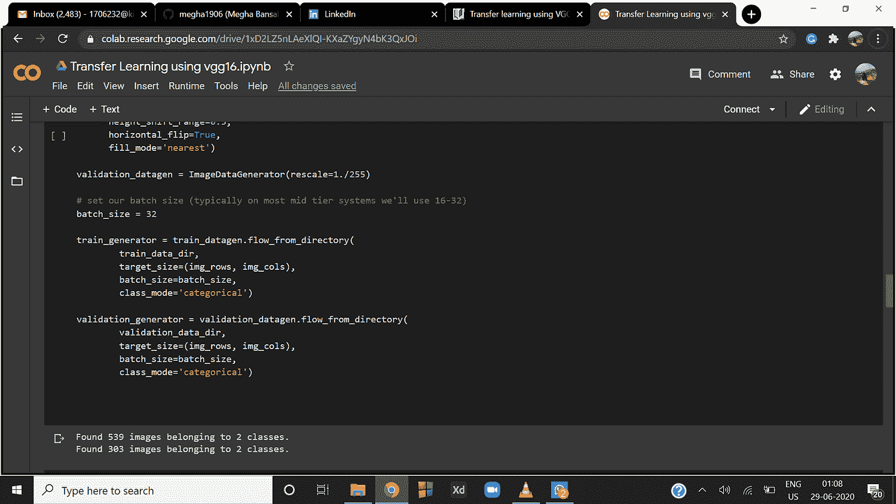

5)使用迁移学习再次训练我们的层以建立 vgg 模型。然后将模型保存为人脸识别。h5

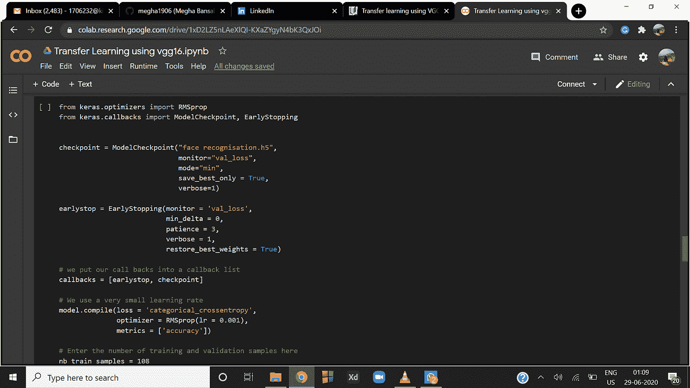

6)加载我们的模型并使用它来识别人脸:

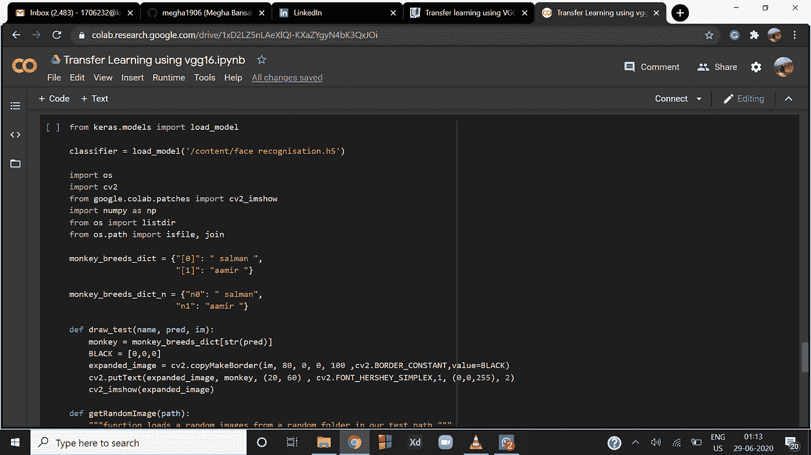

输出:

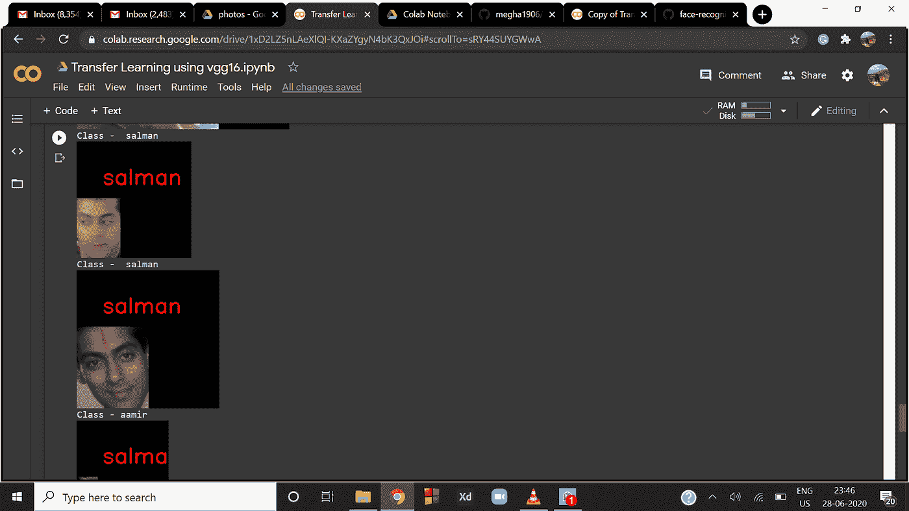

完整代码请访问 https://github.com/megha1906/TransferLearning-using-VGG16

谢谢你！

如有任何疑问，[请通过 Linkedln](https://www.linkedin.com/in/megha-bansal-8aa76996/) 与我联系。

# 发布者

【https://www.linkedin.com】最初发表于**。**