# 基于 MobileNet 的迁移学习人脸识别

> 原文：<https://medium.com/analytics-vidhya/face-recognition-using-transfer-learning-on-mobilenet-cf632e25353e?source=collection_archive---------7----------------------->


今天，我将使用迁移学习的概念来演示迁移学习如何在预先训练的模型上完成(这里，我使用 MobileNet)以节省我们的计算能力和资源。

1.  创建数据集。

因为，我必须做我的面部识别，所以手动做所有的裁剪和重新签名部分，然后将其存储到一个文件夹中，使用一个脚本，在一个单一的去创建尽可能多的图像，你想要的，也根据各自的大小。

```
import cv2
import numpy as np# Load HAAR face classifier
face_classifier = cv2.CascadeClassifier(‘haarcascade_frontalface_default.xml’)# Load functions
def face_extractor(img):
 # Function detects faces and returns the cropped face
 # If no face detected, it returns the input image

 gray = cv2.cvtColor(img,cv2.COLOR_BGR2GRAY)
 faces = face_classifier.detectMultiScale(gray, 1.3, 5)

 if faces is ():
 return None

 # Crop all faces found
 for (x,y,w,h) in faces:
 cropped_face = img[y:y+h, x:x+w]return cropped_face# Initialize Webcam
cap = cv2.VideoCapture(0)
count = 0# Collect 100 samples of your face from webcam input
while True:ret, frame = cap.read()
 if face_extractor(frame) is not None:
 count += 1
 face = cv2.resize(face_extractor(frame), (300, 300))# Save file in specified directory with unique name
 file_name_path = r”C:\Users\Shinchan\Music\Akashdeep” + str(count) + ‘.jpg’
 cv2.imwrite(file_name_path, face)# Put count on images and display live count
 cv2.putText(face, str(count), (50, 50), cv2.FONT_HERSHEY_COMPLEX, 1, (0,255,0), 2)
 cv2.imshow(‘Face Cropper’, face)

 else:
 print(“Face not found”)
 passif cv2.waitKey(1) == 27 or count == 100: #27 is the Esc Key
 break

cap.release()
cv2.destroyAllWindows() 
print(“Samples Taken”)
```

在这里，我创建了 100 个大小为 300x300 的样本进行测试，并在 GitHub 库中上传了一些不同民族的数据集，链接在文章的末尾。

```
Here  ”C:\Users\Shinchan\Music\Akashdeep” is the path where the samples will be stored. You can use your own location.
```

2.现在，我们将在 MobileNet 模型上使用迁移学习的概念。

我们将加载预先训练好的模型，您可以在本地下载，也可以从互联网上自动下载。

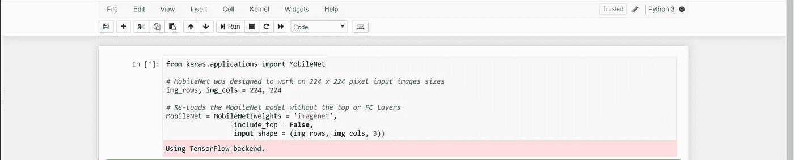

这些是默认情况下在该模型中使用的预训练层的列表。正如你所看到的，所有预先训练的层都被设置为真，这意味着它们准备好再次被训练。

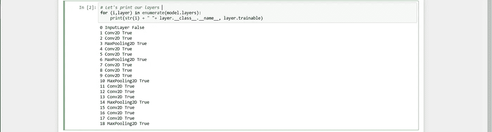

现在，我们将把所有预先训练好的层设置为 False，这样它们就不能再被训练了。

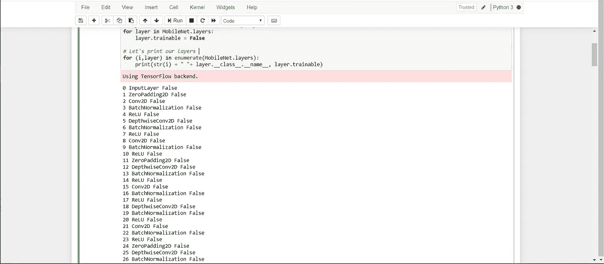

2.现在，我们将为我们想要训练的输入添加层。


3.将所有层添加到模型中，并打印模型摘要。

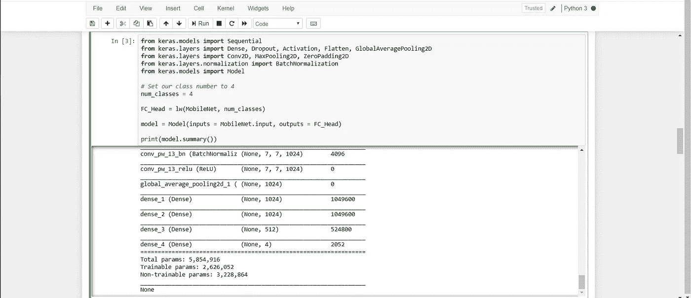

4.现在，检查我们提供给模型的测试和验证数据集，并对它们进行修改。

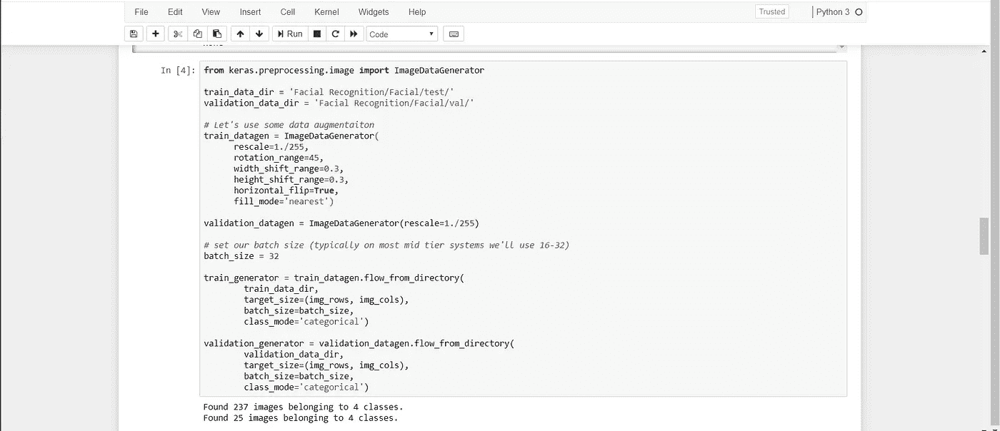

在这里，我们使用 ImageDataGenerator 模块来完成所有的事情。

ImageDataGenerator 接受一批输入的**图像**，随机转换该批图像，然后返回原始批图像和修改后的数据

5.现在，我们将训练 are 模型并将该模型保存到特定文件扩展名“. h5”中。

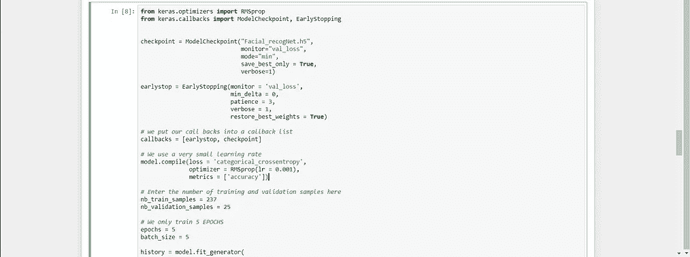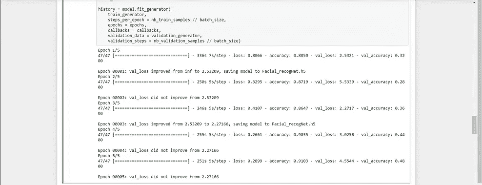

在这里，我使用名称“face _ recognet . H5”来保存模型。您可以使用任何名称，但以前只能使用分机。

你可以看到模型的准确性几乎是 91%,因为只有这么少的历元和使用更少的计算能力。

6.现在，加载面部识别的模型和模型预测。

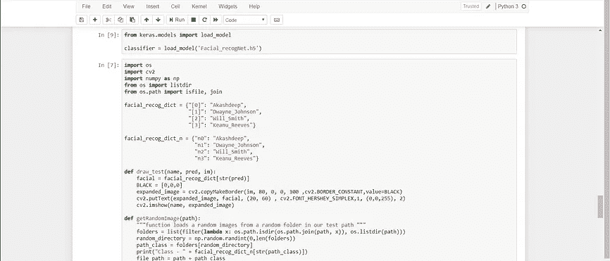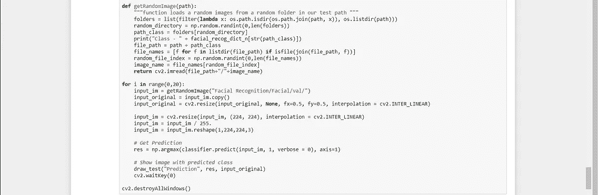

7.显示预测。

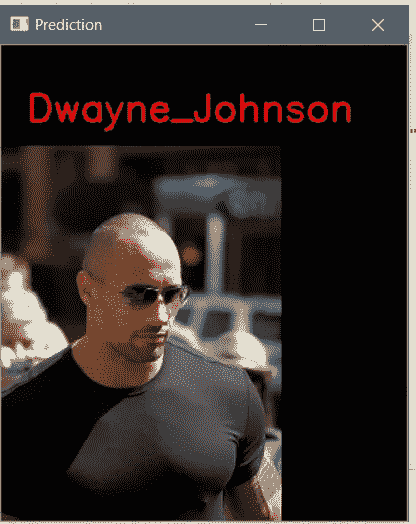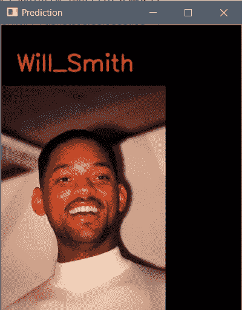

此任务的数据集和所有文件的 GitHub 链接…

[](https://github.com/Akashdeep-47/Facial-Recognition.git) [## akashdeep-47/面部识别

### 在 MobileNet-Akashdeep-47/face-Recognition 上使用迁移学习进行人脸识别

github.com](https://github.com/Akashdeep-47/Facial-Recognition.git)