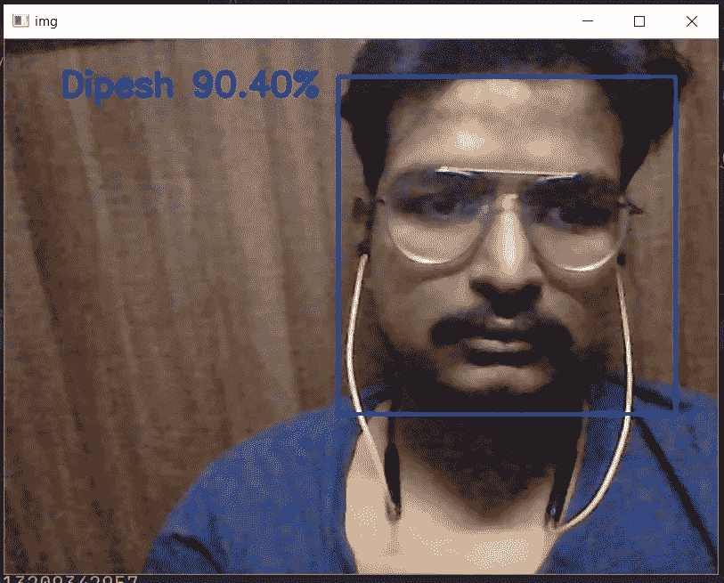
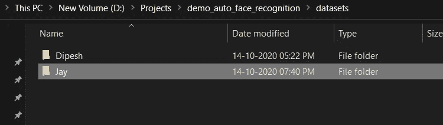

# 用 Python 和深度学习进行人脸识别，5 行 10 分钟

> 原文：<https://medium.com/analytics-vidhya/face-recognition-with-python-and-deep-learning-in-5-lines-5-minutes-39a5bf798267?source=collection_archive---------1----------------------->

在这篇文章中，我将向你展示如何通过深度学习用 Python 在 5 行中创建人脸识别。人脸识别和检测大多是任何一个 ML 或者 AI 学生的第一个项目。现在你不需要写几千行来执行这个简单的任务。

所有的代码和资源都在最后提供，如果你喜欢我的内容，就拍拍这篇文章，给我订阅 [YouTube](https://www.youtube.com/DIPESHPAL17) 以便将来更新。

## 演示和代码-

## 内容-

1.  什么是人脸识别
2.  什么是人脸检测
3.  “自动人脸识别”python 库简介
4.  事情是如何运作的
5.  密码
6.  未来更新
7.  资源和 GitHub 代码

> 让我们开始-


# 1.什么是人脸识别-

简单来说，识别个人面孔/人的面孔。

根据维基百科，面部识别系统是一种能够从数字图像或视频源的视频帧中识别或验证人的技术。



人脸识别

# 2.什么是人脸检测

简而言之，检测人脸。检测并不意味着识别，只是从图像或视频中找到人脸的特征。

根据维基百科，人脸检测是一种计算机技术，广泛应用于识别数字图像中的人脸。人脸检测也指人类在视觉场景中定位和注意人脸的心理过程。


来源:[https://files . real python . com/media/face-detection-ABBA . ea 2 DCC 6d 3 BDA . jpg](https://files.realpython.com/media/face-detection-abba.ea2dcc6d3bda.jpg)

# 3.“自动人脸识别”python 库介绍

它是我创建的 python 库，我想降低这项任务的复杂性，所以这就是为什么我创建了这个库。稍后将讨论它的工作原理。

你可以在这里查看这个图书馆的官方 Pypi 页面:【https://pypi.org/project/auto-face-recognition/ 

***安装最新版本-*** pip 安装自动人脸识别

***关于自动人脸识别*** :是一个用于人脸识别的 python 库。这个库使人脸识别变得容易和简单。该库使用 Tensorflow 2.0+进行人脸识别和模型训练。

***先决条件***——使用它只需要 Python ( > 3.6)。

# 4.事情是如何运作的-

通常，机器学习架构遵循几个步骤-数据收集、预处理、训练，然后使用导出的模型对未知数据进行预测。


ML 架构

如果这个**数据收集、训练和预测**可以使用几行图像识别代码来完成呢？

答案是肯定的，使用[自动人脸识别](https://pypi.org/project/auto-face-recognition/)是可行的。

# 5.代码-

这是你需要的完整代码-

> ***解释-***

## **导入库-**

```
*import* auto_face_recognition
```

## **创建对象-**

```
obj = auto_face_recognition.AutoFaceRecognition()
```

## **创建数据集-**

```
obj.datasetcreate(haarcascade_path='haarcascade/haarcascade_frontalface_default.xml',
                  eyecascade_path='haarcascade/haarcascade_eye.xml',
                  class_name='Dipesh')
```

这将为您创建数据集。您至少需要通过这三个参数-

`:param **class_name**: str (example: ‘folder of class’)
:param **haarcascade_path**: str (example: haarcascade_frontalface_default.xml)hars
:param **eyecascade_path**: str (example: haarcascade_eye.xml)`

`haarcascade_frontalface_default.xml`和`haarcascade_eye.xml`是[opencv Haar scade](https://github.com/opencv/opencv/tree/master/data/haarcascades)文件。您需要将这些文件放在本地存储中，并提供参数的路径。`**class_name**` 是您要创建的文件夹名称。

将创建一个名为“数据集/Dipesh”的文件夹，其中包含训练图像-


图像识别数据集

*注意-为分类创建至少两个文件夹。一个文件夹也可以训练，但没有任何意义。*



数据集的两个文件夹

## 培训-

```
obj.face_recognition_train()
```

它会自动开始训练，并自动找到数据集的路径。如果您可以在“datasetcreate”函数中设置数据集目录的参数，则相应地更改“face_recognition_train”中的数据集目录。默认目录是“数据集”。

*培训总结-*

*这个图表会自动生成-*


培训结果

## 预测-

```
obj.predict_faces(class_name=['Dipesh', 'Jay'], color_mode=*True*)
```

这里确保传递 class_name=['class_1 '，' class2 ']。你可以选择颜色模式为真/假。

它会开始识别你的脸-


> 你可以随意选择参数-

## ***参数可以选择-***

**datasetcreate()**

```
datasetcreate(dataset_path='datasets', class_name='Demo',  
                  haarcascade_path='haarcascade/haarcascade_frontalface_default.xml',  
                  eyecascade_path='haarcascade/haarcascade_eye.xml', eye_detect=False,  
                  save_face_only=True, no_of_samples=100,  
                  width=128, height=128, color_mode=False)
""""                  
Dataset Create by face detection  
:param dataset_path: str (example: 'folder_of_dataset')
:param class_name: str (example: 'folder_of_dataset')
:param haarcascade_path: str (example: 'haarcascade_frontalface_default.xml)
:param eyecascade_path: str (example: 'haarcascade_eye.xml):param eye_detect: bool (example:True)
:param save_face_only: bool (example:True)
:param no_of_samples: int (example: 100)
:param width: int (example: 128)
:param height: int (example: 128)
:param color_mode: bool (example:False):return: None
"""
```

**人脸 _ 识别 _ 训练()**

```
face_recognition_train(data_dir='datasets', batch_size=32, img_height=128, img_width=128, epochs=10,  
                           model_path='model'):  
 """  
 Train TF Keras model according to dataset path  
 :param data_dir: str (example: 'folder_of_dataset')  
 :param batch_size: int (example:32)  
 :param img_height: int (example:128)  
 :param img_width: int (example:128)  
 :param epochs: int (example:10)  
 :param model_path: str (example: 'model')  
 :return: None  
 """
```

**predict_faces()**

```
predict_faces(self, class_name=None, img_height=128, img_width=128,  
              haarcascade_path='haarcascade/haarcascade_frontalface_default.xml',  
              eyecascade_path='haarcascade/haarcascade_eye.xml', model_path='model',  
              color_mode=False):  
 """  
 Predict Face  
 :param class_name: Type-List (example: ['class1', 'class2'] )  
 :param img_height: int (example:128)  
 :param img_width: int (example:128)  
 :param haarcascade_path: str (example: 'haarcascade_frontalface_default.xml)  
 :param eyecascade_path: str (example: 'haarcascade_eye.xml)  
 :param model_path: str (example: 'model')  
 :param color_mode: bool (example: False)  
 :return: None  
 """
```

# 6.未来-

***注-*** 我还没有经过压力测试，喜欢最大类数。

微调，定制模型和您的建议。

关注我这里或 [YouTube](https://www.youtube.com/DIPESHPAL17) 或 [Instagram](https://www.instagram.com/dipesh_pal17/) 了解未来更新。

# 7.资源和 GitHub 代码-

**Pipy:**【https://pypi.org/project/auto-face-recognition/】T2

**Github:**[https://gist . Github . com/Dipeshpal/ed 0431234 f1 c 8873249 cf DD 5 F4 DC 88 e 4](https://gist.github.com/Dipeshpal/ed0431234f1c8873249cfdd5f4dc88e4.js)

**YouTube:**[https://www.youtube.com/DIPESHPAL17](https://www.youtube.com/DIPESHPAL17)

**YouTube 人脸识别演示:**[https://youtu.be/EU0LHtEJTnE](https://youtu.be/EU0LHtEJTnE)