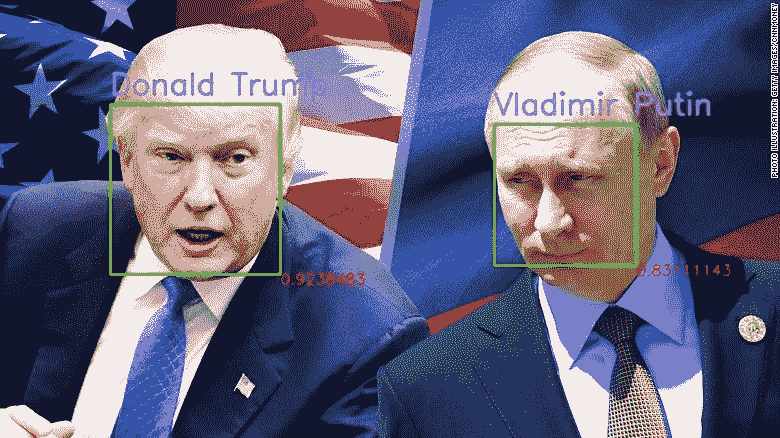
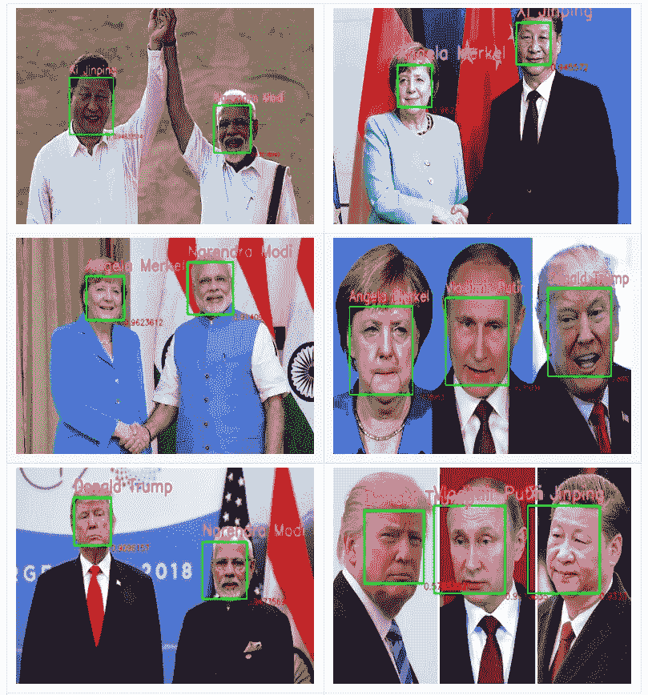
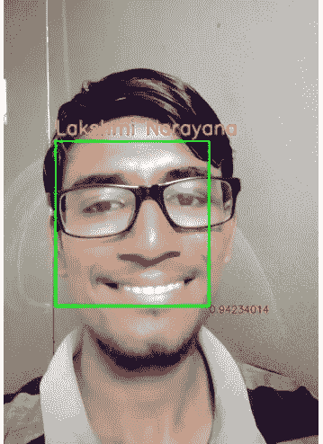

# Face Recognition with VGG-Face in Keras.

> 原文：<https://medium.com/analytics-vidhya/face-recognition-with-vgg-face-in-keras-96e6bc1951d5?source=collection_archive---------0----------------------->



# 1\. Get dataset/images of persons.

I have collected images of top 5 most powerful leaders in the world Donald Trump, Vladimir Putin, Xi Jinping, Angela Merkel, Narendara Modi. Train dataset contains 10 images of each person and also to check model working also included my images. Name this folder as “Images” .

# 2.Detect faces in image.

To get better predictions we first detect faces in image and use only faces for recognition. To do so we first detect faces in an image,for this we use ‘mmod_human_face_detector’ a cnn_face_detector which identifies faces in image and returns position of each face in image with finding rectangle bounding box as (left,top,right,bottom) positions. ‘dlib’ in python uses these weights and detect images,but dlib doesn’t provide this detector as in-built. We must download and provide to ‘dlib’ classes for extracting face. Download mmod_human_face_detector from here

> [‘http://dlib.net/files/mmod_human_face_detector.dat.bz2'](http://dlib.net/files/mmod_human_face_detector.dat.bz2)

As it is .bz2 file,extract it

```
$ wget [http://dlib.net/files/mmod_human_face_detector.dat.bz2](http://dlib.net/files/mmod_human_face_detector.dat.bz2) 
$ bzip2 -dk mmod_human_face_detector.dat.bz2 
```

# 3\. Extract faces from images.

Extract face from images,crop face and store as image in separate folder with image name as person name.

We use images with only one face

Above snippet shows how to extract face from image and save them for recognition. Do the same for all images in train dataset and test dataset saving with person names as image names. Store each person cropped image in a separate folder like Ex: All ‘modi_*.jpg’ images are saved in ‘modi’ folder.

After extracting faces directory structures looks like:

```
Directory structure :
|Images /
|  |-- (60 images)
|Images_crop /
|  |--angelamerkel (10 images)
|  |--jinping / (10 images)
|  |--lakshminarayana / (10 images)
|  |--modi / (10 images)
|  |--putin / (10 images) 
|  |--trump / (10 images)
|Images_test / 
|  |-- .. / (18 images)
|Images_test_crop / 
|  |--angelamerkel / (3 images)
|  |--jinping / (3 images)
|  |--lakshminarayana / (3 imgaes)
|  |--modi / (3 images)
|  |--putin / (3 images) 
|Face_Recognition.ipynb
|mmod_human_face_detector.dat
```

# 4.Use VGG-face model to create embeddings for faces.

We create embeddings for each face/person which defines the person in numeric data. Pre-trained networks like DeepFace,OpenFace provides embeddings in less than 5 lines of code. But we use VGG_Face_net which trained on millions of images to recognize labelled faces in the wild (LFW). The original model takes an image in WildFace dataset on which VGG_face_net trained and classifies/recognize person in image. It ouputs 2622 embeddings for an image,we take this 2622 embeddings for each cropped_image for later classification of image. VGG_face_net weights are not available for tensorflow or keras models in official [site](https://www.robots.ox.ac.uk/~vgg/software/vgg_face/), in this [blog](https://sefiks.com/2018/09/03/face-recognition-with-facenet-in-keras/) .mat weights are converted to .h5 file weights.
Donwnload .h5 weights file for VGG_Face_net here

> [‘https://drive.google.com/uc?id=1CPSeum3HpopfomUEK1gybeuIVoeJT_Eo’](https://drive.google.com/uc?id=1CPSeum3HpopfomUEK1gybeuIVoeJT_Eo)

因为它存储在 google drive 中，所以我们可以用 python 'gdown '包下载到我们的本地存储中。

```
$ gdown https://drive.google.com/ucid=1CPSeum3HpopfomUEK1gybeuIVoeJT_Eo 
```

我们现在有了. h5 的 vgg_face_net 权重，用它在 keras/tensorflow 中建立 vgg_face_net 模型。

# 5.构建 vgg_face_architecture 并获得 faces 的嵌入。

为了给模型分配权重，我们必须定义模型架构。keras 中的 VGG _ 人脸模型

在输出层中，他们使用 softmax 层来识别 WildFaces 数据集中的图像。我们只需要倒数第二层输出的嵌入，即。展平()图层。所以我们的模型需要最后一个 Flatten()层。

```
# Remove last Softmax layer and get model upto last flatten layer #with outputs 2622 units vgg_face=Model(inputs=model.layers[0].input,outputs=model.layers[-2].output) 
```

在上面的行中，我们定义了模型直到 Flatten()层。现在，我们可以输入任何图像来获得嵌入，这些嵌入将用于训练我们自己的分类器/识别器。

# 6.准备训练数据和测试数据

准备训练数据和测试数据，这些数据包含作为每张脸的行的嵌入和作为人名的标签。

之前，我们将每个裁剪的人脸图像存储在相应的个人文件夹中，遍历每个文件夹，并在每个文件夹中为每个图像从 keras 内置函数 load_img()加载图像，该函数是具有
**target_size=(224，224)** 的 PIL 图像，因为 VGG_face_net 期望图像形状为(224，224)格式。对于每个加载的图像，它被预处理成[ **-1，1]【T4]的尺度，并被馈送到 vgg_face()模型，该模型输出 **(1，2262)** 维张量，它被转换成列表并附加到训练和测试数据。此外，对于每个人，我们用数字标记该人，如**

> 例如:{ 0:'莫迪'，1:'川普'，2:'安格拉马克尔'，3:'金平'，…。….}

我们得到了(x_train，y_train)和(x_test，y_test)列表，为了在 keras 模型中使用，我们首先将它们转换成 numpy 数组。

```
x_train=np.array(x_train) 
y_train=np.array(y_train)
x_test=np.array(x_test) 
y_test=np.array(y_test) 
```

# 7.训练 softmax 分类器。

我们最终得到的是训练数据和测试数据，其中人脸嵌入和标签作为人的编码。现在，我们训练简单的 softmax 分类器并保存模型，以获得对数据集中看不见的图像面部的预测。

我们训练 softmax 分类器对图像进行分类，它以人脸嵌入作为输入，输出对应的图像编号，图像编号编码为人名。

[](https://github.com/santhalakshminarayana/face-recognition) [## santhalakshminarayana/面部识别

在 keras 中用 Vgg 人脸网和 dlib opencv 人脸 detection…github.com 进行人脸识别](https://github.com/santhalakshminarayana/face-recognition) 

# 8.识别面孔。

现在，我们可以识别图像中的任何人脸，如果我们在 vgg_face 模型的帮助下获得人脸的嵌入，并输入到分类器中，然后获得人名。用 opencv 在人脸周围画一个矩形框，并在图像中写下每个人脸的名字。

在上面的代码片段中，它获取图像路径，并输出图像中识别的人脸，在人脸和人名周围有一个矩形框。



我的形象

