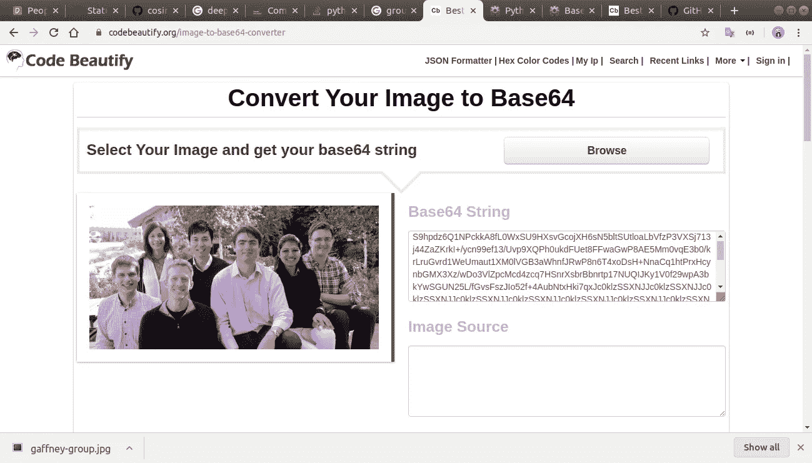
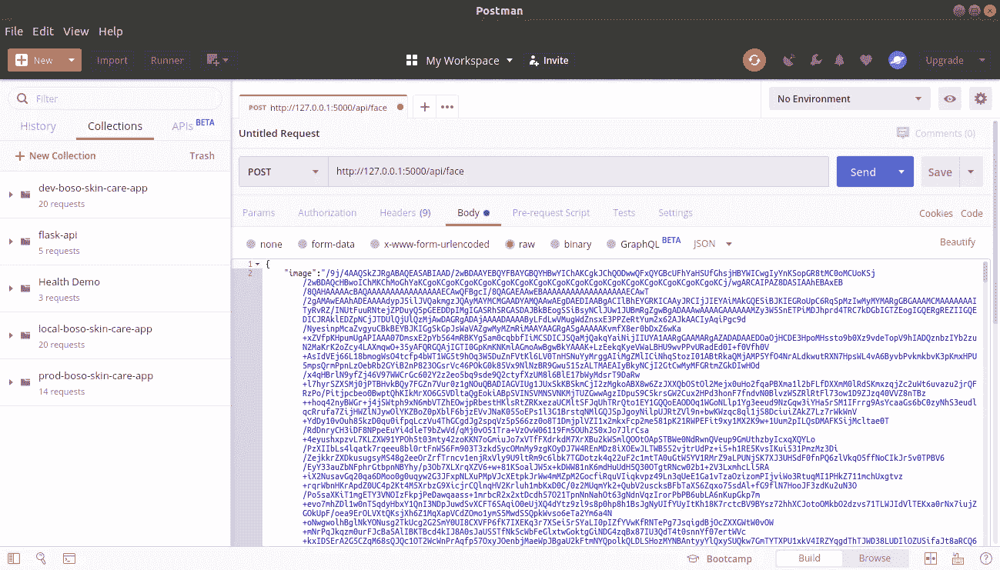
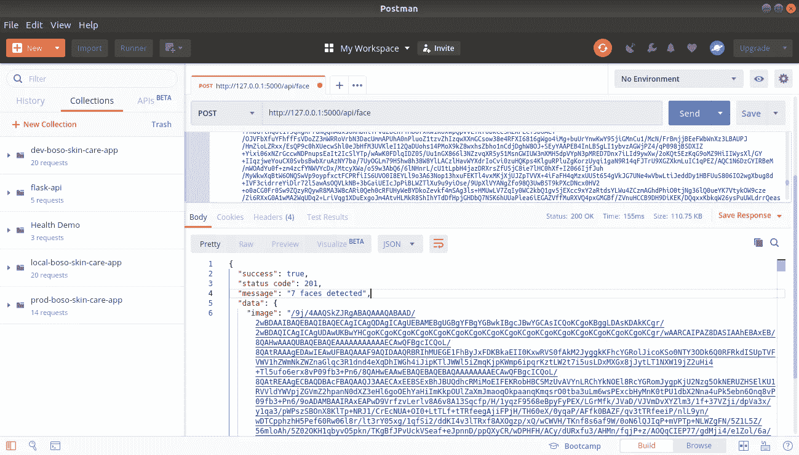
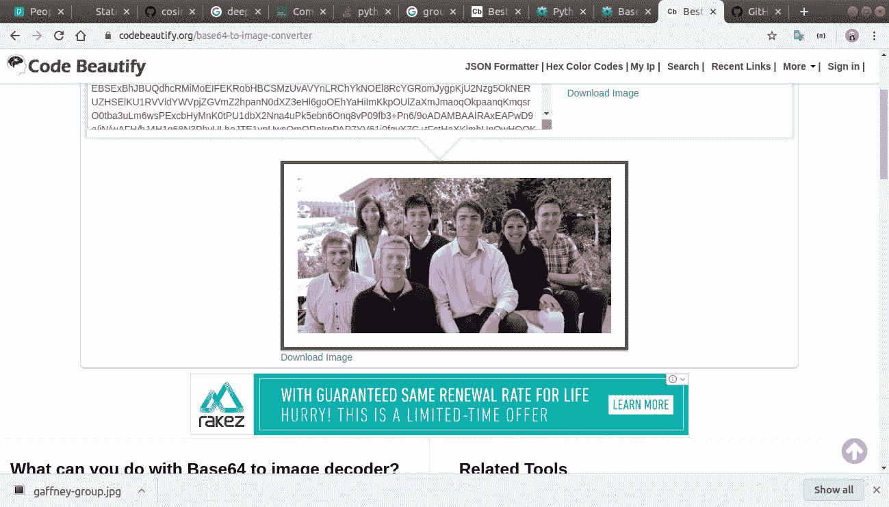
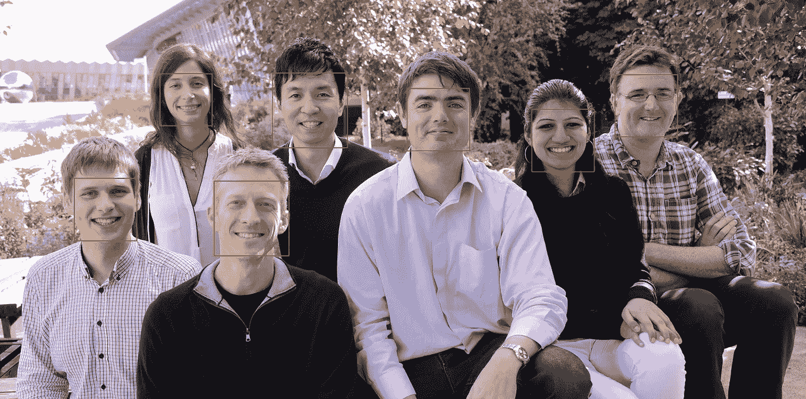
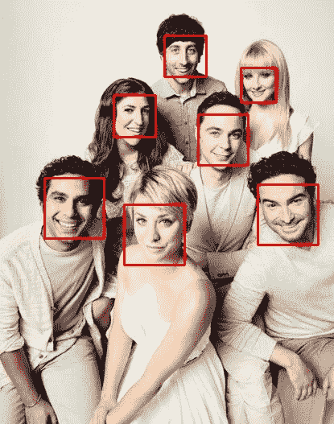

# FaceApi: Rest Api 使用 dlib、openCV 和 Flask 来检测图像中的人脸。

> 原文：<https://medium.com/analytics-vidhya/faceapi-rest-api-to-detect-face-s-in-image-using-dlib-openvc-flask-8a6cdfb0571f?source=collection_archive---------9----------------------->


[ [图像来源]](https://i0.wp.com/krazytech.com/wp-content/uploads/Face-detection-and-recognition-e1462652980288.jpg?w=600&ssl=1)

首先使用软件包管理器[ [pip](https://pip.pypa.io/en/stable/) 安装基础软件包。

```
pip install pipenv
```

创建文件夹 FaceApi

```
mkdir FaceApi && cd FaceApi
```

使用 pipenv 创建虚拟环境

```
pipenv shell
```

使用 pipenv 安装所有软件包

```
pipenv install flask dlib numpy python-dotenv opencv-python
```

这将在虚拟环境中安装所有软件包。

如果你使用的是 ubuntu，那么你需要先安装 cmake。

```
sudo **apt**-**get** **install cmake**
```

创建 app.py 文件，这是我们的应用程序的起点。

```
touch app.py
```

创造。flaskenv 文件并输入 env 变量

```
touch .flaskenv
FLASK_ENV=development
FLASK_DEBUG=1
```

创建一个文件夹 face 和 2 个文件 app.py 和 exception.py，app.py 包含主要逻辑。

```
mkdir face
touch face/{app.py,exception.py}
```

检测图像中人脸的代码

face/app.py

我们已经使用 dlib 来检测图像中的人脸，并使用 opencv 在人脸上创建一个边界框。

detect()返回检测到的面数和 base64 字符串中的图像，作为 api 的 json 响应返回。

face/exceptions.py

该类用于返回自定义异常消息。

app.py

这个文件是我们 flask 应用程序的入口点。

我们接受 base64 字符串形式的图像，然后转换为 numpy 数组，再转换为 rgb 模式，因为 dlib 使用 RGB 模式的图像。

来自 detect()的响应被转换成 json，然后发送出去。

# 用 postman 测试 api

激活虚拟环境并运行您的应用程序

```
pipenv shell
flask run
(FaceAPI) sambhav@Sambhav-pc:~/Downloads/FaceApi$ flask run
 * Environment: development
 * Debug mode: on
 * Running on [http://127.0.0.1:5000/](http://127.0.0.1:5000/) (Press CTRL+C to quit)
 * Restarting with stat
 * Debugger is active!
 * Debugger PIN: 626-933-224
```

如果一切正常，那么从谷歌下载任何包含人物的图片。

使用将图像转换为 base64 字符串[:](https://codebeautify.org/image-to-base64-converter)



复制 base64 字符串并打开 postman。创建新请求。选择方法为 Post，转到 body 并选择 raw 和 JSON。

在正文中，按照以下格式输入 json 并点击请求

```
{
"image":"your base 64 string"
}
```



api 将返回一个 json 对象作为响应。



现在，复制 base64 字符串来测试它，并将它粘贴到这里[以将字符串转换为图像。](https://codebeautify.org/base64-to-image-converter)



# 结果



你可以在 [*github*](https://github.com/SambhavChoradia/FaceApi) *找到完整的代码。*

希望这对你有用。如果你在实现这个过程中有任何困难或者你需要任何帮助，请联系我。

*邮箱:sambhavchoradia@gmail.com*

*社交媒体:*[*LinkedIn*](https://www.linkedin.com/in/sambhav-choradia/)

快乐编码。

***参考文献:***

[](https://programmer.group/opencv-python-cv2.imdecode-and-cv2.imencode-picture-decoding-and-coding.html) [## OpenCV-Python cv2.imdecode()和 cv2.imencode()图片解码和编码

### cv2.imdecode()函数从指定的内存缓存中读取数据，并将数据转换(解码)为图像格式；这是…

程序员小组](https://programmer.group/opencv-python-cv2.imdecode-and-cv2.imencode-picture-decoding-and-coding.html)  [## Python base64.b64decode()

### 解码 Base64 编码的字符串 base64.b64decode(s[，altchars]) s -是要解码的字符串。可选替代字符必须是…

www.base64decode.net](https://www.base64decode.net/python-base64-b64decode)  [## Flask 大型教程第二十三部分:应用编程接口(API)

### 这是 Flask 大型教程系列的第二十三部分，也是最后一部分，我将告诉你如何…

blog.miguelgrinberg.com](https://blog.miguelgrinberg.com/post/the-flask-mega-tutorial-part-xxiii-application-programming-interfaces-apis) 

[http://dlib.net/face_recognition.py.html](http://dlib.net/face_recognition.py.html)