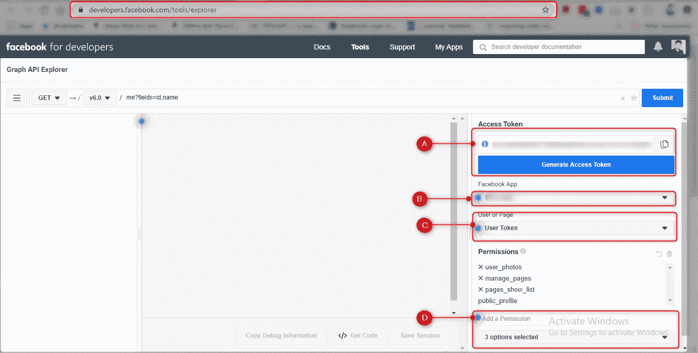
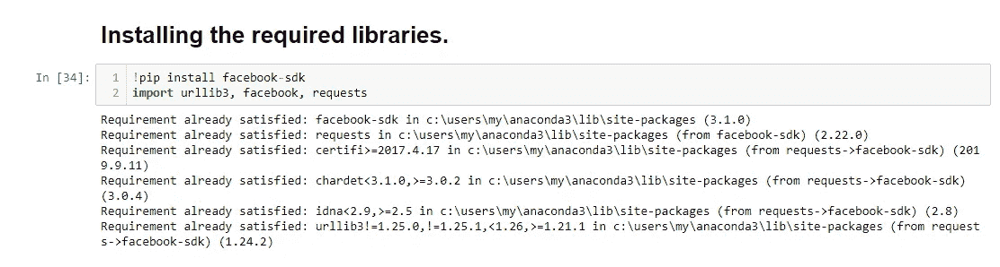

# 脸书图形 API | Python

> 原文：<https://medium.com/analytics-vidhya/facebook-graph-api-python-3c8bab8a5a2a?source=collection_archive---------1----------------------->

自从我了解了 Python，并且熟练掌握了它的流行库之后，一个总是让我觉得有趣并且总是显示出其巨大潜力的领域就是使用 Python 的基于 HTTP 的 API 调用。人们通常用它来联系各种社交平台，如脸书、推特等。以便提取有意义的数据，如发布的内容、发布的图片、喜欢的内容、完成的评论等。在各种帖子、页面、推文中等等。

一个这样流行且高效的基于 HTTP 的 API 是**脸书的 Graph API。**在本文中，我们将详细讨论这个 API，并且在最后也将亲自动手。

# **概述:-**

**图形 API** 是从**脸书**平台获取数据以及将数据发布到其上的主要方式。这是一个基于 HTTP 的 API，应用程序可以通过程序/脚本的方式使用它来查询数据、发布新故事、管理广告、上传照片以及执行各种各样的其他任务。我将使用 Python3 来完成我的工作，正如你将看到的那样。嗯，远程访问脸书所有可用公共信息的想法本身就很吸引人。不是吗？
**哦当然，是它！不过，像往常一样，我想走一步看一步，并请求你沉住气。让我们讨论一下脸书的 Graph API，它的基础知识和背景，在我们进入实用主义的方法和接触 API 之前再多一点。**

# **基础知识:-**

*   **图形 API 得名于“社交图”的概念**。社交图通常被定义为说明社交网络中的人、群体和组织之间的互连/关系的图表或图形。 ***还记得大卫·芬奇的电影《社交网络》吗？***

社交网络

**忠告:只取形象比喻！😛**

术语“社交图”也用于描述个人的社交网络。当描绘成地图时，社交图表现为一组由线连接的网络节点。

*   **脸书图形 API 本质上由** **节点、边&字段**组成。

社交图概述| API

***节点*** *基本上都是个体唯一的对象，比如一个用户、一张照片、一条评论、一个群组或者一个页面等。一种分类使用节点来获得关于特定对象的信息/数据。假设明天我想获得关于乐队 Metallica 的官方脸书页面的信息。
显然，这就是我要使用节点的地方。* ***边缘*** *基本上就是单个对象和对象集合之间的联系，比如一张照片上的评论或者一个页面上的照片。人们通常利用边缘来获得围绕单个对象的对象集合。* ***字段*** *基本上是关于一个对象的数据，例如，一个脸书页面的名字或者一个脸书用户的生日。特别是利用字段来获取关于单个对象或集合中每个对象的数据。*

*   **Graph API 是基于 HTTP 的，**这意味着它可以与任何具有 HTTP 库的语言一起工作，比如 cURL 或 urllib。这也意味着你和我可以在我们的浏览器中直接使用 Graph API。你想看看怎么做吗？试着在你的浏览器中请求这个网址(**[**【https://graph.facebook.com/facebook/picture?redirect=false】**](https://graph.facebook.com/facebook/picture?redirect=false)**)。现在如果你看到一个 JSON 节点对象——说 ***“天哪，我是真的*格兰芬多！😛 *"*** *然后从响应中复制 URL，并在另一个选项卡中请求相同的内容，您将看到一个 FB 徽标图像。现在让我告诉你，它相当于执行了 cURL 请求:****cURL-I-X GET \
    "https://graph.facebook.com/facebook/picture？redirect=false”。*******
*   ****图形 API 的结构是这样的，人们使用**节点**来获得关于单个对象的数据。一种是使用**边**来获取与一个节点相关联的对象集合，或者将对象发布到那些集合。然后，用户使用**字段**来指定用户希望在响应中包含的所有数据。****
*   ******说到主机 URL，所有的请求都被传递到 graph.facebook.com 主机 URL。唯一的例外是，我们将见证使用 graph-video.facebook.com 上传视频的 id。******
*   ******深入研究对象 ID，**我们看到节点是独立的对象，每个节点都有一个唯一的 ID，因此人们可以通过直接查询它的 ID 来获得关于该节点的信息。比方说，我们每天都使用脸书，我们应该知道平台上存在的每个脸书页面或每个脸书用户帐户都有一个 ID，允许一个人查询关于该页面或用户的信息:***curl-I-X GET \
    【"https://graph.facebook.com/object-id？access _ token = your-access-token "***。现在，如何获得 object-id 或 access_token，是我将在我们将所有这些付诸实践时解释的事情。现在，我要告诉你的是，你需要一个脸书开发者登录相同的和一些必要的权限，以及应用程序/用户访问令牌，你将生成。****
*   ******Objects Fields & Edges :** 如果想获得某个节点的特定信息/数据(称为字段)，他/她可以包含 Fields 参数，并指定他们希望在响应中返回哪些字段。例如，在读取用户对象时，您可以获得的字段之一是 **name** 字段，这是您在脸书上的名字。下面是查询的样子:***curl-I-X GET \ " https://graph . Facebook . com/your-Facebook-user-id？fields = name&access _ token = your-access-token "。* PS :** 很容易知道你的 facebook-user-id 和 access_token 是你在 developers.facebook.com 上生成的东西。我们一会儿会讨论这个问题。
    **比如我提交了下面这个网址——“**[https://graph . Facebook . com/[your-Facebook-user-id]？fields = name&access _ token =[access-token](https://graph.facebook.com/your-facebook-user-id?fields=name&access_token=access-token)]"**在我的浏览器的另一个选项卡中，得到了想要的响应。******

********

****向 API 查询特定数据(字段=名称)****

*   ****您还会看到，大多数节点也有边，这些边可以返回与该节点相关联的对象集合。现在，如果您想要查询一条边，您必须使用节点 ID 和边名。正如我在用户节点引用中所列出的边，有一个**照片**边，查询它我得到所有的照片对象。**你想试试吗？** 好的，那么要获得你拥有的所有照片，你需要查询节点的**照片**边。但是，在我让您运行查询之前，请确保您有一个带有 **user_photos** 权限的用户访问令牌。您可以使用图形浏览器工具获得一个。你必须登录 developers.facebook.com。您可以使用***curl-I-X GET \ "https://graph.facebook.com/your-facebook-user-id/photos？access _ token = your-access-token "*******
*   ****现在，还可以使用 Graph API 进行 POST 操作。你知道吗，如果你有一个带有 ***电子邮件*** 权限的访问令牌，你就可以更新你的电子邮件字段。你也可以用这个来做同样的事情-***curl-I-X POST \ "https://graph.facebook.com/your-facebook-user-id？email=you@your-email.com&访问令牌=你的访问令牌”。*******
*   ****同样，您也可以对对象 ID 执行删除操作，并删除一个节点。****

********

****不要最终删除你的脸书帐户。****

****所以如果你运行这个命令，你将能够删除你的脸书用户帐号:-
***curl-I-X DELETE \ "https://graph.facebook.com/object-id？访问令牌=您的访问令牌”。*******

****PS:你可能真的不想那么做！😟🙏只是为了知识！****

****以上是脸书图形 API 的概述，以及它的真正构成。希望我上面提到的基础知识，给你解释了这个概念，嗯。在脸书官方图形 API 网站上有更多的记录。请通过同样的方式深入潜水。****

# ****现在是使用 PYTHON 的时候了****

****所有设置提取一些有意义的数据从脸书个人资料和网页？****

********

****让我们一步一步来:-****

1.  ******首先，** **我需要你在脸书上注册成为一名开发者，**因为这将为我们获得访问令牌铺平道路。我的朋友，你知道对公共 API 的访问权标对一个人来说就像氧气。😆****

****I)好的，所以你需要在[http://developers.facebook.com/](http://developers.facebook.com/)上记账。简单的事情，是吗？****

****ii)登录后，接下来，我希望您前往[https://developers.facebook.com/tools/explorer](https://developers.facebook.com/tools/explorer)。在这里，您需要转到右上角的“我的应用程序”下拉菜单，然后选择“添加新应用程序”。你需要选择一个显示名称，一个类别，然后“创建应用程序 ID”。恭喜你，你刚刚创建了一个应用程序。****

****iii)现在，我需要你回到 https://developers.facebook.com/tools/explorer。你看到右边有一个标签“脸书应用”(下图中标为 B)吗？在“脸书应用”下拉列表中，您可以看到您的应用名称。请选择它！****

****iv)接下来，您必须从用户或页面下拉菜单*(下图中标为 C)*中选择“获取用户访问令牌”。****

********

****图形 API 浏览器-令牌生成器屏幕****

****v)从标签“添加权限”*(图中标记为 D)*下出现的菜单中选择权限，最后点击“生成访问令牌”*(图中标记为 A)*。您还会看到一个小图标，用于复制剪贴板上的令牌，就在令牌旁边。 ***好了，现在您有了用户访问令牌。*******

# ******访问 FACEBOOK 上个人数据的 PYTHON 代码:-******

1.  ****首先，安装 facebook-sdk 并导入重要的库——“URL lib 3”、“facebook”、“requests”，如果它们已经可用的话。如果没有，请下载这些库。****

********

****安装所需的库和 sdk****

****2.是时候确保我们拥有手头任务的正确权限了。因此，在这里，您需要返回到 Graph API Explorer 屏幕，并确保在**权限**标签下保持不变。****

********

****许可****

****在为自己生成访问令牌之前，请确保您在图形 API 浏览器屏幕上获得了必要的权限。让我来帮你弄清楚我要执行的活动的权限。显然，在这里我已经获得了用户数据权限中几乎所有可用的权限，但是您不必获得所有权限。您应该根据您的用例获取相关的权限。****

****3.现在，我们将尝试从我的脸书个人资料中挖掘一些数据。我们将挖掘数据，即 f **名字、位置、个人资料链接&电子邮件**。我模糊了一些敏感的信息，我相信你会认为是合理的。我导入 json 的原因是因为我想以 json 的形式呈现/存储检索到的数据。这里，**令牌**变量应该具有“用户访问令牌”,这是您在标记相关权限后在 Graph API Explorer 屏幕上生成的。 **graph** 只是我创建的用来访问 API 方法的对象。最后，我在 get_object 方法中使用“me”的原因是因为我们试图提取关于我自己的用户帐户的信息。
**PS :** 您可以根据需要增加字段数量。只需确保您拥有所需的权限即可。****

********

****从我自己的 FB 用户帐户中挖掘数据****

*******接下来，我将更新这篇文章，关于如何访问脸书上可用的公共数据，比如名称中带有特定关键字的事件/某些类型的事件、页面数据、群组数据等。我现在所希望的是，你们中的一些人会发现这篇文章值得你花时间去读。我正在更多地探索 Graph API，并承诺会带来 Graph API 的高级范围和用法。*******

********