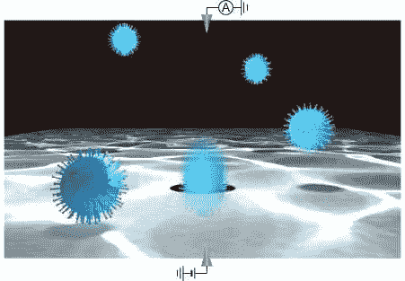
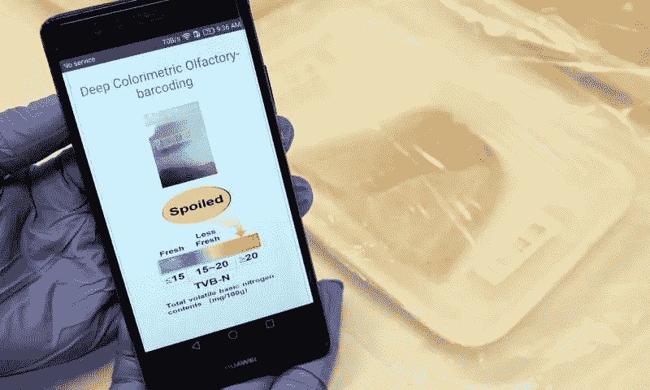

# 脸书用人工智能给帖子排名

> 原文：<https://medium.com/analytics-vidhya/facebook-uses-ai-to-rank-posts-3222d92cdf82?source=collection_archive---------26----------------------->

*这是对一周内发生的一些人工智能新闻的回顾。*

处理 16.2 亿日常用户的活动，产生 4pb 的数据，以及 3.5 亿张照片，并不容易。脸书有 15，000 名版主来审查从政治内容或骚扰到恐怖威胁和儿童剥削的一切。上周五，我宣布了最大的社交网络，该网络将结合自动学习，对每天产生的信息进行审核。他们将对需要快速行动的问题进行分类，并将其分配给人类主持人。有问题的帖子将根据三个标准进行评估:病毒式传播、严重性和违反规则的可能性。

## 利用机器学习对病毒进行分类

日本研究人员开发的一种新系统允许使用一种机器学习算法从常见的呼吸道病原体中识别出单个病毒体，该算法是根据通过硅纳米孔的电流变化进行训练的。这项研究可能有助于对 COVID19 和流感等疾病进行快速准确的检测。

## 人工智能预测大规模交通聚集

许多城市因交通堵塞而闻名，在洛杉矶，据估计人们每年要花 120 个小时在交通堵塞上。基于此，它试图通过快速预测和潜在重定向流量来解决问题。这个想法是在处理从近一年来安装在加州道路上的 11，160 个传感器收集的交通模式数据后，应用机器学习。该模型旨在以毫秒为单位查看上一小时的数据，并精确预测下一小时的流量。

## 用人工智能的鼻子来检测肉的新鲜度。

新加坡南洋理工大学的科学家们创造了一个模仿哺乳动物鼻子的系统来评估肉类的新鲜度。鼻子上有一个条形码，随着时间的推移，它会对肉类分解产生的气体做出反应，从而改变颜色。基于深度卷积神经网络的算法预测新鲜度的准确率为 98.5%，而常用算法的整体准确率为 61.7%。

感谢阅读，我希望你已经了解了一些新的东西。下一期再见。