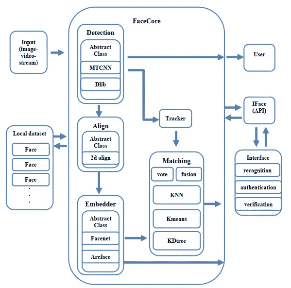

# 图像和视频中人脸识别管道的模块化框架

> 原文：<https://medium.com/analytics-vidhya/facelib-a-modular-framework-for-face-recognition-pipeline-in-images-and-videos-b4498907c082?source=collection_archive---------14----------------------->

你想用多种类型的检测器、嵌入和匹配方法在视频和图像中进行人脸识别吗？facelib 就是这样一个软件解决方案！！它还配备了强大的跟踪方法，提高了在**视频**和**现场直播**人脸识别中的性能

《老友记》的演员阵容得到了认可

## 什么是 facelib？

该项目通过单独解决以下每个问题来解决人脸识别问题:人脸检测、人脸对齐、人脸嵌入和人脸匹配或识别，代码反映了学术划分，以便每个步骤可以用用户喜欢的任何框架或编程语言独立执行，然后将它集成到管道中。该项目还与视频或直播流和实现对象跟踪，以获得更好的结果，并减少计算成本时，处理高帧率。该项目旨在找到一种软件解决方案，允许开发人员根据自己的需求快速定制人脸识别管道，同时该项目还帮助研究人员评估他们为特定任务(如人脸嵌入)开发的具有不同检测和对齐方法的模型。这个项目还有许多其他有用的用例。代码以良好的方式组织和记录，这样开发人员可以相对容易地阅读和调整，文档是使用 sphinx 构建的，因此用户可以搜索任何需要的文档。

# 体系结构

facelib 架构

代码架构由执行独立任务的独立单元组成，主要模块是处理管道操作的类 FaceCore，但也可用于检测或嵌入等单一任务。每个类都可以选择“清理”它所领导的模型，FaceCore 的构建是为了将模型保存在内存中，以避免加载开销。这提高了 facelib 在应用程序中的性能。在任何时候，您都可以使用 clean 选项来释放内存。

# 视频识别

视频人脸识别

FaceCore 类可以使用函数“process stream”(可以处理实时流和视频)执行视频人脸识别和跟踪，这包括忽略视频中出现的小人脸，一旦人脸大于阈值，它就会对该人脸执行 N(一个可以控制的变量)帧的识别流水线，并累积关于人脸身份的决策并做出最终决策，一旦做出最终决策，就不再执行识别，该函数将继续仅跟踪人脸。
决策累积可以以两种方式进行(发现具有相似的性能),即投票和特征融合，在投票中，前 N 帧中的每一帧在最终决策上都有一票，而在特征融合中，我们取在特定人脸的 N 帧中提取的 N 个嵌入向量的平均值，然后使用新的嵌入向量进行最终匹配。这对于减少计算量和提高人脸识别率是很重要的。

github:

## [https://github . com/allooshe/face lib _ modular _ face _ recognition _ pip line](https://github.com/Alloooshe/facelib_modular_face_recognition_pipline)

**更具技术性的解释即将推出，敬请关注，祝您愉快。**