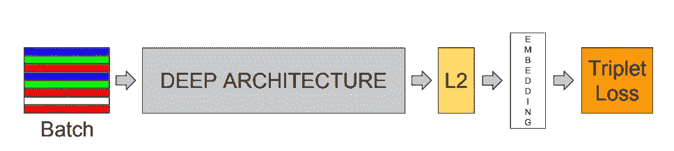
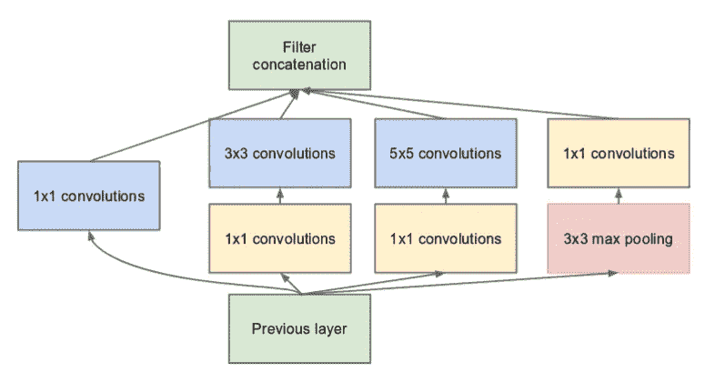
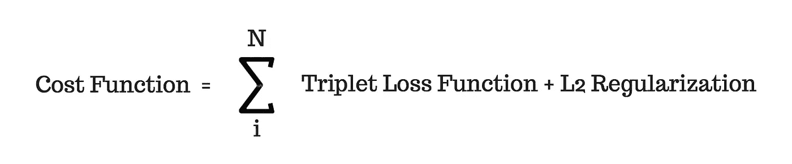
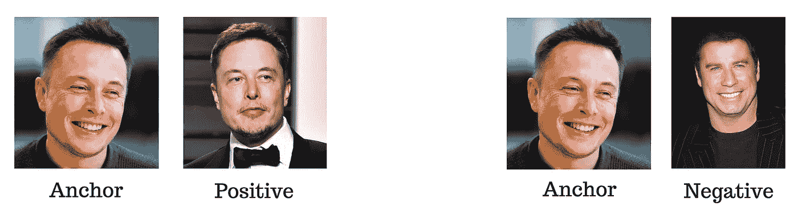

# FaceNet 架构

> 原文：<https://medium.com/analytics-vidhya/facenet-architecture-part-1-a062d5d918a1?source=collection_archive---------1----------------------->

## 第 1 部分:架构和在 Google Colab 上运行一个基本示例

> 帮助弱者！打击网络犯罪[了解如何](https://forms.gle/JWAPHzf2gd7jGq2YA)。


*本文理解来自* [*FaceNet*](https://arxiv.org/pdf/1503.03832.pdf) *和*[*GoogleNet*](https://arxiv.org/pdf/1409.4842.pdf)*论文。这是一个由两部分组成的系列，第一部分我们将介绍 FaceNet 架构以及在 Google Colab 上运行的示例，后面的部分将介绍移动版本。*

FaceNet 是一个先进的人脸识别、验证和聚类神经网络。是 22 层深度神经网络，直接训练其输出为 128 维嵌入。在最后一层使用的损失函数被称为三重损失。



图 1:高级模态结构

FaceNet 由上述构建模块组成，因此我们将依次介绍每一个模块。

图 1 中显示的深度网络来自 GoogleNet 架构(*它有很多版本，但是‘Inception-Resenet-v1’是我们将在我们的编码示例中使用的那个*)。FaceNet 论文并没有太多地涉及 GoogleNet 架构的内部工作方式，它将深度神经网络视为一个黑盒，但我们将触及一些重要的概念，以了解它是如何使用的以及用于什么目的。

# 深度网络——谷歌网

GoogleNet 是 ImageNet 2014 挑战赛的获胜者，该网络给出了一些突破性的结果，并对传统的卷积神经网络(CNN)进行了改进。下面列出了其中的一些功能:

*   22 层深度网络与 8 层 AlexNet 相比。
*   高效、更快计算能力。计算成本:比 AlexNet 少 2 倍。
*   与 AlexNet 相比要精确得多。
*   低内存使用和低功耗。
*   与 AlexNet 相比，网络更大，但参数数量更少。参数比 AlexNet 少 12 倍。
*   MUL-ADD Ops 预算被限制在 15 亿美元(在推断期间)，这样该架构可以用于现实世界的应用，特别是移动电话等便携式设备。

> 在传统的 CNN 中，[卷积](/@tomdeore/deep-learning-in-gradient-descent-style-part-2-e159e2cf8a99)是用给定的滤波器在图像上进行的，以构建相关统计，逐层然后将这些高度相关的神经元聚类作为输出。需要注意的重要一点是，相关性是图像块的局部相关性，最高相关性存在于网络的早期层，因此大的滤波器尺寸和早期汇集将减少隐藏在图像块中的重要信息。

这是谷歌网络架构背后的主要灵感，并被转化为所谓的网络中的网络，命名为“ ***盗梦空间模块*** ”。

传统的美国有线电视新闻网(CNN)很少有其他挑战被谷歌网很好地解决了，它们是:

## 关注:

1.  网络中的层数越多越好，但缺点是，它也增加了参数的数量，并可能导致过拟合。
2.  深层网络也存在梯度消失问题，因为在反向传播过程中，梯度直到初始层才能到达网络，导致权重不变，这是不希望的。
3.  滤波器的线性增加导致运算的二次增加，由此需要更多的计算能力。
4.  更多参数，将需要更多的数据集和更长的训练时间，即使数据扩充也没有多大帮助。通常，表面数据生成并不是一个合适的解决方案。
5.  **减少代表权瓶颈**。这可以理解为*降维与信息提取*之间的权衡。在卷积中，当我们深入网络时，输入的维数减少，信息衰减发生，因此信息提取应该对每一层都有效，特别是关于局部区域。

## 解决方案:

1.  GoogleNet 使用 1x1 过滤器进行降维。1x1 卷积背后的想法是保持输入大小(高度和宽度)不变，但收缩通道。示例:将 256x256x3 RGB 图像转换为 256x256x1 图像。
2.  除了 1x1 之外，还使用其他更小但在空间上分散的滤波器，如 3x3、5x5 和 7x7。由于 max-polling 成功地对图像进行了下采样，因此滤波器被并行应用，并且最终所有中间输出被连接用于下一阶段。这使得 inception 模块在中间更宽，但背靠背连接许多这样的模块，使它更深。从视觉上看，基本构建模块“初始模块”如下所示:



图 2:降维后的初始模块

3.考虑到网络的深度，在反向传播期间必然会出现消失梯度问题，因此在中间层分接两个辅助输出，并在将其添加到总损耗之前进行加权平均，即:

```
total_loss = final_loss + (1/3 * aux1_loss) + (1/3 * aux2_loss)
```

自 Inception-v1 以来，模块已经经历了各种改进，如下所述，简而言之:

**盗梦空间-v2 和盗梦空间-v3 (** [**纸**](https://arxiv.org/pdf/1512.00567v3.pdf) **)**

这个版本有**因子分解**，它减少了参数并减少了过拟合问题，引入了**批处理规范化**，以及**标签平滑**，它防止特定的 logit 与其他 logit 相比变得太大，因此在分类器层应用了正则化。

**Inception-v4 和 Inception-ResNet-v1(**[**论文**](https://arxiv.org/pdf/1602.07261.pdf) **)**

这个版本简化了网络的主干(这是连接到第一个初始模块的网络的前导)。初始块和以前一样，只是它们被命名为 A、B、c。对于 ResNet 版本，引入了剩余连接，取代了初始模块中的池。

在[大卫·桑德伯格](https://github.com/davidsandberg)的 FaceNet [实现](https://github.com/davidsandberg/facenet)中，使用的是’[Inception-ResNet-v1](https://github.com/davidsandberg/facenet/blob/master/src/models/inception_resnet_v1.py)版本。

在 FaceNet 训练期间，深度网络提取并学习各种面部特征，然后将这些特征直接转换为 128D 嵌入，其中相同的面部应该彼此靠近，不同的面部应该在嵌入空间中远离(*嵌入空间*无非是*特征空间*)。这只是给你一个直觉，但在实现上，这是通过一个称为三重损失的损失函数来实现的。

# 价值函数

FaceNet 的非常具体的特性是它的损失函数。三元组损失是用于面部验证的函数的名称，但是 David 的 FaceNet 实现具有两个损失函数'**三元组损失**以及' **Softmax 激活与交叉熵损失**'。三元成本函数看起来像:



图 4:成本函数

**三重损失:**假设， *f(x)* 在 *d* 维空间中为图像 *x* 创建嵌入。示例图像有:

*   **主播**:我们要对比的埃隆面具的图像，
*   **正**:埃隆面具的另一个图像，正例，
*   反面人物:约翰·特拉沃尔塔的形象，反面例子。



图 3:分组的三幅图像。

理论上，在欧几里德空间中，锚图像应该更靠近正图像而远离负图像。这可以计算为:

```
 **dist(A,P)**               **dist(A,N)**||f(A) - f(P)||² + α <= ||f(A) - f(N)||²similarly, ||f(A) - f(P)||² + α - ||f(A) - f(N)||² <= 0                ... (1)
```

这里，

`||f(A) — f(P)||`是锚和正之间的距离，

`||f(A) — f(N)||`是锚和负之间的距离。

为了让积极的一组远离消极的一组，一个边缘 **α** 被加到积极的一组，这样我们把积极的一组推得更远。

损失函数(1)可以是**零**，在这种情况下，等式看起来如下(因为我们不需要低于零的值):

```
L(A,P,N) = max(||f(A) - f(P)||² + α - ||f(A) - f(N)||², 0)   ... (2)
```

**三元组选择:**想到的明显问题是我们如何选择`f(A,P)`和`f(A,N)`对，因为如果我们随机选择它们，上面的等式(2)将很容易满足，但是我们的网络不会从中学习很多，此外，寻找局部最小值也是不正确的，并且梯度下降可能收敛到错误的权重。

论文指出，使用非常硬的**示例会导致收敛在一开始就发生，并可能导致模型崩溃。**半硬**示例是首选选项。这可以通过使用合理的小批量来实现，本文作者在小批量中使用了 40 个面。**

因此，我们必须将'**半硬**'示例配对，并将其呈现给网络。使得:

```
 d(A,P) ≈ d(A,N)
```

因为 **α** 缘会一直把他们拒之门外，即使他们彼此很近。

FaceNet 论文提出了两种方法:

1.  在每一个`n`训练步骤中离线:计算最新检查点的`argmin`和`argmax`，并将其应用于数据子集。
2.  在线:选择一个大的小批量，并在该批量中计算`argmin`和`argmax`。

**注意** :-带有三重丢失的训练可能会很麻烦，因此 David 的 FaceNet 实现建议使用“带有交叉熵丢失的 Softmax”，该理论来自[论文](http://www.robots.ox.ac.uk/~vgg/publications/2015/Parkhi15/parkhi15.pdf)。

# SVM 训练—推理

然后，这些嵌入被用来寻找欧几里德距离以匹配或验证照片。SVM 是最适合用于分类的机器学习算法，该算法根据这些生成的嵌入进行训练，并且稍后可以针对测试数据进行推断。

# 示例代码

代码可以在这里找到[。最好是你能在 Google Colab 上打开并运行它。](https://gist.github.com/milinddeore/0e36ad7dda227f708bef0beb4fe595da)

*在接下来的* [*第二部分*](/@tomdeore/facenet-on-mobile-cb6aebe38505) *中，我们将介绍在移动设备上使用 FaceNet 的实际例子，我们还将了解什么是* `*.tflite*` *模型，以及为什么它需要在移动设备上使用。*

**你可以在|**[**LinkedIn**](https://www.linkedin.com/in/mdeore/)**|**[**网站**](https://tomdeore.wixsite.com/epoch)**|**[**Github**](https://github.com/milinddeore)**|**