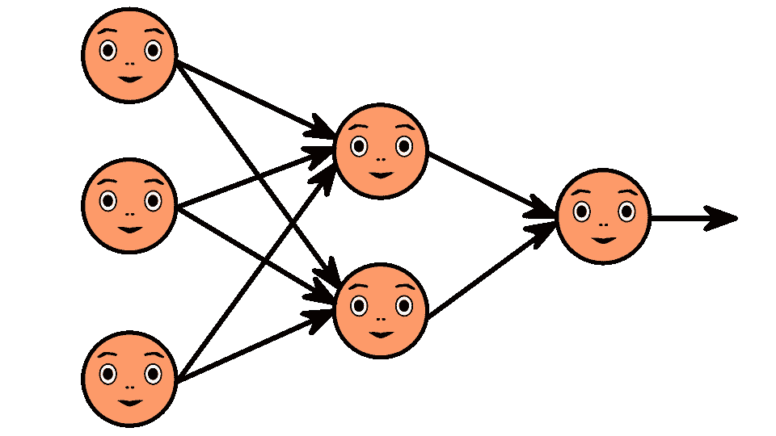
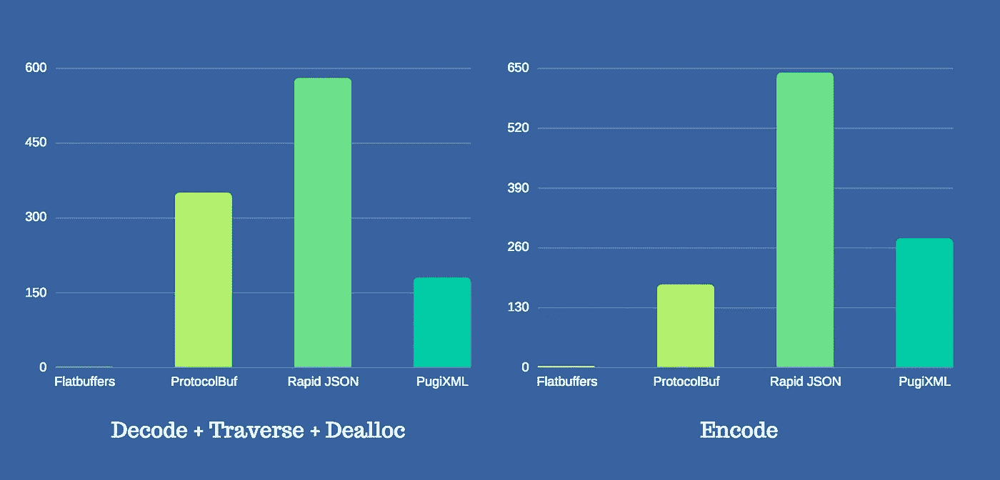

# 手机上的 Facenet 第二部分

> 原文：<https://medium.com/analytics-vidhya/facenet-on-mobile-cb6aebe38505?source=collection_archive---------0----------------------->

## *转换 Facenet(。pb)到 Facenet(。tflite)*

> 帮助弱者！打击网络犯罪[了解如何](https://forms.gle/JWAPHzf2gd7jGq2YA)。



*如果你没有读过我关于 FaceNet 架构的故事，我会推荐你去浏览一下*[*part-1*](/@tomdeore/facenet-architecture-part-1-a062d5d918a1)*。在接下来的*[*part-3*](/@tomdeore/facenet-on-modile-part-3-cc6f6d5752d6)*中，我会比较* `*.pb*` *和* `*.tflite*` *车型。*

当人脸识别/认证需要最先进的准确性时，Facenet 是 Android 和 IOS 平台的显而易见的选择。但是在移动设备上运行 Facenet 需要一些特殊的处理，本文讨论了这个问题和潜在的解决方案。

在 Android 上，每个应用程序都有 Dalvik VM 强制限制的内存使用量。Android NDK 没有这个限制，但这并不意味着本地代码可以消耗尽可能多的内存。同样的逻辑也适用于 AI 模型，它们应该是精益和精简的。

AI 模型是以特定文件格式构造的大型数据文件，以便推理引擎可以快速解析和加载它们。读取这样的数据文件可能会导致各种问题:解析开销、由于大小导致的性能下降、加载时间长，并且可能会导致低端设备上的内存节流。

Tensorflow 的`.tflite`文件格式，主要用于解决资源受限设备上的此类问题。`.tflite`实际上将完整的模型数据转换成一种叫做[的量化](https://nervanasystems.github.io/distiller/quantization/)和精简结构化格式(即 [flatbuffers](https://google.github.io/flatbuffers/) )。

非量化的 Facenet 模型大小约为 95MB，而且它位于[协议缓冲区](https://developers.google.com/protocol-buffers/)(另一种文件格式)。与 flatbuffers 相比，protocol-buffer 慢得惊人，下图显示了比较结果:



如果您想了解[与`.tflite`支持的操作](https://www.tensorflow.org/lite/tf_ops_compatibility)。您还可以直接从[代码库](https://github.com/tensorflow/tensorflow/tree/master/tensorflow/lite/kernels)中查看所有最新的重大变更。

无论如何，让我们开始支付代码…

## 步骤 1:克隆 Facenet 存储库

```
$ git clone [https://github.com/davidsandberg/facenet.git](https://github.com/davidsandberg/facenet.git)
```

我们将量化预训练的具有 512 个嵌入大小的 Facenet [模型](https://drive.google.com/open?id=1EXPBSXwTaqrSC0OhUdXNmKSh9qJUQ55-)，但是您可以选择使用具有 128 个嵌入大小的模型。该模型在量化前大小约为 95MB。

`wget`模型到`../facenet/models/`目录

```
$ ls -l models/total 461248
-rw-rw-r — @ 1 milinddeore staff **95745767** Apr 9 2018 20180402–114759.pb
```

*在您的机器上安装 tensor flow:*

```
$ pip3 install tensorflow
```

*确保安装了 python ≥ 3.4 版本。*

## 步骤 2:分条训练分支

这里我们剥离掉' ***phase_train*** '输入分支，这将减少总的操作数并使它只推论图形。

如果您尝试将 facenet 型号`.pb`转换为`.tflite`，您将得到 **BatchNorm** 错误，如下所示:

错误:'*平均值、乘数和偏移量需要是常数*'。

让我们详细了解这一点:

> 什么是 BatchNormalization？

**BatchNormalization(又名 batch normal)**:输入数据预处理是必须的，在输入神经网络之前，这通常在输入数据集上完成。

同样，我们也对 DNN 层之间的数据进行归一化，这被称为 **BatchNorm** 。它在相同的尺度上转换数据，并避免任何不稳定性。这有两个部分:

1.  归一化:通常我们在 *0 到*1 的尺度上**缩小数据。让我们假设我有*data _ values =【1，200，100000，500】*。这是一个相当大的值范围，我们需要将它们缩小到 0 到 1 的范围，中间有很多浮点。这一点很重要，否则网络将变得不稳定，数据点的范围很广，训练将花费很长时间，而且也不能保证网络会正确收敛。**
2.  标准化:这实际上是计算 Z 分数，并使**数据集具有‘零’均值和‘一’标准差**。

```
 x — m
                              Z = -----
                                    S
Where: 
x = data point
m = Mean of dataset
S = Standard deviation
```

现在我们需要了解 BatchNorm 是如何在 Tensorflow 中实现的。“训练”和“推理”的效果不同

**培训**:

1.  基于小批量统计，标准化层激活。其中，小批量统计数据为:小批量平均值和小批量标准偏差。
2.  通过小批量统计的移动平均值更新总体统计近似值。其中人口统计为:人口均值和人口标准差。

**推论**:

1.  估计人口统计，以标准化层激活。
2.  不要根据小批量统计数据更新总体统计数据，因为这是测试数据。

在代码中:我们需要设置`is_training = False`以便 BatchNorm 按照推理模式的建议工作。下面的代码片段设置了`arg_scope`,因此对于图中的所有`BatchNorm`,这个配置都是适用的。

```
inception_resnet_v1.inference(data_input, keep_probability=0.8, phase_train=False, bottleneck_layer_size=512)Here: 
**is_training = phase_train = False** 
```

为了创建一个只包含推理的模型，将下面的代码粘贴到`../facenet/`目录下的`inference_graph.py`文件中

```
import tensorflow as tf
from src.models import inception_resnet_v1
import sys def main():

    traning_checkpoint = “models/model-20180402-114759.ckpt-275”
    eval_checkpoint = “model_inference/imagenet_facenet.ckpt”

    data_input = tf.placeholder(name=’input’, dtype=tf.float32, shape=[None, 160, 160, 3])
    output, _ = inception_resnet_v1.inference(data_input, keep_probability=0.8, phase_train=False, bottleneck_layer_size=512)
    label_batch= tf.identity(output, name=’label_batch’)
    embeddings = tf.identity(output, name=’embeddings’)

    init = tf.global_variables_initializer() with tf.Session() as sess:
        sess.run(init)
        saver = tf.train.Saver()
        saver.restore(sess, traning_checkpoint)
        save_path = saver.save(sess, eval_checkpoint)
        print(“Model saved in file: %s” % save_path) if __name__ == “__main__”:
    main()
```

运行脚本并创建仅推理模型，将其保存在`../facenet/model_inference/`下

```
$ python3 inference_graph.py models/ model_inference/
```

Facenet 提供了`freeze_graph.py`文件，我们将用它来冻结推理模型。

```
$ cd ./facenet
$ python3 src/freeze_graph.py model_inference/ facenet_frozen.pb
```

一旦生成了冻结模型，就该将其转换为`.tflite`

```
$ tflite_convert --output_file model_mobile/my_facenet.tflite --graph_def_file facenet_frozen.pb --input_arrays “input” --input_shapes “1,160,160,3” --output_arrays "embeddings" --output_format TFLITE — mean_values 128 --std_dev_values 128 --default_ranges_min 0 --default_ranges_max 6 --inference_type QUANTIZED_UINT8 --inference_input_type QUANTIZED_UINT8 
```

我们将 float32 量子化为 quint8，使大小缩小了三倍。让我们检查量化模型的大小:

```
$ ls -l model_mobile/total 47232
-rw-r — r — @ 1 milinddeore staff 23667888 Feb 25 13:39 my_facenet.tflite 
```

为了验证`.tflite`型号，我们需要如下的参数间代码:

```
import numpy as np
import tensorflow as tf# Load TFLite model and allocate tensors.
interpreter = tf.lite.Interpreter(model_path=”/Users/milinddeore/facenet/model_mobile/my_facenet.tflite”)interpreter.allocate_tensors()# Get input and output tensors.
input_details = interpreter.get_input_details()
output_details = interpreter.get_output_details()# Test model on random input data.
input_shape = input_details[0][‘shape’]
input_data = np.array(np.random.random_sample(input_shape), dtype=np.uint8)interpreter.set_tensor(input_details[0][‘index’], input_data)
interpreter.invoke()output_data = interpreter.get_tensor(output_details[0][‘index’])print(‘INPUTS: ‘)
print(input_details)
print(‘OUTPUTS: ‘)
print(output_details)
```

参数间输出:

```
$ python inout.pyINPUTS:
[{‘index’: 451, ‘shape’: array([ 1, 160, 160, 3], dtype=int32), ‘quantization’: (0.0078125, 128L), ‘name’: ‘input’, ‘dtype’: <type ‘numpy.uint8’>}]
OUTPUTS:
[{‘index’: 450, ‘shape’: array([ 1, 512], dtype=int32), ‘quantization’: (0.0235294122248888, 0L), ‘name’: ‘embeddings’, ‘dtype’: <type ‘numpy.uint8’>}]
```

输出与我们预期的一样，现在是时候在目标设备上运行它并查看性能了。

在接下来的 [part-3](/@tomdeore/facenet-on-modile-part-3-cc6f6d5752d6) 中，我将稍微深入一点比较`.pb`和`.tflite`无量化模型比较。理论上他们应该吐出相同的嵌入。

第三集见…

**你可以在|**[**LinkedIn**](https://www.linkedin.com/in/mdeore/)**|**[**网站**](https://tomdeore.wixsite.com/epoch)**|**[**Github**](https://github.com/milinddeore)**|**