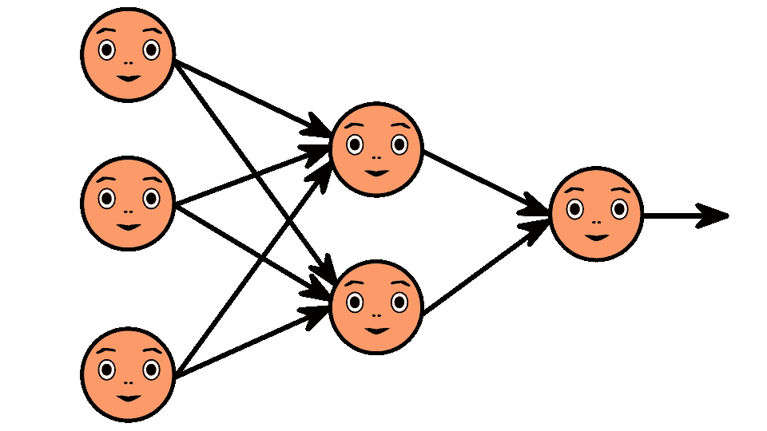
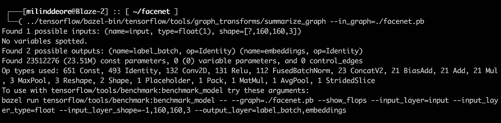
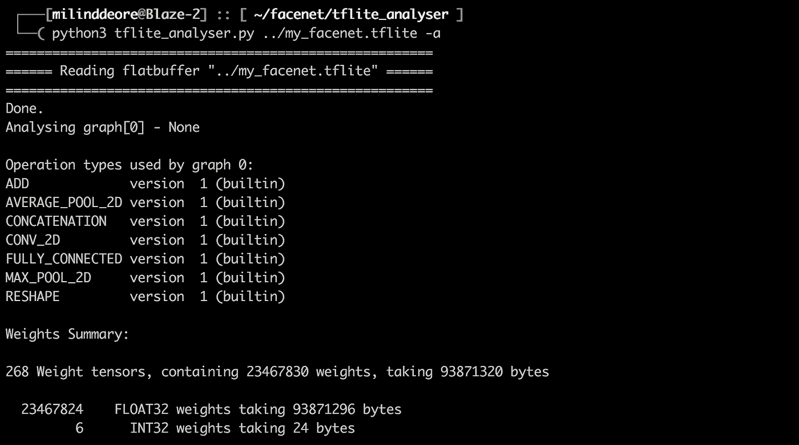
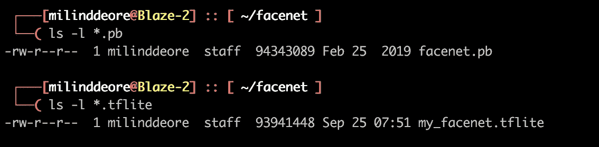
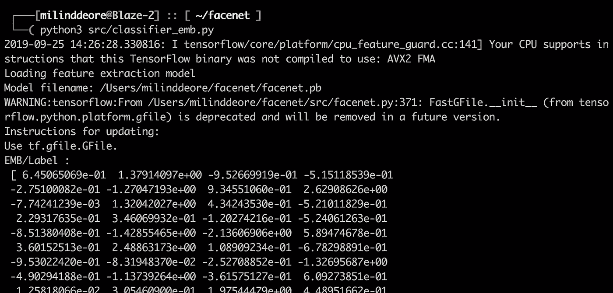
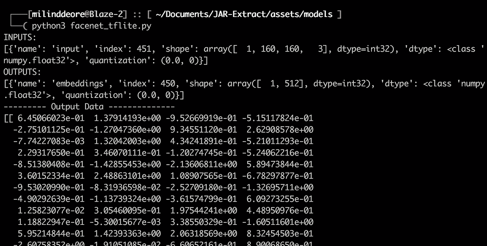

# 手机上的 Facenet 第三部分

> 原文：<https://medium.com/analytics-vidhya/facenet-on-modile-part-3-cc6f6d5752d6?source=collection_archive---------5----------------------->

## *了解一下，再多一点……*

> 帮助弱者！打击网络犯罪[了解如何](https://forms.gle/JWAPHzf2gd7jGq2YA)。



*如果你还没有读过我之前关于 FaceNet 架构和将* `*.pb*` *转换为* `*.tflite*` *的故事，我建议你浏览一下* [*第一部分*](/@tomdeore/facenet-architecture-part-1-a062d5d918a1) *和* [*第二部分*](/@tomdeore/facenet-on-mobile-cb6aebe38505) *。*

让我们从[第二部分](/@tomdeore/facenet-on-mobile-cb6aebe38505)中离开的地方继续。我们将 Facenet 检查点转换为 Facenet 冻结模型`.pb`，其中只有推理分支，并从模型中剥离出*阶段训练*。要验证这一事实，请使用 Tensorflow `graph_transforms`工具，如下图所示:



同样，我们也有很棒的工具用于`.tflite`模型。我强烈建议使用 Pete 的 [tflite_analyser](https://github.com/PeteBlackerThe3rd/tflite_analyser.git) 工具(感谢 Pete！).请查看下面的输出片段:



现在，如果你比较这两个模型的“重量大小”的输出，它是完全相同的。

**23M** 权重 **x 4** ( *浮点* *数据类型* ) = **93M** 字节的权重。

您还会注意到`.pb`和`.tflite`的完整模型尺寸也在 93M 左右。



> 是时候验证他们是否为给定的“图像”提供了相同的嵌入了？

**请注意，本文中使用的模型尚未量化**，因为量化后我们预计会有一些退化。但是在这一点上，我们想检查一下，从`.pb`到`.tflite`是否有任何变化？因为这种转换本质上只是格式的**转换，即**将协议缓冲区转换为平面缓冲区**。**

这可以使用以下命令进行归档:

```
$ tflite_convert --output_file model_mobile/my_facenet.tflite --graph_def_file facenet_frozen.pb --input_arrays “input” --input_shapes “1,160,160,3” --output_arrays "embeddings" --output_format TFLITE
```

*理论上，对于给定的图像，这两个模型应该会产生相同的嵌入，让我们来测试一下:*

## `Protocol Buffer — Model`

下面的脚本采用`.pb`模型和我的一个图像来输出 128 字节的嵌入。这里，我们使用*预白化*()对图像进行归一化处理。

```
from __future__ import absolute_import
from __future__ import division
from __future__ import print_functionimport tensorflow as tf
import numpy as np
import facenet
from skimage import iodef prewhiten(x):
  try:
    x = io.imread(x)
  except:
    print('Image is corrupt!')
    return 0
  mean = np.mean(x)
  std = np.std(x)
  std_adj = np.maximum(std, 1.0/np.sqrt(x.size))
  y = np.multiply(np.subtract(x, mean), 1/std_adj)
  return ydef main():
  with tf.Graph().as_default():
    with tf.Session() as sess:
      np.random.seed(seed=666)# Load the model
      print('Loading feature extraction model')
      facenet.load_model('facenet_frozen.pb')# Get input and output tensors
      images_placeholder = tf.get_default_graph().get_tensor_by_name("input:0")
      embeddings = tf.get_default_graph().get_tensor_by_name("embeddings:0")
      embedding_size = embeddings.get_shape()[1]# Run forward pass to calculate embeddings
      input_img = 'Milind-Deore.jpeg'
      image = prewhiten(input_img)input_data = np.zeros((1, 160, 160, 3))
      input_data[0,:,:,:] = image
      input_data = input_data.astype(np.float32)
      feed_dict = { images_placeholder:input_data }
      emb_array = np.zeros((1, 128))
      emb_array = sess.run(embeddings, feed_dict=feed_dict)print('EMB/Label : \n', emb_array[0])if __name__ == '__main__':
     main()
```

它输出如下所示的内容:(小片段)



## 平板缓冲器—型号

类似地，对于`.tflite`模型，下面的脚本获取我的一个相同的图像并输出 128 字节的嵌入。

```
import numpy as np
import tensorflow as tf
from skimage import io# Normalize the image
def prewhiten(x):
     try:
         x = io.imread(x)
     except:
         print('Image is corrupt!')
         return 0
     mean = np.mean(x)
     std = np.std(x)
     std_adj = np.maximum(std, 1.0/np.sqrt(x.size))
     y = np.multiply(np.subtract(x, mean), 1/std_adj)
     return y# Load TFLite model and allocate tensors.
interpreter = tf.lite.Interpreter(model_path='my_facenet.tflite')
interpreter.allocate_tensors()# Get input and output tensors.
input_details = interpreter.get_input_details()
output_details = interpreter.get_output_details()# Test model on random input data.
input_img = 'Milind-Deore.jpeg'
image = prewhiten(input_img)
input_data = np.zeros((1, 160, 160, 3))
input_data[0,:,:,:] = image
input_data = input_data.astype(np.float32)
interpreter.set_tensor(input_details[0]['index'], input_data)interpreter.invoke()
output_data = interpreter.get_tensor(output_details[0]['index'])print('INPUTS: ')
print(input_details)
print('OUTPUTS: ')
print(output_details)

print('--------- Output Data --------------')
print(output_data)
```

输出片段如下所示:



好消息！嵌入看起来很相似。

你现在可以尝试应用量化`QUANTIZED_UINT8`并查看准确性的变化，因为比较嵌入没有任何意义，因为量化会将输出嵌入从`float32`转换为`int8`数据类型。

*引用:*

*   *感谢 Pete Blacker 提供了牛逼的 TF lite*[*analyser*](https://github.com/PeteBlackerThe3rd/tflite_analyser.git)*。*

**你可以在|**[**LinkedIn**](https://www.linkedin.com/in/mdeore/)**|**[**网站**](https://tomdeore.wixsite.com/epoch)**|**[**Github**](https://github.com/milinddeore)**|**