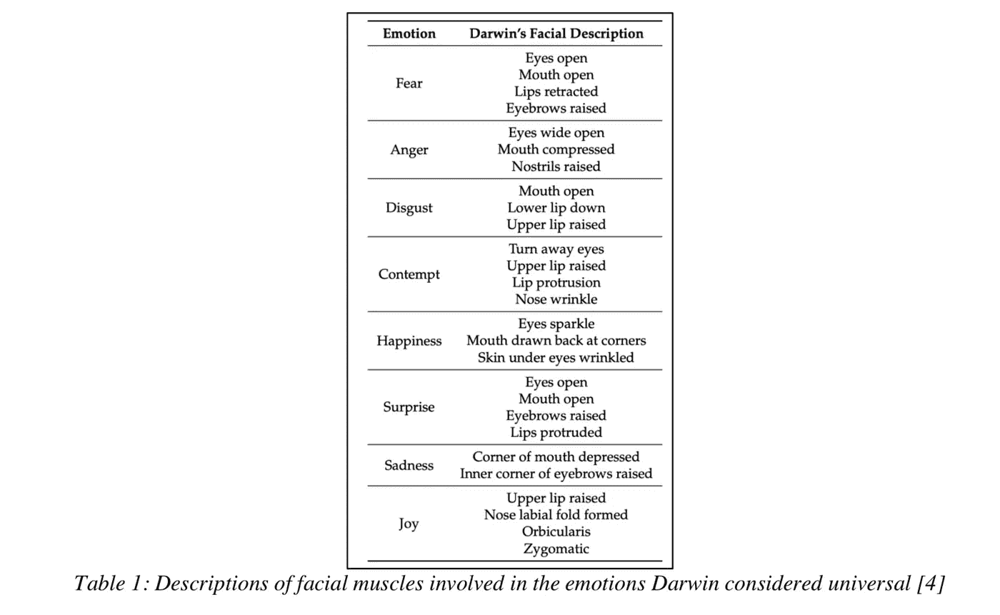

# 基于深度学习的人脸情感分类

> 原文：<https://medium.com/analytics-vidhya/facial-emotion-classification-using-deep-learning-d08dd02a2d38?source=collection_archive---------2----------------------->

**第 1 节**
情绪检测是现代机器学习领域最受研究的课题之一[1]。准确检测和识别情绪的能力为高级人机交互打开了无数的大门。对情绪的检测可以通过人的语言、身体姿势和面部表情来完成。这个项目的目的是实时检测多达五种不同的面部情绪。这个项目运行在一个卷积神经网络(CNN)之上，该网络是在 *Keras* 的帮助下建立的，其后端是 *Python* 中的 *TensorFlow* 。该系统可以检测和分类的面部情绪有高兴、悲伤、愤怒、惊讶和中性。

我们已经将 *OpenCV* 用于图像处理任务，在这些任务中，我们从实时网络摄像头馈送中识别人脸，然后对其进行处理，并将其馈送到经过训练的神经网络中进行情绪检测。这里使用的数据集是 *Fer2013* ，它由 32，298 幅图像组成，这些图像被进一步分为训练(28，709)和测试(3，589)图像。

第 1 节给出了整个项目的简要概述，第 2 节阐明了为此项目所做的文献综述，第 3 节讨论了系统的功能和能力，第 4 节揭示了此模型的应用，第 5 节阐述了可交付成果和时间限制，第 6 节包括团队成员的贡献，第 7 节以成功的证据结束了报告。

**第二部分:文献综述**

我们项目的目标是使用 CNN 实时检测面部情绪。这是一种特殊类型的深度学习技术，在经过大量训练后，它为我们提供了面部情感识别中许多问题的解决方案[2]。CNN 的主要优势是通过直接从输入源进行“端到端”学习，完全消除或显著减少对基于物理的模型和/或其他预处理技术的依赖[3]。

自动识别和面部情绪状态的研究代表了一个人的行为方式，对于识别、检查和保护易受伤害的人(如遇到精神问题的患者、承受严重精神压力的人和自我控制能力较差的孩子)非常有用[4]。

虽然我们在我们的项目中使用了 *Fer2013* 数据集，但我们发现很难清楚地区分恐惧、惊讶和厌恶这几种情绪，因此，我们将它们归类到我们考虑的 5 种情绪中的一个名为惊讶的组中，这 5 种情绪也包括快乐、悲伤、愤怒和中性。 *Fer2013* 数据集由 Kaggle 提供，代表真实世界中自发的面部表情，在所有具有挑战性的条件下制作，如不同的灯光，不同的头部运动，以及因种族，年龄，性别，面部毛发和眼镜而产生的面部特征差异。

基于深度学习的面部表情识别(FER) [1]技术通过直接从输入图像在流水线中进行纵向学习，在更大程度上降低了对基于面部物理学的模型和其他预处理技术的依赖[5]。该方法包括以下步骤:

CNN 由以下几层组成:

*输入层:*包含图像的原始像素值。在将像素馈送到该层之前，进行预处理

*   *卷积层:*该层计算输入层上神经元连接的权重和小区域之间的点积。随后是一个汇集层，它沿宽度和高度向下采样维度，以减少大量卷积层的计算时间[2]
*   *密集层:*它通过与可训练权重相连的层来转换特征。这一层识别出图像的复杂特征，从而展现出整个图像[2]
*   *输出层:*该层连接到前一个完全连接的层，并输出所需的类别或其概率

人类的 7 种基本情绪是快乐、惊讶、愤怒、悲伤、恐惧、厌恶和中性。复合情绪是两种基本情绪的结合。Du 等人[6]介绍了 22 种情绪，包括 7 种 BE，12 种 CE，最典型地由人类表达，以及另外 3 种情绪(恐惧、憎恨和敬畏)。微表情(ME)表示更多的自发和微妙的面部运动，这些运动是不由自主地发生的。他们倾向于在短时间内揭示一个人真实的和潜在的情感[5]。

**第 3 节:功能和系统能力**

该系统在 Macintosh 系统上经过 20 个历元的训练，总体准确率达到了 70.62%。该模型可以实时检测多张人脸。首先，它识别每个检测到的人脸中的情感，然后在每个检测到的人脸周围出现的边界框附近相应地标记情感。在 Python 上构建这个的决定给了我们扩展这个项目的多功能性，不仅仅是面部情绪检测。我们可以以这个项目为核心构建各种应用程序。

**第四部分:应用程序**

情感检测现在有更广泛的应用范围，将来也是如此。我们已经确定了可以实施该模型的几个领域，如下所示:

*   药物治疗——如果一个人不能/不愿意说话，有助于进行初步分析，在给予治疗时检查患者的舒适度，进行心理分析
*   这种型号的娱乐功能可以应用于索尼的 AIBO 机器狗以及 Anki Vector 机器人，相机应用程序:如果相机中检测到的人脸似乎没有微笑，设备会喷水并让那个人微笑，这种功能只有在选择时才起作用，不需要每次都起作用，因为人们可能希望在每张照片中展示不同的情绪
*   业务发展-当填写在线调查时，网络摄像头会检测这个人实际上是快乐还是悲伤*(这侵犯了隐私，但会弹出一个窗口询问用户是否允许特定网站访问摄像头)，*原型也可以用于市场研究*(安装在商店过道上的网络摄像头决定了产品对最终客户的影响)*

**第 5 部分:交付成果和时间限制**

如果我们有更多的时间来研究这个系统，我们会更加珍惜。时间的缺乏意味着我们无法提高检测“悲伤”情绪的准确性，而这个系统似乎是最不准确的。我们认为，在训练数据集中有一些噪声数据，这导致了情绪检测的不均匀准确性。我们本可以过滤噪声数据以获得更好的结果，甚至可以制作我们自己的数据集，但这也需要大量的人工工作和时间。此外，如果有更多的时间，我们就可以利用许多其他参数进行游戏和工作，例如提高图像的分辨率，在云上进行培训以获得更好的计算能力，并在上述某个应用程序上实际实施该模型，前提是我们有更多与时间和金钱相关的资源。

这个系统的一些缺点是:

*   对于类似*【悲伤】*的情感，准确率较低(76.4%)
*   如果一个人戴着任何道具，如帽子、便帽或护目镜，即使他的眼睛是闭着的，他的情绪也无法被察觉
*   所用的数据集含有噪声数据，因此我们无法达到 90 '左右的精确度
*   检测到的情绪并不指定人的实际情绪或人在现实中的感觉，这只是对人类情绪的外围分析和检测
*   使用的数据集是 *Fer2013* ，无权访问其他私有数据集

Github Link- [情绪检测](https://github.com/gagan16/Emotion-Detection)

参考

1.  F.Khan，“通过神经网络使用面部标志检测和特征提取进行面部表情识别”，印度芒格洛尔尼特卡纳塔克邦电子与通信工程系，*ij CsA，*2018 年 12 月 10 日。【在线】。可用:https://www . ground ai . com/project/face-expression-recognition-using-face-landmark-detection-and-feature-extraction-on-neural-networks/[访问日期:2018 年 12 月 12 日]
2.  南米什拉，G.R.B .普拉萨德，R.K .库马尔，g .桑亚尔，“通过面部手势进行情绪识别——一种深度学习方法”，*挖掘智能和知识探索*，2017 年 11 月 28 日，施普林格，查姆。【在线】。a 可用:https://link . springer . com/chapter/10.1007/978-3-319-71928-3 _ 2[访问时间:2018 年 12 月 10 日]
3.  R.Walecki，O. Rudovic，V.Pavlovic，B. Schuller，M. Pantic，“用于面部动作单元强度估计的深度结构化学习”，*ij CsA*，2017 年 4 月 14 日。【在线】。可用:[https://ibug . doc . IC . AC . uk/media/uploads/documents/deep-structured-learning . pdf](https://ibug.doc.ic.ac.uk/media/uploads/documents/deep-structured-learning.pdf)【访问时间:2018 年 12 月 10 日】
4.  南 Turabzadeh，H. Meng，R.M. Swash，M. Pleva，J.Juhar，“面向实时嵌入式系统的面部表情情感检测”， *INTECH 2017，*2018 年 1 月 26 日。【在线】。可用:[https://www.mdpi.com/2227-7080/6/1/17](https://www.mdpi.com/2227-7080/6/1/17)【访问时间:2018 . 12 . 10】
5.  B.C. Ko，“基于视觉信息的面部情感识别简评”，韩国大邱市庆明大学计算机工程系， *Sensors 2018，*2018 年 1 月 30 日。【在线】。a 可用:https://pdfs . semantic scholar . org/1e7a/e 86 a 78 a9 b 4860 aa 720 FB 0 FD 0 BDC 199 b 092 c 3 . pdf？_ ga = 2.13808179.58733878.1545058651-58201269.1545058651[访问时间:2018 年 12 月 12 日]