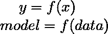
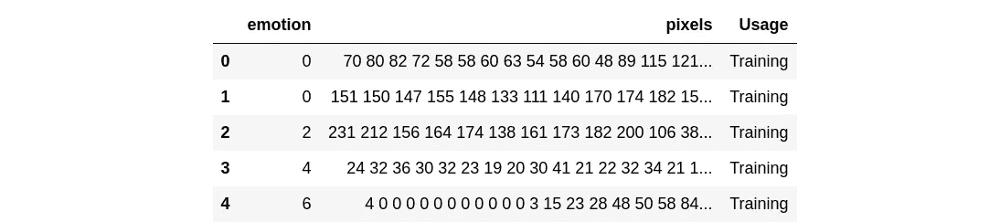
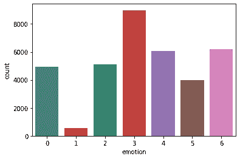
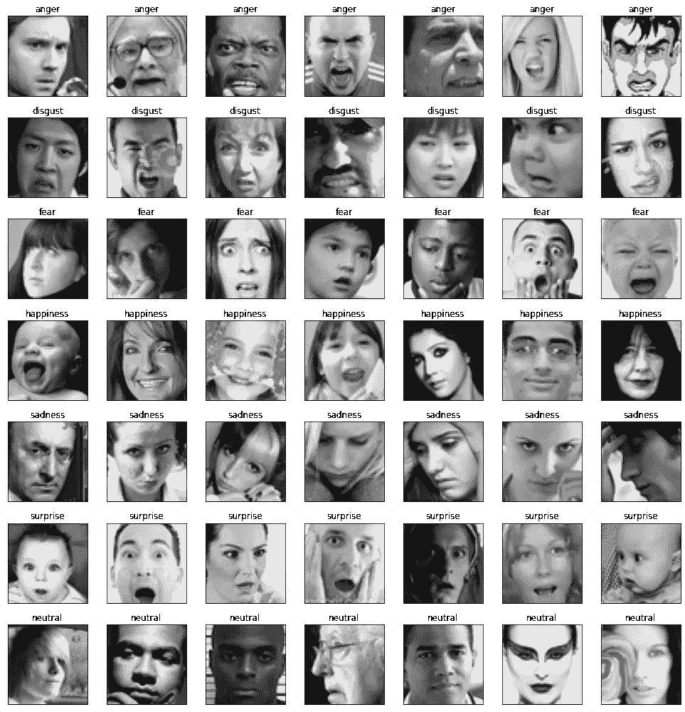
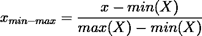
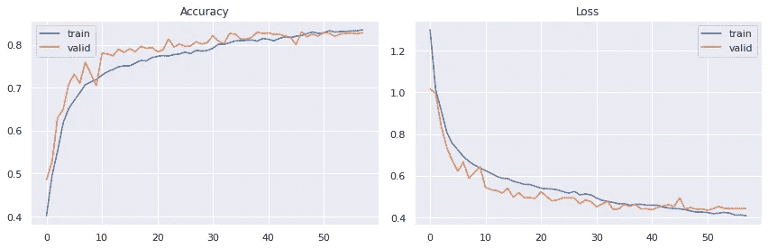
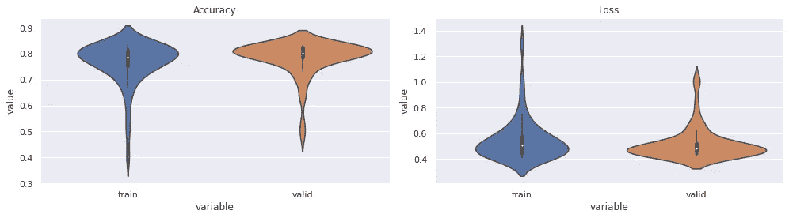
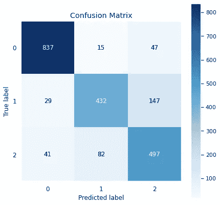
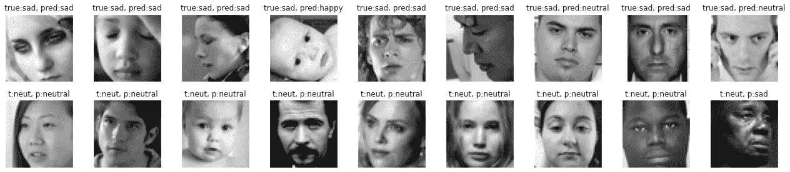

# 基于 Keras 的人脸情感识别(FER)

> 原文：<https://medium.com/analytics-vidhya/facial-emotion-recognition-fer-using-keras-763df7946a64?source=collection_archive---------1----------------------->

这个故事将带你了解 FER 及其应用，更重要的是，我们如何使用 Tensorflow-Keras 创建自己的 FER 系统。

这个故事分为以下几个部分:

*   介绍
*   检查和操作数据
*   从头开始创建我们自己的定制 FER 模型
*   FER 系统的应用

# 介绍

人脸情感识别(俗称 FER)是迄今为止计算机视觉研究最多的领域之一，并且仍处于不断的评估和改进中。这个想法是，我们能通过一个人的面部表情来察觉他/她的情绪吗？当然，作为人类，我们很容易做到这一点，事实上，我们每天都要做上千次。但是*我们能让我们所谓的哑机器足够智能，让它们在这些情感识别任务上也能达到人类水平的表现吗？*看，因为我们人类有情感，所以我们很容易察觉他人的情感，但机器却不是这样。

计算机视觉领域的进步正在飞速发展，这些任务不再那么困难，至少我们能够用很少的努力获得良好的性能。我们将看到如何用几行 python 代码来实现这一点。

> **注意:**为了充分理解这个故事，你应该对 python 和神经网络(特别是 CNN)有一些基本的了解。

# 检查和操作数据

众所周知*给机器增加智能更多的是让它们通过某种算法从数据中学习*，当然为此我们需要**数据**。数据是任何机器学习/深度学习项目中最重要的部分，因为毕竟我们训练的模型是它训练所依据的数据的产物。我的意思是，我们的数据越能代表真实世界，我们的模型就越能像真实世界一样，在真实世界中表现得越好。记住一件事**“垃圾输入，垃圾输出”**，如果我们训练包含大量垃圾的数据，那么在生产中我们的模型也会抛出垃圾。因此，数据是任何 ML/DL 任务最重要的组成部分。

所以，我们也需要 FER 任务的数据。我们将在此基础上训练我们的模型，然后在保留的数据和实时视频流中测试它的性能。注意，这是一个**监督学习**问题，即学习的模型 y 是数据 x 的函数。

对于这个任务，我将使用一个在 [kaggle](https://www.kaggle.com/ashishpatel26/facial-expression-recognitionferchallenge) 上可以获得的非常流行的数据。它的名称与任务相同，因为它仅用于此目的。您也可以使用其他数据集，公开可用的数据集很少，或者您可以创建自己的数据集。

> 随着我们的继续，我们将获得更多关于这些数据的见解，敬请关注…

现在我们将尝试一些真正的 python 代码。首先导入所有需要的库，

让我们检查一下数据，

这些数据不是图像格式，而是一种叫做数据帧的格式。数据帧的`pixels`列包含所有像素值。总共有 96 个像素值与每个图像相关联，因为**每个图像都是灰度图像，分辨率为 48x48。**

现在，我们将检查我们拥有的情感类别的数量以及每个类别中的图像数量。

> 因此，在这个数据集中有 7 类情绪，情绪**厌恶**的图像最少，大约是其他类别的 5-10%。

让我们想象一下每一种情绪的图像。

从这些图像中，我们可以得出以下几点结论:

*   该数据包含各种各样的图像，如男性、女性、儿童、老人、白人、黑人等。
*   它包含一些非人类的图像，如卡通(第一行，最后一列)，事实上包含的图像不包含任何人脸，但要么是空白图像，要么包含一些文本。
*   数据集包含**野生设置**中的图像，所谓野生设置是指在适当的光照条件下(如 **ck+48** )它们不会在实验室中被点击。而是通过网络抓取从网络中获取。

> 为了简单起见，我们将只在前三个类上训练我们即将推出的模型，即 **3:快乐**、 **4:悲伤**和 **6:中立**。

# 创建我们自己的定制 FER 模型

我们将为此任务创建一个*卷积神经网络(CNN)* ，然后我们将输入一批 **48x48x1** 灰度图像。但我们现有的数据不是这种格式，所以我们需要让数据与我们的模型兼容，否则它甚至会在开始学习之前就崩溃。

下面的代码将使数据与我们即将推出的模型兼容。我将逐行解释它。

在 **line-1** 中，我将每个展平后的图像转换成一个尺寸为 48x48x1 的正方形三维图像(注意，因为这是一个灰度图像，所以只有一个通道)。

在 **line-2** 中，我沿着第四维堆叠了所有这些图像，因为我们将数据成批地提供给我们的模型，而不是一次提供一个图像。这是因为我们将使用**小批量梯度下降**作为我们的优化器。在**线-3** 中，您可以验证形状。

现在我们的图像(X)已经准备好了，但是我们还需要使我们的标签与我们的模型兼容。从**第 5–8 行**，我正在对我的类别进行标签编码。

`le_name_mapping`，是原始类标签到新标签的映射。比如，原本是 3 的情感*快乐*现在被标为 0。

现在，将把数据分成训练集和验证集。我们将根据训练数据进行训练，并根据验证数据验证我们的模型。

现在，我们将归一化图像阵列，这样做是因为神经网络对非归一化数据高度敏感。我们将使用**最小-最大归一化。**

对于这些灰度图像，最小值=0，最大值=255，因此我们将该阵列除以 **255** ，因为，

下面是一个*卷积神经网络(CNN)，我使用了以下设置:*

*   出于通用目的，定期使用 ***辍学*** 。
*   ***ELU*** 被用作激活函数，因为首先它避免了*死亡 relu 问题*，但是与 LeakyRelu 相比它也表现得很好，至少在这种情况下。
*   he_normal 被用作内核初始化器，因为它适合 ELU。
*   **批量归一化**也用于更好的结果。

我使用了两个回调函数，一个是**提前停止**以避免过度拟合训练数据，另一个是 **ReduceLROnPlateau** 以在验证准确性停滞时降低学习率。

**ImageDataGenerator** 也被用来帮助提高模型性能，因为我们给图像添加了一些变化，这些变化在现实世界中可能会经常遇到，如剪切、旋转等。

我尝试了 **Nadam** 和 **Adam** optimizer，但获得了相似的性能。使用 32 的批量大小，并训练最大 100 个时期。

现在让我们训练模型并记录训练表现。

让我们绘制培训和验证指标，

epoch 的历史表明，准确性逐渐增加，在训练集和验证集上都达到了+83%的准确性，但在最后，模型开始过度拟合训练数据，并且这里模型自动停止，因为我们已经启用了早期停止。此外，每当精度达到稳定状态时，就会调用 ReduceLROnPlateau。

我们还应该使用`save`函数保存这个模型，并在以后使用。

让我们绘制培训和验证指标的分布图。

我们现在将可视化我们称之为**的混淆矩阵**，它是用于多类分类的最广泛使用的评估器之一。它让我们清楚地看到模特在所有课程上的表现。

混淆矩阵清楚地表明，我们的模型在类`happy`上做得很好，但在其他两个类上性能较低。原因之一可能是这两个类的数据较少。但是当我看这些照片时，我发现这两类照片中的一些人甚至很难分辨出这个人是悲伤的还是中性的。面部表情也取决于个人。有些人中性的脸看起来更像悲伤。

让我们检查一下错误，

看，第一排第七张图片*看起来更像中性而不是悲伤的*，我们的模型甚至预测它是中性的。而第二行的最后一幅图像*非常悲伤，而不是我们的模型预测的中性*。因此，**我们的模型误差率约为 17%，但我们的模型产生的一些误差是由于数据本身的误差。**

接下来呢？我们应该就此打住吗？不，一点也不。任何模型的目的不仅仅是训练和验证它，而是在现实世界中测试/使用它。通过尝试许多不同的模型和更多的情感课程，我在这个项目上前进了很长时间。最后，我将我的模型与 OpenCV 集成在一起，并在视频甚至实时网络视频流中进行了测试。我通过将视频**逐帧**输入到我的模型中来做到这一点。我实现了很好的 fps，接近实时预测。

这是一个 2 分钟的演示视频，展示了我们模型的威力，在这个视频中，我使用了许多情感，也做了很酷的注释。

[这里的](https://github.com/greatsharma/Facial_Emotion_Recognition)是托管在 Github 上的完整项目。

# FER 系统的应用

有许多应用程序，有些甚至正在出现，我只提到其中的几个:

*   产品的客户满意度(视觉情感分析)
*   在医学诊断中
*   理解人类行为
*   为了好玩…:)

> 你可以从[这里](https://www.kaggle.com/gauravsharma99/facial-emotion-recognition)获得这个故事的**整个 jupyter 笔记本**，你只需要叉一下。同样，如果你喜欢这个笔记本，那么**投票支持**，它会激励我创造更多高质量的内容。

[这里](/@greatsharma04/facial-emotion-recognition-using-convolutional-bidirectional-lstm-49d4199024f)是这个 FER 系列的第二部分，在这里我解释了我们如何将微小的视频剪辑作为模型的输入。为此，我使用了**时间分布卷积**和**双向 LSTM。这是一本必读的书，你一定会学到新东西。**

如果你喜欢这个故事，请鼓掌并与他人分享。

此外，请阅读我的其他故事，其中包括各种主题，

*   [**python 中的统计分析**](/@greatsharma04/statistical-analysis-using-python-e83f10ca3c82)
*   [**线性回归中的多重共线性**](/analytics-vidhya/effect-of-multicollinearity-on-linear-regression-1cf7cfc5e8eb)

还有[更多](/@greatsharma04)。

再次感谢你阅读我的故事，我的朋友:)