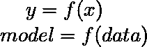
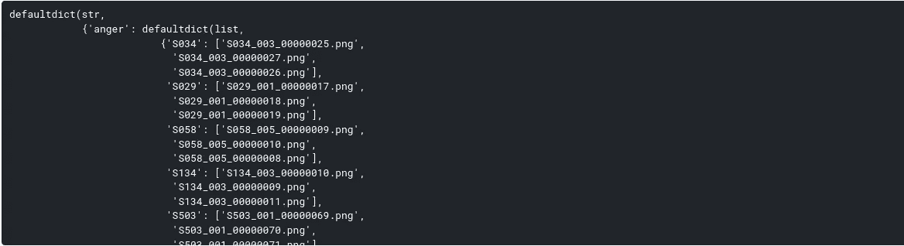
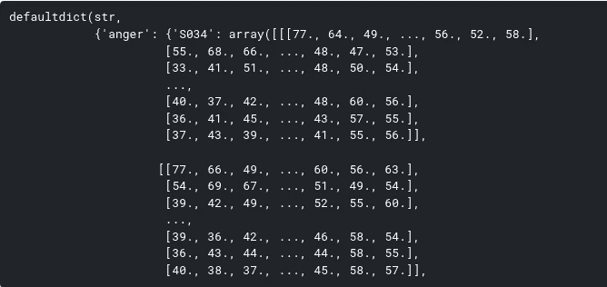
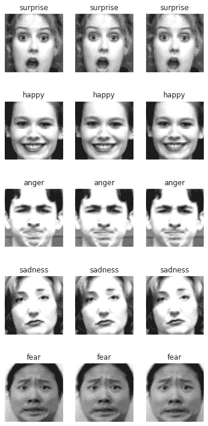
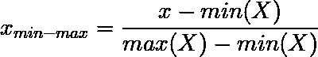
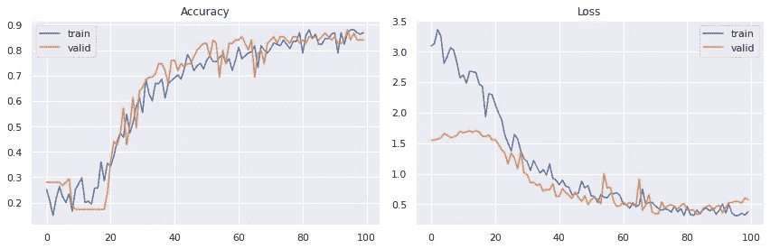
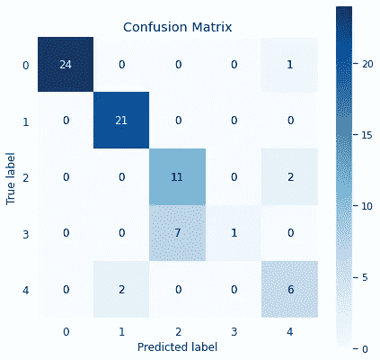
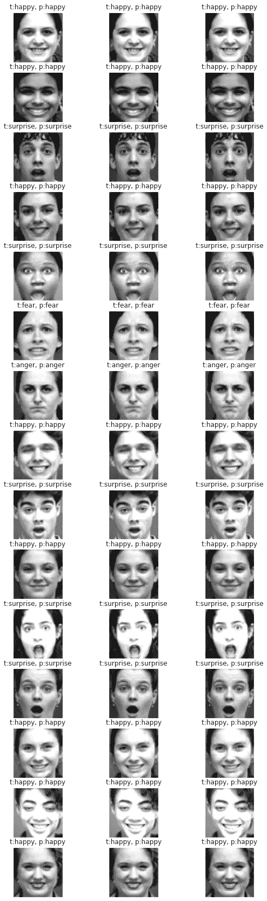

# 基于卷积双向 LSTM 的人脸情感识别

> 原文：<https://medium.com/analytics-vidhya/facial-emotion-recognition-using-convolutional-bidirectional-lstm-49d4199024f?source=collection_archive---------9----------------------->

这是[面部情感识别](/analytics-vidhya/facial-emotion-recognition-fer-using-keras-763df7946a64)系列中的第二部，建议先看完第一部再跳到这里。

这个故事将带你了解如何在 Tensorflow-Keras 中使用**时间分布卷积**和**双向 LSTM** 创建一个 FER 模型。我已经在第一部分讨论了这个主题的介绍和应用。

这个故事分为以下几个部分:

*   为什么我们需要这种方法
*   检查和操作数据
*   从头开始创建我们自己的定制 FER 模型

# 为什么我们需要这种方法？

因此，如果您已经完成了第一部分，那么您可能会问这种新方法的需求是什么？答案非常简单和直观，正如我在第 1 部分的结尾告诉你的那样，要将简单的基于 CNN 的模型应用于视频，我必须逐帧馈送视频**，即*一次馈送一帧，并预测该帧*上的情绪，并对每一帧持续这样做(可能会在中间跳过 4-5 帧，因为这样会增加 fps，但性能几乎保持不变)。**

**那么，*有没有什么方法可以让我们播放一小段 2-3 秒的视频(一个 30fps 的视频 60-90 帧)？*是的，我们可以，通过*时间分配 CNN*。但是，我们可以做得更多，因为就像一个句子的单词彼此共享上下文一样，视频的帧也与相邻的帧共享上下文。因此，我们的模型也可以从这些上下文中学习，为此我们可以使用*双向 lstm*。**

> ****注意:**为了充分理解这个故事，你应该对 python 和神经网络(特别是 CNN 和 LSTM)有一些基本的了解。**

# **检查和操作数据**

**众所周知*给机器增加智能更多的是让它们通过某种算法从数据中学习，*，当然为此我们需要**数据**。数据是任何机器学习/深度学习项目中最重要的部分，因为毕竟我们训练的模型是它训练所依据的数据的产物。我的意思是，我们的数据越能代表真实世界，我们的模型就越能像真实世界一样，在真实世界中表现得越好。记住一件事**“垃圾输入，垃圾输出”**，如果我们训练包含大量垃圾的数据，那么在生产中我们的模型也会抛出垃圾。因此，数据是任何 ML/DL 任务最重要的组成部分。**

**所以，我们也需要 FER 任务的数据。我们将在此基础上训练我们的模型，然后在保留的数据和实时视频流中测试它的性能。注意，这是一个**监督学习**问题，即学习的模型 y 是数据 x 的函数**

****

**对于这个任务，我将使用一个在 [kaggle](https://www.kaggle.com) 非常流行的数据，称为[**【CK+48**](https://www.kaggle.com/gauravsharma99/ck48-5-emotions)****数据集，每个图像都是灰度的，分辨率为 48x48。**您也可以使用其他数据集，公开可用的数据集很少，或者您可以创建自己的数据集。****

> ****随着我们的继续，我们将获得更多关于这些数据的见解，敬请关注…****

****现在我们将尝试一些真正的 python 代码。首先导入所有需要的库，****

****让我们检查数据，我们将检查我们拥有的情感类别的数量以及每个类别中的图像数量。****

****与其他类别相比，`sadness`和`fear`的图像数量非常少。****

```
**TOP_EMOTIONS = ["happy", "surprise", "anger", "sadness", "fear"]**
```

****与第一部分中使用的数据集不同，这个 *CK+48 数据集包含图像目录，这些目录以它们包含的情感命名。在每个目录中，我们都有特定情感类别的图像。*****

****关于这些数据有趣的一点是*原始数据包含视频剪辑*。但是我们使用的数据集包含了每个视频剪辑的最后 3 帧。因为在即将到来的模型中，我们将不会提供图像(如第 1 部分)，而是微小的视频剪辑，即帧的集合。因此，*我们需要将与每个视频剪辑相关的这 3 帧捆绑成一个短的 3 帧视频剪辑*(尽管这个剪辑非常短，以毫秒计，因为在一个 30fps 的视频中，一秒钟包含 30 帧)。然后，我们将这 3 帧视频输入到我们的模型中。****

****下面是代码片段，它将使数据与我们即将推出的模型兼容。我将逐一解释。****

****这里我们创建了一个名为 **data** 的默认字典，它的关键字是情感名称，值是字典本身。这个嵌套字典的关键字是*视频 id* ，我们已经从中提取了最后三帧，这个嵌套字典的值是一个包含最后三帧名称的列表。看看下面的图片，你会更清楚。****

********

****我们还需要一些助手功能来完成工作。****

****在这里，我们首先迭代字典`data`的关键字，然后在每个情感类中，我们堆叠与每个视频剪辑相关的 3 帧。这将为我们提供如下内容:****

********

****现在我们差不多完成了，我们需要一些堆叠和整形，如下图所示。****

****现在，我们将数据分为训练集和验证集。我们将根据训练数据进行训练，并根据验证数据验证我们的模型。****

****`label_emotion_mapper`，是原始类别标签到情感名称的映射。****

****让我们想象一下每一种情绪的图像。****

********

# ****创建我们自己的定制 FER 模型****

****我们首先需要归一化图像阵列，这样做是因为神经网络对非归一化数据高度敏感。我们将使用**最小-最大归一化。******

****对于这些灰度图像，最小值=0，最大值=255，因此我们将阵列除以 **255** ，因为，****

********

****下面是一个*卷积神经网络(CNN)，我用了以下设置:*****

*   ****出于通用目的，定期使用 ***辍学*** 。****
*   *******ELU*** 被用作激活函数，因为首先它避免了*死亡 relu 问题*但是与 LeakyRelu 相比它也表现得很好，至少在这种情况下。****
*   ****he_normal 被用作内核初始化器，因为它适合 ELU。****
*   ******批量归一化**也用于更好的结果。****

****现在，我们将上述 CNN 模型进行时间分布，然后堆叠几个双向 LSTMs，最后堆叠几个密集层。下面是它的功能，****

****与第一部分不同，这里我只使用了一个名为 **ReduceLROnPlateau** 的回调函数，用于在验证精度达到稳定状态时降低学习速度。使用 32 的批量大小并训练 100 个时期。****

****现在你会看到输入形状的不同，与 4 维数组(在第 1 部分)不同，我们现在有 5 维数组(第 5 维是图像的批次)。然后我们编译这个模型。****

****现在让我们训练模型并记录训练表现。****

****让我们绘制培训和验证指标，****

********

****epoch 的历史表明，准确率逐渐增加，在训练集和验证集上都达到了+86%的准确率。此外，每当精度达到稳定状态时，就会调用 ReduceLROnPlateau。****

> ******注意:**历元指标的波动是由于我们对于如此复杂的任务只有非常少的数据。****

****我们现在将可视化我们称之为**的混淆矩阵**，它是用于多类分类的最广泛使用的评估器之一。它让我们清楚地看到模特在所有课程上的表现。****

********

> ****如果我们有更多的数据来训练，那么我们将得到更好和更通用的模型。****

****现在，让我们想象一些预测。****

> ******注**:此处 **t** 为真实标签， **p** 为预测标签****

********

****接下来呢？我们应该就此打住吗？不，一点也不。任何模型的目的不仅仅是训练和验证它，而是在现实世界中测试/使用它。通过尝试许多不同的模型和更多的情感课程，我在这个项目上前进了很长时间。最后，我将我的模型与 OpenCV 整合在一起，并在视频上进行测试。****

****这是一个 2 分钟的演示视频，展示了我们模型的威力，在这个视频中，我使用了许多情感，也做了很酷的注释。****

****[这里的](https://github.com/greatsharma/Facial_Emotion_Recognition)是托管在 Github 上的完整项目。****

> ****你可以从[这里](https://www.kaggle.com/gauravsharma99/fer-using-convolutional-bidrectional-lstm)获得这个故事的**整个 jupyter 笔记本**，你只需要叉一下。同样，如果你喜欢这个笔记本，那么**投票支持**，它会激励我创造更多高质量的内容。****

****如果你喜欢这个故事，请鼓掌并与他人分享。****

****此外，请阅读我的其他故事，其中包括各种主题，****

*   ****[**python 中的统计分析**](/@greatsharma04/statistical-analysis-using-python-e83f10ca3c82)****
*   ****[**线性回归中的多重共线性**](/analytics-vidhya/effect-of-multicollinearity-on-linear-regression-1cf7cfc5e8eb)****

****还有[好多好多](/@greatsharma04)。****

****再次感谢你阅读我的故事，我的朋友:)****