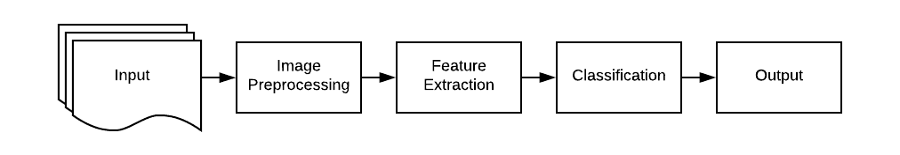
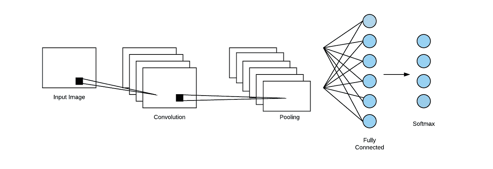
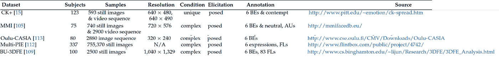
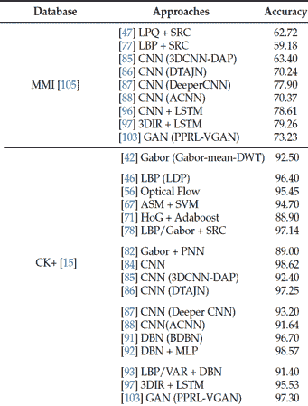
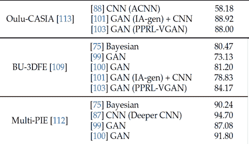

# 使用深度学习的面部表情识别

> 原文：<https://medium.com/analytics-vidhya/facial-expression-recognition-using-deep-learning-3ec1d7426604?source=collection_archive---------19----------------------->

## 基于深度学习的面部表情识别研究综述

她是开心还是兴奋？|照片由[阿莱夫·维尼修斯](https://unsplash.com/@seteales?utm_source=medium&utm_medium=referral)在 [Unsplash](https://unsplash.com?utm_source=medium&utm_medium=referral) 上拍摄

> 人脸识别是计算机视觉和人工智能领域中的一个重要且有前途的领域。信息可以从一个人的非语言意图中挖掘出来。目前，对面部表情识别(FER)进行分类的方法可以分为两大类:传统的 FER 方法和基于深度学习的方法。这项调查将简要涵盖传统的 FER 方法，并主要侧重于讨论 FER 的深度学习方法。

# **传统 FER 方法概述**

传统的 FER 方法通常依赖于大量的手工特征工程。图像需要进行预处理，研究人员需要为目标数据集选择合适的特征提取和分类方法。

传统的 FER 方法工作流程

与传统的 FER 方法相比，基于深度学习的方法将更加依赖于数据和硬件。然而，在传统的 FER 方法中，特征提取和分类都被分成两个部分。因此，不允许同时优化这两个阶段。传统 FER 方法的有效性将受到这两个部件中的每一个的性能的限制。

# **深度学习方法**

基于深度学习的方法通常会限制对图像处理和特征提取的依赖，并且对其环境更加鲁棒。深度学习在包括识别、分类和目标识别在内的机器学习任务中表现非常出色。有几种方法可以使用深度学习方法来识别 FER。为 FER 提出的三种方法包括使用卷积神经网络(CNN)、长短期记忆(LSTM)模型和生成对抗网络(GAN)。

**卷积神经网络**

CNN 是用于图像识别和处理的人工神经网络的子集，专门用于识别图像中的某些特征。它由一个或多个卷积层组成，主要用于图像处理、分类和分割。以下架构显示了基于 CNN 的 FER 程序的流程示例。

CNN 架构

**长短期记忆(LSTM)**

LSTM 模型是一种人工递归神经网络，可用于提取连续帧内的时间特征。总部位于 LSTM 的 FER 过去曾被推荐用于视频序列，因为长距离上下文建模有助于提高情感分析的准确性。已经有研究，其中代表性状态帧的空间特征通过使用 CNN 来学习，并且 LSTM 模型用于学习空间表示的时间特征。这种提出的研究方法利用了从使用 LSTM 的面部序列中确定的代表性表情状态，而不是评估表情的强度或表情保持了多长时间。

**生成对抗网络**

GAN 是一个无监督的学习模型，由一个生成网络和一个判别网络组成。GANs 已被广泛用于生成图像和合成看起来非常类似于真实图像的面部图像。已经有研究提出了端到端的基于 GAN 的模型，其中生成器的编码器-解码器结构学习面部图像的身份表示，然后基于表情和头部姿态来指定。所提出的模型还能够通过使用 GAN 模型自动生成图像的图像来增加 FER 训练数据集。

# 韵律学

FER 相关数据集|来源:[面部表情识别:一项调查](https://www.mdpi.com/2073-8994/11/10/1189)

训练和测试数据集用于评估不同的基于深度学习的 FER 模型的性能。有许多训练和测试数据集可用于面部情感识别。[FER 的一项调查](https://www.mdpi.com/2073-8994/11/10/1189)展示了几个不同的 FER 相关数据集的概况。上面的图表显示了最能代表使用基于深度学习的 FER 模型(如 CNN、LSTM 模型和甘模型)的优势的数据集。

FER 使用 CNN 和 LSTM 在 MMI 和 CK+数据集上的表现|来源:[面部表情识别:一项调查](https://www.mdpi.com/2073-8994/11/10/1189)

通过使用不同的 FER 数据集的性能显示，CNN 框架可以应用于几乎所有的 FER 数据集，并达到稳定的精度。使用 CK+和 MMI 数据集的性能表明，基于 LSTM 的 FER 方法在视频序列上表现良好。这证实了 LSTM 网络对于连续帧的时间特征提取表现良好。

使用 CNN & GANs 在 Oulu-CASIA、BU-3DFE 和 Multi-PIE 数据集上对 FER 的性能|来源:[面部表情识别:调查](https://www.mdpi.com/2073-8994/11/10/1189)

类似地，使用 BU-3DFE、Multi-PIE 和 Oulu-CASIA 数据集的性能显示了使用基于 GAN 的 FER 方法对这些图像的显著准确性。GAN 模型最适合用于生成逼真的面部图像。因此，基于 GAN 的模型适用于对没有变化的面部图像(静止图像)执行表情识别。

# 期末思想

随着机器学习领域的最新技术和领域的发展，面部表情识别(FER)最近吸引了很多关注。本文简要介绍了 FER 的一些传统方法和 FER 使用深度学习模型的几个模型。FER 内部仍然存在挑战，也有很多机会来评估不同的 FER 算法。这项调查的目的是提供一个简单的了解，目前有什么，提供一些见解，并促进在这一领域的进一步研究。

*关于本文内容的简明参考，请参考我的*[*slide share*](https://www.slideshare.net/EmmelineTsen/facial-expression-recognition-fer-using-deep-learning)*。*

**参考文献**

1.  黄，杨，陈，冯，吕，王，谢(2019 . 9 . 20)。面部表情识别:综述。于 2020 年 5 月 8 日从[https://www.mdpi.com/2073-8994/11/10/1189](https://www.mdpi.com/2073-8994/11/10/1189)检索
2.  Divya，m .，Reddy，R. O .，& Raghavendra，C. (2019)。基于卷积神经网络算法的有效人脸情感识别。*国际近期技术与工程期刊定期刊，* *8* (4)，4351–4354。doi:
3.  阿米迪公司和阿米迪公司(未标明)。卷积神经网络 cheatsheet Star。2020 年 5 月 8 日检索，来自[https://Stanford . edu/~ shervine/teaching/cs-230/cheat sheet-convolutionary-neural-networks](https://stanford.edu/~shervine/teaching/cs-230/cheatsheet-convolutional-neural-networks)