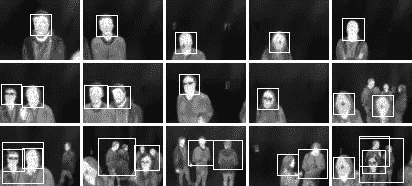
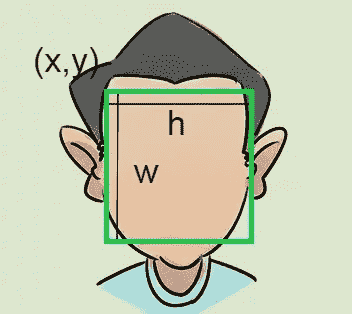
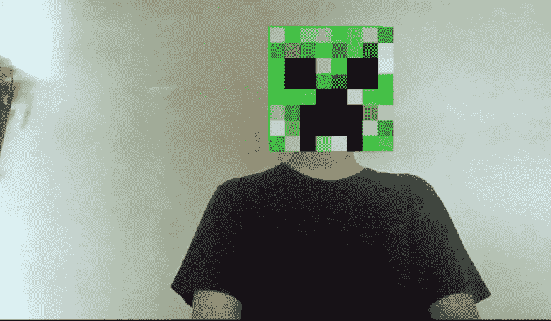

# 使用 OpenCV 的面部滤镜

> 原文：<https://medium.com/analytics-vidhya/facial-filters-using-opencv-d543300ff51?source=collection_archive---------18----------------------->

1.  OpenCV 是什么？

OpenCV(开源计算机视觉库)是一个开源的计算机视觉和机器学习软件库。OpenCV 旨在为计算机视觉应用提供一个公共基础设施，并加速机器感知在商业产品中的应用。该库拥有超过 2500 种优化算法。这些算法可用于检测和识别人脸、识别物体、对视频中的人类动作进行分类、跟踪相机运动、跟踪运动物体、将图像拼接在一起以产生整个场景的高分辨率图像、从图像数据库中找到相似的图像、从使用闪光灯拍摄的图像中去除红眼、跟踪眼球运动等。


2.Haarcascade:

Haar Cascade 是一种机器学习对象检测算法，用于识别图像或视频中的对象。Haarcascade 通常用于识别某些面部特征，例如眼睛、微笑、脸。这在我们的项目中非常有用，因为我们需要检测某些面部特征，然后在它们上面覆盖所需的过滤器。



haarcascade 面部检测的例子

3.构建过滤器的步骤包括:

I .使用 haarcascade 和 openCV 检测特定的面部特征。

二。获取帧中检测到的特征的坐标。

三。用期望的过滤器图像替换由坐标指示的帧部分。

I .导入 opencv 和各自的 haarcascade xml 文件。

```
import cv2
face1 = cv2.CascadeClassifier('haarcascade_frontalface_default.xml')cap = cv2.VideoCapture(0) #Use the system camera for capturing video
repl1 = cv2.imread('mask4.png')  #Load the filter image
```

二。

```
while True: 
    ret,frame = cap.read()  #Saving the captured video frames# The frames captured are by default mirrored so they need to be flipped before using further
    frame = cv2.flip(frame,1) # Converting the image to grayscale makes it easier for processing 
    gray = cv2.cvtColor(frame,cv2.COLOR_BGR2GRAY) 
```

将图像转换为灰度后，我们可以开始叠加滤镜。

```
f = face1.detectMultiScale(gray,scaleFactor = 1.1,minNeighbors = 7)#This will capture the features in the given image and save them.
```



坐标可视化

请参考上图，获取以下覆盖图:

```
for x,y,w,h in f:
        #frame = cv2.rectangle(frame,(x,y),(x+h,y+w),(0,255,0),2) (Optional : Rectangle can be displayed for reference)frame[y:y+w,x:x+h] = repl1 
        cv2.imshow('Face Recognized',frame)# Frame will be closed by pressing 'q' key:
if cv2.waitKey(1) == ord('q'): 
        break
```

上面的代码将完全正常工作，覆盖将被应用，但是，一旦您试图移向或远离相机，您将观察到覆盖没有根据功能缩放。这个问题需要解决。因此，我们需要动态调整覆盖图像的大小，然后将其应用到我们的框架中。

```
repl1 = cv2.resize(repl1,(w,h))#This needs to be added before the replacement of overlay in the frame.
```

动态调整大小将极大地改变图像分辨率，但它将解决上述问题。

最后，我们需要在功能完成后关闭系统摄像头。

```
cap.release()          
cv2.destroyAllWindows()
```

就是这样！您可以应用您选择的覆盖，并将其用作过滤器。请注意，这个过滤器应用程序过于简单，并不完全适合这些特性(可以通过优化来实现)。因此，应该仔细选择叠加图像和多尺度参数。

演示滤镜图像:

