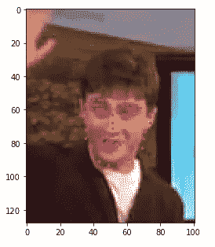

# Pytorch 人脸关键点检测

> 原文：<https://medium.com/analytics-vidhya/facial-keypoint-detection-with-pytorch-e9f94ab321a2?source=collection_archive---------3----------------------->

## 建立和训练卷积神经网络来检测面部关键点。建在 Pytorch 上。


这里有一个 VGG16 的描述。让你的大脑进入状态。

注意:我已经移动到 SubStack。我仍然会偶尔在 Medium 上发布一些东西，但是现在[你可以在这里找到我的大部分新作品](https://antoniolinares.substack.com/people/32102170-antonio-linares)。

## 介绍

时间在流逝，我仍然对[深度学习](/@evolvia2/my-deep-learning-journey-d63404afc0e0)充满热情。出于这个原因，我决定深入挖掘**计算机视觉**，以下简称 CV 的子领域，我认为它将在未来几十年重新定义人类生活。如果机器能看得见，它们将能为我们做很多事情。这里也有一些哲学上的问题，或者说很多，但那是另一篇文章。

随着我对医学越来越感兴趣，我决定实现一个**面部关键点检测器，**它运行在一个相当简单的*卷积神经网络上，下文称为* CNN。这种软件可以让我们更早地发现疾病。我已经用 **Pytorch** 建立了这个。

在不知所措的感觉出现之前(我经常遇到这种情况)，这里有一个快速的项目概要:

1.  获取数据(带有相应关键点坐标的人脸图片)。
2.  对它进行变换，以帮助网络学习。
3.  定义网络。
4.  训练网络并测试它。
5.  使用网络进行预测(在这种情况下，返回面部关键点)。

## 1 -获取数据

我正在使用[这个](https://www.cs.tau.ac.il/~wolf/ytfaces/)数据集。每个数据点都是一张人脸的图像及其对应的 68 个关键点。每个关键点是一个(x，y)坐标。每个数据点如下所示:



数据点示例

如果你有一点点深度学习的经验，你将已经知道这是走向哪里。图像(没有关键点)是三维像素阵列。关键点只是 136 个数字(68 个坐标对)。我们基本上要教会网络正确预测 136 个数字。

**存储**给定目录中的数据，例如:

/data/training _ frames _ key points . CSV '

任何给定的数据点看起来都像这样:

```
Image name:  Luis_Fonsi_21.jpg
Landmarks shape:  (68, 2)
First 4 key pts: [[  45\.   98.]
 [  47\.  106.]
 [  49\.  110.]
 [  53\.  119.]]
```

## 2—转换数据

充分转换数据有助于神经网络学习。对于 CV 来说，几乎是*永远是*左右:

1.  降低图像的初始维数，将图像从 RGB (3 2D 阵列)转换为灰度(1 2D 阵列)。
2.  重新缩放和随机裁剪它。
3.  归一化像素值。
4.  将图像转换成一个**张量**数据类型。
5.  将数据集加载到**数据加载器**

在这个项目中，我以面向对象的方式处理了这一部分，最初为数据集定义了一个类，它实际上继承了 torch.utils.data 的**数据集类**。这允许以更加**敏捷**的方式处理数据。

下面，您可以看到 FacialKeypointsDataset 类定义的代码。最值得注意的是， **__getitem__** 方法只允许通过索引*访问类实例来检索任何给定的数据点。这在以后会有意义。*

```
from torch.utils.data import Dataset, DataLoaderclass FacialKeypointsDataset(Dataset):
    """Face Landmarks dataset."""def __init__(self, csv_file, root_dir, transform=None):
        """
        Args:
            csv_file (string): Path to the csv file with annotations.
            root_dir (string): Directory with all the images.
            transform (callable, optional): Optional transform to be applied
                on a sample.
        """
        self.key_pts_frame = pd.read_csv(csv_file)
        self.root_dir = root_dir
        self.transform = transformdef __len__(self):
        return len(self.key_pts_frame)def __getitem__(self, idx):
        image_name = os.path.join(self.root_dir,
                                self.key_pts_frame.iloc[idx, 0])

        image = mpimg.imread(image_name)

        # if image has an alpha color channel, get rid of it
        if(image.shape[2] == 4):
            image = image[:,:,0:3]

        key_pts = self.key_pts_frame.iloc[idx, 1:].as_matrix()
        key_pts = key_pts.astype('float').reshape(-1, 2)
        sample = {'image': image, 'keypoints': key_pts}if self.transform:
            sample = self.transform(sample)return sample
```

我以类似的方式定义了转换，定义了 Normalize、Rescale、RandomCrop 和 ToTensor 类。由于这种格式的缩进看起来很奇怪，我建议将代码复制到一个真正的编辑器中，以便更好地检查。

这是 Normalize 类。它所做的只是将图像转换为灰度，并归一化 0 到 1 范围内的像素值，包括 0 和 1:

```
import torch
from torchvision import transforms, utils
# tranformsclass Normalize(object):
    """Convert a color image to grayscale and normalize the color range to [0,1]."""def __call__(self, sample):
        image, key_pts = sample['image'], sample['keypoints']

        image_copy = np.copy(image)
        key_pts_copy = np.copy(key_pts)# convert image to grayscale
        image_copy = cv2.cvtColor(image, cv2.COLOR_RGB2GRAY)

        # scale color range from [0, 255] to [0, 1]
        image_copy=  image_copy/255.0

        # scale keypoints to be centered around 0 with a range of [-1, 1]
        # mean = 100, sqrt = 50, so, pts should be (pts - 100)/50
        key_pts_copy = (key_pts_copy - 100)/50.0return {'image': image_copy, 'keypoints': key_pts_copy}
```

这是 Rescale 类。它所做的只是调整图像的大小:

```
class Rescale(object):
    """Rescale the image in a sample to a given size.Args:
        output_size (tuple or int): Desired output size. If tuple, output is
            matched to output_size. If int, smaller of image edges is matched
            to output_size keeping aspect ratio the same.
    """def __init__(self, output_size):
        assert isinstance(output_size, (int, tuple))
        self.output_size = output_sizedef __call__(self, sample):
        image, key_pts = sample['image'], sample['keypoints']h, w = image.shape[:2]
        if isinstance(self.output_size, int):
            if h > w:
                new_h, new_w = self.output_size * h / w, self.output_size
            else:
                new_h, new_w = self.output_size, self.output_size * w / h
        else:
            new_h, new_w = self.output_sizenew_h, new_w = int(new_h), int(new_w)img = cv2.resize(image, (new_w, new_h))

        # scale the pts, too
        key_pts = key_pts * [new_w / w, new_h / h]return {'image': img, 'keypoints': key_pts}
```

这是 RandomCrop 类。几乎不言自明:

```
class RandomCrop(object):
    """Crop randomly the image in a sample.Args:
        output_size (tuple or int): Desired output size. If int, square crop
            is made.
    """def __init__(self, output_size):
        assert isinstance(output_size, (int, tuple))
        if isinstance(output_size, int):
            self.output_size = (output_size, output_size)
        else:
            assert len(output_size) == 2
            self.output_size = output_sizedef __call__(self, sample):
        image, key_pts = sample['image'], sample['keypoints']h, w = image.shape[:2]
        new_h, new_w = self.output_sizetop = np.random.randint(0, h - new_h)
        left = np.random.randint(0, w - new_w)image = image[top: top + new_h,
                      left: left + new_w]key_pts = key_pts - [left, top]return {'image': image, 'keypoints': key_pts}
```

最后，这里是 ToTensor 类，它简单地将图像从数组转换成神经网络最喜欢的张量类型。

```
class ToTensor(object):
    """Convert ndarrays in sample to Tensors."""def __call__(self, sample):
        image, key_pts = sample['image'], sample['keypoints']

        # if image has no grayscale color channel, add one
        if(len(image.shape) == 2):
            # add that third color dim
            image = image.reshape(image.shape[0], image.shape[1], 1)

        # swap color axis because
        # numpy image: H x W x C
        # torch image: C X H X W
        image = image.transpose((2, 0, 1))

        return {'image': torch.from_numpy(image),
                'keypoints': torch.from_numpy(key_pts)}
```

上面的代码看起来很长，很神秘，但事实并非如此。它所能做的就是让我们以一种非常简单的方式创建数据加载器，这些数据加载器可以输入到网络中进行训练，就像这样:

```
from torchvision import transforms, utils#defining transformations using transforms.Compose([])data_transform =transforms.Compose(
[
    Rescale(250), RandomCrop(224), Normalize(), ToTensor()
])#creating dataset, by instantiating FacialKeyPointsDatasetclasstransformed_dataset = FacialKeypointsDataset(csv_file='/data/training_frames_keypoints.csv',
                                             root_dir='/data/training/',
                                             transform=data_transform)
```

data_transform 包含要对数据进行的转换。通过将其作为 FacialKeypointsDataset 实例化的参数进行传递，可以生成一个具有适当转换的数据集。然后，为了能够将其输入网络，我们运行以下代码:

```
batch_size = 10train_loader = DataLoader(transformed_dataset, 
                          batch_size=batch_size,
                          shuffle=True, 
                          num_workers=4)
```

train_loader 现在包含 10 批转换后的图像，以及相应的关键点。不管有没有面向对象的方法，完成这项工作的高级模式都是一样的:

1.  创建数据集(通过适当的转换)
2.  创建数据加载器(将数据集作为参数传入)
3.  就这样

## 3 —定义网络

卷积神经网络已经被证明在图像处理方面非常有效。老话“一个图像胜过 1000 个单词”，从计算的角度来说，是非常正确的。图像中信息密集。

本质上，CNN**以某种方式压缩信息**，然后可以将其输入分类器(基本上是一个前馈神经网络)。通过告诉分类器应该输出什么(损失函数)，我们可以通过反向传播和梯度下降对卷积层中的权重进行调整。在某个阶段，我会发布一个关于这是如何工作的深入解释，但不是今天。

下面是模型当前版本的代码。我将在更新实际模型时更新代码。

```
#defining the cnn architectureimport torch
import torch.nn as nn
import torch.nn.functional as F
import torch.nn.init as Iclass Net(nn.Module):def __init__(self):
        super(Net, self).__init__()

        #defining maxpool block
        self.maxpool = nn.MaxPool2d(2, 2)

        #defining dropout block
        self.dropout = nn.Dropout(p=0.2)

        self.conv1 = nn.Conv2d(1, 32, 5)

        #defining second convolutional layer
        self.conv2 = nn.Conv2d(32, 64, 3)

        #defining third convolutional layer
        self.conv3 = nn.Conv2d(64, 128, 3)

        #defining linear output layer
        self.fc1 = nn.Linear(128*26*26, 136) def forward(self, x):

        #passing tensor x through first conv layer
        x = self.maxpool(F.relu(self.conv1(x)))

        #passing tensor x through second conv layer
        x = self.maxpool(F.relu(self.conv2(x)))

        #passing tensor x through third conv layer
        x = self.maxpool(F.relu(self.conv3(x)))

        print(x.size())
        #flattening x tensor
        x = x.view(x.size(0), -1)

        #applying dropout
        x = self.dropout(x)

        #passing x through linear layer
        x = self.fc1(x)

        #returning x
        return x
```

就训练它而言，代码相当简单。它包括通过网络传递张量，计算输出误差，然后通过反向传播和梯度下降调整权重。代码迭代地做这个*，*让模型更接近足够高的性能水平。同样，由于缩进在这种格式下会变得很奇怪，所以将它复制粘贴到代码编辑器中，以真正了解发生了什么。

```
def train_net(n_epochs):
# prepare the net for training
    net.train()
    for epoch in range(n_epochs):  # loop over the dataset multiple timesrunning_loss = 0.0
# train on batches of data, assumes you already have train_loader
        for batch_i, data in enumerate(train_loader):
            # get the input images and their corresponding labels
            images = data['image']
            key_pts = data['keypoints']
# flatten pts
            key_pts = key_pts.view(key_pts.size(0), -1)
# convert variables to floats for regression loss
            key_pts = key_pts.type(torch.FloatTensor)
            images = images.type(torch.FloatTensor)
# forward pass to get outputs
            output_pts = net(images)
# calculate the loss between predicted and target keypoints
            loss = criterion(output_pts, key_pts)
# zero the parameter (weight) gradients
            optimizer.zero_grad()# backward pass to calculate the weight gradients
            loss.backward()
# update the weights
            optimizer.step()
# print loss statistics
            running_loss += loss.item()
            if batch_i % 10 == 9:    # print every 10 batches
                print('Epoch: {}, Batch: {}, Avg. Loss: {}'.format(epoch + 1, batch_i+1, running_loss/10))
                running_loss = 0.0
    print('Finished Training')
```

训练网络现在是定义损失标准和优化器函数、实例化网络(来自上面定义的**网络类**)、定义训练过程的历元数以及运行 **train_net 方法**的问题。

你会注意到我使用了 [MSE](https://en.wikipedia.org/wiki/Mean_squared_error) 作为损失函数。这是因为网络将输出值，而我们希望这些值尽可能接近实际的关键点(68 个坐标对)。因此，损失函数必须具有类似“T11”的“T10”回归性质。

```
#defining the loss criterion
import torch.optim as optim
criterion = nn.MSELoss()#defining the optimizer method, for gradient descent
optimizer = optim.Adam(net.parameters(), lr = 0.0005)#instantiating a network
net = Net()#defining the number of epochs
n_epochs = 10#training the network
train_net(n_epochs)
```

多次反复试验让我意识到，收敛开始于大约 0.005 的**学习速率。太远低于或高于该速率，网络似乎学习得不好。也许在不久的将来，一篇深入学习率概念的文章会很有意思。**

训练网络共 **10 个历元**，训练损耗收敛到 0.05 左右。为了减少层之间的协变量转移，我现在继续添加批量标准化，看看它是如何工作的。

**此帖子正在进行中。**