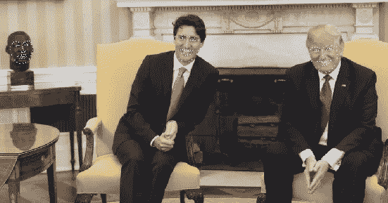
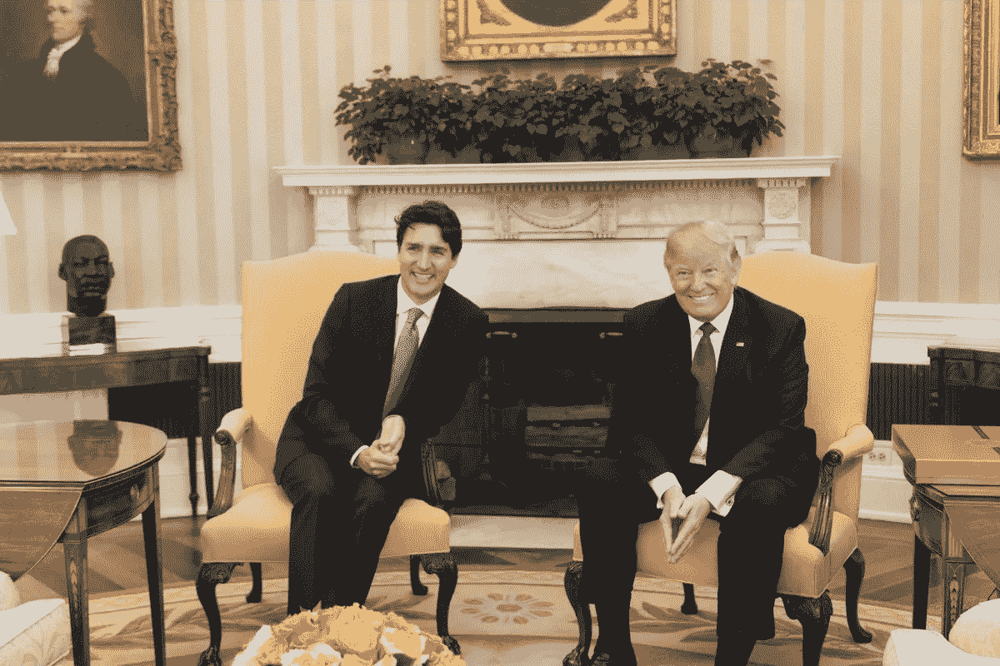
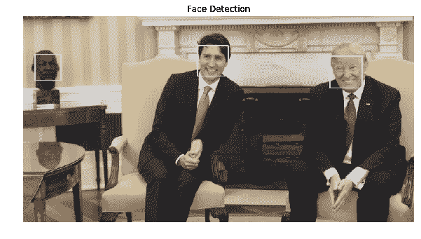

# 用 OpenCV 实现 Python 中的人脸标志和人脸检测

> 原文：<https://medium.com/analytics-vidhya/facial-landmarks-and-face-detection-in-python-with-opencv-73979391f30e?source=collection_archive---------0----------------------->



面部标志检测样本

> 人脸检测是一种用于在数字图像中识别人脸的计算机技术。人脸检测也指人类在视觉场景中定位和注意人脸的心理过程。— [维基百科](https://en.wikipedia.org/wiki/Face_detection)

面部标志检测是检测面部标志或感兴趣区域(关键点)的过程，如眉毛、眼睛、鼻子、嘴和下巴轮廓。

面部标志检测的一些应用是面部交换、头部姿态检测、检测面部姿态、注视方向等。

# 安装和下载

*这个项目是在 jupyter 笔记本上完成的。*

开始之前，您应该在计算机上安装以下软件:

*   Python，可用[这里的*选择 3.7 或更高版本。*](https://www.python.org/downloads/)
*   *PIP，此处可用[T9。Pip 是 Python 的包安装程序。您可以使用 pip 从 Python 包索引和其他索引安装包。](https://pip.pypa.io/en/stable/installing/)*

**下列软件包是必需的，您可以从命令行使用 pip 安装它们:**

*   *OpenCV 代表开源计算机视觉库，*用来读取和处理我们的图像。**

```
*pip install opencv-python
// or this
pip install opencv-python — user*
```

*   *对于 URL 请求处理，请安装:*

```
*pip install urllib3
// or this
pip install urllib3 — user*
```

*   *和 matplotlib 来绘制我们的图像:*

```
*pip install matplotlib
// or this
pip install matplotlib — user*
```

*   *人脸检测使用 **haarcascade** 人脸分类器， [*下载分类器*](https://raw.githubusercontent.com/opencv/opencv/master/data/haarcascades/haarcascade_frontalface_alt2.xml) ( < 1MB)。*
*   *地标检测使用 **LBFmodel** ， [*下载 model*](https://github.com/kurnianggoro/GSOC2017/raw/master/data/lbfmodel.yaml) ( < 54 MB)。*

***注**:下载的分类器和模型必须移动到与你的同一个目录下。本教程的 ipynb 文件。*

# *导入包*

*在您的交互式 Python 笔记本(*。ipynb)导入以下内容*

# *检索图像*

*用于此检测的图像可用 [*此处*](https://upload.wikimedia.org/wikipedia/commons/archive/7/76/20170623195932%21Donald_Trump_Justin_Trudeau_2017-02-13_02.jpg) ，您也可以使用您选择的任何图像，只需更改图像名称/路径。*

**

*(R-L:美国总统川普和加拿大总理贾斯廷·特鲁多)*

*在*第 2 行*和*第 5 行*中，图像的 URL 和名称分别保存在`pic_url`和`pic`变量中。
*第 8 行*从网上获取图像并保存在本地的同一个工作目录下。
*第 11 行*用 OpenCV 的`cv2.imread()`读取下载的图像。
*第 14 行*绘制图像。*

# *图像处理*

*在*行 2* 上，将图像从 BGR 转换为 RGB 颜色
在*行 8，9* 上使用图像轴将图像裁剪为特定尺寸，图像的左上角为(0，0)。使用`image[y:y+depth, x:x+width]`，其中`x`和`y`为左侧轴，开始裁剪。`width`和`depth`分别是裁剪图像的 x 和 y 尺寸(长度)。
*第 15 行*将图像转换为灰度，注意这里使用的人脸检测算法在灰度图像上表现更好。*

# *人脸检测*

**

*面部检测输出*

**图像上检测到三张人脸。**

*在*第 2 行*和*第 5 行*上，分类器的 URL 和名称分别保存在`haarcascade_url`和`haarcascade`变量中。
*第 8* 到 *13* 行，检查 haarcascade 分类器是否下载到工作目录中，如果没有，则下载。
*第 16 行*创建一个分类器实例，用*第 19 行*检测面部。
*第 24 到 29 行*通过 openCV 的`cv2.rectangle()`方法，使用存储在 *faces* 变量中的坐标，在每个检测到的面周围打印一个方框。*

# *面部标志检测*

*上面的代码类似于*线 2* 和 *5* 上的人脸检测代码
，模型的 URL 和名称分别保存在`LBFmodel_url`和`LBFmodel`变量中。
*第 8* 到 *13* 行，检查 LBFmodel 是否下载到工作目录中，如果没有，则下载。
*第 16 行*创建并加载地标检测模型。
在*第 20 行*上，我们用灰度图像和检测到的人脸坐标来拟合模型。
*第 22 行*到 *26* 用 openCV 的`cv2.circle()`方法在每个检测到的人脸上标记地标，第*行 28* 用检测到的地标绘制图像。*

**

*面部标志检测输出*

*下面是放大的检测。*

**

*缩放输出*

# *临时演员*

*笔记本的链接可以在[这里](https://github.com/Danotsonof/facial-landmark-detection/blob/master/facial-landmark.ipynb)找到。
***Python 3.7****和****OpenCV 4 . 1 . 2****用于此任务。通过网络摄像头进行地标检测，勾选* [*GitHub 链接*](https://github.com/Danotsonof/facial-landmark-detection) *。**

*特别感谢以下分享的知识:
[阿尔贝托·费尔南德斯·维兰](https://github.com/albertofernandezvillan)
[库尔尼昂戈罗](https://github.com/kurnianggoro/GSOC2017)
[萨奇特·查达](https://github.com/sacchitchadha)
[滕索福拉格斯](https://github.com/tensorflowlagos)*

*感谢阅读！*