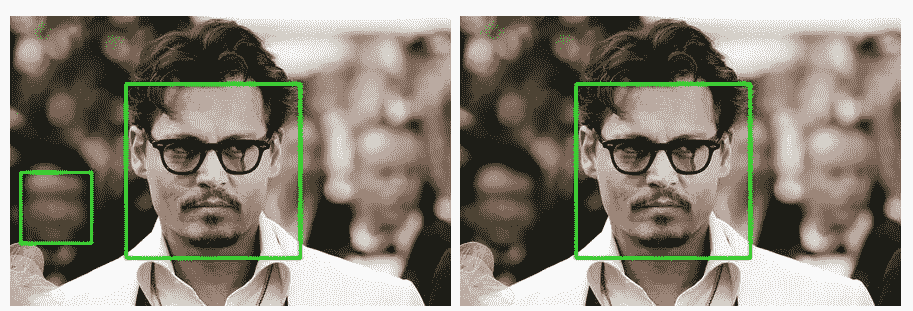
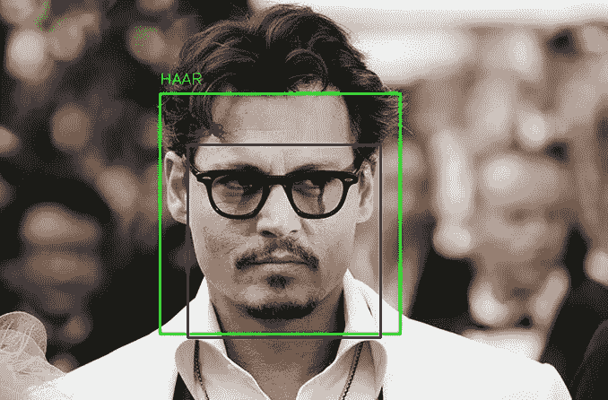

# 基于 dlib 和 haar 级联的人脸标志点检测

> 原文：<https://medium.com/analytics-vidhya/facial-landmarks-detection-with-dlib-and-haar-cascade-e3c8195131d7?source=collection_archive---------6----------------------->


克里斯里德在 [Unsplash](https://unsplash.com?utm_source=medium&utm_medium=referral) 上的照片

最近我在做一个项目，涉及使用 Python 进行面部标志检测。Python 提供了一个名为 dlib 的库，非常适合这个工作。为了找到任何面部标志，首先必须从图像中提取面部，然后使用提取的面部 ROI(感兴趣区域)来获得标志。现在，从图像中检测人脸是计算机视觉领域的一个老把戏。最著名的过程是使用 haar 级联分类器，它返回一个多维 numpy 数组。该阵列中元素的数量等于图像中存在的面的数量。这个数组的每个元素包含 4 个整数。前两个表示左上角，后面是 ROI 的宽度和高度。

Dlib 还提供了一个名为 get _ frontal _ face _ detector()的人脸检测函数。这个函数返回矩形对象的数组。rectangle 对象表示图像的矩形区域。每个 rectangle 对象包含四个值，这意味着它还返回包含人脸的 ROI 的坐标，但格式不同。因此，在 haar 级联分类器和 dlib 检测器之间有三个主要区别。首先，当 haar cascade 检测器返回一个多维 numpy 数组时，dlib 检测器返回一个矩形对象数组。其次，haar 级联检测器返回左上角的宽度和高度，而 dlib 返回左上角(rectangle 对象的前两个值)和右下角(rectangle 对象的后两个值)。第三，dlib 函数只取灰度图像作为参数，而 haar 级联分类器取两个以上的参数，比例因子和最小邻居。scaleFactor 参数指定在每个影像比例下影像大小减少多少，minNeighbors 参数指定每个候选矩形需要多少个邻居才能保留它。基本上，通过这两个参数，您可以控制在图像中检测人脸的严格程度或宽松程度。因此，与 dlib 函数相比，haar cascade 具有更大的灵活性。例如，当邻居的值为 5 时，约翰尼·德普后面的人的脸也会被检测到，但当邻居的值为 10 时，情况就不是这样了。



最小邻居= 5(左)和最小邻居= 10(右)的 haar 级联人脸检测

现在我很好奇，想看看 haar cascade 和 dlib 库是否提供了相同的结果，例如相同的 ROI。但是我发现了一点不同。haar 级联比 dlib 函数提取更多的区域。



哈尔瀑布与 Dlib

现在回到面部标志检测。dlib 库提供了一个名为 shape_predictor()的函数，它接受两个参数，第一个是图像的灰度版本，第二个是保存面部区域坐标的 dlib rectangle 对象。然后我们可以得到特征点，利用这些特征点我们可以得到面部标志。在我的例子中，我想使用 haar 级联分类器的结果来检测面部标志。但问题是，dlib 库的 shape_predictor 函数采用的是 dlib rectangle 对象而不是 numpy 数组。因此，要使用 shape_predictor 函数的 haar 级联结果，我们必须将 numpy 数组转换为 dlib 矩形对象。这样我们就可以拥有 haar cascade 类的灵活性。

这是代码

```
# importing libraries
import cv2
import numpy as np
import dlib# function to convert dlib.full_object_detection to numpy array
def shape_to_np(shape, dtype="int"):
 coords = np.zeros((68, 2), dtype=dtype)
 for i in range(0, 68):
  coords[i] = (shape.part(i).x, shape.part(i).y)
 return coords# reading an image and converting it to grayscale
image = cv2.imread('johny.jpg')
gray = cv2.cvtColor(image,cv2.COLOR_BGR2GRAY)# loading the classifiers with respected files
face_cascade = cv2.CascadeClassifier("haarcascade_frontalface_default.xml")
predictor = dlib.shape_predictor("shape_predictor_68_face_landmarks.dat")
faces = face_cascade.detectMultiScale(gray,scaleFactor=1.10,minNeighbors=5)# looping through each detected faces and drawing rectangle around the face and circles around the feature points
if len(faces)>0:
    for x,y,w,h in faces:
        cv2.rectangle(image, (x,y), (x+w, y+h), (0, 255, 0),3)
        # creating the rectangle object from the outputs of haar cascade calssifier
        drect = dlib.rectangle(int(x),int(y),int(x+w),int(y+h))
        landmarks = predictor(gray, drect)
        points = shape_to_np(landmarks)
        for i in points:
            x = i[0]
            y = i[1]
            cv2.circle(image, (x, y), 2, (0, 255, 0), -1)cv2.imshow('image',image)
```

也可以用 dlib 查看我的检测面部地标的 Github repo，找到需要的文件。

[](https://github.com/pythonboy178/python-projects/tree/master/Facial_landmark_detection) [## python boy 178/python-项目

### dlib_with_haar.py 文件包含实现 dlib shape_predictor()函数的代码

github.com](https://github.com/pythonboy178/python-projects/tree/master/Facial_landmark_detection) 

如果你想了解 dlib 库和 haar 级联分类器，这里有一些有用的链接

1.  [对象检测:使用哈尔级联分类器的面部检测](https://www.bogotobogo.com/python/OpenCV_Python/python_opencv3_Image_Object_Detection_Face_Detection_Haar_Cascade_Classifiers.php)
2.  [Dlib 文件](http://dlib.net/python/index.html#dlib.shape_predictor)
3.  [用 dlib、OpenCV 和 Python 实现的面部地标](https://www.pyimagesearch.com/2017/04/03/facial-landmarks-dlib-opencv-python/)