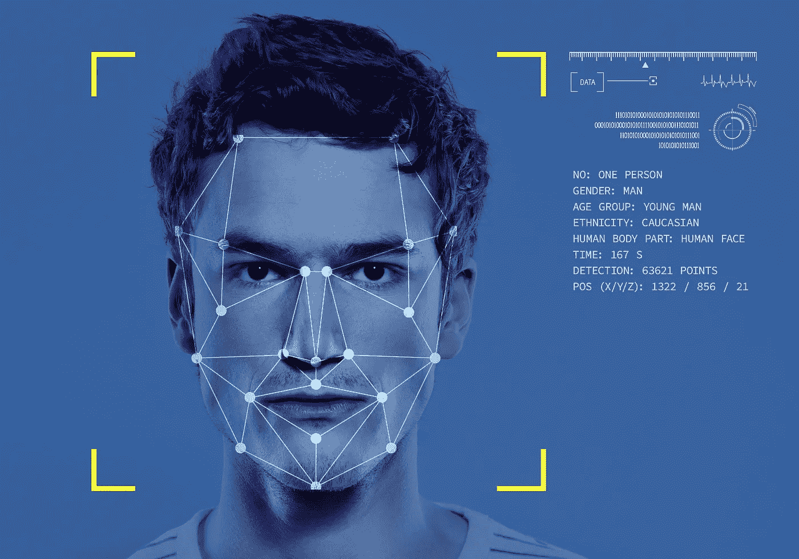
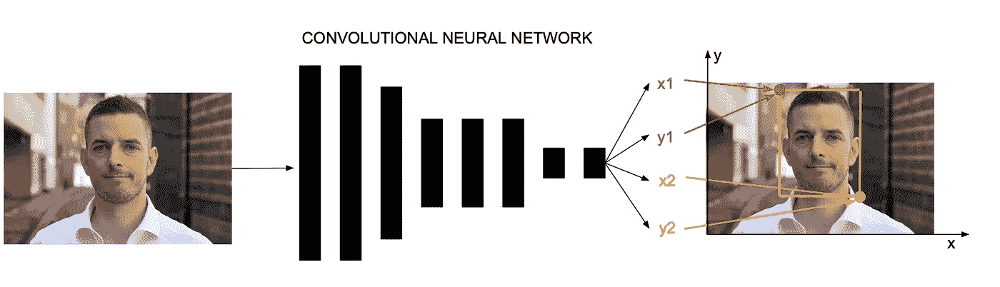
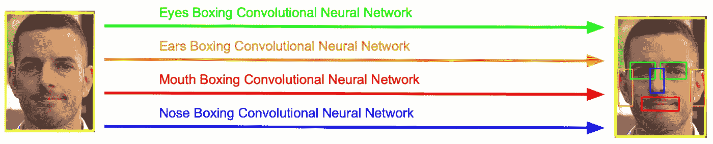
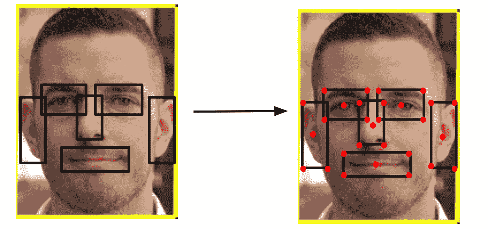
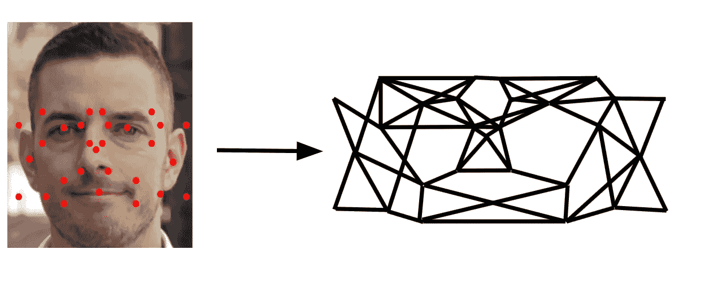
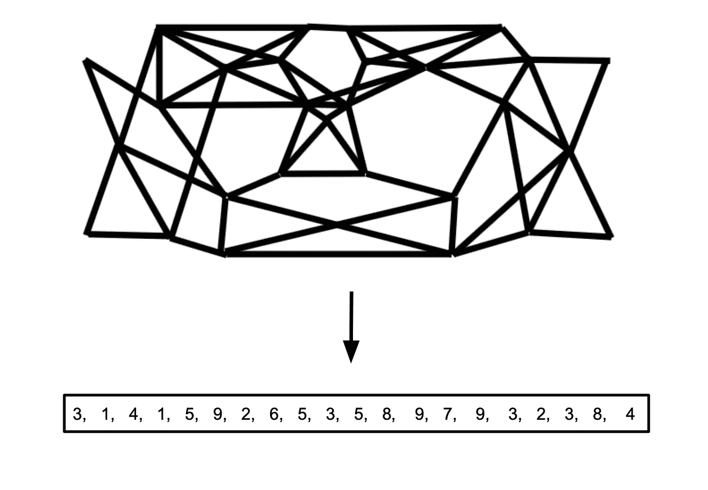
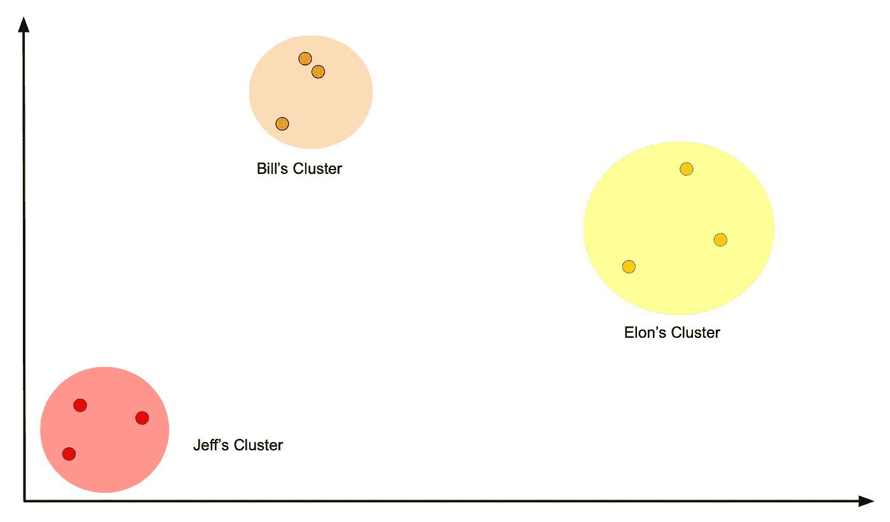
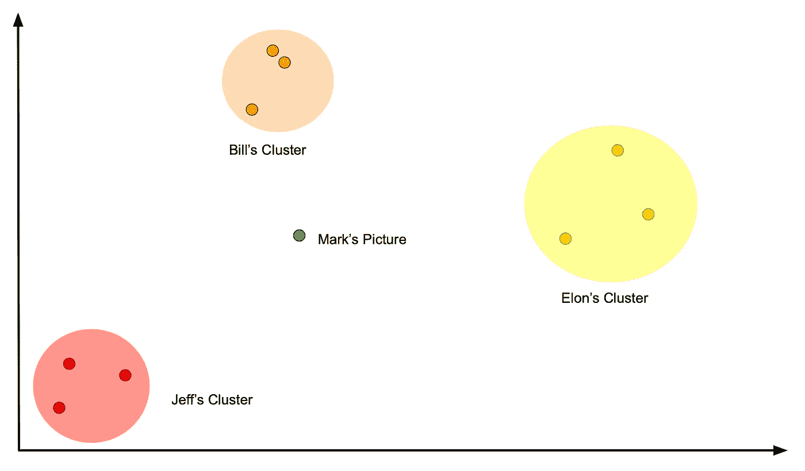
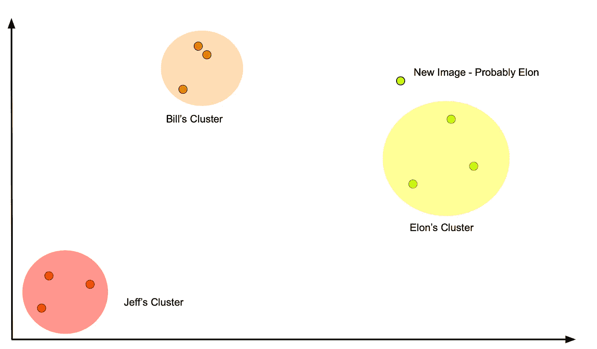

# 面部识别

> 原文：<https://medium.com/analytics-vidhya/facial-recognition-e141c51fc5c5?source=collection_archive---------21----------------------->

我们都认为理所当然的事情是能够通过面部识别某人。从前面、左边或右边看你的朋友——没关系，你仍然可以理解他们是谁。

计算机能做到这一点吗？

简单回答，可以！长回答——有点复杂…

# 它是如何工作的

人脸识别有 4 个基本步骤:
-人脸拳击
-特征拳击
-重要点选择
-绝对距离矢量化
-矢量分类

# 面部拳击

在过程的这一步中，我们希望只框出图像中人的脸，因为照片中的其他东西都与我们无关。

我们可以通过卷积神经网络把二维图像放进盒子里。在所有的正向传播之后，这个特定的神经网络将输出 4 个值。2 对 2，第一对是我们“盒子”左上角的坐标**，第二对是盒子右下角**的坐标**。**

有了这 4 个坐标值，我们就知道图像的哪一部分与我们相关。

# 特征框

一旦我们得到了脸部的一个片段，我们就将脸部的**特征**本身“装箱”。这不是一个具体的规则，您可以自己列出想要装箱的功能。最常见的列表包括:
-眼睛
-嘴巴
-耳朵
-鼻子

为了简单起见，让我们使用这些特性。我们设计的卷积神经网络类似于“面盒”神经网络，以盒中的具体功能。

# 重点选择

一旦我们有了所有的面部特征，我们就选择人脸上的重要点。*“但是你说的重点是什么意思？”我听到你问了。*

重要的点可以是鼻孔的中间，嘴的末端，瞳孔，耳朵的顶端…你明白了。

为了选择这些要点，我们使用了*上一步*创建的方框。由于方框突出显示了面部的重要区域，我们可以在这些方框中选择点，这意味着这些点是“重要点”

通常在这些盒子上选择的点是它们所在盒子的**角**和准确的**中间**。

现在这些点可能看起来很随机，但它们最终会很相似。

# 绝对距离矢量化

当点被选中时，我们取点之间的距离。这些距离可以是每一对之间的距离，也可以是最接近的 5 对之间的距离。那是你写算法的时候选择的问题。我们可以用线来表示这些距离。

我们没有使用特定的算法来连接上面的点，然而，在最后，这是代表这个家伙的脸的线的网络(根据我的*“算法”*)。

一旦我们有了线的网络，我们测量每条线有多长，并把它放入一个数组/向量中。向量基本上是一系列数字。

仔细想想，这太神奇了。我们刚刚把一个人的**头像**转换成了一个**数字列表**！

# 向量分类

现在我们已经有了每个人面部的数字，我们必须知道计算机如何对一个人进行分类。即使每张照片的数字列表不完全相同，它如何知道两张照片都是艾米？

为了解决这个问题，假设我们有 3 张 Jeff 的照片，3 张 Bill 的照片和 3 张 Elon 的照片，它们都被转换成数字。

当我们绘制每幅图像的向量时，Elon、Jeff 和 Bill 的向量都将在它们相似的簇中，因为相似的脸给出相似的数字。

现在我们给出一个人的新形象。如果这是一个不同的人，该图像将被绘制成远离其他聚类，告诉算法这是一个不同的人，因为该图像的坐标离任何其他聚类都很远。

然而，如果我们给另一张图片是埃隆的图像，那么该点将接近埃隆的聚类，告诉算法这是埃隆的图片。

这就是你要的，伙计们！机器知道谁是人类😱我希望这篇文章已经给了你你一直在寻找的东西，并且你已经喜欢它了。如果你喜欢我的文章，我强烈建议你订阅我的时事通讯，因为我会每月更新我的近况:)

https://mailchi.mp/02ac433cc6eb/subscribe-timucin-erbas✏️[月刊](https://mailchi.mp/02ac433cc6eb/subscribe-timucin-erbas)

以后再说！👋