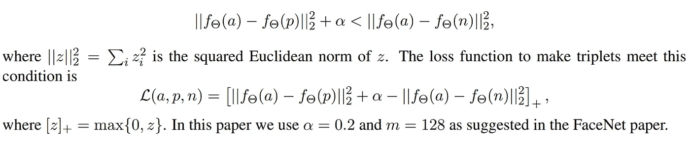
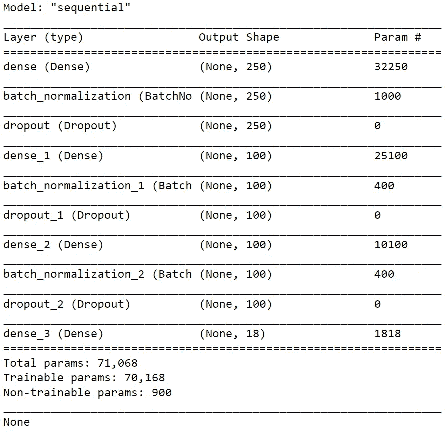
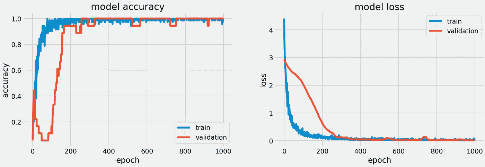
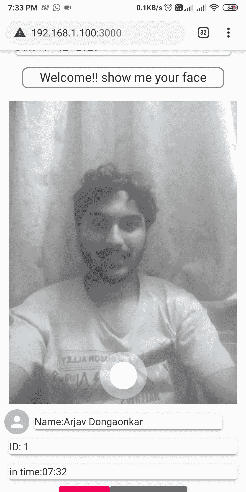

# 面部识别考勤系统

> 原文：<https://medium.com/analytics-vidhya/facial-recognition-is-a-modern-day-technique-capable-of-identifying-a-person-from-its-digital-image-59164121b839?source=collection_archive---------11----------------------->

> "脸是心灵的图画，眼睛是它的解释者."
> ――马库斯·图留斯·西塞罗

***面部识别*** 是一种现代技术，能够从数字图像中识别一个人。他们通过比较一个人的面部特征和它通过训练认识的面孔来工作。它是一种生物识别技术，通过分析面部特征，从给定的图像中得出准确的结果。

在这个项目中，提供了一个完整的端到端解决方案，用于使用人脸识别和身份验证的常规出勤。

这项工作分为两个主要部分:

**1。面部识别和鉴定。**

**2。用于服务器和其他需求的 REST API。**

# 1.面部识别和鉴定。

面部识别从从给定图像中提取面部开始，为图像中找到的一个或多个面部裁剪出背景。它将真实的人脸从背景中分离出来，使识别任务变得更加容易。对于人脸识别的过程，我们有不同的方法。在这篇博客中，我在谈论使用**[**dlib**](http://dlib.net/)**库****

****我正在为人脸检测实现 [dlib，它使用了 HOG(梯度方向直方图)&支持向量机(SVM)的组合。该模型在具有锚图像的正图像和负图像上被训练。(正像表示同一个人，负像表示不同的人)](http://blog.dlib.net/2014/02/dlib-186-released-make-your-own-object.html)****

****在这个项目中，我使用[***open face***](https://cmusatyalab.github.io/openface/)预训练模型进行人脸嵌入。OpenFace 在 dlib 库的孤立人脸上使用了 [FaceNet](https://arxiv.org/abs/1503.03832) (Google 在 3D 图像上使用的模型)架构。****

****OpenFace 使用简单的 2D 仿射变换使眼睛和鼻子出现在神经网络输入的相似位置。 **68** 地标用 dlib 的人脸地标检测器检测。给定输入人脸，仿射变换使眼角和鼻子接近平均位置。仿射变换还会调整图像的大小并将其裁剪到界标的边缘，因此神经网络的输入图像为 96 × 96 像素。****

****FaceNet 在给定的输入图像上使用 ***三重损失函数*** 进行识别，使嵌入更加准确可靠。****

****学习神经网络参数的一种方法是在三重损失函数上定义一个应用的梯度下降，从而为你的面部图片提供有效的编码。为了应用三重损失，我们需要比较成对的图像。给定一张图片，要学习神经网络的参数，就要同时看几张图片。例如，给定同一个人的一对图像，我们希望它们的编码相似。然而，给定一对不同人的图像，我们希望它们的编码完全不同。在三重损失的术语中，我们要做的是总是看一个锚图像，然后我们希望锚和正图像之间的距离更小。然而，当锚与反例相比时，我们希望距离更远。因此，这就产生了术语三重损失，我们将一次看三个图像，一个正图像，一个负图像和一个锚图像。****

****用于训练目的的数据集由每个人不同角度的 10 幅图像组成，以便更精确并避免任何模糊。数据集分成 70:30 分别作为训练数据集和验证数据集。****

> ****数学部分:****

********

****来自 OpenFace 上的官方文件****

> ****在哪里，****
> 
> ****| | fθ(a)—fθ(p)| |是锚图像和正图像的差值，****
> 
> ****| | fθ(a)—fθ(n)| |是锚图像和负图像之间的差值，****

****我用 [**Keras**](https://keras.io/) 和 [**TensorFlow**](https://www.tensorflow.org/) 库做了预测的自定义 NN。****

****现在，为了分类的目的，我构建了一个定制的序列神经网络，其结构如下:****

****1.NN 的输入是孤立面的 128D 嵌入向量。****

****2.这是一个 3 阶段的 CNN，批量标准化，漏失 0.5。****

****3.它对中间(隐藏)层使用 Relu 激活，对分类(输出)层使用 softmax 激活。****

****4.输出维度是我的数据库中的人数(对我来说 n=20)。****

****5.我用 Adam 优化器和分类交叉熵损失编译了神经网络。****

****6.NN 被训练成批量为 64，时期数为 1000。****

********

****神经网络综述****

****我在训练模型时遇到了一个尺寸错误问题，它显示你的张量大小不合适。但是经过一番挖掘，我发现我作为输入给出的张量的大小是(128，1)，但可接受的输入大小是(128，)。****

********

****1000 个时期后的训练结果****

****我执行培训任务的机器有 GPU 支持，所以我使用 CUDA 库，但是在将项目部署为 does 文件时，它显示了一个 CUDAdll 无法启动的警告，请忽略它，因为它不会改变任何过程****

****随着我的深入，每个错误都出现了许多解决方案。****

# ****2.服务器和需求的 REST API。****

****这个项目的主要目的是生产一个全功能的基于人工智能的考勤系统，为此我需要一个用户友好的用户界面，它易于导航，并能有效地向给定的机构报告每月和每年的出勤情况。****

****我在 ***flask*** 中创建了一个后端，这是一个基于 python 的微框架库，用于暴露和连接到前端端口，并通过一个**具象状态转移(REST) API** 与后端进行数据传输和用户请求交互。该数据可用于获取、放置、发布和删除数据类型，这是指读取、更新、创建和删除与数据库中资源相关的操作。****

****我使用了一个 **MySQL 数据库**来满足这个系统的数据库需求。该数据库维护给定公司员工的正常出勤情况。这包括创建一个用户(除了 root 之外),并授予他添加、删除和修改的所有权限。然后为每日出勤创建表，表中包含当天每个员工的唯一员工 id、员工姓名、上班时间和下班时间。****

****Pymysql 库用于连接数据库和服务器，在创建用户时提供唯一的密码。****

********

****实际部署****

****在这之后，我转向了这个考勤系统的用户界面。****

****我用了[***React JS***](https://reactjs.org/)；JavaScript 库 React JS 是一个声明式的、高效的、灵活的 JavaScript 库，用于构建用户界面****

****我使用“react-html5-camera-photo”库捕获一张照片，并通过 POST 请求将其发送到服务器。像“react-bootstrap-table”和“@material-ui”这样的库帮助我构建了一个易于使用并且看起来很棒的 ui。****

****图表用于向用户提供员工出勤的月度报告。月度图表使管理机构可以很容易地关注每个员工的出勤情况，并更有效地将数据转换为工资的成本计算。****

****我使用 Docker 图像在实时使用中快速部署这个系统。****

****所以，面部识别是一个很好的研究领域。它的研究范围很广。在这个项目中，我学到了很多关于 M *模型架构*、*前端开发*、S *服务器构建*、D *数据库管理*和*产品部署*的知识。****

****在整个项目中，Gaurav Chaware 先生给予了极大的帮助。他是我的导师，一直指引我到最后。
太感谢了， ***师傅*** 。****

****为了进一步阅读，我提供了关于 OpenFace，FaceNet 研究论文的链接。****

****open face:-[https://www . research gate . net/publication/303563940 _ open face _ An _ open _ source _ face _ behavior _ analysis _ toolkit](https://www.researchgate.net/publication/303563940_OpenFace_An_open_source_facial_behavior_analysis_toolkit)****

****face net:-【https://arxiv.org/abs/1503.03832 ****