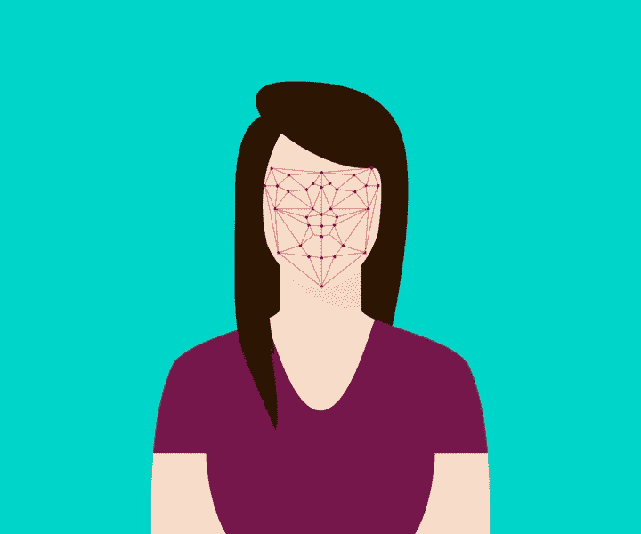

# 面部识别过程

> 原文：<https://medium.com/analytics-vidhya/facial-recognition-process-33906285f8ca?source=collection_archive---------16----------------------->

来源:维基共享资源[teguhjatipras / CC0]

随着诸如面部识别的计算机视觉技术进入许多现代应用的前沿，该技术的受欢迎程度上升。尽管很受欢迎，但许多人无法理解面部识别工作的潜在机制。

**第一步:预处理数据集**

面部识别过程的第一个主要步骤是数据的预处理。要让计算机识别人脸，计算机必须有数据作为识别的基础。因此，用户必须首先输入一些样本数据。输入的数据量有两种方法。用户可以选择输入大量数据，训练神经网络或少量数据，并通过使用预训练模型使用迁移学习等技术。为了简单起见，今天我们将走迁移学习路线。

通过迁移学习途径，您可以导入一个预先训练好的模型，然后将图像预处理成数据。由于计算机不能处理原始图像数据，它通过编码过程将图像转换为数字数据(NumPy 数组),称为嵌入。这些嵌入将在未来的步骤中使用。

**第二步:面部检测**

面部识别过程的第二步是通过网络摄像头进行面部检测。这部分非常简单，因为称为 haar cascades 的 XML 文件可以与 OpenCV 库同时使用来进行面部检测。

**第三步:方差计算**

要找出哪张脸最接近，我们必须找出两张脸之间的差异或“距离”。要做到这一点，我们需要将之前从预处理步骤中获得的矩阵量化为一个数字，这可以通过采用 Frobenius 范数来实现。然后，我们将这些值与网络摄像头上发现的值进行比较，差异最小的人脸就是被识别的人脸。

**结束语**

这个过程可能看起来非常复杂，但是，由于其公式化的性质， [Adam Geitgey](https://medium.com/u/ba4c55e4aa3d?source=post_page-----33906285f8ca--------------------------------) 开发了一个面部识别库，称为 face_recognition，采用迁移学习方法。这个库有很好的文档记录，这是我在创建基于面部识别的考勤跟踪器时采用的方法。我强烈推荐你去看一看，因为这是对面部识别世界的第一次精彩的观察。

