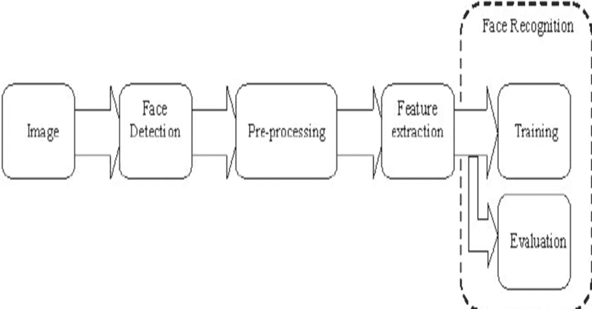
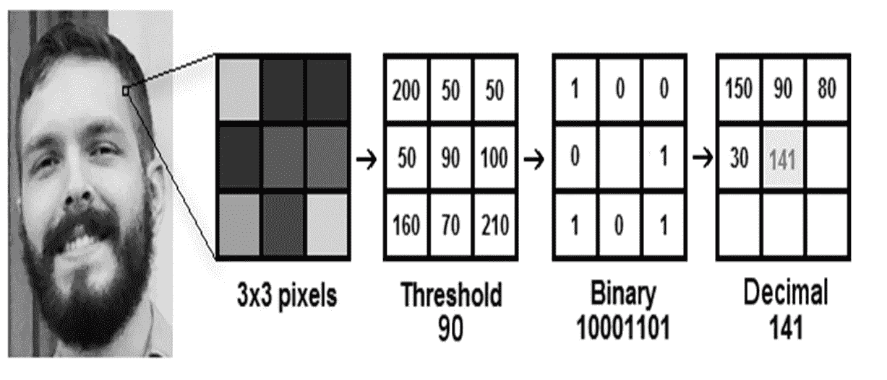
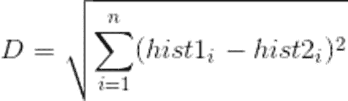
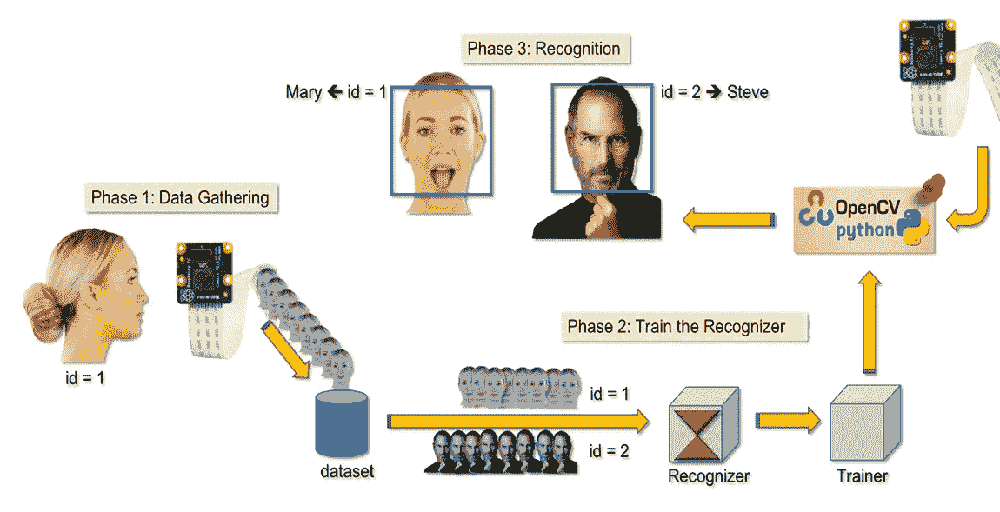
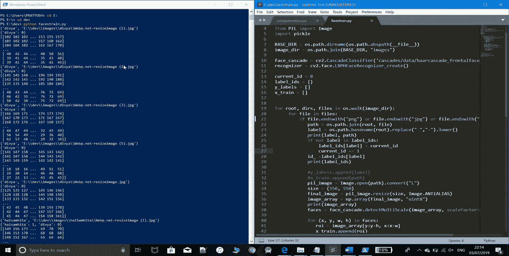
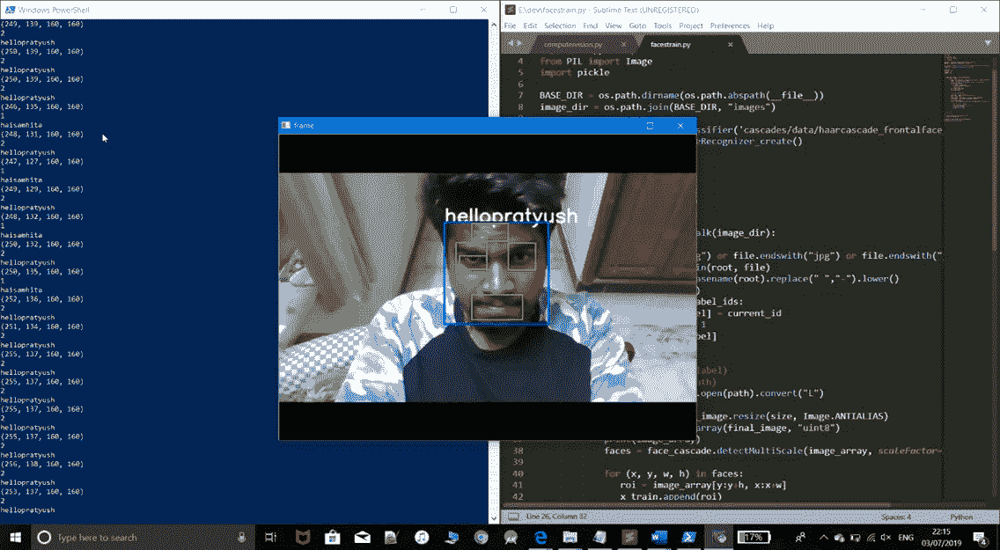

# 使用 Open-CV 的面部识别

> 原文：<https://medium.com/analytics-vidhya/facial-recognition-using-open-cv-1d58be3db40b?source=collection_archive---------9----------------------->

从自动标记图片到解锁手机，人脸识别的应用无所不在。随着最近深度学习的进步，人脸识别的准确性也有所提高。在这个项目中，我们学习了如何开发一个可以检测和识别人脸的人脸识别系统。

**人脸识别系统基本上可以在两种模式下运行**:

*   面部图像的验证或认证:将输入的面部图像与要求认证的用户的面部图像进行比较。
*   面部识别:它将输入的面部图像与数据集中的所有面部图像进行比较，以找到与该面部相匹配的用户。

**使用 Python 和 OpenCV 编码人脸识别:**我们在这个项目中要对人脸识别流程进行划分。

*   准备训练数据:读取每个人/对象的训练图像及其标签，从每个图像中检测人脸，并为每个检测到的人脸分配其所属的人的整数标签。
*   训练人脸识别器:通过向 OpenCV 的 LBPH 识别器输入我们在步骤 1 中准备的数据来训练它。
*   预测:向人脸识别器引入一些测试图像，看看它是否预测正确。

## 算法:

*   我使用了一种古老且更流行的人脸识别算法:**【局部二值模式直方图(LBPH)】**。
*   因为这是一个比较容易的人脸识别算法，每个人都可以理解它没有大的困难。
*   它在 1994 年首次被描述(LBP ),并且已经被发现是纹理分类的强大特征。

**算法步骤:**

**参数**:

LBPH 使用 4 个参数:

**1 —半径**:半径用于构建圆形局部二进制模式，代表中心像素周围的半径。它通常设置为 1。

**2 —邻居**:构建圆形局部二值模式的样本点数。计算成本越高。通常设置为 8。

**3 —网格 X** :水平方向的单元格个数。单元越多，网格越细，得到的特征向量的维度越高。通常设置为 8。

**4 —网格 Y** :垂直方向的单元格个数。单元越多，网格越细，得到的特征向量的维度越高。通常设置为 8。

## **训练算法**:

首先，我们需要训练算法。为此，我们需要使用一个包含我们想要识别的人的面部图像的数据集。我们还需要为每张图像设置一个 ID(它可能是一个数字或人名)，因此算法将使用这些信息来识别输入图像并给你一个输出。同一个人的图像必须有相同的 ID。训练集已经构建好了。

## **应用 LBP 操作**:

LBPH 的第一个计算步骤是通过突出面部特征来创建以更好的方式描述原始图像的中间图像。为此，该算法基于参数的**半径**和**邻居**，使用了滑动窗口的概念。

假设我们有一张灰度的面部图像。

我们可以得到这个图像的一部分，作为一个 3x3 像素的窗口。

♀也可以表示为包含每个像素(0~255)强度的 3x3 矩阵。

♀然后，我们需要取矩阵的中心值作为阈值。

对于中心值(阈值)的每个邻居，我们设置一个新的二进制值。我们将等于或高于阈值的值设置为 1，将低于阈值的值设置为 0。

现在，矩阵将只包含二进制值(忽略中心值)。我们需要将矩阵中每个位置的每个二进制值逐行连接成一个新的二进制值(例如 10001101)。

♀然后，我们将这个二进制值转换为十进制值，并将其设置为矩阵的中心值，它是原始图像的一个像素。

在该程序(LBP 程序)结束时，我们有一个新的图像，它更好地代表了原始图像的特征

下图显示了此过程:

**提取直方图**:现在，使用上一步生成的图像，我们可以使用**网格 X** 和**网格 Y** 参数将图像分成多个网格，如下图所示:

根据上图，我们可以提取每个区域的直方图，如下所示:

因为我们有一个灰度图像，每个直方图(来自每个网格)将只包含 256 个位置(0~255 ),代表每个像素强度的出现次数。

然后，我们需要连接每个直方图，以创建一个新的更大的直方图。假设我们有 8×8 的网格，在最终的直方图中我们将有 8×8×256 = 16.384 个位置。最终的直方图表示图像原始图像的特征。

## **执行面部识别**:

在这一步，算法已经被训练好了。创建的每个直方图用于表示来自训练数据集的每个图像。因此，给定一个输入图像，我们对这个新图像再次执行这些步骤，并创建一个代表该图像的直方图。

因此，要找到与输入图像匹配的图像，我们只需比较两个直方图，并返回直方图最接近的图像。

我们可以使用各种方法来比较直方图(计算两个直方图之间的距离)，例如，**欧氏距离**、**卡方**、**绝对值**等。

在本例中，我们可以根据以下公式使用欧几里德距离(这是众所周知的):

获取 GitHub 上的代码:[https://GitHub . com/prayushnair 1976/face-Recognition-using-opencv](https://github.com/PRATYUSHNAIR1976/Facial-Recognition-using-opencv)

# 输出:

