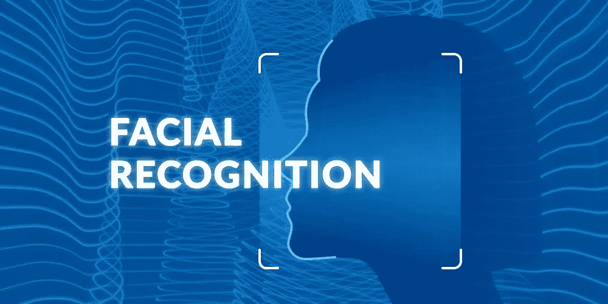
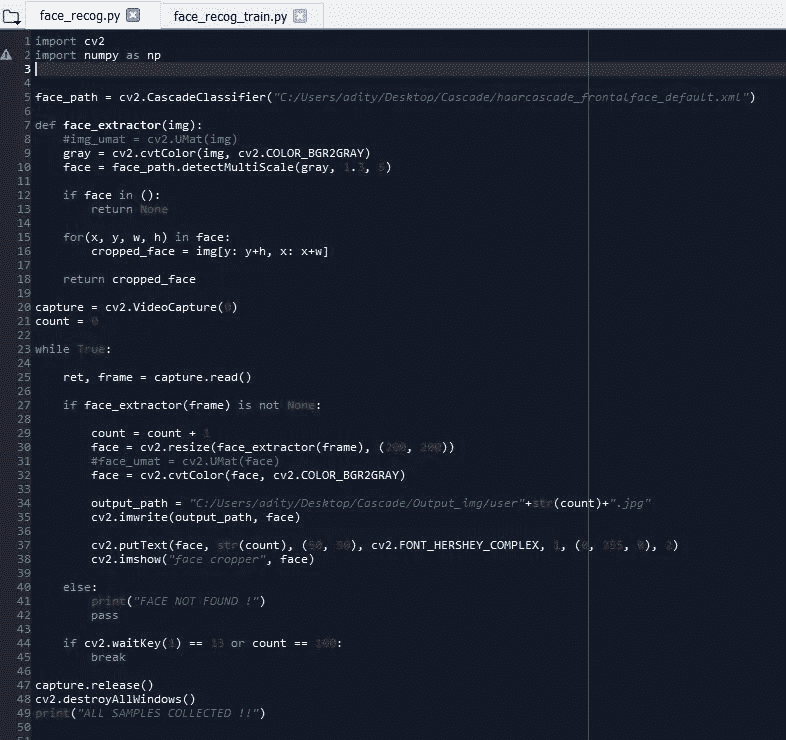
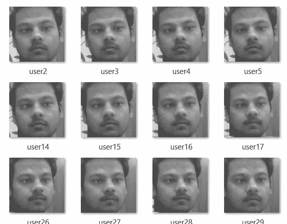
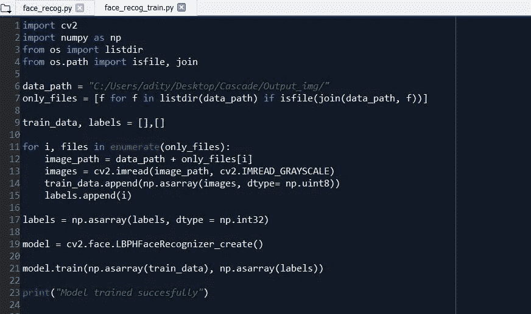
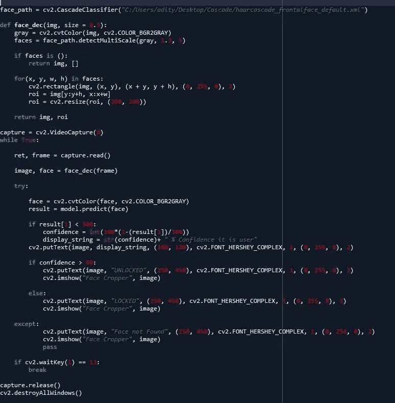

# 使用 OpenCV (Python)进行面部识别

> 原文：<https://medium.com/analytics-vidhya/facial-recognition-using-opencv-python-b90c94fbac8f?source=collection_archive---------3----------------------->

# **OpenCV:**

OpenCV(开源计算机视觉库)是一个开源的计算机视觉和机器学习库。这是为了给计算机视觉应用提供一个通用结构，并影响商业产品中机器解释的使用，如当今世界广泛使用的面部识别。OpenCV 拥有超过 2500 种优化算法。这些算法可以用于检测和识别面部、物体、跟踪视频或图像中运动物体、跟随眼睛运动等。

OpenCV 已经用 C++编写，并具有与 STL 容器一起工作模板化接口(标准模板库:它是一组 C++模板类，提供公共编程数据结构和函数，如列表、数组、堆栈等)。OpenCV 有 C++、Python、Java 和 Matlab 接口，支持 Windows、Linux、Mac OS 和 Android

# **哈尔卡斯克:**

Haar Cascade 是一种分类器，用于检测其已被训练的对象。通过在一组图像上叠加正图像来训练 Haar 级联。这种类型的培训通常在服务器上和不同的阶段进行。通过使用高质量的图像和增加分类器被训练的阶段的数量，可以获得更好的结果。这种级联使得构建模型更加容易。人们只需要预先定义 Haar cascade，它可以在 [github](https://github.com/opencv/opencv/tree/master/data/haarcascades) 上获得。此外，您可以制作自己的级联文件。

# **那么，我们开始:**

在开始这个之前，我的建议是把这个项目分成不同的部分或者分步骤来做，这样就变得容易理解了。因此，我把它分成了两个主要部分，这样它就变得简单又省事。

## **第一部分:(数据收集)**

第一个也是最主要的部分是收集数据样本，这个模型需要在这些样本上进行训练。

**步骤:**

1.  定义路径:如果你可以从 [github](https://github.com/opencv/opencv/tree/master/data/haarcascades) 下载名为“Haar cascode _ frontal face _ default . XML”的层叠文件，我们首先给出该文件的路径。这个级联文件将帮助您的模型对您的面部表情进行分类，并帮助识别它已被训练过的面部。
2.  面部提取:在这个过程中，我们基本上将捕获图像的颜色转换为灰色，因为对于许多基于图像处理的应用程序来说，颜色信息并不能帮助我们识别重要的边缘或其他特征。此外，对于学习图像处理，最好理解多通道处理，而不是从全彩色成像开始，错过所有可以从单通道处理中学到的重要见解。此外，在灰度图像中，分水岭算法相当容易概念化，因为我们可以将两个空间维度和一个亮度维度想象成具有山丘、山谷、集水盆地、山脊等的 3D 图像。
3.  多尺度:在颜色转换之后，我们使用 detectMultiScale()，这基本上检测输入图像中不同大小的对象，检测到的对象作为矩形列表返回。该方法有三个主要参数，包括图像、比例因子和最近邻。
4.  裁剪图像:这是非常关键的部分，因为我们只是裁剪图像，这样我们就可以得到物体的脸。
5.  阅读:现在在裁剪完面部后，我们开始阅读。你一定注意到了一件事，我使用了两个变量来解包 read 函数。这是因为，这个函数总是返回两个值，一个是布尔值，第二个是坐标。
6.  调整大小并保存输出:此处的 resize 函数将裁剪后的图像调整为所需的一组帧，同时声明保存训练数据的文件的位置(“cv2.putText”用于在屏幕上添加文本以及视频和“cv2 .FONT_HERSHEY_COMPLEX "是所用字体的名称，就像 Arial 等)
7.  等待键:这是一个用于终止进程的方法，如果按下任何键，它只接受 ASCII 值，这里 13 是一个 ASCII 值。
8.  释放和破坏窗口:这可能是最重要的事情，因为这将破坏所有在捕捉数据过程中打开的窗口，如果你不这样做，相机窗口将不会关闭，你将不得不重新启动系统，在某些情况下，重新启动甚至不起作用。

(用于数据收集的代码快照)

上述代码将收集 100 个样本数据，然后将其存储在预定义的文件夹(output_path)中

(输出文件)

## **第二部分(训练和预测数据):**

**训练:**

在这一部分中，我们将根据我们收集的数据来训练模型，并且根据训练，我们的模型将预测(基于置信度)用户是同一个用户还是它的其他人；和其他手机面锁一样。

在开始训练之前，我们首先需要从输出文件中获取数据，然后将其转换为灰度。在这个颜色转换之后，我们将数据添加到 train_data 中。

确定主体面部的模型已经被定义为“cv2 . face . lbphface recognizer _ create()”。因此，我们使用它作为训练样本数据的主要模型。

(训练模型)

**预测:**

这是最后也是最后一步。在这种情况下，我们使用测试我们的模型并计算置信度，基于这种置信度，我们的模型将确定并预测用户是否与数据已被训练的用户相同。这一部分的几个步骤与第一部分中列出的步骤相似(定义路径、面提取、多重缩放和调整大小)。唯一不同的是计算置信度。首先，我们设置一个阈值，如果我们的模型预测并且预测值小于阈值，则只计算置信度，如果置信度大于 80，则只弹出“解锁”消息，否则设备将对所有其他人脸保持锁定。

***下面的视频演示了代码的工作方式:***

这个的源代码可以在我的 [github](https://github.com/adityadhapola/Facial-Recognition) 库中找到。