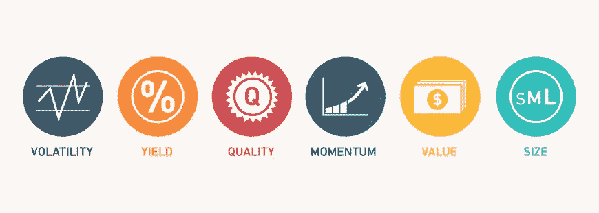

# 使用 Python 进行要素投资

> 原文：<https://medium.com/analytics-vidhya/factor-investing-with-python-89897153c70f?source=collection_archive---------8----------------------->

一个新的金融 Python 系列，带有一个实际例子。让我们了解一下专业的资金管理者是如何处理投资组合的，以及 Python 可以用在什么地方。

## 动机

由于可以以更低的成本获得数量有限的高质量数据，Medium 上最常见的文章都在谈论使用 ML/AI 来预测仅具有定价数据的回报，这些数据是…