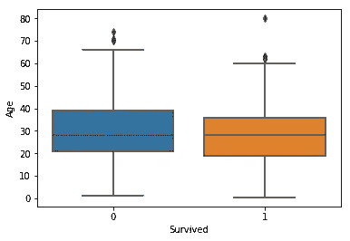

# 泰坦尼克号灾难中影响生存预测的因素

> 原文：<https://medium.com/analytics-vidhya/factors-affect-the-survival-prediction-in-the-titanic-disaster-a0601ef6cce8?source=collection_archive---------36----------------------->

图片鸣谢:[https://gallery . Azure . ai/Experiment/Tutorial-Building-a-class ification-model-in-Azure-ML-18](https://gallery.azure.ai/Experiment/Tutorial-Building-a-classification-model-in-Azure-ML-18)

# 介绍

在这篇博文中，我将讲述找出那些影响泰坦尼克号灾难中存活率预测的因素的过程。我不得不使用在 [***Kaggle***](https://www.kaggle.com/c/titanic/data) 上可用的著名的泰坦尼克号数据集。

主要目标是找到乘客的存活率预测。根据给定的数据，哪种类型的乘客在这场灾难中幸存。

# **哪些特征有助于提高存活率？**

通过查看数据，我发现除了“乘客 ID、姓名和机票”列之外，每个特征都有其重要性，并且对模型的准确性有很大的影响。

总共有 891 个训练集示例，11 个特征+目标变量(幸存)。我发现在不同的特性中有多个缺失值。

有 77%的数据在舱内特征中缺失，19%的数据在年龄特征中缺失，0.2%的数据在船上特征中缺失。

通过执行数据争论，删除 cabin 和 age 列，因为它有多个影响模型性能的缺失值。

# 性别和年龄列之间的概率率是多少？

你已经看到“男性”在 18-33 岁之间有更高的生存概率，而女性在 14-40 岁之间有更高的生存概率。

# 上船和性别有什么关联？

上船的特征似乎与生存相关，取决于性别。

你可以看到在**港口 C** 的男性生存几率较高，在**港口 S 和港口 Q 的生存几率较低**女性在**港口 Q 和 S** 的生存几率较高，反之如果她们在**港口 C**

# **Pclass 与生存率的相关性如何？**

Pclass 似乎与存活率相关。我会将数据的见解可视化，以便更好地理解。

我们清楚地看到**“1 级”**与其他两个等级相比有更高的生存概率。为了更好地理解，我将向您展示另一个 Pclass 图。

我们关于类 1 的假设是正确的，但是我们看到在 Pclass 3 中存活的几率更低。

为了可视化数据的洞察力，找出这些对泰坦尼克号灾难中的存活率有很大影响的特征。

# 结论

在这篇文章中，我们要看看**哪些特征对存活率有贡献？**

我们必须看到多种可视化，以了解不同特征与生存概率之间的相关性。我们还看到在不同的特性中有多个缺失值。

我们已经看到, **Sex、Pclass 和 abowed**特性提高了模型性能，我正在进一步研究其他特性，并分享具有改进的模型性能的[存储库链接](https://github.com/LAsain/Survival-Prediction-in-Titanic-Disaster)。