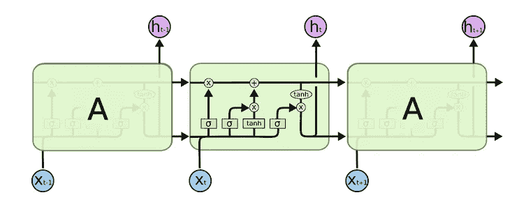
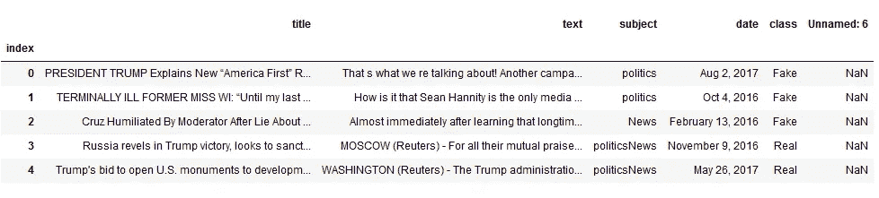
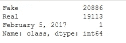
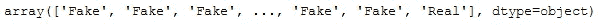
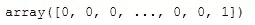
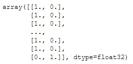
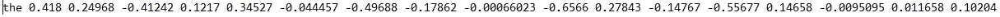
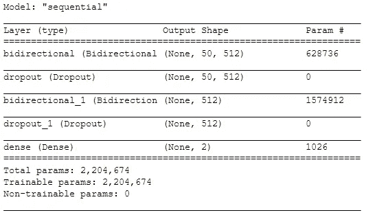
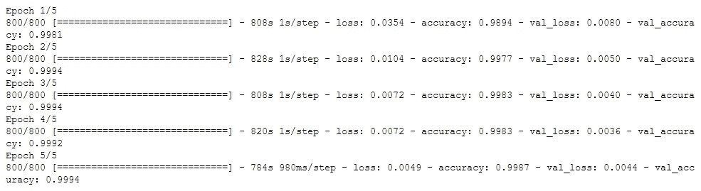
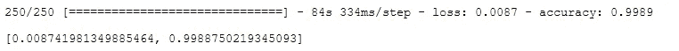

# 基于 LSTM 的假新闻分类器

> 原文：<https://medium.com/analytics-vidhya/fake-news-classifier-using-lstm-280518f973f7?source=collection_archive---------11----------------------->

今天，我们将通过一个小项目来讨论自然语言处理(NLP)中最广泛使用的算法之一。

递归神经网络(RNN)克服了传统神经网络的问题。但是 RNN 也有它的问题，也就是说，它不能把以前的信息和现在的信息联系起来，这就是 LSTM 来帮忙的地方。



*LSTM* 建筑

为了深入了解 LSTM，你可以访问由[科拉](https://colah.github.io/posts/2015-08-Understanding-LSTMs/)撰写的最好的博客之一。

# **目录**

*   导入库和读取数据
*   预处理
*   把...嵌入
*   列车测试分离
*   LSTM
*   估价
*   结束注释

# **导入库并读取数据**

首先，我们将导入所有需要的库。

```
import numpy as np
import pandas as pd
import refrom sklearn.preprocessing import LabelEncoder
from sklearn.model_selection import train_test_splitfrom keras.utils import to_categorical
from keras.models import Sequential 
from keras.layers import LSTM, Dense, Dropout, Bidirectional
```

如果您使用的是 tensorflow < 2.0 than use keras and if you are have tensorflow > 2.0，您可以如下图所示进行导入。

```
import numpy as np
import pandas as pd
import refrom sklearn.preprocessing import LabelEncoder
from sklearn.model_selection import train_test_splitfrom tensorflow.keras.utils import to_categorical
from tensorflow.keras.models import Sequential 
from tensorflow.keras.layers import LSTM, Dense, Dropout, Bidirectional
```

一旦所有东西都被导入，我们将加载数据集。

```
train = pd.read_csv('./train.csv')
train.head()
```



数据

# **预处理**

因为我们不需要 Unnamed:6 列，所以我们将删除它。参数 axis=1 表示删除所有行的列。

```
new_train = train.drop(['Unnamed: 6'], axis = 1)
```

现在，我们将运行**。value_counts()** 获取每个类的计数。

```
new_train['class'].value_counts()
```



输出

正如我们在输出中看到的，我们有一个名为“2017 年 2 月 5 日”的类，它不是分类所必需的，因此我们将删除它。

```
new_train = new_train[new_train['class'] != 'February 5, 2017']
```

当我们从数据集中删除一个条目时，索引变得混乱，因此我们需要将它们按顺序恢复。

```
new_train.reset_index(inplace=True)
```

在接下来的步骤中，我们将创建一个语料库，基于这个语料库我们将对新闻进行分类。我们现在将从数据中提取文本列，并将其分配给语料库。

```
corpus = new_train['text']
```

现在，我们将清理数据。为了执行这个任务，我们将创建一个名为 **clean()的函数。**在此函数中，我们将创建一个空列表来存储转换/清理后的数据。我们将遍历所有数据点，并使用**将其转换为小写。**降低()。在下一步中，我们使用 re 模块(正则表达式)将除小写字符和数字之外的所有内容替换为空格，最后在列表中追加新的数据点。

你也可以使用词干化和词汇化，但是由于准确性很好，我们在这里不需要它。

```
def clean(c):
    C = []
    for i in c:
        i = i.lower()
        k = re.sub(r"[^0-9a-z]"," ",i)
        C.append(k)
    return C
```

下一步，我们将把语料库转换成一个系列，使任务更易于管理。

```
corpus = pd.Series(corpus)
```

现在，我们将预处理标签。我们将首先提取标签。的。方法将返回一个标签数组。

```
y = new_train['class'].values
```



变量 y

由于标签是单词的形式，我们需要将其转换为数字，因为深度学习模型无法在字符上训练，为此，我们将使用来自 **Sklearn** 的**标签编码器**。

我们将创建一个对象并使用。fit_transform 方法获取数字形式的标签。

```
le = Label Encoder()
y = le.fit_transform(y)
```



变量 y

由于该模型在**单热编码**的形式中获取标签值，我们将使用**将其转换为 _ 分类**。

```
y = to_categorical(y)
```



变量 y

# **嵌入**

我们将使用一个名为**单词表示全局向量(GloVe)** 的嵌入，你可以使用 Google 提供的嵌入，或者你也可以[创建自己的嵌入](https://www.youtube.com/watch?v=TsXR7_vtusQ&t=611s)。

我们将首先在记事本中打开该文件进行查看。旁边会有一个单词和一个嵌入，如下面图片中的“ **the** ”。



在记事本中打开文件

**步骤 1** :打开文件

```
f = open("./glove.6B.50d.txt", encoding='utf8')
```

**步骤 2** :我们将创建一个字典来存储单词及其作为键值对的嵌入。正如我们所知，对于每一行，第一件事是 word，其余的都是嵌入，我们将访问它，如下所示。

```
embedding_index = {}for line in f:
    values = line.split()
    word = values[0]
    emb = np.array(values[1:], dtype ='float')

    embedding_index[word] = emb
```

**步骤 3** :我们现在将创建一个名为 **get_embedding_output** 的函数来为我们的语料库创建嵌入。

我们要做的第一件事是分配一个最大长度变量(maxLen)。在下一步中，我们将创建一个名为 **embedding_output** 的 NumPy 数组，所有值都为零，以便稍后用嵌入填充它。

现在，我们将遍历所有的数据点，我们将分割每个数据点，并将所有单词存储在列表 my_example 中。我们将遍历每个单词，并检查在我们之前创建的字典中是否有该单词的嵌入。如果有，我们会将它存储在 **embedding_output 中。**

```
def get_embedding_output(X):
    maxLen = 50
    embedding_output = np.zeros((len(X), maxLen, 50))

    for ix in range(X.shape[0]):
        my_example = X[ix].split()

        for ij in range(len(my_example)):             if (embedding_index.get(my_example[ij].lower()) is not              
                        None) and (ij<maxLen):

                embedding_output[ix][ij]= 
                          embedding_index[my_example[ij].lower()]

    return embedding_output
```

**步骤 4** :在这一步中，我们将调用函数来为我们的语料库获取嵌入。

```
embeddings = get_embedding_output(corpus)
```

# **列车试分裂**

我们将使用来自 Sklearn 的 **train_test_split** ，因为一旦模型被训练，我们就需要一些数据来进行测试。

```
X_train, X_test, y_train, y_test = train_test_split(embeddings, y, test_size = 0.2 , random_state=42)
```

# **LSTM 模式**

要创建顺序模型，我们将从 Keras 创建顺序对象。您也可以使用功能模型。我们将使用。add()方法向我们的模型添加层。

我们模型的第一层是双向 LSTM 层，单元(神经元)可以根据需要改变。我们使用 return_sequences=True 来堆叠 LSTM 层。

我们模型的第二层将是一个下降层，以防止过度拟合。下一层与上一层相似。

我们的模型的最后一层将是具有 2 个单元(神经元)的密集层，因为我们有 2 个类别“假”或“真”，并且因为我们想要对其进行分类，我们将使用 **softmax** 作为激活函数。

```
model = Sequential()
model.add(Bidirectional(LSTM(units = 256 , return_sequences=True), input_shape = (50,50)))
model.add(Dropout(0.3))
model.add(Bidirectional(LSTM(units = 256)))
model.add(Dropout(0.3))
model.add(Dense(units= 2, activation='softmax'))
model.summary()
```

model.summary()用于获取我们刚刚构建的模型的摘要。



模型摘要

现在我们将编译模型，我们将使用 adam 优化器，因为它是最好的优化器之一，您也可以使用其他优化器，如 sgd。我们将使用分类交叉熵来度量损失。

```
model.compile(optimizer='adam', loss='categorical_crossentropy', metrics =['accuracy'])
```

最后，我们将训练我们的模型。我们使用。fit()方法来训练我们的模型，我们传递从 train_test_split 获得的数据。validation_split 属性用于每个时期中模型验证。

```
hist = model.fit(X_train, y_train, validation_split=0.2, shuffle=True, batch_size=32, epochs=5)
```



培养

# 估价

随着模型被训练，我们现在将使用**来评估我们的模型的准确性。evaluate()** 函数。我们刚刚创建的模型的准确率是 99.88%。

```
model.evaluate(X_test, y_test)
```



输出

# **结尾注释**

在这个模型中，我们使用文本来对新闻进行分类，你也可以使用标题或主题或者文本、标题、主题的组合来将准确率提高到 99.9%或者可能是 100%

这是一个使用长短期记忆的假新闻分类器(LSTM)。如果你想了解更多关于机器学习和数据科学的博客，请关注我，并告诉我你想了解的话题。

嘿，读者们，感谢你们的时间。如果你喜欢这个博客，别忘了鼓掌欣赏它👏如果你喜欢❤，你可以给 50 英镑👏

*数据科学爱好者| ML 爱好者| TCS CA |编码块 CA | Blogger |社区成员|公共演讲者*

如果您有任何疑问或建议，请随时联系我

[https://twitter.com/shah_naivedh](https://twitter.com/shah_naivedh)

[https://www.linkedin.com/in/naivedh-shah/](https://www.linkedin.com/in/naivedh-shah/?originalSubdomain=in)