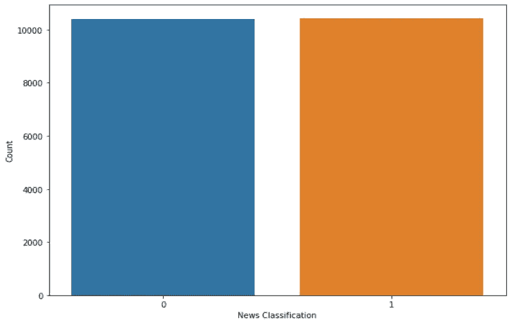
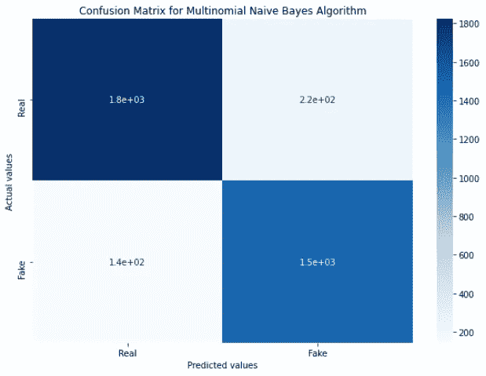
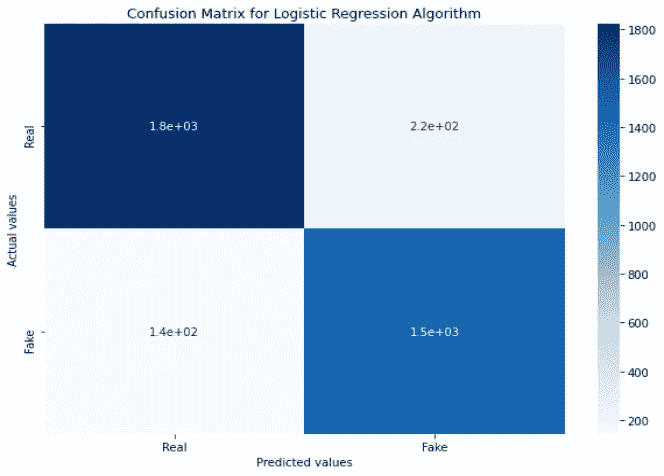

# 基于自然语言处理的假新闻检测

> 原文：<https://medium.com/analytics-vidhya/fake-news-detection-using-natural-language-processing-ae4d9aaab923?source=collection_archive---------6----------------------->

随着大量假新闻报道和编造故事的兴起，假新闻的传播是当前的热点问题。让我们以印度为例。印度领先的信息平台 Whatsapp 是传播错误信息的工具，尤其是在选举期间。2019 年 3 月，Whatsapp 群中充斥着声称显示印度在巴基斯坦前所未有的空袭取得成功的照片。然而，据英国广播公司报道，这些照片是带有虚假说明的旧图片。一张照片可以追溯到 2014 年巴基斯坦的自杀式袭击，另一张可以追溯到 2005 年巴控克什米尔的地震。在这种情况下，虚假消息的传播引起了严重的政治动荡。这是假新闻如何可能以沙文主义的名义导致暴力和暴民私刑的一个例子。

手头的事情如此严重，以至于 Whatsapp 声称每月删除 200 万个账户，以试图停止假新闻的产生。脸书和其他社交媒体应用也遇到了类似的情况。

但是是什么原因导致这种假新闻泛滥呢？

BBC 研究发现，情绪化思维和爱国主义在很多情况下超越了事实，导致了捏造新闻的产生。有一定的条件为假新闻的传播提供了便利。这些是:

1.各类新闻之间界限的模糊

2.对新闻媒体动机的怀疑

3.数字信息的泛滥和向高频新闻消费世界的转变

4.应对海量数字信息的应对机制。这些因素是:选择性消费，偏爱图片，发送者优先，来源不可知论，论坛的性质，以及“感觉”胜于“思考”

5.消费和分享之间断裂的联系

6.观众分享 WhatsApp 和脸书的策略。

分享背后的动机丰富而复杂，需要理解才能确定为什么要分享假新闻。这些是:

1.共享以在网络内验证

2.分享是公民的义务

3.为国家建设而分享

4.分享是一种社会政治身份的表达。

在这里，我们正在创建一个模型，使用这个数据集来预测一个给定的新闻是真是假。它预测新闻文章的可信度，并使用 NLP 技术自动处理真实性问题。首先，我们导入必要的 python 库，如 pandas 和 numpy，然后导入我们的数据集(包含 id、标题、文章作者、文本和标签)。标签 1 代表真新闻，0 代表假新闻。我们研究这些数据，并使用 seaborn 库来绘制真假新闻的计数。

从图中我们可以得出结论，数据是平衡的。

下一个关键步骤是数据清理。我们检查空值。发现了一些空值，使用 dropna()函数删除了这些空值。

现在，我们先把新闻简化一下，再分类为假的还是假的。我们首先从新闻标题中删除特殊字符，然后将其转换成小写字母。然后我们将它标记化(拆分成单词)并删除停用词。停用词是语言中常用的词。搜索引擎在索引数据以及检索搜索查询结果时会忽略停用词。我们还需要使用 PorterStemmer()来阻止单词。这给出了单词的词根形式。例如:“clean”表示“清洁”，“fish”表示“鱼”，等等。

一旦通过将数据转换为小写、移除特殊字符、词干和移除停用词来简化数据，我们就建立了一个单词包模型。这将把文本表示为一个单词包(multiset ),并对单词进行计数。它给了我们 5000 个特征或最常用的词，范围从 1 到 3。计数矢量器对文档集合进行标记化，并构建唯一单词的词汇表。它还可以使用这个词汇表对新文档进行编码。

现在，让我们进入分类模型。首先，我们需要将数据分为训练和测试数据，因为这是一个监督学习模型。我们使用训练集训练数据，并使用测试集测试数据。80%的数据用于训练，其余 20 %用于测试以获得最佳结果。

**朴素贝叶斯** 朴素贝叶斯主要用于自然语言处理。朴素贝叶斯分类算法是一类使用贝叶斯定理的算法。它使用了一个天真的假设，即所有的特性都是相互独立的。贝叶斯定理计算概率 P(A|B ),其中 A 是可能结果的类别，B 是必须分类的给定实例。

P(A|B) = P(B|A) * P(A) / P(B)

根据我们的数据，类为 0 或 1，其中 0 表示假新闻，1 表示真新闻。给定一个新闻 x，我们将计算:

P(真实新闻| x)= P(x |真实新闻)* P(真实新闻)/ P(x)

P(假新闻| x)=**P(x |假新闻)* P(假新闻)/ P(x)**

**如果 P(真新闻|x) > P(假新闻|x)，算法预测是真新闻。否则消息会被预测为假的。**

**我们将模型拟合到训练集，预测测试集结果，并计算准确度、精确度和召回率。此外，我们调整超参数以获得最佳结果和精确度*。***

**我们获得了 90.16%的准确率**

**精度分数为 0.87，并且**

**回忆得分为 0.91**

**当α值为 0.3 时，最佳准确度为 90.59%。**

****逻辑回归****

**逻辑回归是一种统计模型，其中响应变量取离散值，解释变量可以是连续的，也可以是离散的。如果结果变量只取两个值，则该模型称为二元逻辑回归模型。这里的结果可以是真实消息(Y = 1)和虚假消息(Y = 0)。则使用二元逻辑回归模型，记录属于正类 P(Y = 1)的概率由下式给出:**

**P(Y=1) = e^z/(1 + (e^z)**

**逻辑函数-逻辑函数，也称为 sigmoid 函数，是由统计学家开发的，用于描述生态学中人口增长的特性，快速增长并达到环境的承载能力。它是一条 S 形曲线，可以将任何实数值映射为 0 到 1 之间的值，但永远不会精确到这些极限。**

**y = e^(b0 + b1*x) / (1 + e^(b0 + b1*x))**

**这里，y 是预测输出，b0 是偏差或截距项，b1 是单一输入值(x)的系数。输入数据中的每一列都有一个关联的 b 系数(一个恒定的实值)，该系数必须从训练数据中获取。**

**同样，我们将模型拟合到训练集，预测测试集结果，计算准确度、精确度和召回率，并调整超参数以获得最佳结果和准确度。**

**我们获得了 93.52%的准确率**

**精度分数为 0.89，并且**

**回忆得分为 0.97**

**当 C 值为 0.8 时，最佳精度为 93.63%。**

**我们使用混淆矩阵来评估模型的性能。它比较预测值和实际值。我们使用 4 种方法来评估绩效:**

*   **真正值:预测值和实际值相同，且值为正值的情况。**
*   **真负值:预测值和实际值相同，并且值为负值的情况。**
*   **假阳性:预测值为“是”，但实际值为“否”的情况。**
*   **假阴性:预测为“否”，但实际值为“是”的情况。**

****多项式朴素贝叶斯的混淆矩阵:****

****

****LoR 的混淆矩阵:****

****

**最后一步是做预测。**

****输出示例****

***新闻:今日图表:大繁荣(1947-79)与大衰退(1980-2016)***

***预测:这是假新闻！***

***新闻:蒂姆·泰博将再次尝试复出，这次是在棒球领域——纽约时报***

***预测:这是一条真实的新闻。***

***新闻:叙利亚、俄罗斯、摩苏尔:你周五晚上的简报——纽约时报***

***预测:这是一条真实的新闻。***

***新闻:克林顿的闪电战:寡头的野蛮政治***

***预测:这是假新闻！***

**以这种方式，给定新闻标题，模型可以预测文章是真是假。**

****结论****

**本文介绍了建立假新闻检测模型的各个阶段。描述了预处理、训练和预测阶段，并使用准确度、精确度、召回率和混淆矩阵评估了模型的性能。该模型完成了检测假新闻的任务。**

**然而，这仅仅是根除假新闻的开始阶段。有更先进的自然语言处理技术，如伯特，手套，ELMo 可以使用。其他方法包括使用基于风格测量的出处，即，追溯文本的书写风格到其产生源，并确定该源是否是恶意的。技术也可以用来评估假新闻的子类别。**

****参考文献****

*   **[https://www . geeks forgeeks . org/applying-multinomial-naive-Bayes-to-NLP-problems/](https://www.geeksforgeeks.org/applying-multinomial-naive-bayes-to-nlp-problems/)**
*   **[https://en.wikipedia.org/wiki/Logistic_regression](https://en.wikipedia.org/wiki/Logistic_regression)**
*   **[https://www . Forbes . com/sites/bernardmarr/2017/03/01/fake-news-how-big-data-and-ai-can-help/](https://www.forbes.com/sites/bernardmarr/2017/03/01/fake-news-how-big-data-and-ai-can-help/)**
*   **[https://www . data robot . com/blog/data-science-fails-fake-news-fake-data/](https://www.datarobot.com/blog/data-science-fails-fake-news-fake-data/)**
*   **[https://www . the guardian . com/technology/2019/feb/06/whatsapp-每月删除 200 万个账户以阻止假新闻](https://www.theguardian.com/technology/2019/feb/06/whatsapp-deleting-two-million-accounts-per-month-to-stop-fake-news)**
*   **[https://www.bbc.com/news/world-asia-india-47797151](https://www.bbc.com/news/world-asia-india-47797151)**
*   **[http://downloads . BBC . co . uk/media centre/duty-identity-credential . pdf](http://downloads.bbc.co.uk/mediacentre/duty-identity-credibility.pdf)**