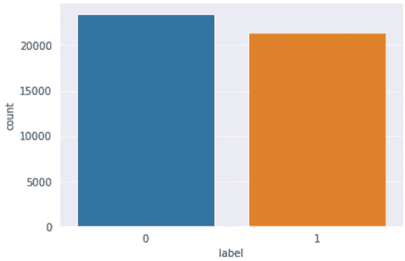
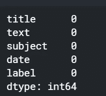
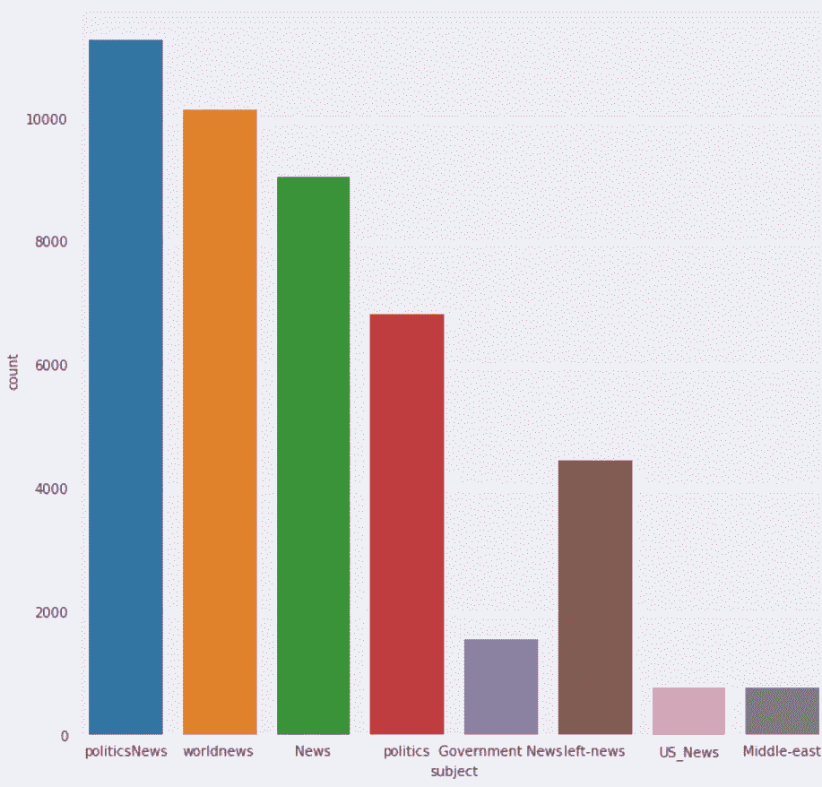
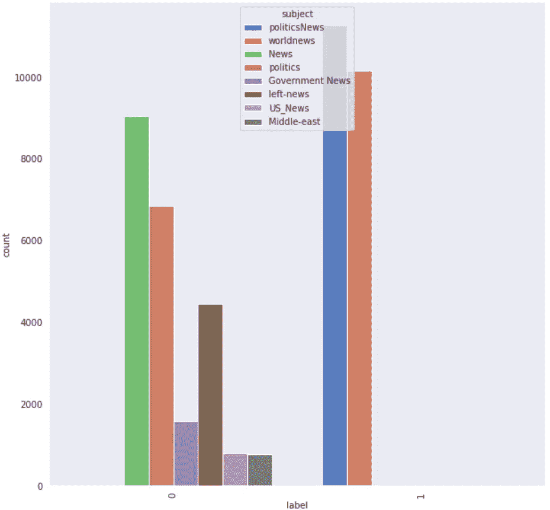
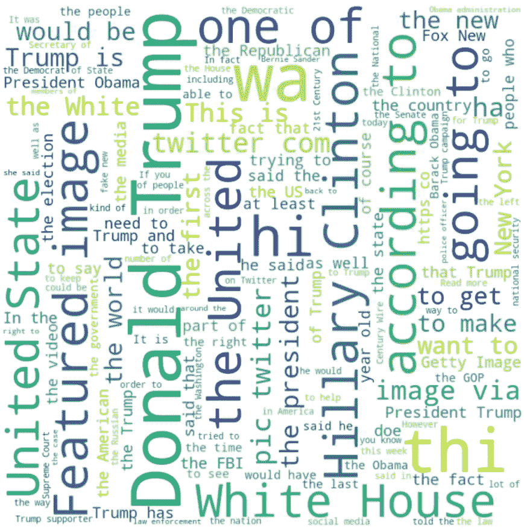
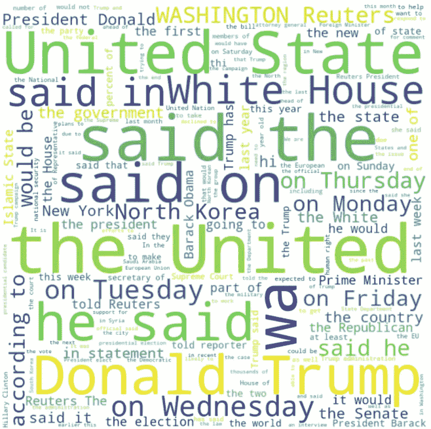
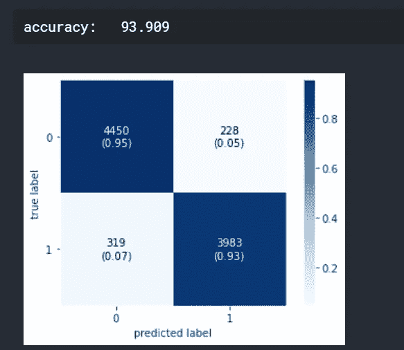
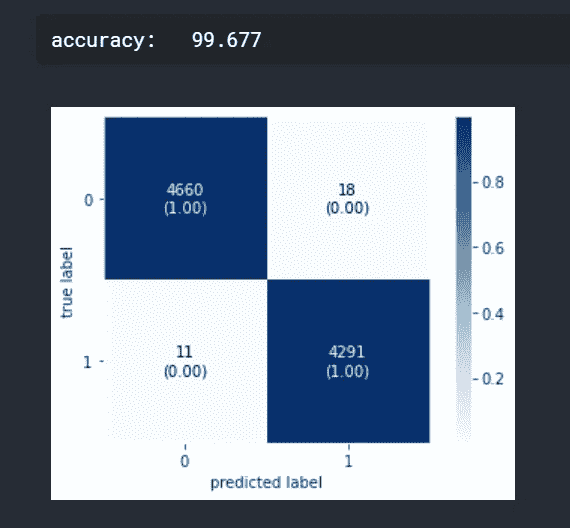
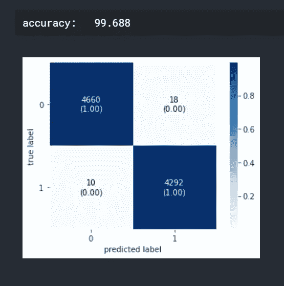

# 利用自然语言处理技术检测假新闻

> 原文：<https://medium.com/analytics-vidhya/fake-news-detection-using-nlp-techniques-c2dc4be05f99?source=collection_archive---------1----------------------->

由 [Raphael Schaller](https://unsplash.com/@raphaelphotoch?utm_source=medium&utm_medium=referral) 在 [Unsplash](https://unsplash.com?utm_source=medium&utm_medium=referral) 拍摄的照片

假新闻检测是自然语言处理领域的一个热门话题。在本文中，我们使用这个[数据集](https://www.kaggle.com/clmentbisaillon/fake-and-real-news-dataset)通过 NLP 技术进行新闻分类。我们有两个输入文件。一个是真消息，一个是假消息。让我们进一步挖掘给定的数据。

真正的头

假的。头

我们的工作是创建一个模型来预测一个给定的新闻是真是假。由于这是一个监督学习问题，我们在真实和虚假新闻数据中创建了一个名为“label”的目标列，并将它们连接起来。

现在我们有了输入，真实新闻的标签值为 1，虚假新闻的标签值为 0。我们必须检查我们的数据是否平衡。我们使用 seaborn 库来绘制真假新闻的计数。

“标签”列的计数图

从图中我们可以得出结论，数据是平衡的。这是重要的一步，因为现实世界中有很多不平衡的数据集。让我们检查数据中的空值。

幸运的是，我们没有空值。然后，我们查看数据中的所有列。数据中有 5 列-标题、文本、主题、日期和标签。让我们检查一下这些题目。

受试者计数图

有关于 8 个主题的新闻。我们有最多的政治新闻。让我们深入探讨一下这个问题。

主题与标签的对比图

从这个情节可以清楚地看出，我们所有的真实新闻都属于两个主题。这似乎很奇怪。这可能是因为我们的数据只取自一小段时间。让我们将标题和文本字段连接成一列，并删除所有其他列。

现在，让我们创建一个词云来分析我们数据中最常用的词。将停用词从数据中移除，并生成词云。停用词是语言中常用的词。搜索引擎在索引数据以及检索搜索查询结果时会忽略停用词。

假新闻的词云

真实新闻的文字云

我们可以从单词云得出结论，关于唐纳德·特朗普和美国有很多真实和虚假的新闻。

**分类**

现在，让我们进入分类模型。我们将尝试不同的模型并评估性能。由于分类是一种监督学习，我们必须首先将数据分为训练数据和测试数据。我们使用训练数据来训练模型，并使用测试数据来测试我们的模型的性能。一般来说，数据是以这样的方式分割的，80%的数据在训练集中，20%的数据在测试集中。这是因为训练集越多，模型从数据中学习的就越多。

现在，我们将研究一些基本的分类模型。

*   **多项式朴素贝叶斯**

朴素贝叶斯主要用于自然语言处理。朴素贝叶斯分类算法是一个使用[贝叶斯定理](https://en.wikipedia.org/wiki/Bayes%27_theorem#:~:text=In%20probability%20theory%20and%20statistics,be%20related%20to%20the%20event.)的算法家族。它使用了一个天真的假设，即所有的特性都是相互独立的。贝叶斯定理计算概率 P(c|x ),其中 c 是可能结果的类别，x 是必须分类的给定实例。

`**P(c|x) = P(x|c) * P(c) / P(x)**`

根据我们的数据，类为 0 或 1，其中 0 表示假新闻，1 表示真新闻。给定一个新闻 x，我们将计算 P(真新闻|x)以及 P(假新闻|x)。如果 P(真新闻|x) > P(假新闻|x)，算法预测是真新闻。否则消息会被预测为假的。

*   **支持向量机**

支持向量机或 SVM 是用于分类和回归问题的线性模型。SVM 模型获取训练集中的数据，并将其映射到空间中的数据点，以便在属于不同类别的点之间存在明显的差距。该间隙尽可能宽，以提高模型的性能。每当一个新的数据点被赋予模型时，它将该点映射到相同的空间，并根据它们落在缺口的哪一侧来预测类别。

*   **被动主动分类器**

被动积极分类器是一种从海量数据流中学习的在线算法。想法是得到一个例子，更新分类器，然后扔掉这个例子。它实施起来既快又容易，但不像 SVM 那样提供全球担保。

现在我们可以将这些模型应用到我们的数据中。但是，我们不能将文本直接作为分类器的输入。相反，我们将把文本转换成数字。机器学习使用一种叫做词袋的简单模型来处理文本数据。其思想是找到文档中所有的唯一单词，并创建一个大小等于唯一单词数量的向量。向量中的每个单词都有一个索引。对应于该单词的索引用该单词在文档中的频率填充。这种方法的主要缺点是，它忽略了与单词顺序相关的所有信息，只考虑了单词的频率。我们使用[计数矢量器](https://scikit-learn.org/stable/modules/generated/sklearn.feature_extraction.text.CountVectorizer.html)和 [TfidfTransformer](https://scikit-learn.org/stable/modules/generated/sklearn.feature_extraction.text.TfidfVectorizer.html) 进行转换。

**计数矢量器**

计数矢量器对文档集合进行标记化，并构建唯一单词的词汇表。它还可以使用这个词汇表对新文档进行编码。

**Tfidf 变压器**

考虑下面的一组单词-'the '，' in '，' on '，' a '，' an '。这是一组单词的例子，这些单词本身没有任何意义，但是它们在每个文档中都出现了很多次。在我们的算法中包含这类单词会降低模型的性能。所以，我们必须剔除这些词。TF-IDF 或*术语频率-逆文档频率*用于删除此类单词。词频是指该词在文档中出现的频率。逆文档频率减少了在所有文档中出现过多的单词的分数。简而言之，TF-IDF 通过突出显示在一个文档中出现频率较高的单词来给单词打分，但不会跨越文档。TfidfVectorizer 对文档进行标记化，学习词汇并对文档频率分数进行逆运算。它还对新文档进行编码。或者，如果您已经使用了 CountVectorizer，您可以将它与一个 [TfidfTransformer](http://scikit-learn.org/stable/modules/generated/sklearn.feature_extraction.text.TfidfTransformer.html) 一起使用，来计算逆文档频率并开始编码文档。

我们使用 [Pipeline](https://scikit-learn.org/stable/modules/compose.html) object，这是一个用于自动化机器学习工作流的实用程序。管道允许几个变压器链接在一起。数据从流水线的起点流向终点，每个变换器的输出作为下一个变换器的输入给出。管道有两种主要方法:

*   fit_transform:为每个转换器调用这个方法，每次结果都被输入到下一个转换器中。
*   fit_predict:如果你的管道以一个估算器结束，那么在估算器上调用 fit_predict。

有几个指标可以评估模型的性能。在这个项目中，我们使用准确性和混淆矩阵。准确度是正确预测数与预测总数的比率。只有当你的数据是平衡的，准确性才被认为是一个好的衡量标准。混淆矩阵是一个给我们的模型更多洞察力的矩阵。它比较预测值和实际值。我们使用 4 种方法来评估性能。

*   真正值:预测值和实际值相同，且值为正值的情况。
*   真负值:预测值和实际值相同，并且值为负值的情况。
*   假阳性:预测值为“是”，但实际值为“否”的情况。
*   假阴性:预测为“否”，但实际值为“是”的情况。

最后，让我们应用各种模型并评估性能。

多项式 NB

混淆矩阵

SVM

混淆矩阵

被动主动分类器

混淆矩阵

很明显，与其他模型相比，多项式朴素贝叶斯表现不佳。SVM 和被动主动分类器具有几乎相似的性能。

**结论**

我们使用三种分类模型对新闻数据进行了分类。我们使用准确度和混淆矩阵分析了模型的性能。但这只是问题的起点。有像 BERT、GloVe 和 ELMo 这样的先进技术在自然语言处理领域得到了广泛的应用。如果您对 NLP 感兴趣，您可以使用这些技术继续工作。

 [## 信用卡欺诈检测:处理阶层失衡的案例研究

### 我们生活在一个日常交易越来越依赖信用卡而不是现金的时代。作为…的频率

medium.com](/analytics-vidhya/credit-card-fraud-detection-a-case-study-for-handling-class-imbalance-f81abf997421) 

**参考文献**

*   【https://en.wikipedia.org/wiki/Support_vector_machine 
*   [https://www . geeks forgeeks . org/applying-multinomial-naive-Bayes-to-NLP-problems/](https://www.geeksforgeeks.org/applying-multinomial-naive-bayes-to-nlp-problems/)
*   [https://www.youtube.com/watch?v=TJU8NfDdqNQ](https://www.youtube.com/watch?v=TJU8NfDdqNQ)
*   [https://www.youtube.com/watch?v=xyq-zYr1cnI](https://www.youtube.com/watch?v=xyq-zYr1cnI)
*   [https://signal-to-noise.xyz/post/sklearn-pipeline/](https://signal-to-noise.xyz/post/sklearn-pipeline/)
*   [https://machine learning mastery . com/prepare-text-data-machine-learning-scikit-learn/](https://machinelearningmastery.com/prepare-text-data-machine-learning-scikit-learn/)