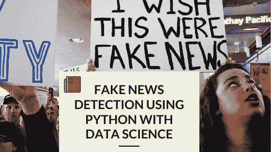
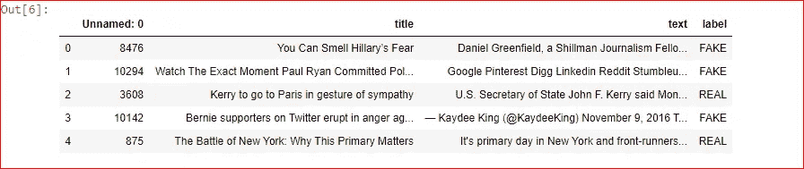
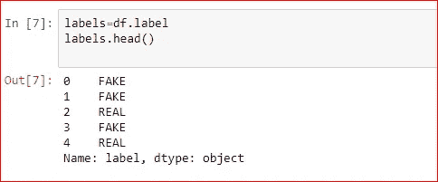
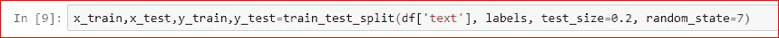
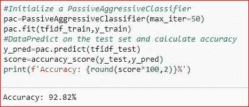
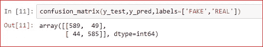

# 利用 Python 检测假新闻| 2023 年学数据科学

> 原文：<https://medium.com/analytics-vidhya/fake-news-detection-using-python-learn-data-science-in-2020-80a45727a67b?source=collection_archive---------10----------------------->

## Python 与数据科学

## 利用 Python 进行假新闻数据分析

**1。** **简介**

根据目前的社交媒体和各种与互联网相关的事情，人们完全依赖于，有时我们不知道每条新闻和文章都不是真实发生的事情

但我们相信社交媒体是最大的用户基础平台，它包含有时真实或虚假的新闻。该系统利用强大的数据科学平台识别各种虚假和真实的新闻，并通过分析平台使用大量包含大量新闻相关数据的数据集。

> **什么是假新闻？**

作为黄色新闻的一种，假新闻包含可能是恶作剧的新闻片段，通常通过社交媒体和其他在线媒体传播。这样做通常是为了推进或强加某些想法，并经常通过政治议程来实现。这类新闻可能包含虚假和/或夸大的说法，最终可能被算法虚拟化，用户可能最终陷入过滤器泡沫。

> **什么是 TfidfVectorizer？**

**TF(词频):**一个词在文档中出现的次数就是它的词频。较高的值意味着某个术语比其他术语出现得更频繁，因此，当该术语是搜索术语的一部分时，该文档是一个很好的匹配。

**IDF(逆文档频率):**在一个文档中出现多次，但在其他很多文档中也出现多次的词，可能不相关。IDF 是对一个术语在整个语料库中的重要性的度量。

tfidf 矢量器将原始文档的集合转换成 TF-IDF 特征的矩阵。

> **什么是 PassiveAggressiveClassifier？**

被动攻击算法是一类用于大规模学习的算法。它们类似于感知器，因为它们不需要学习率。然而，与感知器相反，它们包括一个正则化参数 c。

> **软件要求**

**IDE —** Jupyter 笔记本(Ipython 编程环境)

**步骤 1:下载第一个新闻数据集以处理实时数据**

我们将在这个 python 项目中使用的数据集——我们称之为 [news.csv.](https://mega.nz/file/UIpTBA6S#GRte_vnTObFPdkYpzcSJmNZE1C19lh8_8-LoGTnYWv4) 这个数据集的形状为 7796×4。第一列标识新闻，第二和第三列是标题和文本，第四列有标签表示新闻是真是假

**第二步:进行必要的导入**

> import numpy as NP
> import pandas as PD
> import ITER tools
> from sk learn . model _ selection import train _ test _ split
> from sk learn . feature _ extraction . text import tfidf vectorier
> from sk learn . linear _ model import PassiveAggressiveClassifier
> from sk learn . metrics import accuracy _ score，confusion _ matrix
> df = PD . read _ CSV(' E://news/news . CSV ')
> 
> df.shape
> df.head()

**步骤 3:现在，让我们将数据读入数据帧，并获得数据的形状和前 5 条记录。**

**步骤 4:从数据帧中获取标签**

**步骤 5:将数据集分成训练集和测试集。**

**步骤-6:** 让我们用来自英语的停用词和 0.7 的最大文档频率初始化一个 **TfidfVectorizer** (具有更高文档频率的术语将被丢弃)。停用词是在处理自然语言数据之前要过滤掉的语言中最常见的词。tfidf 矢量器将原始文档的集合转化为 TF-IDF 特征的矩阵。

> #初始化 tfidf 矢量器
> 
> tfidf _ vectorizer = tfidf vectorizer(stop _ words = ' English '，max_df=0.7)
> #拟合并转换训练集，转换测试集
> tfidf _ train = tfidf _ vectorizer . Fit _ transform(x _ train)
> tfidf _ test = tfidf _ vectorizer . transform(x _ test)
> 
> #初始化一个 PassiveAggressiveClassifier
> PAC = PassiveAggressiveClassifier(max _ ITER = 50)
> PAC . fit(tfi df _ train，y_train)
> #DataPredict 在测试集上计算精度
> y _ pred = PAC . predict(tfi df _ test)
> score = accuracy _ score(y _ test，y _ pred)
> print(f ' accuracy:{ round(score * 100，2)}% ')

现在，在训练集上拟合和转换矢量器，在测试集上转换矢量器。

现在，我们将初始化 PassiveAggressiveClassifier。我们将在 tfidf_train 和 y_train 上安装这个。

然后，我们将从 tfidf 矢量器预测测试集，并使用 sklearn.metrics 中的 accuracy_score()计算准确度。

步骤 8:现在，在精确度计算之后，我们必须建立一个混淆矩阵。

所以用这个模型，我们有 589 个真阳性，585 个真阴性，44 个假阳性，和 49 个假阴性。

> **结论**

我在此声明，我的系统从给定的数据集中以 92.82%的准确率检测出真假新闻。同时解决黄色新闻的问题。