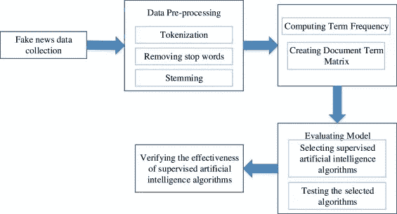
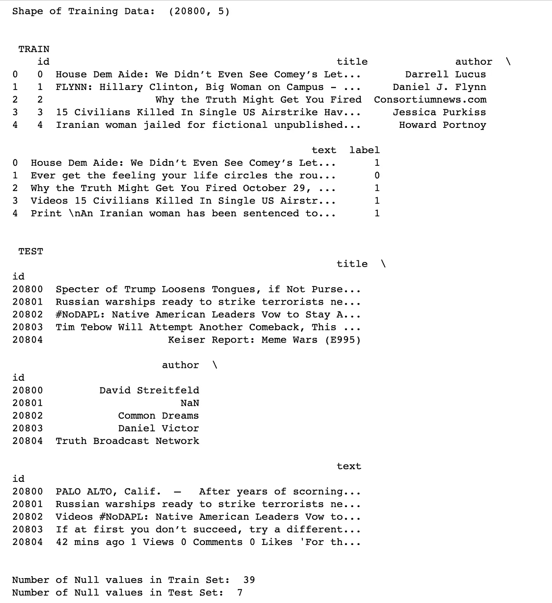
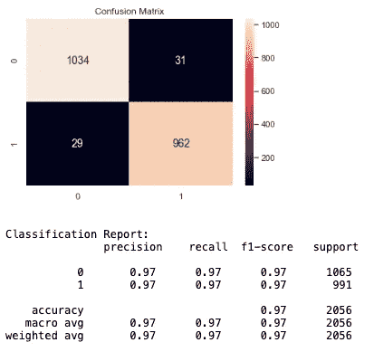

# 基于 tfidf 向量机和被动主动分类器的假新闻检测

> 原文：<https://medium.com/analytics-vidhya/fake-news-detector-cbc47b085d4?source=collection_archive---------4----------------------->


图片来自[www.vpnsrus.com](https://www.vpnsrus.com/)

我认为可以肯定的是，我们所有人都遇到过在我们的社交媒体论坛上流传的新闻文章，这些文章看起来好得令人难以置信。通常情况下，我们会看到同一个话题的相互矛盾的事实，并想知道哪一个是正确的。我们让自己陷入困境，无法确定该相信哪个来源。嗯，不再是了。使用 Python 和机器学习可以使这项任务变得更容易。我们可以使用分类器算法来训练一个模型，该模型可以预测一篇“新闻”文章是事实还是虚假的。

此外，查看我的其他帖子，了解更多机器学习算法的应用。一定要检查，然后通过评论分享你的见解，并与你的朋友分享，看看他们对此有何看法。您也可以按照我的文章创建这样的模型，并根据您的兴趣进行调整。

# 什么是假新闻？

作为黄色新闻的一种，假新闻包含可能是恶作剧的新闻片段，通常通过社交媒体和其他在线媒体传播。这样做通常是为了推进或强加某些想法，并经常通过政治议程来实现。此类新闻可能包含虚假和/或夸大的声明，并可能最终被算法病毒式传播，用户可能最终陷入过滤器泡沫。

# 关于项目

这是我在学习数据科学和机器学习概念的同时从事的一个项目。这里的目标是识别一篇“新闻”文章是假的还是真实的。我们将采用一个带有标签的公共信息数据集，并使用频率矢量器应用分类技术。我们可以稍后在未分类的公共消息上测试该模型的准确性和性能。类似的技术可以应用于其他 NLP 应用，如情感分析等。

# 数据

我正在使用来自 kaggle.com[的数据集，它包含以下特征:](https://www.kaggle.com/c/fake-news/data)

*   id:新闻文章的唯一 id
*   标题:新闻文章的标题
*   作者:新闻文章的作者
*   正文:文章的正文；可能不完整
*   标签:将文章标记为潜在不可靠的标签
    1:不可靠
    0:可靠

# 模型

我们使用 TfIdf 矢量器将文本字符串转换为数字表示，并初始化一个被动渐进分类器来适应模型。最后，准确度分数和混淆矩阵告诉我们模型的效果如何。



## 词频(Tf) —逆文档频率(Idf)矢量器

Tf-Idf 矢量器是将文本转换成有意义的数字表示的常用算法。它用于根据出现次数从文本字符串中提取特征。

我们假设一个单词重复的次数越多，在给定的文本中就意味着越重要。我们用文档的大小来标准化单词的出现，因此称之为词频。数值定义:`tf(w) = doc.count(w) / total words in the doc`

在计算术语频率时，每个术语被赋予相等的权重。可能有在文档中出现频率很高的单词，因此对推导文档含义的贡献较小。例如“a”、“the”等这样的词。可能会压制更有意义的单词的权重。为了减少这种影响，Tf 用一个称为逆文档频率的因子来贴现。`idf(w) = log(total_number_of_documents / number_of-documents_containing_word_w)`

然后通过 Tf 和 Idf 的乘积计算 Tf-Idf。更重要的单词将获得更高的 tf-idf 分数。`tf-idf(w) = tf(w) * idf(w)`

## [被动攻击性量词](http://jmlr.csail.mit.edu/papers/volume7/crammer06a/crammer06a.pdf)

被动攻击算法是一类用于大规模学习的算法。直观上，被动表示如果分类正确，我们应该保留模型，而主动表示如果分类不正确，更新模型以适应更多错误分类的示例。不像大多数其他的，它不收敛，而是更新以纠正损失。

# 开发 ML 模型

**第一步:**导入必要的包:

```
**import** **numpy** **as** **np**
**import** **pandas** **as** **pd**
**import** **itertools**
**import** **seaborn** **as** **sn**
**import** **pandas** **as** **pd**
**import** **matplotlib.pyplot** **as** **plt**
**from** **sklearn.model_selection** **import** train_test_split
**from** **sklearn.feature_extraction.text** **import** TfidfVectorizer
**from** **sklearn.linear_model** **import** PassiveAggressiveClassifier
**from** **sklearn.metrics** **import** accuracy_score, confusion_matrix, classification_report
```

**步骤 2:** 将数据集加载到 pandas 数据框中:

```
train = pd.read_csv('train.csv')
test = pd.read_csv('test.csv')
test = test.set_index('id', drop = **True**)
```

**第三步:**阅读理解资料。创建任何 ML 模型最重要的步骤之一是首先准备数据。这包括清理和过滤数据，去除异常值，创建独立和合理的特征(我将在处理另一个模型时详细讨论)。

我们使用。shape 方法来标识数据集中的列数和新闻样本总数。然后使用读取数据表。方法来查看数据的外观。接下来，确定写新闻文章的栏名和标有分类的栏名。

然后我们使用。isna 确定我们的新闻文章所在的列中是否有空值，在这种情况下，它位于名为“text”的列中。现在我们使用。sum()来标识存在多少这样的值。一旦识别出来，我们就删除列“text”有空值的行，并用空值填充其他列中的空白。

```
*# Counting number of rows and columns in the data*
print('Shape of Training Data: ', train.shape)

*# Gettiing a hang of the data in each column and their names*
print('**\n** **\n** TRAIN **\n**', train.head())
print('**\n** **\n** TEST **\n**', test.head())

*# Looking for any places where training data has NaN values*
print('**\n** **\n**Number of Null values in Train Set: ', train['text'].isna().sum())
print('Number of Null values in Test Set: ', test['text'].isna().sum())

*# Dropping all rows where text column is NaN*
train.dropna(axis=0, how="any", thresh=**None**, subset=['text'], inplace=**True**)
test = test.fillna(' ')
```

输出如下所示:



**步骤 4:** 现在让我们看看数据中是否有异常值。我们将通过检查每篇文章中的字数并确定所有文章中字数的范围和平均值来做到这一点。我们将使用 len()函数来检查长度。

```
# Checking length of each article
length = []
[length.append(len(str(text))) for text in train['text']]
train['length'] = lengthprint('Minimum Length: ', min(train['length']), '\nMaximum Length: ', max(train['length']), '\nAverage Length: ', round(sum(train['length'])/len(train['length'])))
```

输出:

```
Minimum Length:  1 
Maximum Length:  142961 
Average Length:  4553
```

我们注意到有些文章也只有一个单词。现在让我们设定一篇新闻文章需要的最少字数，我推断为 50 个。

我们现在来看看有多少文章少于 50 个单词，这些文章是什么样子的。

```
# Minimum length is 1\. We need to spot some outliers and get rid of them. Counting how many outliers are there
print('Number of articles with less than 50 words: ', len(train[train['length'] < 50]))# Skimming through such short texts just to be sure
print(train['text'][train['length'] < 50])
```

输出:

```
Number of articles with less than 50 words:  207
82                                                   
169                                                  
173                                   Guest   Guest  
196            They got the heater turned up on high.
295                                                  
                             ...                     
20350                         I hope nobody got hurt!
20418                                 Guest   Guest  
20431    \nOctober 28, 2016 The Mothers by stclair by
20513                                                
20636                              Trump all the way!
Name: text, Length: 207, dtype: object
```

我们注意到一些文章只是空白，而其他许多文章是随意的陈述，总共有惊人的 207 篇这样的文章。想象一下，这会给我们的模型对数据的理解增加多少噪音。现在让我们从数据集中删除这些文章，并重新打印文章长度统计数据。

```
# Removing outliers, it will reduce overfitting
train = train.drop(train['text'][train['length'] < 50].index, axis = 0)print('Minimum Length: ', min(train['length']), '\nMaximum Length: ', max(train['length']), '\nAverage Length: ', round(sum(train['length'])/len(train['length'])))
```

输出:

```
Minimum Length:  50 
Maximum Length:  142961 
Average Length:  4598
```

**步骤 5:** 在我们开始应用模型之前，最后一步是将分类列与其余的输入特征分离，然后将数据集划分为训练和测试子集。我们这样做是为了确保我们的模型在新的数据集上表现良好。我们将 90%的数据作为训练集，10%作为测试集。这个分割百分比可以定制，以便更好地调整模型。

```
# Secluding labels in a new pandas dataframe for supervised learning
train_labels = train['label']# Splitting data into training and testing sets
x_train, x_test, y_train, y_test = train_test_split(train['text'], train_labels, test_size=0.1, random_state=0)
```

**步骤 6:** 让我们用来自英语的停用词和 0.7 的最大文档频率初始化一个 [TfIdfVectorizer](https://scikit-learn.org/stable/modules/generated/sklearn.feature_extraction.text.TfidfVectorizer.html) (具有更高文档频率的术语将被丢弃)。停用词是在处理自然语言数据之前要过滤掉的语言中最常见的词。tfidf 矢量器将原始文档的集合转化为 Tf-Idf 特征的矩阵。

现在，在训练集上拟合和转换矢量器，在测试集上转换矢量器。

```
# Setting up Term Frequency - Inverse Document Frequency Vectorizer
tfidf = TfidfVectorizer(stop_words = 'english', max_df = 0.7)# Fit and transform training set and transform test set
tfidf_train = tfidf.fit_transform(x_train) 
tfidf_test = tfidf.transform(x_test)
tfidf_test_final = tfidf.transform(test['text'])
```

接下来，我们将初始化一个[PassiveAggressiveClassifier](https://scikit-learn.org/stable/modules/generated/sklearn.linear_model.PassiveAggressiveClassifier.html)。我们将在 tfidf_train 和 y_train 上安装这个。

然后，我们将对来自 TfidfVectorizer 的测试集进行预测，并使用来自 sklearn.metrics 的 [accuracy_score()计算准确度。](https://scikit-learn.org/stable/modules/generated/sklearn.metrics.accuracy_score.html?highlight=accuracy_score#sklearn.metrics.accuracy_score)

```
# Setting up Passive Aggressive Classifier
pac = PassiveAggressiveClassifier(max_iter = 50)# Fitting on the training set
pac.fit(tfidf_train, y_train)# Predicting on the test set
y_pred = pac.predict(tfidf_test)
score = accuracy_score(y_test, y_pred)
print(f'Accuracy: {round(score * 100, 2)}%')
```

输出:

```
Accuracy: 97.08%
```

我们用这个模型得到了 97%的准确率。我们现在可以使用 sklearn 库打印出[分类 _ 报告()](https://scikit-learn.org/stable/modules/generated/sklearn.metrics.classification_report.html?highlight=classification_report#sklearn.metrics.classification_report)和[混淆 _ 矩阵()](https://scikit-learn.org/stable/modules/generated/sklearn.metrics.confusion_matrix.html?highlight=confusion_matrix#sklearn.metrics.confusion_matrix)。

```
# Creating confusion matrix with columns as True Positive, False Negative, False Positive and True Negative 
cm = confusion_matrix(y_test, y_pred, labels=[0, 1])
df_cm = pd.DataFrame(cm, range(2), range(2))
sn.set(font_scale=1)
sn.heatmap(df_cm, annot=True, annot_kws={'size':14}, fmt='d').set_title('Confusion Matrix')
plt.show()# Creating classification report
print('\nClassification Report: \n', classification_report(y_test, (y_pred > 0.5)))
```

输出:



假新闻检测结果

# 结果:

我们成功实现了一个机器学习和自然语言处理模型来检测一篇文章是假的还是事实。我们有 1034 篇文章被正确识别为假的，962 篇被正确识别为真的。当进行这样的分类时，检查我们是否限制了假阳性的数量是很重要的，因为它们会导致事实被标记为假。

## 未来工作:

我打算通过添加一个图形用户界面(GUI)来扩展这个项目，用户可以粘贴任何文本片段，并在结果中获得其分类。如果你有一些建议给我，请写信给我！

## 参考

你可以在 [Github](https://github.com/rpalri/Fake_News_ML) 上找到我的代码。

如果你喜欢我的作品，请通过分享和关注我的故事来表达你的欣赏。当我不断学习新的东西时，这会让我有动力与你们分享！

如果你不喜欢我的作品，请分享你的想法和建议。这将有助于我下次为您改进和开发更好的阅读材料！

谢谢你。