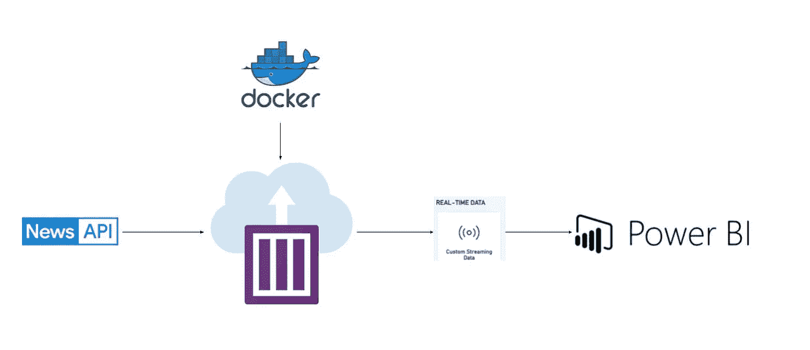
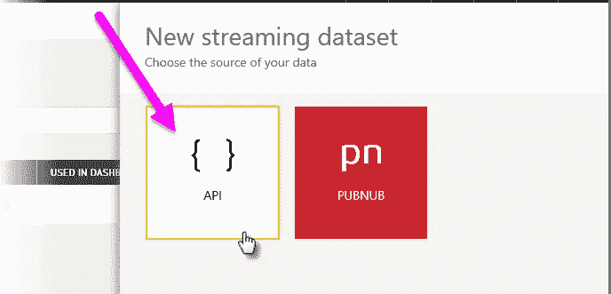
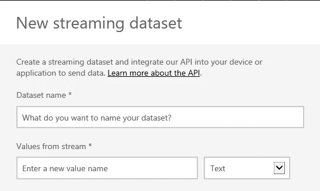
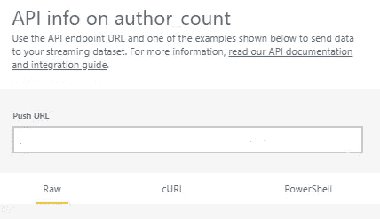
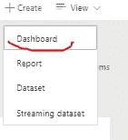
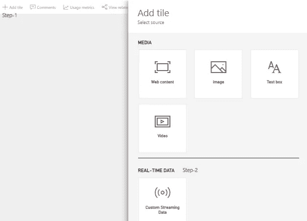
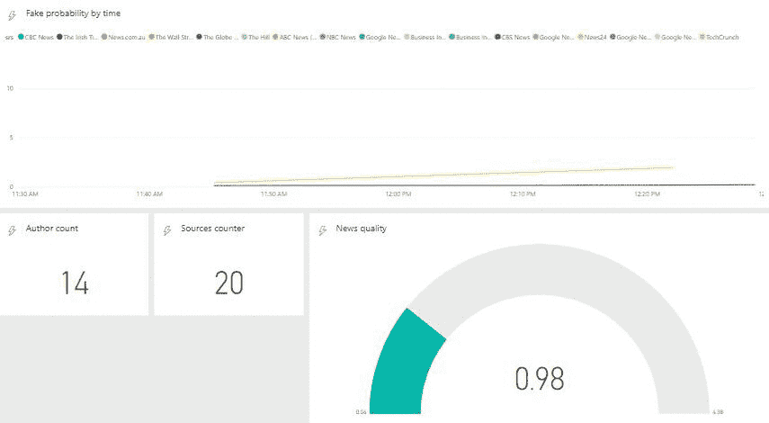

# 使用深度学习方法部署假新闻检测器(第三部分)

> 原文：<https://medium.com/analytics-vidhya/fake-news-detector-with-deep-learning-approach-part-iii-deploy-292be3be7950?source=collection_archive---------12----------------------->

## 使用 docker 容器和 Power BI 部署神经网络

在这一系列文章中，我将展示我们如何使用深度学习算法来检测假新闻，并比较一些神经网络架构。

这是本系列的第三部分，我想创建实时服务来检测假新闻并将其部署到云上。正如你所记得的，在第一部分和第二部分，我试图用两种技术分析方法和深度神经网络来区分假新闻和非假新闻。现在是时候部署解决方案了。

照片由[伯纳德·赫曼特](https://unsplash.com/@bernardhermant?utm_source=medium&utm_medium=referral)在 [Unsplash](https://unsplash.com?utm_source=medium&utm_medium=referral) 上拍摄

首先，让我们定义将成为架构一部分的组件。

服务架构

这个架构很简单。我想创建一个 Python 脚本，它将从新闻 API 每 N 分钟(在我的例子中是 15 分钟)获取一个日期(来自不同来源的头条新闻)。第二步是预处理，我将使用与建模时相同的步骤。第三步是模型评分，我想使用预先训练好的模型。脚本的最后一部分是将数据推送到 Power BI 流数据集，然后在 Power BI 仪表板中可视化结果。为了部署 python 脚本，我想创建一个 docker 映像，并将其保存到我的私有 Docker Hub 存储库中。为了部署这个 docker 映像，我将使用 Azure 容器实例。

好了，让我们来描述一下我们的第一个组件——新闻 API。News API 是新闻收报机和其他应用程序的一个很好的数据源，在这些应用程序中，您希望向用户显示实时标题。它几乎实时地跟踪 50 多个国家 7 个类别的头条新闻，以及 100 多个顶级出版物和博客。要了解更多信息，这里有一个[链接](https://newsapi.org/)。

我将使用 Python 库(newsapi-python)获取 las 15 minutes 关于“COVID”的头条新闻。我只需要英语新闻，所以我在请求中指定了它。注意，这个 API 的 free key 给出了一条新闻，而不是全文。

在创建 docker 映像并部署它之前，我需要创建 Power BI 流数据集。在 Power BI 服务中，您可以通过选择 API 方法来创建数据集，如图 1 所示。

[图片 1](https://docs.microsoft.com/en-us/power-bi/connect-data/service-real-time-streaming)

下一步是给它起一个名字，并用适当的数据格式创建变量。

[图像 2](https://docs.microsoft.com/en-us/power-bi/connect-data/service-real-time-streaming)

最后一步是让超链接将结果推送到适当的数据集中。

获取推送 URL 的快照

下一步是创建 docker 映像。为了创建它，我需要我的 Python 脚本、预训练模型和 docker 文件，以及创建图像的说明。这一部分，我没有具体描述。在我的例子中，我需要一个简单的图像，使用 Python 3.6 和 Tensorflow 2.0.0 的 CPU。你可以在 [Git 仓库](https://github.com/AndriiShchur/Fake_news)中找到所有的例子。

为了创建一个实时服务，我可以在本地机器上运行我的映像，或者将它部署到云中。在我的测试中，我使用了我的本地机器，但是对于生产，我想使用 Azure。对于生产，我选择 Azure 容器实例。容器正在成为打包、部署和管理云应用程序的首选方式。Azure Container Instances 提供了在 Azure 中运行容器的最快和最简单的方式，无需管理任何虚拟机，也无需采用更高级别的服务。为了在云中部署我的映像，我使用 DockerHub 作为源，并选择 3CPU 和 6RAM 作为配置。你可以在[文档](https://docs.microsoft.com/en-us/azure/container-instances/container-instances-tutorial-prepare-app)中找到部署过程的例子。

最后一个阶段是在 Power BI 中创建一个实时仪表板。为此，我需要选择创建一个仪表板。

创建仪表板的快照

在新的仪表板中，我需要创建几个图表，并将它们连接到流数据集。

创建切片的快照

在我的例子中，我创建了两张图表和两张卡片。第一个图表是一个简单的线形图，按来源分组，按特定时间戳显示所有新闻的平均虚假概率。此图表显示 las 60 分钟的数据。第二张图是量表图，我显示了过去 15 分钟内假消息的最小、最大和平均概率。我的仪表板上的卡片显示了过去 15 分钟内分析的作者数和来源数。

你可以在这里看到结果:

电源 BI 报告快照

# 结论

正如你所看到的，我们可以轻松地创建和部署实时服务，它可以通过时间戳向我们显示新闻的假概率。在这种情况下，我将 Power BI 报告作为一个“假显示器”使用，它是一个实时流数据集。要创建更复杂和详细的仪表板，我们可以使用 Dash。在这种情况下，我们可以显示更复杂的文本分析和伪造或不伪造的新闻细节。

第一部分你可以阅读——“[深度学习方法的假新闻检测器(Part-I) EDA](/@andriishchur/fake-news-detector-with-deep-learning-approach-part-i-eda-757f5c052)

第二部分你可以阅读——“[深度学习方法假新闻检测器(第二部分)建模](/@andriishchur/fake-news-detector-with-deep-learning-approach-part-ii-modeling-42b9f901b12b)”

你能在 Git 仓库中找到的所有代码— [链接](https://github.com/AndriiShchur/Fake_news)。