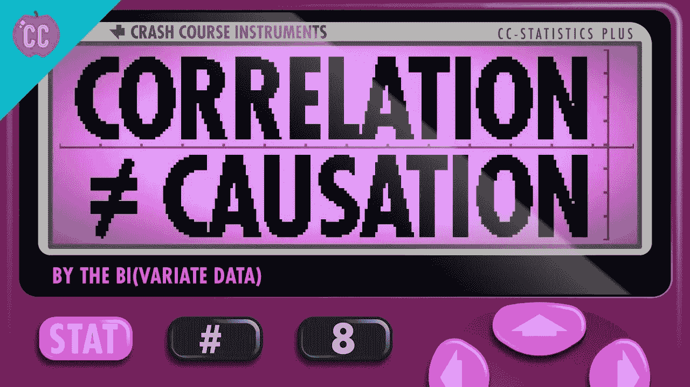
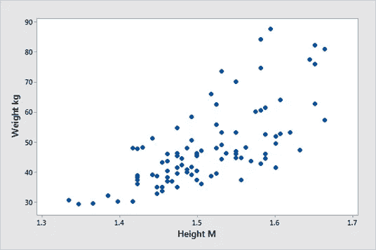
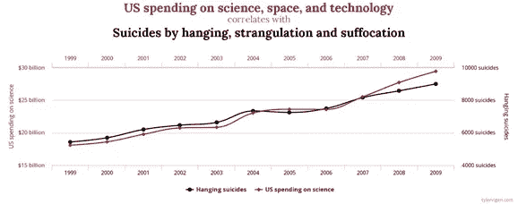
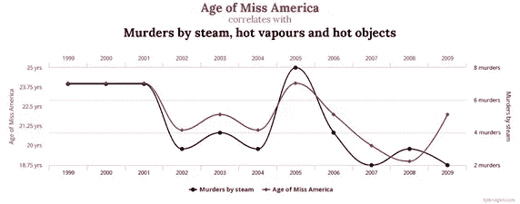
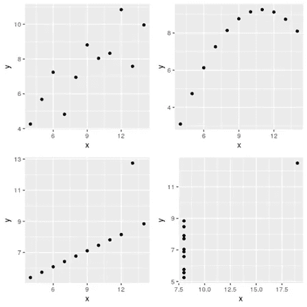

# 谬误的关联

> 原文：<https://medium.com/analytics-vidhya/fallacious-correlations-4299a0cbe078?source=collection_archive---------27----------------------->

在统计学和数据科学中，通常通过计算相关系数来衡量两个变量之间的关系强度。

这里我们应该记住的基本咒语是 ***相关性不是因果关系*** 。这意味着即使两个变量根据相关值看起来密切相关，也不能说明一个变量导致了另一个变量。

来源:谷歌

在本文中，我们将探讨为什么相关性并不意味着因果关系。

首先，让我们试着理解相关性和因果关系。

**相关性**:它只是告诉我们两个变量之间的线性关系有多强，而没有背后的原因。

例如，让我们看看下面的相关图。它表明，随着身高的增加，体重也增加。

**因果关系**:表示一个变量的变化会引起另一个变量的变化，表示两个变量之间的关系。

例如，当一个人连续使用他的移动电话时，每使用一秒钟，电池电量就会下降。前者导致后者的发生。

现在，让我们借助下面的例图来理解为什么相关性并不意味着因果关系。下图显示了两个时间序列，它们具有相似的形状，具有非常高的相关性，但却是不相关的(甚至可笑的不相关)。

美国在科技上的投入与自杀人数有关系吗？美国小姐的年龄和谋杀有关系吗？

**不！！**

来源:[http://www.tylervigen.com/](http://www.tylervigen.com/)

两件事相关并不意味着一件事会导致另一件事。相关性并不意味着因果关系，或者在我们的例子中，美国的支出并没有导致人们的死亡，美国小姐的年龄也没有导致谋杀。

来源:[http://www.tylervigen.com/](http://www.tylervigen.com/)

这些关联中的大多数只是因为巧合和虚假的关联。看起来一个因素在影响另一个因素，但实际上没有。

相关系数仅衡量线性关系的强度，有时会产生误导。

例如，下面所有的图都具有相同的相关系数 0.82，但是它们具有非常不同的关系。看到这一点，我们应该意识到看图而不仅仅是用相关值做决定是多么重要。

资料来源:罗伯·J·海曼和乔治·阿萨纳索普洛斯的《预测:原理与实践》

**包装**

记住，关联只是第一步。在对两个变量之间的关系做出决定之前，你应该试着看看数据的图表，理解它们并找到潜在的因素。不要只看相关值就太快下结论。

感谢阅读！！