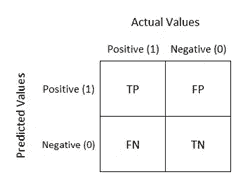

# 使用 AUC 作为模型选择标准的谬误

> 原文：<https://medium.com/analytics-vidhya/fallacy-of-using-auc-as-a-model-selection-criteria-d6bf50f4de0d?source=collection_archive---------4----------------------->

在模型选择的背景下，大多数数据科学家依靠各种各样的拟合优度标准来决定哪个模型对应于维持/验证数据集的最佳性能。这些拟合优度标准通常也称为'**度量'**。

混淆矩阵:表格 ML 模型的大多数度量标准都是从混淆矩阵中得到的

> 注意，“**度量”**可以是与“**损失函数**完全不同的**，在大多数情况下，损失函数对应于将成本惩罚映射到任何给定预测的函数，使得如果预测更接近目标，则成本更低，反之亦然。**

**三维欧氏空间中的损失函数**

> **损失函数被约束:**

损失函数的一个约束条件是，在大多数情况下，要求它们至少是一阶可微的，在一些高级算法中，甚至是二阶可微的( [LightGBM](https://lightgbm.readthedocs.io/en/latest/) ， [XGBoost](https://xgboost.readthedocs.io/en/latest/) 等)

## **损失函数和度量的例子:**

**损失函数**:对数损失、似然损失、均方误差等。

**指标**:准确度、精确度、召回率、f-Beta 评分、RMSE、MSE、MAPE、MAD 等。

你会注意到一个 ***损失函数绝对可以作为一个度量*** ，但是 ***反过来不一定是真的*** 。例如，可以使用 [logloss](http://wiki.fast.ai/index.php/Log_Loss) 作为损失函数和度量。然而，诸如[准确度、精确度、召回率](https://blog.exsilio.com/all/accuracy-precision-recall-f1-score-interpretation-of-performance-measures/)等指标不能用作损失函数。

如果我们使用上述度量，则违反了至少要定义有效梯度或甚至 Hessian 矩阵(对于提升树模型)的约束。

***解析梯度公式:****f(x0+⇼x)= f(x0)+A(x0)⇼x+o(⇼x)*

**注**:尽量说服自己，梯度可以看成是一个指向函数曲面上最陡上升方向的向量。

**黑森**定义为二阶微分，数学上可以写成:

**黑森公式**

**AUC-ROC 指标**

让我们关注分类问题中非常常见的一个特定指标——AUC 或 ROC(受试者操作特征)曲线下面积。

考虑二进制分类的情况，其中我们训练模型 X 并检索维持集上的预测概率。我们还假设阳性类的特定截止阈值为 0.4(概率> 0.4 = +ve 类)。

> 参考下表的 Y 实际(目标)、预测概率(+ve 类)和基于阈值的预测类标签。

实际问题与预测问题

我们不会深入讨论如何计算 AUC 的细节，但在高层次上，AUC 对应于:

1.首先基于多个截止阈值计算 **TPR(真阳性率)**和 **FPR(假阳性率)**

2.将这些绘制在图上，并计算曲线下的面积。

AUC-ROC 曲线([来源](https://towardsdatascience.com/understanding-auc-roc-curve-68b2303cc9c5))

如需了解详细信息，请点击[查看](https://towardsdatascience.com/understanding-auc-roc-curve-68b2303cc9c5)。

> 现在，我们将从**创建一个随机数据集**开始。具体来说，我们生成三样东西:

1.  y 实际矢量:10 X 1
2.  Y Pred 矢量:10 X 1
3.  基于阈值的预测类别:10 X 1

> 接下来，我们将基于实际的目标标签和预测的概率值来计算 AUC

乍一看， **AUC 似乎直接取决于概率**。在上面的代码中，我们可以看到，我们仅使用实际目标和预测概率来计算 AUC。虽然使用了概率，但人们可能会惊讶地发现**根本没有使用量值**。我用代码解释一下。

> 我们不使用原始概率，而是对概率进行等级平均，然后将等级平均结果输入 AUC 公式。让我们看看当我们这样做时会发生什么:

> 瞧啊。当我们使用概率向量的等级平均值时，AUC 值**不变**。

这对我们的分析意味着什么？

简而言之，这意味着在 AUC 的计算中没有使用原始概率值，因此，我们不能说我们的模型在进行预测方面有多大的信心。

为了进一步分析，我们将准备另一组预测概率(**模型 B** )，它是模型 A 概率的等级平均值，缩小了 100 倍。

注意，在新生成的概率中，**的排序仍然保持不变。与原始模型(模型 A)的输出 相比，概率的 ***幅度很可能会减小。*****

**让我们检查两个不同模型的预测概率输出的概率分布曲线，如下所示:**

****

**来自两个不同模型(具有相同 AUC)的预测先证者的 KDE 图**

> ****模型 A 的 AUC:0.875
> 模型 B 的 AUC:0.875****
> 
> **因此，两个分类器的 AUC 分数相同，但预测的概率分布非常不同。这是什么意思？**

**这意味着我们的模型在预测的可信度方面表现得非常不同。我们知道，我们既不想要一个过于自信的模型，也不想要一个不够自信的模型。**

**我们将不得不看一系列的数字来理解两个模型中哪一个过于自信/不够自信/刚刚好。**

**这个帖子下周会有后续，届时我会贴出进一步的分析，介绍概率校准分析的概念。**

**感谢阅读。**

***参考文献*:**

***1。*[*https://blog . algorithm ia . com/introduction-to-loss-functions/*](https://blog.algorithmia.com/introduction-to-loss-functions/)**

***2。*[*https://courses . cs . ut . ee/mtat . 03.227/2016 _ spring/uploads/Main/lecture-4-extra-materials . pdf*](https://courses.cs.ut.ee/MTAT.03.227/2016_spring/uploads/Main/lecture-4-extra-materials.pdf)**