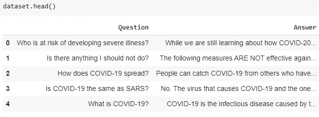
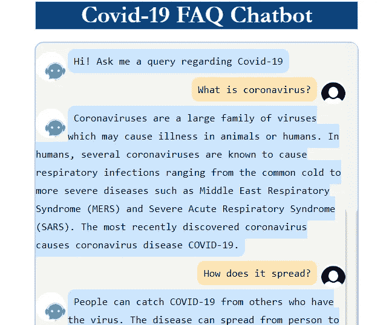
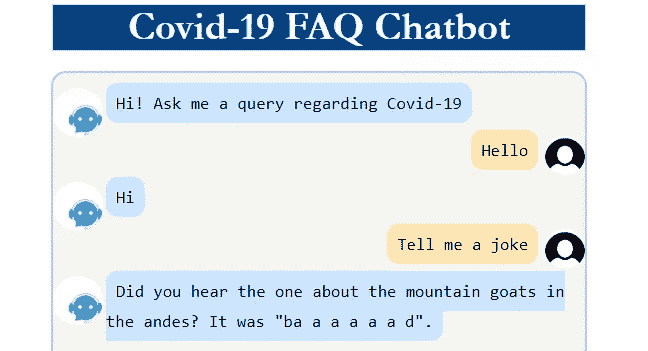

# 带用户界面的常见问题聊天机器人

> 原文：<https://medium.com/analytics-vidhya/faq-chatbot-with-ui-74ee032e4a1d?source=collection_archive---------5----------------------->

用 python 创建新冠肺炎常见问题聊天机器人以及用户界面

聊天机器人有不同种类的用例。面向任务(预订航班、寻找出租车等)、一般聊天、常见问题解答等。
我们将看到如何实现聊天机器人来回答常见问题(FAQ)。

**数据集**
目前我们正处于新冠肺炎危机之中。我想到创造一个聊天机器人来回答人们头脑中的常见问题。我从网站上获取了常见问题解答(在参考资料部分提到)并创建了数据集。



**实现**
我们将用户问题与数据集中的问题进行匹配，找出最相似/相关的问题。然后我们会返回相应的答案给用户。
对于匹配问题，我们将使用余弦相似度。
余弦相似度求两个向量之间的相似度/距离。距离越短，向量越相似。

因此，首先我们必须创建用户问题和数据集问题的向量。

有多种[方法](https://www.analyticsvidhya.com/blog/2017/06/word-embeddings-count-word2veec/)将文本转换成数字/矢量。

我们将使用由[通用句子编码器](https://tfhub.dev/google/universal-sentence-encoder/1)提供的单词嵌入。

我们将添加另一个列 Question_vector 来存储嵌入的问题。

```
import tensorflow as tf
import tensorflow_hub as hubmodule_url = "[https://tfhub.dev/google/universal-sentence-encoder/4](https://tfhub.dev/google/universal-sentence-encoder/4)"
model = hub.load(module_url)
def embed(input):
  return model([input])
dataset['Question_Vector'] = dataset.Question.map(embed)
dataset['Question_Vector'] = dataset.Question_Vector.map(np.array)
pickle.dump(updated_dataset, open('dataset.pkl', 'wb'))
```

用户将提出一个问题，我们将找到最相似的问题与相似性阈值和返回答案。该阈值是可配置的。

```
def generate_answer(self, question):
        '''This will return list of all questions according to their   similarity,but we'll pick topmost/most relevant question'''
        most_relevant_row = self.semantic_search(question, self.questions, self.QUESTION_VECTORS)[0]
        #print(most_relevant_row)
        if most_relevant_row[0][0]>=self.COSINE_THRESHOLD:
            answer = self.dataset.Answer[most_relevant_row[2]]
        else:
            answer = self.chitchat_bot.get_response(question)
        return answer
```

我已经为聊天机器人用户界面创建了 flask web 应用程序。



我们假设，如果我们在数据集中没有找到相关的问题，用户只是在进行正常的聊天。我们不需要构建新的东西来回应聊天。我们将把用户问题重定向到 chatterbot API。
(如果你对聊天机器人培训感兴趣，[请便](https://chatterbot.readthedocs.io/en/stable/))



要在 Ubuntu 服务器上部署这个 flask 应用程序，请遵循我的文章[中的步骤。](/analytics-vidhya/part-1-deploy-flask-app-anaconda-gunicorn-nginx-on-ubuntu-4524014451b)

但是对于这个应用部署，我已经在 Google 云平台上使用了 AppEngine。在 AppEngine 上部署应用程序的[步骤](https://cloud.google.com/appengine/docs/standard/python3/building-app)非常简单。

**总结** :
我们已经使用通用句子编码器进行单词嵌入。Chatterbot 是处理正常聊天的有效库。

这个 FAQ 聊天机器人可以用于任何类型的 FAQ 操作，只需改变数据集。

完整的代码可从 [git-hub](https://github.com/sarang0909/FAQ-Chatbot) 获得

如果你喜欢这篇文章或有任何建议/意见，请在下面分享！

我们在 [LinkedIn](https://www.linkedin.com/in/sarang-mete-6797065a/) 上联系讨论吧

**数据集创建参考:**

【https://www.who.int/news-room/q-a-detail/q-a-coronaviruses
[https://www . CDC . gov/coronavirus/2019-ncov/FAQ . html # How-to-Protect-yoursely](https://www.cdc.gov/coronavirus/2019-ncov/faq.html#How-to-Protect-Yourself)
[https://timesofindia . India times . com/life-style/health-fitness/health-news/most-q-questions-about-coronavirus-and-lockdown/article show/74791761 . CMS](https://timesofindia.indiatimes.com/life-style/health-fitness/health-news/most-commonly-asked-questions-about-coronavirus-and-lockdown/articleshow/74791761.cms)
[https://www.unicef.org/india/coronavirus/covid-19](https://www.unicef.org/india/coronavirus/covid-19)