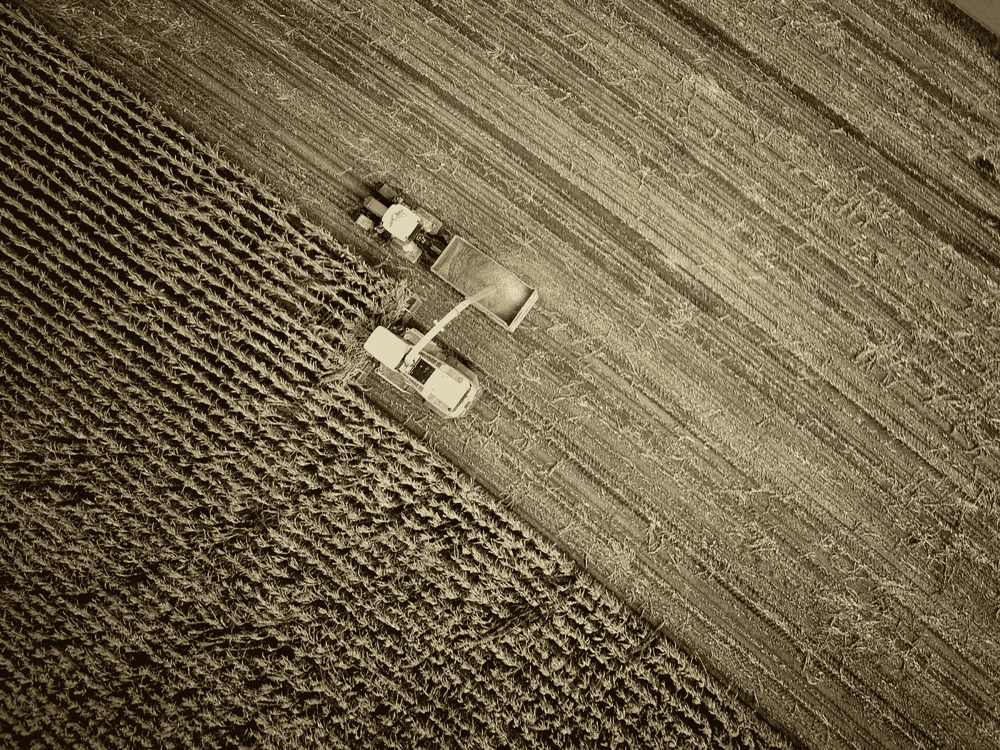

# 农业:人工智能转型

> 原文：<https://medium.com/analytics-vidhya/farming-the-ai-transformation-f674133e0a6d?source=collection_archive---------18----------------------->

## AI 是如何改造农业的？

机械——在农田里|照片由[无人问津](https://unsplash.com/@no_one_cares?utm_source=medium&utm_medium=referral)在 [Unsplash](https://unsplash.com?utm_source=medium&utm_medium=referral)

农业和耕作是世界上一些最古老和最重要的职业，它更多的是出于需要，而不是金钱。自工业革命以来，人类在耕作和种植作物方面已经走过了漫长的一千年。随着世界人口的持续增长和土地变得越来越稀缺，创造力和…