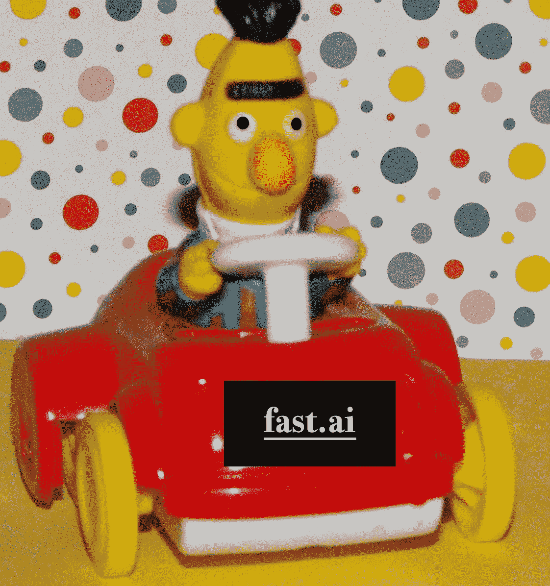
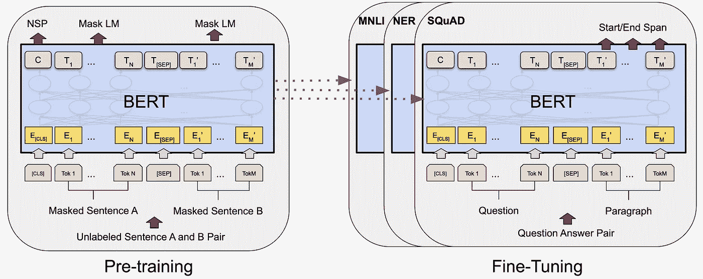
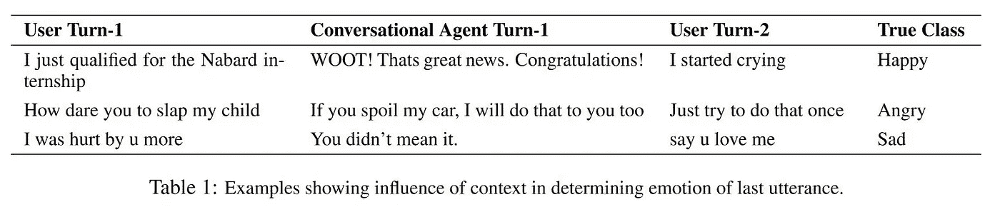
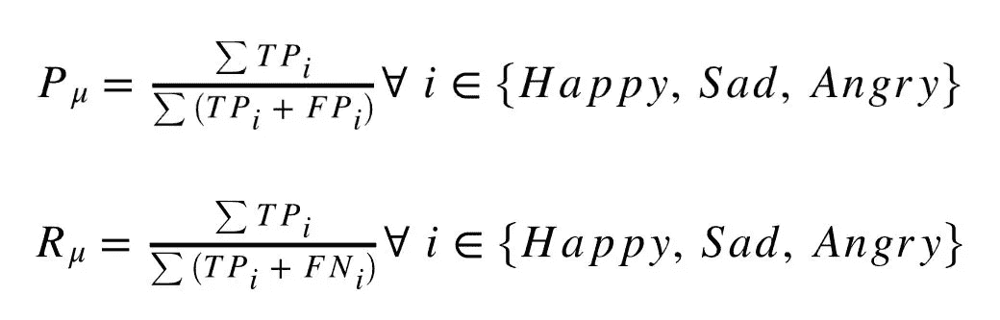
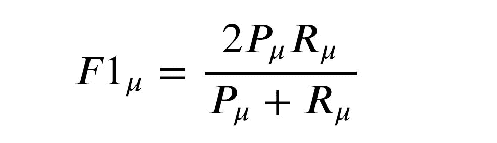

# Fast(Ai)Bert:解决对话中的情感识别

> 原文：<https://medium.com/analytics-vidhya/fast-ai-bert-solving-emotion-recognition-in-conversations-63e6b644f94b?source=collection_archive---------11----------------------->

## 根据情感识别的特殊需求定制 fast.ai 框架的教程(分离序列 Bert)



去年自然语言处理(NLP)中最有前途的模型之一似乎是谷歌团队的模型 [Bert](https://arxiv.org/pdf/1810.04805v2.pdf) 。

接下来，在杰瑞米·霍华德和他的团队的努力下，课程和框架 [fast.ai](https://www.fast.ai/) 帮助了成千上万的人进入机器学习领域，并让他们接触到许多最先进的算法。

然而，如果你想在 fasti.ai 的框架下使用 Bert 或任何基于变形金刚的模型，很长一段时间你都没有机会这样做。在人们定制 API 的倡议下，这成为可能:

*   Keita Kurita 的文章 [*使用 fast.ai*](https://mlexplained.com/2019/05/13/a-tutorial-to-fine-tuning-bert-with-fast-ai/) 微调 BERT 的教程，这使得 pytorch_pretrained_bert 库与 fastai 兼容
*   Dev Sharma 的文章 [*将 RoBERTa 与 fast.ai 一起用于 NLP*](/analytics-vidhya/using-roberta-with-fastai-for-nlp-7ed3fed21f6c) 这使得 pytorch_transformers 库与 fast.ai 兼容
*   maximilien Roberti[article](https://towardsdatascience.com/fastai-with-transformers-bert-roberta-xlnet-xlm-distilbert-4f41ee18ecb2)自定义 fast.ai 以使用 huggingface 变形金刚模型

# 更多定制工作

> **TL；DR:** 我们通过 fast.ai 使得在 Bert 中使用分离的序列成为可能，我们的笔记本包含了定制工作和一个在对话中进行情绪识别的 SemEval 任务的应用，排名在最高分: [**Github**](https://github.com/PhilippMaxx/semeval2019_task3) **。**

这些解决方案集中在**单序列入单/多类出**方法上。所有这些解决方案都不能处理单独序列的问题。如果我们在预训练中使用 Bert，在输入中使用两个独立的序列是必要的。如果你考虑问题-答案，那么在下游任务中进行分离是有意义的，Bert 可以针对这些任务进行微调。



我们发现，特别是如果你有数据，将对话中来自不同人的序列作为独立的输入来处理是一个非常好的主意。

由于我们有一个下游的任务与对话的必要性，我们非常积极地扩展上述工作。

我的笔记本建立在 Maximilien Roberti 的工作基础上，我用这里提供的新定制进行了扩展:[https://github . com/Philip maxx/seme val 2019 _ task 3/blob/master/00 _ fastbert . ipynb](https://github.com/PhilippMaxx/semeval2019_task3/blob/master/00_fastbert.ipynb)。

# SemEval-2019 任务 3:文本中的上下文情感检测

我们在这里展示我们的定制工作，因为我们为 SemEval-2019 任务 3 提出了我们的基线模型。应用笔记本可以在这里找到:[https://github . com/PhilippMaxx/seme val 2019 _ task 3/blob/master/01 _ task 3 . ipynb](https://github.com/PhilippMaxx/semeval2019_task3/blob/master/01_task3.ipynb)。

任务定义可以在这里找到:【https://www.aclweb.org/anthology/S19-2005.pdf】的。



来自 SemEval-2019 任务 3 的对话示例

凭借 fast.ai 的广泛功能和 Bert 的强大功能，我们已经跻身于**前 3%** (在最初的 311 个竞争对手中排名第 8)。与其他模型相比，在这项挑战中投入研究的努力(Bert 已经可用)，我们在模型命题上花费了很少的时间，表现优于大多数模型。

公平地说，当对数据的不同部分进行训练时，我们甚至达到了 3 个 Bert 大模型的集合的**前 1%** (在 311 中排名第 3)。然而，这是一个很好的结果，当谈到计算能力时，我们喜欢我们的模型越小越好。除了堆积模型之外，还可以有更多智能路线(Bert 是第一次尝试)。

# 定制—第 1 部分

定制工作比之前的工作要复杂一些。我们要深入挖掘 fast.ai 源代码。

让我们再次回顾一下我们的特殊需求。我们必须对一个对话或一个 *List[turn]* 元素进行标记化，其中 *turn* 是字符串形式，并且希望返回一个 *List[tokens]* 来表示分隔的格式。该任务定义了第三个回合的情感标签，因此前两个回合可以被视为情境回合。所以我们把这些串联起来，从第三个回合开始分开(Bert 只能分开两个序列):

```
**[CLS] + tok(turn_1) + tok(turn_2) + [SEP] + tok(turn_3) + [SEP]*****tok*** *:= Bert tokenizer* ***[SEP]****:= Bert seperator token* ***[CLS]****:= Bert classification token*
```

正如我们所知，fast.ai 在为文本数据创建 databunch 时，使用 a***tokenize processor***对象执行标记化步骤。这个 processer 类再次获得一个*标记器*作为类对象 ***标记器*** 。有趣的是， ***记号赋予者*** 再次从 ***基础记号赋予者*** 获得记号化能力。我们终于可以开始了。类***base tokenizer***得到一个对象 *_pretrained_tokenizer* ，并拥有类函数 *tokenizer* ，最终通过所有这些封装用于标记化。

所以我们从第一层开始，***BaseTokenizer***。可以看到，与之前的定制工作相比，我们只是更改了最后几行。重点是让*记号赋予器*函数能够接受元素*列表【turn】*。

现在我们有了一个***base tokenizer***，它能够对*List【turn】*元素进行单独的连接。完成后，我们可以创建一个 ***记号赋予器*** 来处理这些元素。这里不需要做任何工作(只需要改变一种类型的注释—如果需要，查看 [**笔记本**](https://github.com/PhilippMaxx/semeval2019_task3/blob/master/00_fastbert.ipynb) 了解详情)。

下一个挑战是让***tokenize processor***类能够使用*List【turn】*的新输入形式。在 fast.ai 中，***tokenize processor***类将一列 *str* 处理成一个串联，然后对整个文本使用 *tokenizer* 。这里我们去掉了连接函数( *_join_texts* )。

以定制的形式使用 *_join_texts* 函数，通过一个特殊的令牌连接转弯来完成我们的方法，会更优雅。这种方法的一个问题是，***bertokenizer***不能区分文本和文本中的特殊标记。我们必须在标记化之后添加特殊标记。

幸运的是，其他定制可以接管，所以我们已经得到了我们的数据束。我们可以转到下一个问题——是的😊

对于单独的 Bert，我们不仅需要序列的*输入标识*，还需要*注意屏蔽*和*令牌类型标识*。这确保了模型可以正确地识别分离和填充。

当查看模型设置时，我们可以通过在正向传递中使用效用函数来做一个简单的技巧。因此，我们有两个实用函数从 *input_ids* 批次中检索掩码。通过使用 pytorch 和 numpy 操作，我们得到了这个函数。请记住，我们正在运行中，必须管理 GPU 的 VRAM。这就是为什么我们在 CPU 上做这些计算。尽管如此，这些都非常快，因为 numpy 和 pytorch 运行在一个 *C++* 后端，它不影响性能。

现在，我们有了一个可以即时检索输入的 *token_type_ids* 的函数，我们可以在模型的前向传递中使用它。

*attention_mask* 是 one liner。

从现在开始，定制更多地与 SemEval 挑战的任务相关。

# 定制—第 2 部分

仍有一些未完成的任务。正如我们在挑战赛文章中看到的，我们对矩阵有特殊要求。此外，由于数据不平衡，重新加权损失函数将是一个好主意。

请注意，我们正在尝试最大化三种情绪类别的微观平均 F1 分数— **快乐、**悲伤和**愤怒**。准确地说，定义的指标如下:



TPᵢ、FPᵢ、FNᵢ是第一类*的真阳性、假阳性和假阴性*



微观平均 F1 分数是调和平均值

因此，我们将编写微观平均 F1 分数作为定制指标(Credits:[https://github . com/Julius berner/emotion _ transformer/blob/master/01 _ model . ipynb](https://github.com/juliusberner/emotion_transformer/blob/master/01_model.ipynb)):

# 结论

在结合 fast.ai 和 Bert 模型的其他例子中，我们看到人们试图使用 fast.ai 版本，这也用于训练 *Ulmfit* 。即逐层解冻模型。需要记住的是，这对于 *Ulmfit* 来说是一个很好的实践，但对于 Bert 模型来说不一定。微调 *Ulmfit* 时，有一个微调模型语言模型的第一阶段，以适应训练数据中的特定语言。然后在分类中进行微调。然而，在 Bert 中，语言和分类的微调是同时进行的。额外的实验可以测试当另一个预任务在之前完成并且因此语言模型已经被预训练时，该方法是否再次适用。

好吧，但是为什么把具有分离序列的 Bert 模型引入 fast.ai 的麻烦值得呢？嗯，如果我们考虑 fast.ai 的框架，仍然有很多可以尝试的地方。仅举几个例子:区别微调、逐步解冻、标签平滑、混合……还有许多任务将受益于这种输入使能。


如果您通过使用我们的工作体验到了新的结果，请告诉我们😊