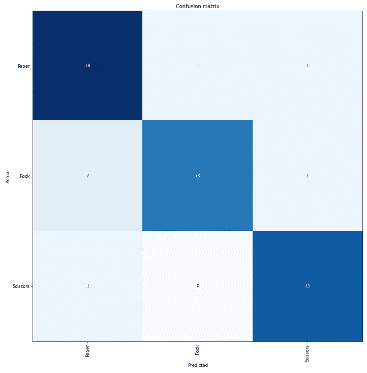

# Fast.ai / PyTorch:在自制的小数据集(262 张图片)上使用 Resnet34 进行迁移学习

> 原文：<https://medium.com/analytics-vidhya/fast-ai-pytorch-transfer-learning-using-resnet34-on-a-self-made-small-dataset-262-images-17003c9af3ce?source=collection_archive---------4----------------------->

# 介绍

我目前正在上 fast.ai 的深度学习课程。为了应用我在第一课中学到的概念，我使用了在 ENSEEIHT 的机器学习实验室中创建的一个非常小的数据集来进行图像分类。

该数据集由 264 张手做“纸”、“石头”和“剪刀”手势的照片组成，如下所示:


这些照片是用智能手机拍摄的。它涉及一个由 9 名学生组成的小组(我是数据集创建过程的一部分),在数据科学领域攻读 ENSEEIHT(图卢兹)硕士学位。我们试图改变背景和我们手的位置/方向，以在数据集中获得尽可能多的可变性。

这些图片被组织在三个文件夹中:**石头、剪刀、布。**每个对应一个类。

我保留了 20%的数据集用于验证。我使用 Fastai 库(在 PyTorch 之上)来加载 Resnet34，并重新训练它最后的密集层来识别“纸”、“石头”和“剪刀”手势。

# 库和主要依赖项

1.  用于 GPU 的 Google Colab
2.  Fastai v 1.0.52
3.  PyTorch v1

Fastai 是一个建立在 PyTorch 之上的令人惊叹的库，它使深度学习更加直观，并使它需要更少的代码行。想了解更多信息，你应该去他们的文档网站:[https://docs.fast.ai/](https://docs.fast.ai/)

# 入门指南

*   在 google colab 上运行任何东西之前，我需要告诉 colab 我对使用 GPU 感兴趣。我点击了“运行时”选项卡，并选择了“更改运行时类型”。一个弹出窗口打开了一个下拉菜单。我从菜单中选择了“GPU”，然后点击“保存”。
*   在我开始使用我的笔记本之前，我需要安装必要的软件包。为此，我创建了一个代码单元，并运行:

```
**!**curl -s https://course.fast.ai/setup/colab | bash
```

接下来的几行代码将执行以下操作:

*   在 Colab 上挂载 Google Drive 来访问数据集，并设置我的数据集路径

```
from google.colab import drive
drive.mount('/content/gdrive', force_remount=True)
root_dir = "/content/gdrive/My Drive/"
base_dir = root_dir + 'VALDOM/PHOTO_MAIN_VALDOM'
```

*   创建一个文件夹，我可以在需要时保存输出，并使用`%autoreload`自动重新加载任何更新的模块

```
from fastai.imports import *
path = Path(base_dir)
dest = path/"folder"
dest.mkdir(parents=True, exist_ok=True)%reload_ext autoreload
%autoreload 2
%matplotlib inline
```

*   从 fastai 进口

```
from fastai.vision import *
from fastai.metrics import error_rate
```

# 加载数据

由于图像是按文件夹分类的，使用`from_folder`方法使用`ImageDataBunch`很方便。

```
data = ImageDataBunch.from_folder(path, ds_tfms=get_transforms(), size=224, valid_pct = 0.2)
data.classes
```

*Out : ['布'，'石头'，'剪刀']*

基本上，`from_folder`方法采用以下参数:

*   路径:图像数据集的路径
*   ds_tfms:应用于图像以扩充数据集的转换
*   尺寸:图像尺寸/选择值:224 x224 像素
*   valid_pct : 0.2(即数据集的 20%将用于验证，因为定型集和验证集没有特定的文件夹。

数据的类型为`ImageDataBunch`并具有 classes 属性。从上面的代码中我们可以看到，我们的 DataBunch 成功地识别了三个标签:“布”、“剪刀”和“石头”。

data 有一个叫做`show_batch`的简便方法，如果需要，它可以查看数据集的样本:

```
data.show_batch(rows=3, figsize=(7,6))
```


# 训练模型

既然我们已经掌握了数据集，我们将训练模型。我们将使用`cnn_learner`函数，这是一个内置的 fastai 函数，加载著名的 CNN(卷积神经网络)架构。

```
learn = cnn_learner(data, models.resnet34, metrics=accuracy)
```

基本上，函数需要以下三个参数:

*   数据中心
*   要下载和训练的模型的规范(这里我们将使用一个 resnet34)
*   以及度量标准(我们在这里选择了准确性)

我们将在 10 个时期内进行培训

```
learn.fit_one_cycle(10)
```


基本上，我们设法在一个非常小的数据集上获得了 88.46%的准确率，这是一个很好的结果。

然后保存该模型并命名为(`stage-1`)

```
learn.save('stage-1')
```

注意，我们只做了微调(即我们只训练了最后的密集层)

# 解释模型

不管怎么说，深度学习在一定程度上是可以解释的，Fastai 库为此做好了准备。这里，我将使用一个叫做`ClassificationInterpretation`的便利工具，它可以帮助我们更好地理解我们的分类器。

例如，解释器可用于执行以下操作:

*   我们绘制具有最高损失值的验证数据样本(即，模型预测图像属于其实际类别的概率非常低的样本)


在每个图片的顶部提供了预测类别、实际类别、损失和由属于其实际类别的图片的模型计算的概率。

*   我们绘制了一个混淆矩阵



# 根据互联网上的随机手绘图片进行预测

我们从互联网上下载了 4 张未标记的手相图片，并让我们的模型预测它们的类别。

这些图像被保存在一个名为`random_hand_images`的文件夹中

```
pred_path = Path(base_dir + '/random_hand_images')
```

我们创建了一个 Fastai `ImageList`,并对其进行迭代，以做出预测并显示结果

```
il = ImageList.from_folder(pred_path); il
```

这给出了以下内容:

```
for img in il:
   prediction = learn.predict(img)
   img.show(figsize=(7,5), title = str(prediction[0]))
```


这个模特把一把剪刀误认为是一只“石头”手。

# 结论

在这篇博客中，我们看到了迁移学习如何让我们在极小的数据集上取得相对较好的性能(> 88%的准确率)。

我们也看到了 Fastai 的力量，以及它如何让深度学习变得简单明了。实际上，对于我们的问题，我们只需要 4 行代码来构建和保存我们的模型

```
*#Load the dataset* data = ImageDataBunch.from_folder(path, ds_tfms=get_transforms(), size=224, valid_pct = 0.2)*#Load learner object* learn = cnn_learner(data, models.resnet34, metrics=accuracy)*#Fit the model* learn.fit_one_cycle(10)*#Save the model* learn.save('stage-1')
```

这是我笔记本的 GitHub 链接(可能有点乱，请原谅)

[](https://github.com/chou404/Rock_Scissor_Paper_FastAi_ResNet/blob/master/Rock_Scissors_Paper.ipynb) [## Chou 404/Rock _ 剪刀 _ 纸张 _FastAi_ResNet

### 此时您不能执行该操作。您已使用另一个标签页或窗口登录。您已在另一个选项卡中注销，或者…

github.com](https://github.com/chou404/Rock_Scissor_Paper_FastAi_ResNet/blob/master/Rock_Scissors_Paper.ipynb) 

如果你喜欢我的文章，我恳请你分享并为之鼓掌:)

# 参考

1.  Fastai 深度学习 MOOC /第一课:[https://course.fast.ai/videos/?lesson=1](https://course.fast.ai/videos/?lesson=1)
2.  Fastai 深度学习 MOOC /第一课讲义:【https://forums.fast.ai/t/deep-learning-lesson-1-notes/27748
3.  PyTorch 文档:【https://pytorch.org/docs/stable/index.html 
4.  Resnet 论文:[https://arxiv.org/abs/1512.03385](https://arxiv.org/abs/1512.03385)