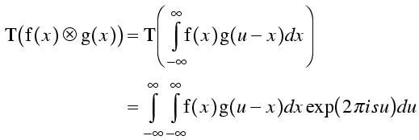

# Fast — CNN:用 FFT 层替代卷积层

> 原文：<https://medium.com/analytics-vidhya/fast-cnn-substitution-of-convolution-layers-with-fft-layers-a9ed3bfdc99a?source=collection_archive---------5----------------------->

最近我一直在思考卷积神经网络。无论是否有 n 个通道，卷积核的主要优点是从图像中提取最大特征。主要动机是提取特征，以便我们可以区分目标对象。核的数量越多，精度越高，但在某种程度上。但是更多的数字核意味着更多的计算成本。虽然 CNN 是迄今为止最好的图像分类算法。但是有两大缺点，第一是计算成本。由于每个像素与内核相乘是耗时的，如果我们增加过滤器的数量，可能需要几个星期来训练一个模型(O(n2))。如果不使用强大的 GPU，使用 CNN 的实时预测几乎不可能有很高的准确性。另一个主要缺点是，如果我们不使用填充，卷积后的结果大小会减小。

[源](/mlreview/a-guide-to-receptive-field-arithmetic-for-convolutional-neural-networks-e0f514068807)卷积后的输出尺寸

卷积丢失了边缘信息，为了防止它，我们使用填充。它可以是任何东西，例如，0 或旋转图像等。但填充后也有一些损失。

[来源](https://stats.stackexchange.com/questions/128880/number-of-feature-maps-in-convolutional-neural-networks)这是 CNN 的工作方式

这里我提出了一种新的图像与核卷积的方法。我们可以使用**傅立叶变换**来代替卷积。利用卷积和傅里叶变换的性质，可以大大减少运算时间，避免边缘。

傅立叶变换公式

[源](https://www-structmed.cimr.cam.ac.uk/Course/Convolution/convolution.html) FT —卷积属性

**该性质表示，通过对图像和核进行傅里叶变换，并在频域相乘，然后进行傅里叶逆变换，可以得到与卷积结果相同或非常相似的结果。**由于傅立叶变换也是繁琐的过程。但是快速傅立叶变换真的非常快，我们可以在 O(nlog(n))时间复杂度内得到输出。这里我引用这篇论文[http://ecmlpkdd2017.ijs.si/papers/paperID11.pdf](http://ecmlpkdd2017.ijs.si/papers/paperID11.pdf)进行反向传播。但是现在我们采用一个训练好的模型权重，所以我们只需要设计正向传播。

我们可以训练一个模型几个小时，但对于实时分析，CNN 非常慢。因此，我们用 FFT 算法代替了前向卷积传播。我得到了非常漂亮的结果，但由于去除了边缘，结果并不精确。这是非常有用的实时算法，如 YOLO，R-CNN，更快的 R-CNN。因为每个图像被分成几个小部分，并且需要对每个片段运行算法来预测结果。所以，想象一下要花多长时间才能分辨出你的脸是否在照片里。对视频分析也很有用。例如，自动驾驶汽车的智能使用大部分图像处理，这将需要大量处理。但是通过 FFT，我们产生与卷积相同的输出。

FFT 如何减少时间？

假设我们有 256 乘 256 的图像，并且我们想要对步幅= 1 的图像进行 3 乘 3 的核卷积，则仅生成一个结果图像就需要 64516 个步骤(不考虑每次乘法)。这些步骤可以很容易地由我们的通用 CPU 来执行。但是，假设我们在单个网络中有 1000 个内核，那么它会变成~64516*1000(如果我们保持图像大小不变)。这有许多工作要做。现在让每一步花 t 秒，这非常非常小。而 CNN 算法仅针对一幅图像所花费的总时间是 64516000*t 秒。虽然“t”很小，但是通过与步长相乘，它会将时间提高很多。为了训练一个神经网络，我们需要大量的图像，这可能需要 64516000*t*m 秒。因此，我们的主要目标是尽量减少步骤，以便减少时间消耗。主图来了。对图像进行 FFT，可能需要 50-60 步，具体取决于图像的尺寸和大小。计算内核 FFT 的步骤相同或更少。但是在进行核心的快速傅立叶变换之前，我们需要填充 0 来获得和图像一样的大小。现在将频域中的图像和内核相乘。下一步是对乘法结果进行 FFT 逆运算。现在，FFT 逆运算的结果将与我们在 64516 步后得到的卷积输出相同或非常相似。但是在 FFT 方法中，它需要更少的步骤和时间。在步骤数量上有很大的变化。我们可以使用傅立叶方法在不改变精度的情况下快速得到结果。由于我们得到了与卷积相似的输出，我们需要用 FFT 层代替卷积层。不需要任何其他改变。

卷积输出

FFT 的输出

我从 kaggle 获取了脑肿瘤数据集，并训练了一个深度学习模型，该模型有 3 个卷积层，每个卷积层有 1 个内核，3 个最大池层和 640 个神经元层。我的模型做得过拟合，精度也不好。因为它帮助我们比较卷积层输出和 FFT 层输出。因为我们主要关心的是用 FFT 层代替卷积层。

训练模型的层次

我替换卷积层的步骤如下:

1.  我拿了训练过的重量和一张照片。
2.  对两者进行 FFT。
3.  将它们在频域相乘。
4.  并对乘法结果进行逆 FFT。
5.  将这一层的输出送入另一层。
6.  每次重复这些步骤。

重复这些步骤后，我得到了非常相似的结果。

我用这两种模型预测了 253 个不同的图像。CNN 预测 253 幅图像的类别所用的时间是**188.133300151825**，FFT 预测 253 幅图像的类别所用的时间是**39**。48665.68668686666 它将时间缩短了 **4.807856811** 倍。

结论: **FFT 层数比卷积层数快大约 5 倍。**并且我们在没有填充的 FFT 层之后达到**相同的尺寸。**

这里是我的 GitHub 库[https://github.com/pushkar-khetrapal/Fast-CNN](https://github.com/pushkar-khetrapal/Fast-CNN)。

感谢阅读！我希望你喜欢这篇文章，并获得了一些额外的见解。如果你做了，请随意留下掌声！感谢建设性的反馈。请随时联系我[这里](https://www.linkedin.com/in/pushkar-khetrapal-bb8935169/)或者 pushkarkhetrapal12@outlook.com。

普什卡尔·赫特拉帕尔