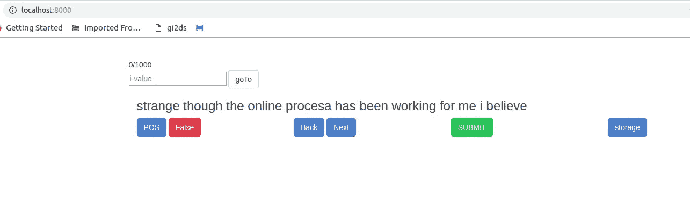
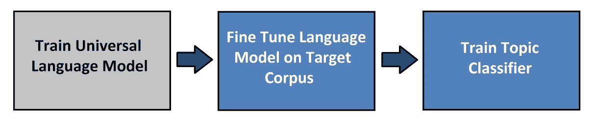
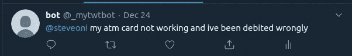
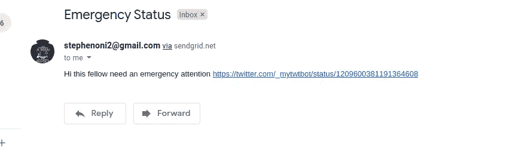

# 利用深度学习(NLP)和 Twitter Bot 实现快速客户服务响应。

> 原文：<https://medium.com/analytics-vidhya/fast-customer-care-response-with-deep-learning-and-twitter-bot-9d7e4a2ec390?source=collection_archive---------17----------------------->


Clem Onojeghuo 在 [Unsplash](https://unsplash.com?utm_source=medium&utm_medium=referral) 拍摄的照片

由于使用一些机构服务而产生的挫折感，确实导致迫切需要专门从事这种服务的人的注意。最令人沮丧的服务之一确实来自于像银行这样的金融机构，并且大多数这样的银行具有较差的客户服务来提供客户所需要的即时响应，这因此导致更沮丧的客户，他们可能最终不再使用这些服务。

但有时我们不能因为没有快速响应而责怪客户服务没有做好他们的工作，有时许多客户同时需要关注，这并不是需要如此紧急响应的全部。由于这种情况，当正确的人在正确的时间被忽略时，客户服务可能会响应错误的人，这可能会导致重大损失。

与上面的陈述一致，它表明有必要提供一种学习过滤消息的系统，从而减少噪音并因此帮助改善客户服务。

在本文中，我们将汇集来自 twitter 的数据，并创建一个 twitter 机器人。这遵循了之前的 [***帖子***](https://towardsdatascience.com/twitter-bot-for-data-scientists-8f4242c4d876) 关于如何为数据科学家创建一个 twitter 机器人。

为什么使用 twitter？Twitter 必须成为人们倾诉心声和分享信息的主要平台之一。由于这些组织中的大多数都有一个 twitter 账户来回应客户，因此，它可以很容易地收集银行客户的数据，以解决他们的问题。

这篇文章是关于什么的？它是关于使用深度学习融合 Twitter 机器人，通过减少噪音，从而提高响应率，让每个组织的客户服务更好。这里的想法可以扩展到其他形式。

我们将努力实现的目标是:

1.  如何从 twitter 中提取数据
2.  如何清理我们的数据
3.  如何标记我们的数据
4.  如何选择合适的型号
5.  如何给这个模型注入 Twitter 机器人
6.  如何将 bot 部署到 aws。

**如何从 twitter 获取数据**

由于我们的数据将基于银行客户的推文，我们将收集尼日利亚几乎所有银行的用户名(因为那是我的所在地)。这个用户名将被存储在一个列表中，然后这个列表将被遍历以让他们客户在 Twitter 上抱怨。

我们使用`api.Cursor`遍历由`api.search`返回的每个页面，这有助于获取列表中包含银行的每个 tweet。`-filter:retweets`用于过滤掉所有的转发，只包括客户直接发至银行 twitter 账户的推文。之后，为每个银行提取的推文创建一个 csv 文件。

**如何清理我们的数据**

一些推文可能包含表情符号、嵌入式 URL、@ sign 等，我们最好将这些从推文文本中删除，以便只在纯文本上训练我们的模型。对每个银行的 csv 文件执行此过程，然后将 csv 文件连接成一个文件。

**如何标注数据**

标注数据是最关键也是最繁琐的部分，因为它决定了我们模型的可信度，而且确实要花很多无聊的时间。这就是我们将推文分为正面或负面的原因。但是注意；我们对负面或正面的感觉取决于我们认为最需要关注的推文(紧急情况)，因此给推文贴上标签意味着它需要紧急关注。因此，从不同的角度来看，不同的人对什么需要关注的定义可能是不同的，因此，这方面的权威应该能够界定哪个是哪个。

为了使标注更快，用 javascript 构建了一个 UI，它提供了简单的导航和临时存储，这有助于在累的时候记下你在哪里停止标注。



**如何选择合适的型号**

这个项目使用的模型可能是由一些库提供的任何 NLP 文本分类算法，例如 Text blob。但在这个项目中，我使用了 ULMFIT，这是 NLP 深度学习的一种新的先进的迁移学习，由杰瑞米·霍华德和塞巴斯蒂安·鲁德提出。

选择它的主要原因是:

1.  数据中的一些文本被截断，我们希望能够建立一个语言模型，通过预测下一个可能出现的单词来重建一些被截断的文本。
2.  一些需要紧急关注的客户投诉有时确实先包含令人愉快的陈述(正面陈述)，然后是他们的投诉。有些时候一些文本分类算法会分类，这有时是中性的。

ULMFIT 是如何工作的；



[诺韦塔](https://www.novetta.com/2019/03/odsc19_text_classification_ulmfit/?__cf_chl_captcha_tk__=88807726d0c0a6a50ca29dd26f7b883a909ccb92-1577299063-0-ATrnrEthBvZlMnHqfU-6sil7vmig0aTzpJDtgBn2U9zfqQ_TCLssrdA-DOm8UPaheDE3L9wRWeG_xrS0RFeCEWaYWACY0VywRX3Ve-AJE5MODCAw4OXvl_tXR8q83qgzXRQ81iMbQq-D-YibXbwmJN4f8ElCku-D1dy7VU8puD3n589esuXypss4_n3oZVduar6ehumHBz2dwD5eDe8nUUYfHXYO1kddkPZ7KthLgM6fRJl5xcI5CUJbP0UoqvhTw0rMZsSfckQUJeqz31VsmY5gsHgeXZE7londpZe0l8z7PmVI6ZLJuSleDOq8KoWXzPw5_-7q7T_mjr80RsBkrkRgA38F2fv3EwWaAEyNSvjh)

首先，我们在 wiki text 103 上训练一个语言模型，然后这个语言模型在我们银行的 tweet 数据上进行微调，为它创建一个语言模型，之后使用语言模型的预训练权重训练一个分类器，以提高性能。

代码完全基于 Fastai 的课程 v3 的教训，可以看视频[这里](https://www.google.com/url?sa=t&rct=j&q=&esrc=s&source=web&cd=2&cad=rja&uact=8&ved=2ahUKEwiqkeTQutHmAhUgTxUIHehODNIQwqsBMAF6BAgKEAQ&url=https%3A%2F%2Fwww.youtube.com%2Fwatch%3Fv%3Dqqt3aMPB81c&usg=AOvVaw3NlTqSyhiXLuFDgL7NF4Qh)

**如何给模型注入 Twitter bot**

在训练完模型后，我们尽量节省可以在推理期间导入的权重。快速人工智能提供了一种简化推理的方法，不需要下载预训练的 AWD LSTM，也不需要导入上面代码中显示的数据 pickle 文件。通过使用`leaner.export()`创建一个`export.pkl` 文件，它可以灵活地进行推理，只需调用`load_learner(path`就可以导入所有必要的数据和重量。

要创建 twitter 机器人，请查看我之前的帖子。

`make_model()`帮助创建推理模型

该机器人的主要目标是查看是否有任何传入的推文被分类为负面，然后它会向客户服务提供的电子邮件发送一封紧急电子邮件，其中包括推文 URL，以便正确查看推文。

要发送电子邮件，最好使用 SendGrid 帐户而不是使用 Gmail API，创建一个 SendGrid 帐户来获取 API 令牌检查[此处](https://sendgrid.com/)

这有助于发送主题为 Emergency status 的邮件，邮件内容包括 tweet status 的链接。

**如何将 bot 部署到 AWS**

首先，我们创建一个 docker 文件来封装 bot，这将使它更容易部署在 AWS 上，而没有代码库环境问题。

然后构建一个镜像将在终端中运行这个；

```
$ docker build . -t cus-bot
```

然后，我们测试正在创建的 docker 映像；

```
docker run -it -e CONSUMER_KEY="AFEFFEF2103Y80Y8" \
-e CONSUMER_SECRET="ASW34134FEFEFMNLN8YH8Y8" \
-e ACCESS_TOKEN="qqww23d43od94djdi3dj" \
-e ACCESS_TOKEN_SECRET="AASWD03993322" \
cus-bot
```

这将启动 twitter 机器人，因此，如果它工作，然后我们就可以开始了，然后我们需要将图像转换为一个. tar 文件，使其易于与 AWS 集成。

```
$ docker image save cus-bot -o cus-bot.tar
$ gzip cus-bot.tar
```

压缩图像后，我们可以继续在 aws EC2 上创建一个实例，我们生成 EC2 密钥 inform of `yourkey.pem`，docker 将安装在您的实例上。要获得完整的要点和快速的解释，请查看[realpython.com](https://realpython.com/twitter-bot-python-tweepy/)，它会一步一步地给你讲解 AWS 上的部署。

**挑战**

在这个过程中遇到的唯一挑战是，为机器人生成的 docker 图像的大小约为 2.0 gig，而我的 AWS EC2 am 使用的免费 trier 只能为我选择的 Ubuntu 18.04 提供 1gig。虽然 docker 图像已经过测试，工作正常，例如，我 twitted 这个；



这就像一个客户抱怨并在推文中引用我的名字。机器人捕捉这条推文，并通过我们的模型处理它，看看它是否是负面的。如果是的话，我会收到一封紧急邮件，里面有我收到的 tweet 状态的链接；



要使用我使用的相同模型并创建完全相同的机器人，请检查代码[这里](https://github.com/steveoni/customer_servicebot)并下载权重[这里](https://drive.google.com/open?id=1nk6egK4zquW3qP4-C8D4N9LTHf67S7bO)，训练模型的代码(包括用于分类的 UI)可以从 [github](https://github.com/steveoni/Bank_UserTweet) 获得

请注意，本次培训使用的数据集来自[尼日利亚数据科学](https://medium.com/u/7c590e569dd4?source=post_page-----9d7e4a2ec390--------------------------------)的一项研究工作