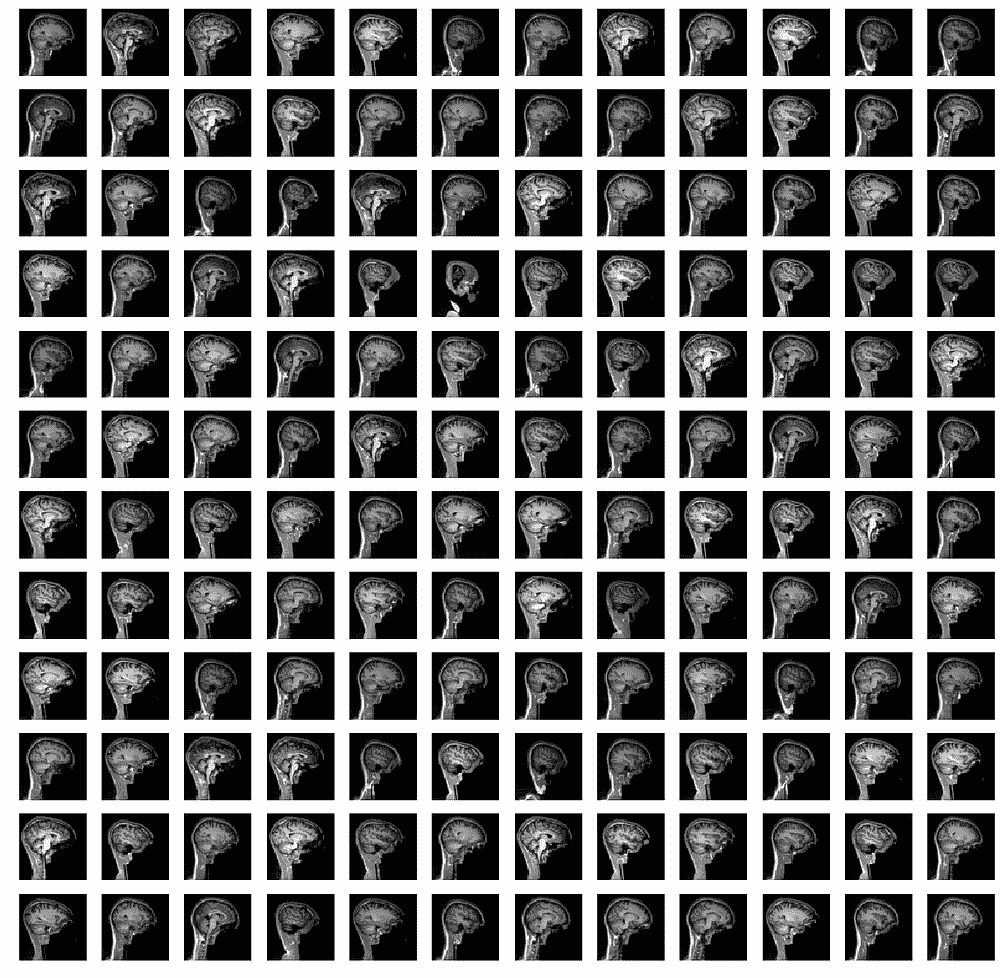
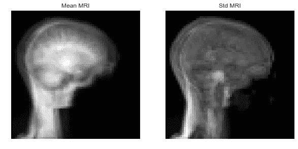
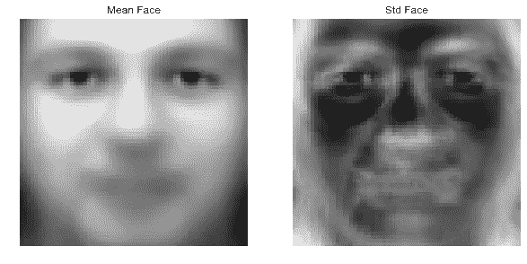
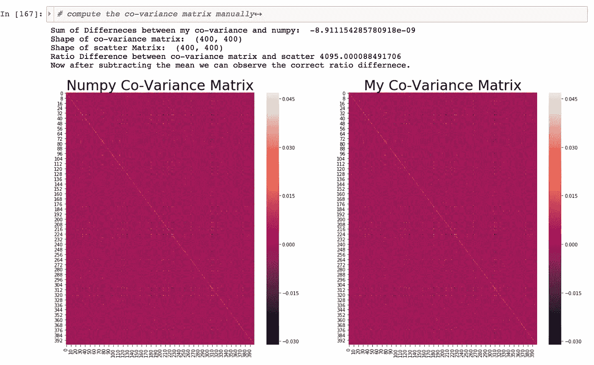

# Tensorflow / Matlab 中的快速独立分量分析与重构独立分量分析与正交独立分量分析

> 原文：<https://medium.com/analytics-vidhya/fast-ica-vs-reconstruction-ica-vs-orthonormal-ica-in-tensorflow-matlab-manual-back-prop-in-tf-8b3212924ad0?source=collection_archive---------1----------------------->

GIF 来自这个[网站](https://giphy.com/gifs/snl-saturday-night-live-mind-blown-9SIqlPusz8iLh1IFFJ)

在阅读吴恩达教授的[无监督特征学习和深度学习教程](http://ufldl.stanford.edu/tutorial/StarterCode/)时，我发现了两种不同的执行 ICA 的方法，我想将这些方法与 FastICA 进行比较。

> **请注意，这个帖子是为了我练习我的编码技能，也是为了我将来回顾这个帖子上的材料。**

**数据集**

在这篇文章中，我将使用两个不同的数据集，即[神经反馈颅骨剥离(NFBS)库](http://preprocessed-connectomes-project.org/NFB_skullstripped/) 和[来自 sklearn 的 Olivetti 人脸数据集](http://scikit-learn.org/stable/datasets/olivetti_faces.html#olivetti-faces)。

**通过主成分分析进行降维**

在将我们的数据统计分离成独立的成分之前，让我们首先通过 PCA 将其投影到较低的子空间。如上所述，我们可以看到每个图像看起来像什么。

现在，在减去每个维度的平均值之前，让我们看看平均脸和平均核磁共振脑。

从每幅图像中减去平均值后，我们可以看到这些图像现在看起来像幽灵。(尤其是人脸图像。)

现在让我们计算每个数据集的协方差矩阵，每个数据集的左侧图像是手动计算的协方差矩阵，而右侧图像表示由 np.cov()计算的协方差矩阵。

现在，在对每个协方差矩阵执行特征值分解后，我们可以按降序绘制特征值。(而且看起来 50 是个不错的截止值。)

上图展示了前 50 名特征大脑和特征面孔。(看着吓人 lol。)

使用这 50 个顶部特征图像，现在让我们重建我们的原始数据，如上所述，原始图像与重建图像并不完全相同。

**执行 PCA 时的注意事项**

图片来自本[网站](https://sebastianraschka.com/Articles/2014_pca_step_by_step.html)

在这个[网站](https://sebastianraschka.com/Articles/2014_pca_step_by_step.html)上有一个关于执行 PCA 的很好的教程，但是在其中一节作者提到了这样一个事实，即协方差矩阵和散布矩阵之间唯一的区别是命名因子。然而，在实验过程中，我注意到由于 np.cov()的实现方式，这个比率可能会被打破。

如上所述，当我们比较散布矩阵和共方差矩阵时，我们可以看到共方差矩阵比散布矩阵清晰。这主要是因为 numpy cov 是如何实现的，在创建协方差矩阵之前，它还要减去每个示例的平均值。(因此将每个例子移动到零均值)，因此产生了差异。但是，如果我们减去每个示例的平均值，我们可以观察到相同的协方差矩阵。

因此，总之，如果您希望遵循 numpy 步骤，仔细检查中间的值可能是个好主意。

**快速 ICA**

图片来自本[网站](http://cis.legacy.ics.tkk.fi/aapo/papers/IJCNN99_tutorialweb/node28.html)

既然我们已经进行了维度缩减，现在让我们使用 FastICA 使我们缩减的数据相互独立。此外，我将使用 log(cosh())作为我的激活函数，下面是激活函数 log(cosh())的图像。

图片来自本[网站](https://www.desmos.com/calculator)

在 tensorflow 中，我们可以实现 FastICA，如下所示。(我在关注 sklearn FastICA 的实现。)

现在经过 1000 次迭代后，我们可以看到每个独立组件的最终结果。

这里需要注意的一点是，ICA 捕捉的是局部变化，而不是全局变化。

当我们将每个组件的收敛过程制作成动画时，它看起来就像上面这样。

**重构 ICA**

图片来自本[网站](http://ufldl.stanford.edu/tutorial/unsupervised/RICA/)

接下来让我们看看 RICA 的行动，此外，如果有人想知道如何驱动权重 w 的反向传播，请参见此处的。

**请注意！我不会提前执行降维，而是只执行 zca 白化。**

正如上面所看到的，白化后，我们可以看到，边缘变得更加清晰。右图是白化后得到的协方差矩阵。

如上所述，我们可以在 tensorflow 中以分层方式实现 RICA。通过这样做，我决定不使用回溯线搜索算法。

不幸的是，我无法收敛算法，这可能是由于一些事情。直接执行降维，需要更多的迭代来收敛，或者需要使用回溯算法来寻找最佳步长等等。

图片来自本[网站](http://ufldl.stanford.edu/wiki/index.php?title=Exercise:Independent_Component_Analysis&direction=prev&oldid=1016#Step_4b:_Reconstruction_ICA)

如上所述，我们可以看到在低维图像上使用 RICA 效果很好。上面的例子使用 8 乘 8 的图像，有 3 个通道，所以每个图像有 192 个矢量。(图像是来自 STL 数据集的自然图像。).面部图像具有 4096 的维度，即 64 * 64。

**正交独立分量分析—回溯线搜索**

图片来自本[网站](https://en.wikipedia.org/wiki/Backtracking_line_search)

在学习正交独立分量分析的细节之前，学习回溯线搜索可能是一个好主意，在回溯线搜索中找到用于更新给定权重的最佳步长。(我只是理解为学习最优学习速率。)

来自本[网站](https://sites.math.washington.edu/~burke/crs/408/lectures/L7-line-search.pdf)的 PPT

来自本[网站](https://people.maths.ox.ac.uk/hauser/hauser_lecture2.pdf)的 PPT

来自本[网站的 PPT](https://www.cs.cmu.edu/~ggordon/10725-F12/slides/05-gd-revisited.pdf)

**正交独立分量分析**

图片来自本[网站](http://ufldl.stanford.edu/wiki/index.php/Independent_Component_Analysis)

最后，让我们尝试正交独立分量分析，需要注意的一点是，正交独立分量分析与重构独立分量分析非常相似，但它有一个更强的约束，即权重矩阵的协方差矩阵是单位矩阵。请注意，我使用了这个 [GitHub](https://github.com/cswhjiang/UFLDL-Tutorial-Exercise/blob/master/Exercise11_independent_component_analysis_exercise/ICAExercise.m) 和这个 [GitHub](https://github.com/PedroCV/UFLDL-Tutorial-Solutions/blob/master/Additional_2_Independent_Component_Analysis/orthonormalICACost.m) 的可用代码来实现这些结果。(在 Matlab 中)

如上所述，当我们使用 8*8 块彩色图像(总共 192 维)时，该算法能够学习类似 gabor 滤波器的滤波器。

然而，当对高维图像使用相同的算法时，该算法不能够收敛。

**互动码**

对于 Google Colab，你需要一个 Google 帐户来查看代码，而且你不能在 Google Colab 中运行只读脚本，所以在你的操场上复制一份。最后，我永远不会请求允许访问你在 Google Drive 上的文件，仅供参考。编码快乐！

要访问磁共振成像[上的 FastICA 代码，请点击此处。](https://colab.research.google.com/drive/16W7nZEgGucgfUXWYeXn1Nurur5wYdRgc)
要访问面部 FastICA 的代码[请点击此处。](https://colab.research.google.com/drive/10Ho316AMm283JS-ODrU9CyuB71Hm2Seh)
要获取 RICA 的代码，请[点击此处。](https://colab.research.google.com/drive/1iSwbjHP5ZYfpXAT05OuUUozx_2ULdz4t)
要访问标准正交 ICA 的代码，请[点击此处。](https://github.com/JaeDukSeo/Daily-Neural-Network-Practice-2/tree/master/Understanding_Concepts/RICA_FASTICA/independent_component_analysis_exercise)

**最后的话**

最后，我想再次把这一节作为我的个人笔记。下面我附上了一个链接，这是一个很好的矩阵演算练习，以及矩阵转置规则的好表格。

图片来自本[网站](https://math.stackexchange.com/questions/1646008/derivative-of-l-1-norm)

图片来自本[网站](https://stattrek.com/matrix-algebra/matrix-theorems.aspx)

以及知道 ICA，FA，PCA 区别的好答案。

图片来自本[网站](https://stats.stackexchange.com/questions/35319/what-is-the-relationship-between-independent-component-analysis-and-factor-analy)

如何在 python 中使用协方差矩阵进行 PCA 可以看[这里](https://stackoverflow.com/questions/13224362/principal-component-analysis-pca-in-python)。

如果发现任何错误，请发电子邮件到 jae.duk.seo@gmail.com 给我，如果你想看我所有写作的列表，请在这里查看我的网站。

同时，在我的 twitter 上关注我[这里](https://twitter.com/JaeDukSeo)，访问[我的网站](https://jaedukseo.me/)，或者我的 [Youtube 频道](https://www.youtube.com/c/JaeDukSeo)了解更多内容。我还实现了[广残网，请点击这里查看博文](/@SeoJaeDuk/wide-residual-networks-with-interactive-code-5e190f8f25ec) t。

**参考**

1.  5.6.1.Olivetti faces 数据集-sci kit-learn 0 . 19 . 2 文档。(2018).Scikit-learn.org。检索于 2018 年 8 月 31 日，来自[http://sci kit-learn . org/stable/datasets/olivetti _ faces . html # olivetti-faces](http://scikit-learn.org/stable/datasets/olivetti_faces.html#olivetti-faces)
2.  Faces 数据集分解-sci kit-学习 0.19.2 文档。(2018).Scikit-learn.org。检索于 2018 年 8 月 31 日，来自[http://sci kit-learn . org/stable/auto _ examples/decomposition/plot _ faces _ decomposition . html # sphx-glr-auto-examples-decomposition-plot-faces-decomposition-py](http://scikit-learn.org/stable/auto_examples/decomposition/plot_faces_decomposition.html#sphx-glr-auto-examples-decomposition-plot-faces-decomposition-py)
3.  [复本]，H. (2018)。如何在一个图中正确显示多个图像？。堆栈溢出。检索于 2018 年 8 月 31 日，来自[https://stack overflow . com/questions/46615554/how-to-display-multiple-images-in-one-figure-right](https://stackoverflow.com/questions/46615554/how-to-display-multiple-images-in-one-figure-correctly)
4.  使用多输出估计器的面补全—sci kit—学习 0.19.2 文档。(2018).Scikit-learn.org。检索于 2018 年 8 月 31 日，来自[http://sci kit-learn . org/stable/auto _ examples/plot _ multi output _ face _ completion . html # sphx-glr-auto-examples-plot-multi output-face-completion-py](http://scikit-learn.org/stable/auto_examples/plot_multioutput_face_completion.html#sphx-glr-auto-examples-plot-multioutput-face-completion-py)
5.  tf.enable_eager_execution 必须在程序启动时调用。第 18304 期张量流/张量流。(2018).GitHub。检索于 2018 年 8 月 31 日，来自[https://github.com/tensorflow/tensorflow/issues/18304](https://github.com/tensorflow/tensorflow/issues/18304)
6.  急切执行| TensorFlow。(2018).张量流。检索于 2018 年 8 月 31 日，来自[https://www.tensorflow.org/guide/eager](https://www.tensorflow.org/guide/eager)
7.  线性代数(SciPy . linalg)-SciPy v 1 . 1 . 0 参考指南。(2018).Docs.scipy.org。检索于 2018 年 8 月 31 日，来自[https://docs . scipy . org/doc/scipy/reference/tutorial/Lina LG . html](https://docs.scipy.org/doc/scipy/reference/tutorial/linalg.html)
8.  ZCA 美白([http://ufldl . Stanford . edu/wiki/index . PHP/Implementing _ PCA/Whitening](http://ufldl.stanford.edu/wiki/index.php/Implementing_PCA/Whitening))。(2018).要点。检索于 2018 年 8 月 31 日，来自 https://gist.github.com/dmaniry/5170087
9.  tf.pow | TensorFlow。(2018).张量流。检索于 2018 年 8 月 31 日，来自[https://www.tensorflow.org/api_docs/python/tf/pow](https://www.tensorflow.org/api_docs/python/tf/pow)
10.  j . brown lee(2018 年)。机器学习中向量范数的简明介绍。机器学习精通。检索于 2018 年 8 月 31 日，来自[https://machine learning mastery . com/vector-norms-machine-learning/](https://machinelearningmastery.com/vector-norms-machine-learning/)
11.  数学倒三角符号是什么意思——谷歌搜索。(2018).Google.co.kr。检索于 2018 年 8 月 31 日，来自[https://www.google.co.kr/search?q = math+what+does+upside+down+triangle+symbol+mean&source = lnms&TBM = isch&sa = X&ved = 0 ahukewi6 pneyl 5 fdahxgzmekhu 0 paukq _ AUICigB&biw = 1600&BIH = 907 # im GRC = htbvwfh 2 BEP 3 om](https://www.google.co.kr/search?q=math+what+does+upside+down+triangle+symbol+mean&source=lnms&tbm=isch&sa=X&ved=0ahUKEwi6pNeyl5fdAhXGzmEKHU0pAukQ_AUICigB&biw=1600&bih=907#imgrc=HtbVWFH2bEP3OM):
12.  RuntimeError:预期的 Double tensor(get Float tensor)问题#2138 pytorch/pytorch。(2018).GitHub。检索于 2018 年 8 月 31 日，来自[https://github.com/pytorch/pytorch/issues/2138](https://github.com/pytorch/pytorch/issues/2138)
13.  norm，D. (2018)。$l_1$范数的导数。数学栈交换。检索于 2018 年 8 月 31 日，来自[https://math . stack exchange . com/questions/1646008/derivative-of-l-1-norm](https://math.stackexchange.com/questions/1646008/derivative-of-l-1-norm)
14.  矩阵定理。(2018).Stattrek.com。检索于 2018 年 8 月 31 日，来自[https://stattrek.com/matrix-algebra/matrix-theorems.aspx](https://stattrek.com/matrix-algebra/matrix-theorems.aspx)
15.  分析？，W. (2018)。独立成分分析和因子分析有什么关系？。交叉验证。检索于 2018 年 9 月 1 日，来自[https://stats . stack exchange . com/questions/35319/what-is-the-relationship-between-independent-component-analysis-and-factor-analyst](https://stats.stackexchange.com/questions/35319/what-is-the-relationship-between-independent-component-analysis-and-factor-analy)
16.  tf.random_uniform | TensorFlow。(2018).张量流。检索于 2018 年 9 月 1 日，来自[https://www . tensor flow . org/API _ docs/python/TF/random _ uniform](https://www.tensorflow.org/api_docs/python/tf/random_uniform)
17.  回溯线搜索。(2018).En.wikipedia.org。检索于 2018 年 9 月 2 日，来自 https://en.wikipedia.org/wiki/Backtracking_line_search
18.  练习:独立成分分析— Ufldl。(2018).Ufldl.stanford.edu。检索于 2018 年 9 月 2 日，来自[http://ufldl.stanford.edu/wiki/index.php?title = Exercise:Independent _ Component _ Analysis&oldid = 1298](http://ufldl.stanford.edu/wiki/index.php?title=Exercise:Independent_Component_Analysis&oldid=1298)
19.  Pedro cv/uf LDL-教程-解决方案。(2018).GitHub。2018 年 9 月 2 日检索，来自[https://github . com/Pedro cv/uf LDL-Tutorial-Solutions/blob/master/Additional _ 2 _ Independent _ Component _ Analysis/orthonormalcacost . m](https://github.com/PedroCV/UFLDL-Tutorial-Solutions/blob/master/Additional_2_Independent_Component_Analysis/orthonormalICACost.m)
20.  cswhjiang/UFLDL-教程-练习。(2018).GitHub。2018 年 9 月 2 日检索，来自[https://github . com/cswhjiang/UFLDL-Tutorial-Exercise/blob/master/Exercise 11 _ independent _ component _ analysis _ Exercise/ICA Exercise . m](https://github.com/cswhjiang/UFLDL-Tutorial-Exercise/blob/master/Exercise11_independent_component_analysis_exercise/ICAExercise.m)
21.  objects，S. (2018)。洗牌的对象列表。堆栈溢出。检索于 2018 年 9 月 3 日，来自[https://stack overflow . com/questions/976882/shuffling-a-list-of-objects](https://stackoverflow.com/questions/976882/shuffling-a-list-of-objects)
22.  order，R. (2018)。以相同的顺序随机打乱不同文件中的数据和标签。堆栈溢出。检索于 2018 年 9 月 3 日，来自[https://stack overflow . com/questions/43229034/random-shuffle-data-and-labels-from-different-files-in-the-same-order/43229113](https://stackoverflow.com/questions/43229034/randomly-shuffle-data-and-labels-from-different-files-in-the-same-order/43229113)
23.  无监督特征学习和深度学习教程。(2018).Ufldl.stanford.edu。检索于 2018 年 9 月 3 日，来自 http://ufldl.stanford.edu/tutorial/unsupervised/RICA/
24.  无监督特征学习和深度学习教程。(2018).Ufldl.stanford.edu。检索于 2018 年 9 月 3 日，来自[http://ufldl . Stanford . edu/tutorial/unsupervised/exercise Rica/](http://ufldl.stanford.edu/tutorial/unsupervised/ExerciseRICA/)
25.  练习:独立成分分析— Ufldl。(2018).Ufldl.stanford.edu。检索于 2018 年 9 月 3 日，来自[http://ufldl.stanford.edu/wiki/index.php?title = Exercise:Independent _ Component _ Analysis&direction = prev&oldid = 1016 # Step _ 4b:_ re construction _ ICA](http://ufldl.stanford.edu/wiki/index.php?title=Exercise:Independent_Component_Analysis&direction=prev&oldid=1016#Step_4b:_Reconstruction_ICA)
26.  实施主成分分析(PCA)。(2014).塞巴斯蒂安·拉什卡博士。2018 年 9 月 4 日检索，来自[https://sebastianraschka . com/Articles/2014 _ PCA _ step _ by _ step . html](https://sebastianraschka.com/Articles/2014_pca_step_by_step.html)
27.  Python，P. (2018)。Python 中的主成分分析(PCA)。堆栈溢出。检索于 2018 年 9 月 5 日，来自[https://stack overflow . com/questions/13224362/principal-component-analysis-PCA-in-python](https://stackoverflow.com/questions/13224362/principal-component-analysis-pca-in-python)
28.  解码降维，主成分分析和奇异值分解。(2015).大数据变得简单—一个来源。多角度..检索于 2018 年 9 月 5 日，来自[http://bigdata-made simple . com/decoding-dimensionally-reduction-PCA-and-SVD/](http://bigdata-madesimple.com/decoding-dimensionality-reduction-pca-and-svd/)
29.  分解，U. (2018)。使用 Numpy (np.linalg.svd)进行奇异值分解。堆栈溢出。2018 年 9 月 5 日检索，来自[https://stack overflow . com/questions/24913232/using-numpy-NP-linalg-SVD-for-singular-value-decomposition](https://stackoverflow.com/questions/24913232/using-numpy-np-linalg-svd-for-singular-value-decomposition)
30.  tf.cosh | TensorFlow。(2018).张量流。检索于 2018 年 9 月 5 日，来自 https://www.tensorflow.org/api_docs/python/tf/cosh
31.  [实现后]收集对独立成分分析有用的演示文稿。(2018).中等。检索于 2018 年 9 月 5 日，来自[https://medium . com/@ SeoJaeDuk/achieved-post-collection-of-used-presentation-for-independent-component-analysis-8e 07426 BF 095](/@SeoJaeDuk/achieved-post-collection-of-useful-presentation-for-independent-component-analysis-8e07426bf095)
32.  德斯莫斯图表。(2018).德斯莫斯图形计算器。检索于 2018 年 9 月 5 日，来自[https://www.desmos.com/calculator](https://www.desmos.com/calculator)
33.  Python 中的 DICOM:用 PyDICOM 和 VTK 将医学图像数据导入 NumPy。(2014).PyScience。2018 年 9 月 5 日检索，来自[https://pyscience . WordPress . com/2014/09/08/DICOM-in-python-importing-medical-image-data-into-numpy-with-pydicom-and-VTK/](https://pyscience.wordpress.com/2014/09/08/dicom-in-python-importing-medical-image-data-into-numpy-with-pydicom-and-vtk/)
34.  scipy.misc.imread，u. (2018)。使用 skimage 替换 scipy.misc.imread. Stack 溢出。检索于 2018 年 9 月 5 日，来自[https://stack overflow . com/questions/49686013/using-skim age-to-replace-scipy-misc-im read](https://stackoverflow.com/questions/49686013/using-skimage-to-replace-scipy-misc-imread)
35.  模块:io —浏览 v0.15.dev0 文档。(2018).Scikit-image.org。检索于 2018 年 9 月 5 日，来自[http://scikit-image . org/docs/dev/API/skim age . io . html # skim age . io . im read](http://scikit-image.org/docs/dev/api/skimage.io.html#skimage.io.imread)
36.  动画示例代码:dynamic _ image . py—Matplotlib 2 . 0 . 2 文档。(2018).Matplotlib.org。检索于 2018 年 9 月 5 日，来自[https://matplotlib . org/examples/animation/dynamic _ image . html](https://matplotlib.org/examples/animation/dynamic_image.html)
37.  使用图像列表的动画图像— Matplotlib 2.1.2 文档。(2018).Matplotlib.org。检索于 2018 年 9 月 5 日，来自[https://matplotlib . org/gallery/animation/dynamic _ image2 . html](https://matplotlib.org/gallery/animation/dynamic_image2.html)
38.  使用图像列表的动画图像— Matplotlib 2.1.2 文档。(2018).Matplotlib.org。检索于 2018 年 9 月 5 日，来自[https://matplotlib . org/gallery/animation/dynamic _ image2 . html](https://matplotlib.org/gallery/animation/dynamic_image2.html)
39.  无监督特征学习和深度学习教程。(2018).Ufldl.stanford.edu。检索于 2018 年 9 月 5 日，来自 http://ufldl.stanford.edu/tutorial/unsupervised/ICA/
40.  NFBS 骷髅仓库。(2018).Preprocessed-connectomes-project.org。检索于 2018 年 9 月 5 日，来自[http://preprocessed-connecto mes-project . org/NFB _ skull stripped/](http://preprocessed-connectomes-project.org/NFB_skullstripped/)
41.  Faces 数据集分解-sci kit-学习 0.19.2 文档。(2018).Scikit-learn.org。2018 年 9 月 5 日检索，来自[http://sci kit-learn . org/stable/auto _ examples/decomposition/plot _ faces _ decomposition . html # sphx-glr-auto-examples-decomposition-plot-faces-decomposition-py](http://scikit-learn.org/stable/auto_examples/decomposition/plot_faces_decomposition.html#sphx-glr-auto-examples-decomposition-plot-faces-decomposition-py)