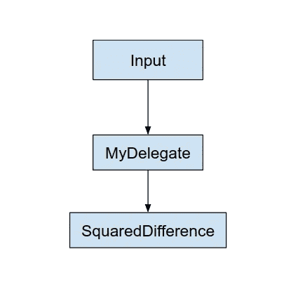

# 快速推断:TFLite GPU Delegate！！

> 原文：<https://medium.com/analytics-vidhya/fast-inference-tflite-gpu-delegate-3e83f83d5b92?source=collection_archive---------5----------------------->

在边缘设备上运行推理，尤其是在移动设备上，要求非常高。当你有一个非常大的机器学习模型时，用有限的资源进行推理是一项非常关键的任务。

很多移动设备尤其是移动设备都有 GPU 之类的硬件加速器。Tensorflow Lite Delegate 有助于优化我们的训练模型，并充分利用硬件加速的优势。


## 什么是 Tensorflow Lite Delegate？

委托人的工作，一般来说，是将你的工作委托或转移给某人。TensorFlow Lite 支持多种硬件加速器。

> TensorFlow Lite 委托是一种将部分或全部图形执行委托给另一个执行器的方式。

# 为什么应该使用委托？

由于移动设备的处理、内存和电源有限，在边缘设备上运行计算密集型深度学习模型的推理需要大量资源。一些设备不依赖于设备 CPU，而是具有硬件加速器，如 GPU 或 DSP(数字信号处理)，从而实现更好的性能和更高的能效。

## 【TFLite 委托如何工作？


TFLite 委托如何工作。tensorflow.org

让我们考虑一下上面的图表。它有一个输入节点，我们将在那里获得用于推理的输入。我们将让输入节点通过卷积运算，然后均值运算，它使用这两个运算的输出来计算平方差。

假设我们有一个硬件加速器，可以非常快速高效地执行 Conv2d 和均值运算，上图如下所示:



在这种情况下，我们将使用 TFLite delegator 将 conv2d 和 mean 这两个操作委托给专门的硬件加速器。

> TFLite GPU delegator 会将操作委托给 GPU delegator(如果可用)。

TFLite 允许我们为特定的操作提供委托，在这种情况下，图将被分割成多个子图，每个子图由一个委托处理。由委托处理的每个子图都将被替换为一个节点，该节点在其被调用的调用中评估该子图。根据模型的不同，最终的图可能以一个节点或多个节点结束，这意味着所有的图都被委托或者多个节点处理子图。通常，您不希望由代理处理多个子图，因为每次从代理切换到主图时，将结果从子图传递到主图都会有开销。

> 共享内存不总是安全的。

# 如何添加代理人？

1.  定义一个负责评估代理子图的内核节点。
2.  创建 TfLiteDelegate 的实例，该实例将注册内核并声明委托可以执行的节点。

# 安卓系统:

[Tensorflow 已经为 android 提供了一个演示应用](https://www.tensorflow.org/lite/performance/gpu):

在您的应用程序中，如上添加 AAR，导入`**org.tensorflow.lite.gpu.GpuDelegate**`模块，并使用`**addDelegate**`函数向解释器注册 GPU 委托

```
import org.tensorflow.lite.Interpreter;
import org.tensorflow.lite.gpu.GpuDelegate;

// Initialize interpreter with GPU delegate
GpuDelegate delegate = new GpuDelegate();
Interpreter.Options options = (new Interpreter.Options()).addDelegate(delegate);
Interpreter interpreter = new Interpreter(model, options);

// Run inference
while (true) {
  writeToInput(input);
  interpreter.run(input, output);
  readFromOutput(output);
}

// Clean up
delegate.close();
```

# iOS:

包含 GPU delegate 头，并调用`**Interpreter::ModifyGraphWithDelegate**`函数向解释器注册 GPU delegate:

```
#import "tensorflow/lite/delegates/gpu/metal_delegate.h"

// Initialize interpreter with GPU delegate
std::unique_ptr<Interpreter> interpreter;
InterpreterBuilder(*model, resolver)(&interpreter);
auto* delegate = NewGpuDelegate(nullptr);  // default config
if (interpreter->ModifyGraphWithDelegate(delegate) != kTfLiteOk) return false;

// Run inference
while (true) {
  WriteToInputTensor(interpreter->typed_input_tensor<float>(0));
  if (interpreter->Invoke() != kTfLiteOk) return false;
  ReadFromOutputTensor(interpreter->typed_output_tensor<float>(0));
}

// Clean up
interpreter = nullptr;
DeleteGpuDelegate(delegate);
```

**注:-**

> 一些在 CPU 上微不足道的操作对 GPU 来说可能成本很高。

**参考链接:**

[https://www.tensorflow.org/lite/performance/gpu](https://www.tensorflow.org/lite/performance/gpu)

[**更多此类故事**](https://maheshwar-ligade.medium.com/)


**下面我们连线上**[**stack overflow**](http://stackoverflow.com/users/3187349/maheshwar-ligade)**，**[**LinkedIn**](https://in.linkedin.com/in/maheshwar-ligade-14447841)**，** [**脸书**](https://www.facebook.com/maheshwar.ligade)**&**[**Twitter**](https://twitter.com/MaheshwarLigade)**。**