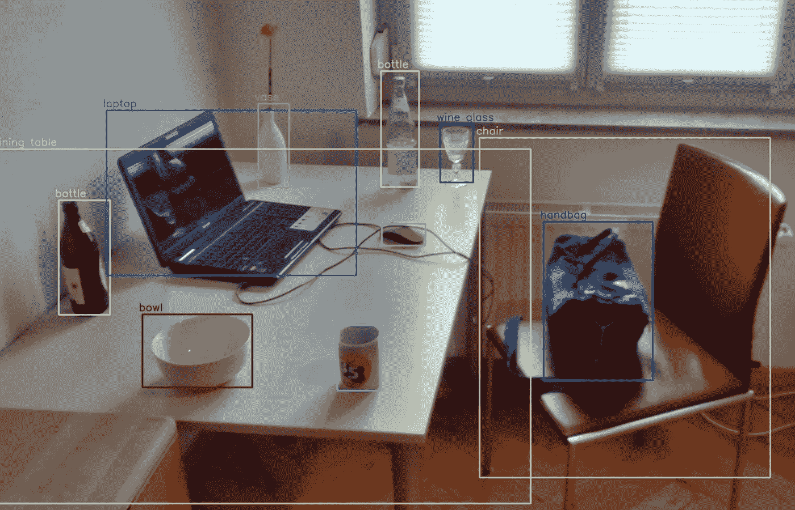
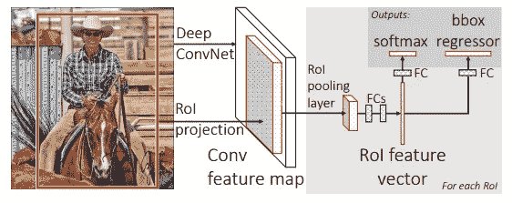
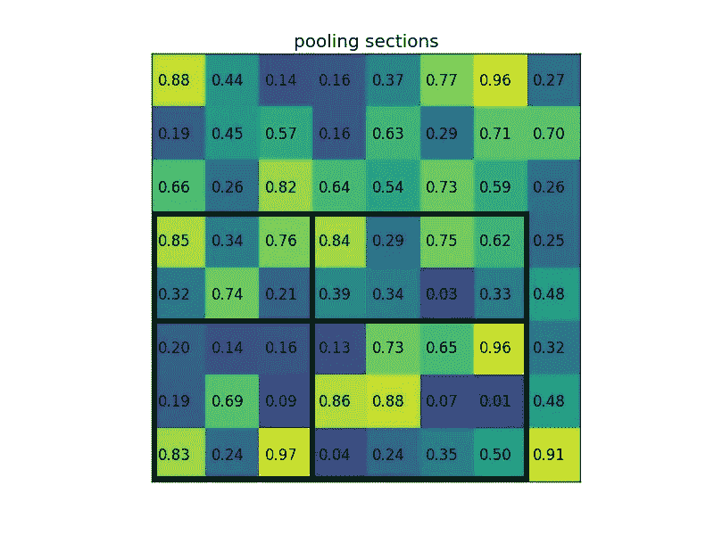
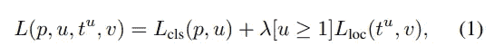

# 快速 RCNN[1504.08083]

> 原文：<https://medium.com/analytics-vidhya/fast-rcnn-1504-08083-d9a968a82a70?source=collection_archive---------17----------------------->

## 物体探测器的单阶段训练

演职员表:[https://en.wikipedia.org/wiki/Object_detection](https://en.wikipedia.org/wiki/Object_detection)

我已经计划阅读主要的物体探测论文(虽然我已经粗略地阅读了它们中的大部分，但我会详细地阅读它们，好到足以写一篇关于它们的博客)。这些论文与基于深度学习的对象检测相关。随时给建议或询问疑惑会尽我所能帮助大家。我将在下面写下每篇论文的 arxiv 代码，并在下面给出博客(我写的时候会不断更新)和他们论文的链接。任何从这个领域开始的人都可以跳过许多这样的论文。当我读完所有的论文后，我还会写下它们的优先级/重要性(根据理解主题的必要性)。
我写这篇博客是考虑到和我相似并且仍在学习的读者。万一我犯了任何错误(我将通过从各种来源(包括博客、代码和视频)深入理解论文来尽量减少错误)，任何人都可以随意地在博客上强调它或添加评论。我已经提到了我将在博客结尾涉及的论文列表。

我们开始吧:)

快速 RCNN 是对 RCNN 和 SPPNet 的改进。快速 RCNN 引入了一种训练策略来在单个阶段中训练模型。相比之下，RCNN 和 SPPNet 分 3 个阶段训练(CNN、SVM 和回归器，所有这些阶段都单独训练)。

快速 RCNN 使用相似的区域提议网络来提议 k 个区域。类似于 SPPNet，CNN 特征对于每个图像只计算一次。他们介绍了 ROI pooling 层，这将在下一节中定义。SVM 分类器由 softmax 分类器(完全连接的层)代替，并给出 num_classes+1 的概率分数(1 个额外的类用于背景)。输出尺寸为 4*(K+1)的类似全连接层用于预测每个类的边界框偏移。VGG 在这里被用作深孔。

演职员表:[https://arxiv.org/pdf/1504.08083.pdf](https://arxiv.org/pdf/1504.08083.pdf)

## 投资回报池

为了用固定维度表示每个区域提案，使用了投资回报池。这个固定维度的形状是一个超参数，我们在这里用它作为 H*W。CNN 架构产生的特征地图之后是 ROI pooling 层。假设当前 ROI 提议候选的边界框尺寸是 h*w。该 h*w 特征图被划分成大约尺寸为 h/H*w/W 的网格

我们用一个例子来理解一下:在这个例子中，我们的 H 和 W 超参数选择 2*2。假设当前建议的尺寸为 5*7(外部黑色矩形)。现在每个网格的大小将是 5/2*7/2。因为除法不会是一个整数，所以我们的网格会有不同的大小，如图所示。一旦我们得到了 2*2 的网格，每个网格元素的最大元素就是 2*2 的输出特征。

演职员表:[https://deepsense.ai/region-of-interest-pooling-explained/](https://deepsense.ai/region-of-interest-pooling-explained/)

在这种情况下，我们将得到输出特征映射[[0.85，0.84]，[0.97，0.96]]。该操作独立应用于特征图中的每个通道(记住，输出特征图是具有 C 个通道的三维，C 是我们从上一个 Conv 层获得的通道数，在上述示例中，输出的大小为(C*2*2))。

现在，我们为每个尺寸为 C*H*W 的区域建议提供了一个固定大小的输出。该输出被展平，之后是完全连接的层。获得的输出 ROI 特征图(见图 1)由分类器和回归器共享。

## 多任务丢失:

快速 RCNN 由两个完全连接的兄弟层组成，其中一层输出类别概率，另一层输出每个类别的回归偏移量。提出了多任务损失 L:

多任务损失

这里 u 和 v 是地面真实类和包围盒目标。L_cls 是分类损失(负对数似然)，L_loc 是平滑 L1 损失(如下图所示)。Lambda 是一个超参数，控制两个任务之间的平衡。这里，u ≥ 1 表示仅当 u≥1 时，lambda 将为 1，而当 u = 0 时，lambda 将为 0，这将在背景类的情况下发生，并且没有背景类的基础事实边界框。

相对于只接受分类损失训练的人，这种多任务损失有助于提高分类准确度。

快速 RCNN 的主要贡献是一阶段训练。该模型在一个阶段中被端到端地训练。

# 论文列表:

1.  [OverFeat:使用卷积网络的综合识别、定位和检测](https://arxiv.org/pdf/1312.6229.pdf)。[ [链接到博客](https://towardsdatascience.com/overfeat-review-1312-6229-4fd925f3739f)
2.  [丰富的特征层次，用于精确的对象检测和语义分割(RCNN)。](https://arxiv.org/pdf/1311.2524.pdf) [ [链接到博客](/@sanchittanwar75/rcnn-review-1311-2524-898c3148789a) ]
3.  [用于视觉识别的深度卷积网络中的空间金字塔池。](https://arxiv.org/pdf/1406.4729.pdf) [ [链接到博客](/@sanchittanwar75/review-spatial-pyramid-pooling-1406-4729-bfc142988dd2)
4.  [快速 R-CNN](https://arxiv.org/pdf/1504.08083.pdf) ←你完成了这篇博客。
5.  更快的 R-CNN:用区域提议网络实现实时目标检测。【博客链接】
6.  [你只看一次:统一的，实时的物体检测。](https://arxiv.org/pdf/1506.02640.pdf)【博客链接】
7.  [SSD:单次多盒探测器](https://arxiv.org/pdf/1512.02325.pdf)。[博客链接]
8.  R-FCN:通过基于区域的完全卷积网络的目标检测。【博客链接】
9.  [用于目标检测的特征金字塔网络。](https://arxiv.org/pdf/1612.03144.pdf)【博客链接】
10.  [DSSD:解卷积单粒子探测器](https://arxiv.org/pdf/1701.06659.pdf)。[博客链接]
11.  [密集物体检测的焦点丢失(视网膜网)。](https://arxiv.org/pdf/1708.02002.pdf)【博客链接】
12.  YOLOv3:一种渐进的改进。[博客链接]
13.  [狙击手:高效多尺度训练](https://arxiv.org/pdf/1805.09300v3.pdf)。[博客链接]
14.  [标注像素和区域的高分辨率表示。](https://arxiv.org/pdf/1904.04514.pdf)【博客链接】
15.  [FCOS:全卷积一级目标检测](https://arxiv.org/pdf/1904.01355v5.pdf)。[博客链接]
16.  [物为点](https://arxiv.org/pdf/1904.07850.pdf)。[博客链接]
17.  CornerNet-Lite:高效的基于关键点的对象检测。【博客链接】
18.  [CenterNet:用于对象检测的关键点三元组](https://arxiv.org/pdf/1904.08189v3.pdf)。[博客链接]
19.  用于实时目标检测的训练时间友好网络。【博客链接】
20.  [CBNet:一种用于目标检测的新型复合主干网络体系结构。](https://arxiv.org/pdf/1909.03625v1.pdf)【博客链接】
21.  [EfficientDet:可扩展且高效的对象检测](https://arxiv.org/pdf/1911.09070v2.pdf)。[博客链接]

和平…