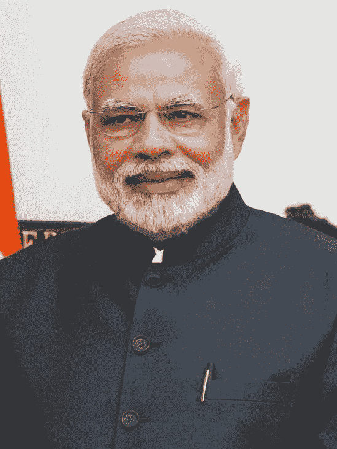

# Fastai —图像回归—基于图像的年龄预测

> 原文：<https://medium.com/analytics-vidhya/fastai-image-regression-age-prediction-based-on-image-68294d34f2ed?source=collection_archive---------1----------------------->


斯科特·韦伯在 [Unsplash](https://unsplash.com?utm_source=medium&utm_medium=referral) 上拍摄的照片

# 介绍

当涉及到图像分类任务时，卷积神经网络(CNN)是非常强大的神经网络架构。然而，很少有人知道它们同样能够执行图像回归任务。

图像分类和图像回归任务的基本区别在于，分类任务中的目标变量(我们试图预测的事物)不是连续的，而回归任务中的目标变量是连续的。例如，如果我们需要在不同的狗和猫品种之间进行分类，这将属于分类任务的范围。然而，如果我们需要根据房屋的图像来预测房价，这将是一项回归任务。

我在人寿保险行业工作，目前全球该行业正在发生的一个重大变化是简化客户的入职流程。不同的公司都在努力使销售保险的过程更加简单、直观和便捷。在这个方向上，深度学习的技术对于解决这个问题非常有用。例如，如果深度学习模型可以预测一个人的年龄、性别、吸烟者身份和身体质量指数(对于给定的保险金额来说，这些是计算正确的保费金额或拒绝/推迟保险的几个最重要的因素)，保险公司可以为他们的客户简化保险销售流程，并可能增加销售额。

我们知道基于人的图像的性别预测相对简单，这属于**图像分类任务**。

如果你有兴趣，可以参考下面的完整工作内容:

[](https://www.kaggle.com/abhikjha/wiki-gender-prediction) [## 维基性别预测

### 下载数千个项目的开放数据集+在一个平台上共享项目。探索热门话题，如政府…

www.kaggle.com](https://www.kaggle.com/abhikjha/wiki-gender-prediction) 

另一方面，诸如基于图像预测人的年龄的图像回归任务是相对难以完成的任务。处理该任务的更简单的方法是通过在一个桶中对不同的年龄进行分组，即通过创建年龄带，使其成为一个分类任务。然而，就保险单销售而言，这并不能解决问题(通常死亡率或发病率因年龄和性别而有显著差异)。因此，我试图创建一个模型，试图预测这个人的确切年龄。

# 偏倚和数据选择问题

处理图像尤其是人物图像的主要问题是，公共领域中可自由获得的大多数数据源都带有明显的种族偏见。Fastai 的杰瑞米·霍华德在他关于深度学习课程的一次讲座中提到了这一点。这些公共领域中可用的图像是有偏见的，因为大多数捕获的图像都是白人，如果我们基于这些图像创建任何模型，那么它很可能不会在例如印度或亚洲血统的人的图像上做得很好。

为了在一定程度上解决这个问题，我仔细选择了三个数据来源(所有这些都可以在公共领域获得):

1.  IMDB-Wiki 人脸数据集([https://data.vision.ee.ethz.ch/cvl/rrothe/imdb-wiki/](https://data.vision.ee.ethz.ch/cvl/rrothe/imdb-wiki/))
2.  http://aicip.eecs.utk.edu/wiki/UTKFace UTK 人脸数据集()
3.  http://chalearnlap.cvc.uab.es/dataset/26/description/真实人脸数据集()

这些数据集是使用不同的来源/图像创建的，涵盖 0 到 100 岁之间的所有年龄，如果我们将这些数据结合在一起，严重的种族偏见问题在某种程度上得到了消除。

# Fastai 课程和图书馆

在开始这篇文章的主要内容之前，我想说几句话，并对我最喜欢的老师杰瑞米·霍华德教授的非凡课程*“程序员实用深度学习(上、下)》*表示感谢。这是一门令人惊叹的课程，我学到了很多东西，非常感谢杰里米和雷切尔创建并支持这门课程。

> 除了课程之外，Fastai 还有一个令人惊叹的蓬勃发展的学生、研究人员和从业者社区，他们随时准备帮助和支持同学和从业者。就在最近，我了解到我过去写了中型文章的两个深度学习项目被 Fastai 用户选为 100 个此类项目的一部分，成为巴西利亚大学深度学习课程的一部分。对于一个刚刚开始学习 ML / DL 基础知识的人来说，这是一个非常好的产品时刻。多酷啊！所有这一切之所以成为可能，是因为这门令人惊叹的课程、像杰瑞米·霍华德这样的优秀教师、Fastai 用户的繁荣社区以及 Pytorch 的包装库。

# 项目描述

由于一些奇怪的原因，我为这个项目工作的 Kaggle 内核没有成功提交。所以，我把笔记本放到了我的 GitHub 上:

[](https://github.com/abhikjha/Image-Regression---Age-Prediction---Fastai) [## abhikjha/图像回归年龄预测 Fastai

### 在 v2 笔记本中，我已经尝试基于 Fastai 库创建了一个图像回归模型。很少有重要的…

github.com](https://github.com/abhikjha/Image-Regression---Age-Prediction---Fastai) 

以下是应该强调的几个要点:

1.  使用 Fastai v1 模型，并选择 CNN 架构— ResNet34 来运行该模型。我尝试使用更复杂的架构，如 ResNet50，但发现验证错误更高。
2.  在这个工作笔记本中，我使用了图像大小调整技术，图像大小逐渐增加，这有助于获得更高的精度。这是一个很棒的技术，每次我们需要在 CNN 工作时都必须使用。
3.  L1 平滑损失(胡伯的损失)被用来比 L1 或 L2 损失表现更好。
4.  在项目期间，我使用 Fastai 的判别学习技术进行学习，其中我们可以将 NN arch 分成不同的部分，并为 NN arch 的不同部分分配不同的权重衰减值和学习速率。
5.  最后，使用 Fastai Pytorch Hooks 和 Spotify Annoy 创建了一个图像相似性模型(在我看来，这不是很好。

**年龄模型一瞥:**

```
**class** **AgeModel**(nn.Module):
   **def** __init__(self):
        super().__init__()
        layers = list(models.resnet34(pretrained=**True**).children())[:-2]
        layers += [AdaptiveConcatPool2d(), Flatten()]
        layers += [nn.BatchNorm1d(1024, eps=1e-05, momentum=0.1, affine=**True**, track_running_stats=**True**)]
        layers += [nn.Dropout(p=0.50)]
        layers += [nn.Linear(1024, 512, bias=**True**), nn.ReLU(inplace=**True**)]
        layers += [nn.BatchNorm1d(512, eps=1e-05, momentum=0.1, affine=**True**, track_running_stats=**True**)]
        layers += [nn.Dropout(p=0.50)]
        layers += [nn.Linear(512, 16, bias=**True**), nn.ReLU(inplace=**True**)]
        layers += [nn.Linear(16,1)]
        self.agemodel = nn.Sequential(*layers) **def** forward(self, x):
        **return** self.agemodel(x).squeeze(-1)
```

在这里，你可以看到在 ResNet34 的架构中，在去除了处理分类任务的层之后，我们添加了可以处理回归任务的部分。

**损失函数一览:**

```
**class** **L1LossFlat**(nn.SmoothL1Loss):
    **def** forward(self, input:Tensor, target:Tensor) -> Rank0Tensor:
        **return** super().forward(input.view(-1), target.view(-1))
```

使用比 L1 或 L2 损失表现更好的平滑 L1 损失。

**看一眼学习者:**

```
learn = Learner(data_wiki_small, model, model_dir = "/temp/model/", opt_func=opt_func, bn_wd=**False**, metrics=root_mean_squared_error,
               callback_fns=[ShowGraph]).mixup(stack_y=**False**, alpha=0.2)

learn.loss_func = L1LossFlat()
```

**现在，我们将看到模型的几个预测:**


模型的预测

为了根据随机测试图像测试这个模型，我使用了印度总理莫迪在 2015 年拍摄的照片(当时他大约 64 岁)。让我们看看我们的进展如何:



2015 年，64 岁的莫迪总理

让我们看看模型预测了什么:


太好了！它预测莫迪的年龄约为 63 岁

# 结论

这是我参与的时间最长的项目之一，但我必须说我在这个过程中学到了很多。这些东西中很少是判别学习技术、通过重构来构建合适模型的方法、图像大小调整技术等。

如果你想对我的工作，尤其是这篇文章发表评论，请在下面分享你的想法和建议。


如果你喜欢我的文章，请鼓掌！！