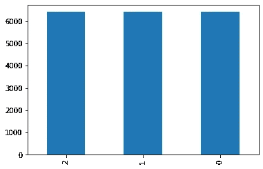

# 使用 Kfold 交叉验证的 fastai 多标签分类

> 原文：<https://medium.com/analytics-vidhya/fastai-multilabel-classification-using-kfold-cross-validation-706b5948e138?source=collection_archive---------20----------------------->

2020 年 7 月 18 日

# **Blog18**

如果你有任何反馈意见，我已经以 Kaggle Public [笔记本](https://www.kaggle.com/kirankamat/fastai-multilabel-classification-using-kfold-cv)的身份写了这篇文章。

我考虑的问题是多标签分类。除了在每个图像中有多个标签之外，这个问题中的另一个挑战是存在罕见的类和不同类的组合。因此，在这种情况下，正常分割或随机分割不起作用，因为您可能最终会将罕见的案例放入验证集中，而您的模型将永远不会了解它们。scikit-learn 中存在的分层也不具备处理多标记目标的能力。

我特别选择了这个问题，因为我们可能会在途中学到一些技术，否则我们不会想到。

**可能有更好或更简单的方法来进行 kfold 交叉验证，但我已经记住了如何使用 fastai** 来实现它，所以如果你知道一些更好的方法，请发邮件或发推特给我，我会尝试实现并给你学分。

# 安装所有必需的库

我正在使用 fastai2，所以导入它。

```
! pip install -q fastai2
```

# 交互效度分析

在我看来，交叉验证是通过 n 次折叠来最小化一次分裂的随机性的想法，每个折叠包含训练和验证分裂。你在每个折叠上训练模型，所以你有 n 个模型。然后你从所有模型中取平均预测值，这应该会给我们结果更多的信心。这些我们将在下面的代码中看到。我发现了迭代分层包，它为 scikit-learn 兼容的交叉验证器提供了多标签数据的分层。

**我的看法**:

在我看来，做一次右劈更重要，尤其是因为 CV 需要 n 倍的时间来训练。那我为什么要这么做？？

我想使用 fastai 的交叉验证来探索分类，我没有找到太多的资源来学习。所以如果我写这个博客，它可能会帮助人们。

fastai 在他们的库中没有交叉验证分割，就像他们提供的其他函数一样工作。可能是因为交叉验证需要时间，所以可能没那么有用。

但是在这种情况下，我觉得使用 fastai 还是值得一试的。

那么什么是**分层**？？

将数据分割成多个折叠可以由标准来控制，例如确保每个折叠具有相同比例的具有给定分类值(例如类结果值)的观察值。这被称为分层交叉验证

```
! pip install -q iterative-stratificationfrom fastai2.vision.all import * 
from iterstrat.ml_stratifiers import MultilabelStratifiedKFold
```

这里的数据集对 GANs 来说是零——人类蛋白质分类在 class jovian.ml 主办的竞赛中

```
path = Path('../input/jovian-pytorch-z2g/Human protein atlas')

train_df = pd.read_csv(path/'train.csv')

train_df['Image'] = train_df['Image'].apply(str) + ".png"

train_df['Image'] = "../input/jovian-pytorch-z2g/Human protein atlas/train/" + train_df['Image']

train_df.head()
```

我在这里使用的方法是，如果我们有一个名为 fold 的列，使用 fold number 来拆分数据会很有帮助。

fastai 在数据块 api 中有 IndexSplitter，所以这将是有帮助的。

```
strat_kfold = MultilabelStratifiedKFold(n_splits=3, random_state=42, shuffle=True)
train_df['fold'] = -1
for i, (_, test_index) in enumerate(strat_kfold.split(train_df.Image.values, train_df.iloc[:,1:].values)):
    train_df.iloc[test_index, -1] = i
train_df.head()train_df.fold.value_counts().plot.bar() ;
```



# 数据块

现在数据在 dataframe 中，并且也为交叉验证定义了折叠，我们将构建数据加载器，为此我们将使用 datablock。

如果你想了解 fastai 数据块是如何实现的，请看我的博客系列[用数据块 api](https://kirankamath.netlify.app/blog/fastais-datablock-api/) 简化代码

我们将创建一个函数 get_data 来创建 dataloader。

get_data 使用 fold 来拆分数据，以便使用 IndexSplitter 进行交叉验证。对于多标签问题，与单标签相比，唯一要做的额外的事情是在块中添加多类别块，这就是 fastai 如何使它变得容易工作。

```
def get_data(fold=0, size=224,bs=32):
    return DataBlock(blocks=(ImageBlock,MultiCategoryBlock),
                       get_x=ColReader(0),
                       get_y=ColReader(1, label_delim=' '),
                       splitter=IndexSplitter(train_df[train_df.fold == fold].index),
                       item_tfms=[FlipItem(p=0.5),Resize(512,method='pad')],
                   batch_tfms=[*aug_transforms(size=size,do_flip=True, flip_vert=True, max_rotate=180.0, max_lighting=0.6,max_warp=0.1, p_affine=0.75, p_lighting=0.75,xtra_tfms=[RandomErasing(p=0.5,sh=0.1, min_aspect=0.2,max_count=2)]),Normalize],
                      ).dataloaders(train_df, bs=bs)
```

# 韵律学

由于这是一个多标签问题，普通的精度函数不起作用，所以我们有了 accuracy_multi。fastai 有这个，我们可以直接在指标中使用，但我想知道它是如何工作的，所以需要代码。

```
def accuracy_multi(inp, targ, thresh=0.5, sigmoid=True):
    "Compute accuracy when `inp` and `targ` are the same size."
    if sigmoid: inp = inp.sigmoid()
    return ((inp>thresh)==targ.bool()).float().mean()
```

F_score 是这次比赛的评估方式，所以用这个。

```
def F_score(output, label, threshold=0.2, beta=1):
    prob = output > threshold
    label = label > threshold

    TP = (prob & label).sum(1).float()
    TN = ((~prob) & (~label)).sum(1).float()
    FP = (prob & (~label)).sum(1).float()
    FN = ((~prob) & label).sum(1).float()

    precision = torch.mean(TP / (TP + FP + 1e-12))
    recall = torch.mean(TP / (TP + FN + 1e-12))
    F2 = (1 + beta**2) * precision * recall / (beta**2 * precision + recall + 1e-12)
    return F2.mean(0)
```

# 收集测试集

```
test_df = pd.read_csv('../input/jovian-pytorch-z2g/submission.csv')
tstpng = test_df.copy()
tstpng['Image'] = tstpng['Image'].apply(str) + ".png"
tstpng['Image'] = "../input/jovian-pytorch-z2g/Human protein atlas/test/" + tstpng['Image']
tstpng.head()
```

# 培养

我使用了一种叫做 mixup 的技术，这是一种数据扩充技术。

在 fastai 中，Mixup 是回调，这个回调用于将 MixUp 数据增强应用到您的训练中。欲知详情，请阅读[本](http://dev.fast.ai/callback.mixup)

我第一次尝试了这种方法，但是这种方法并没有改善我在这个问题上的结果。它通常在 80 个周期后提高准确度，但我已经训练了 20 个周期。所以没有它在准确性上没有区别。所以你可以忽略这个。

但是为了了解 mixup 是如何工作的，我将在博客上单独讨论这个问题，所以请关注我的 twitter 以获取更新。

```
mixup = MixUp(0.3)
```

gc 是垃圾收集

```
import gc
```

我已经创建了 3 个文件夹，我只是从一个特定的文件夹中获取数据，创建一个模型，添加指标，我使用了 resnet34。这就是整个训练过程。我只是在每个褶皱上训练模型，并保存测试集的预测。

我使用了一种叫做渐进调整大小的技术。

这很简单:用小图开始训练，用大图结束训练。使用小图像进行大部分 epochs 训练有助于训练更快完成。使用大图像完成训练使得最终的准确度高得多。这种方法被称为渐进式调整大小。

我们应该在调整图像大小后使用`fine_tune`方法，让我们的模型学会做一些与它以前学过的略有不同的事情。

我已经使用了`cbs=EarlyStoppingCallback(monitor='valid_loss')`,这样模型就不会过度拟合。

将所有预测附加到列表中，以便我们以后使用。

我已经运行模型很少的时期来查看代码工作和显示结果，或者在中间停止模型(这花费了很多时间)

这个方法给了我`.77`的 F_score 和`>91%`的精度，所以你可以试试。

我在这里的目的是写博客，并解释如何方法和代码如何工作。

如果 GPU 内存不足，删除学习者并清空最后一行代码中的 cuda 缓存。

```
all_preds = []

for i in range(3):
    dls = get_data(i,256,64)
    learn = cnn_learner(dls, resnet34, metrics=[partial(accuracy_multi, thresh=0.2),partial(F_score, threshold=0.2)],cbs=mixup).to_fp16()
    learn.fit_one_cycle(10, cbs=EarlyStoppingCallback(monitor='valid_loss'))
    learn.dls = get_data(i,512,32)
    learn.fine_tune(10,cbs=EarlyStoppingCallback(monitor='valid_loss'))
    tst_dl = learn.dls.test_dl(tstpng)
    preds, _ = learn.get_preds(dl=tst_dl)
    all_preds.append(preds)
    del learn
    torch.cuda.empty_cache()
    gc.collect()
```

将存储在列表中的所有预测值进行堆叠，并对这些值进行平均。

```
subm = pd.read_csv("../input/jovian-pytorch-z2g/submission.csv")
preds = np.mean(np.stack(all_preds), axis=0)
```

你应该有我们用 vocab 得到的标签列表。

```
k = dls.vocabpreds[0]
```

我发现阈值为 0.2 对我的代码很好。

```
thresh=0.2
labelled_preds = [' '.join([k[i] for i,p in enumerate(pred) if p > thresh]) for pred in preds]
```

那么所有预测高于 0.2 的标签都是使用 vocab 的那个图像的标签。

将它们放在标签栏中

```
test_df['Label']=labelled_preds
```

这一步是向 kaggle 提交结果。

```
test_df.to_csv( 'submission.csv' , index = False )
```

我已经写了 Kaggle Public [Notebook](https://www.kaggle.com/kirankamat/fastai-multilabel-classification-using-kfold-cv) 如果你喜欢请投上一票。

感谢您的阅读:)

*原载于*[*https://kirankamath . netlify . app*](https://kirankamath.netlify.app/blog/fastai-multilabel-classification-using-kfold-cross-validation/)*。*