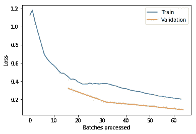
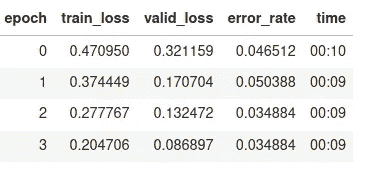
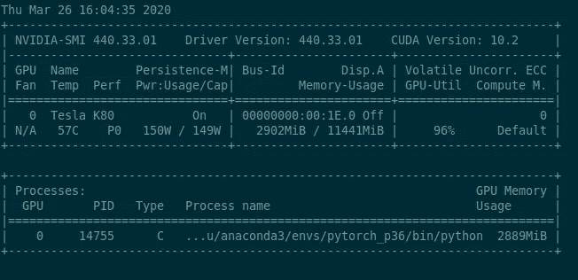

# 尝试 fastai——位于 Pytorch 之上的深度学习库

> 原文：<https://medium.com/analytics-vidhya/fastai-the-deep-learning-library-that-sits-on-top-of-pytorch-fd1da07ff1b2?source=collection_archive---------22----------------------->

## Fastai 有多快？

## 图像分类的遍历

TensorFlow 和 Pytorch 是当下最流行的深度学习库。除此之外，还有高级深度学习库。

Tensorflow 上面有 Keras 一个流行的高级深度学习框架，模块化且用户友好。喀拉的大部分特征都可以在 Pytorch 找到。然而 Pytorch 有自己的高级深度学习框架，称为 fastai。

fastai 承诺为常见的深度学习任务提供更快的开发周期。fastai 有多快？我在这个库中尝试了一个简单的图像分类任务，以检验它是否真的那么快。

## 法斯泰精神

在开始之前，让我们比较一下 fastai 和 Keras。

Keras 提供模块化构建模块来帮助构建自己的网络，fastai 则为常见的机器学习任务提供完整的工作流程，如图像分类、推荐和对象检测。

Fast 努力为这些任务实施最先进的体系结构。它让用户专注于他们的应用程序所特有的内容。通常这是为你自己的数据集写一个数据管道，用你自己的数据训练网络。下面我们进一步谈这些。

# 图像数据助手

fastai 有一些有用的助手来处理图像数据，比如`download_images`、`verify_images`和`open_image`。

```
download_images('chairs.csv', 'data/chairs')
download_images('tables.csv', 'data/tables')
```

我将搜索椅子图片和桌子图片的 URL 导出到文本文件中。`download_images downloads`将图片放入两个目录，`data/chairs`和`data/tables.`

```
Most of the time we want to apply some augmentations on image data. And  we want to split the data into train, validation, and test sets. The  fastai library offers the ImageDataBunch  class which does  just that and a bunch of other tasks that usually  need to be handled  when working with images. This includes  normalization and resizing.verify_images('data/chairs', delete=True, max_size=2000)
verify_images('data/tables', delete=True, max_size=2000)
```

一些图像可能已损坏；删除那些文件。此外，它还会调整像素超过`max_size`的图像的大小。

```
open_image('data/chair/00000000.jpg')
```


图像对象的笔记本表示

`open_image`返回一个`fastai.vision.image.Image`对象。在笔记本电脑环境中，图像文件会自动加载并呈现在笔记本电脑中。

# 数据加载器

对于大多数深度学习任务，我们希望对数据进行一些转换。通常我们也想增加它。我们希望将数据分为训练集、验证集和测试集。

Fastai 提供了`ImageDataBunch`类来做这件事。它执行一些常见的任务，包括规范化和调整大小。

```
data = ImageDataBunch.from_folder(path, train=".", valid_pct=0.2,
    ds_tfms=get_transforms(), size=224, 
    num_workers=4).normalize(imagenet_stats)
```

此外，`ImageDataBunch`还为 Juptyer 笔记本提供了便捷的可视化方法。如果您想检查训练集中的一些示例，无需编写自己的 matplotlib 代码

```
data.show_batch(rows=3, figsize=(7,8))
```


来自训练集的样本

关于训练和验证集的更多信息很容易获得。

```
ImageDataBunch;

Train: LabelList (1032 items)
x: ImageList
Image (3, 224, 224),Image (3, 224, 224),Image (3, 224, 224),Image (3, 224, 224),Image (3, 224, 224)
y: CategoryList
desk,desk,desk,desk,desk
Path: data;

Valid: LabelList (258 items)
x: ImageList
Image (3, 224, 224),Image (3, 224, 224),Image (3, 224, 224),Image (3, 224, 224),Image (3, 224, 224)
y: CategoryList
desk,chair,chair,chair,chair
Path: data;

Test: None
```

摘要显示训练集包含 1032 个项目。验证集包含 258 个项目。默认情况下，没有测试集。此外，我们看到图像大小是 224 像素，正如所期望的

# 加载预训练模型

`ccn`是图像分类的标准工具。作为基线，resnet 架构从来都不是一个坏的选择。

Fastai 使用提供标准模型的`learner`对象，以及训练它们的方法。

```
learn = cnn_learner(data, models.resnet34, metrics=error_rate)
```

下载和训练模型的功能由`learner`类包装。默认情况下，学习者下载预先训练好的模型。`resnet34`模型在 ImageNet 上进行了预训练。

对于迁移学习，循环学习计划在大多数情况下都很有效。这是 fastai 默认提供的学习方法。

```
learn.lr_find()
```

lr_find()方法有助于确定一个好的学习率。



使用 lr_find()调整学习率

在这种情况下，`1e-2`似乎是一个不错的选择。

# 培养

```
learn.fit_one_cycle(4, max_lr=1e-2)
```



培训结果

短短一分钟后，error _ rate(1-准确率)在 9%以下；那相当快。

```
learn.recorder.plot_losses()
```


训练和验证损失

损失图表明有更大的改进空间；这在一分钟的训练后并不奇怪。

# GPU 利用率



96%的 CPU 利用率

提高 GPU 利用率并不总是容易的，所以我检查了我的 K80 的利用率。基于默认设置，96%的利用率是很好的。

# 结论

有了 Fastai，一个简单的分类任务可以在半小时内完成。那相当快。我对开箱即用的默认选择印象特别深刻。

帮助器函数节省写锅炉板代码的时间。分割数据集是我们反复重复的任务之一。

绘制带有标签的样本图像网格也是一项常见任务。这不应该花太多时间，但实际上却经常花。有了 fastai，只需一分钟就能把情节显示在屏幕上。

总的来说，我对这个深度学习库持肯定态度。我有一个问题是关于灵活性的。对于标准任务，fastai 提供了高效的工作流程。但是不那么常见的任务呢？Fastai 很难适应特定的需求吗？也许这将是未来帖子的主题。